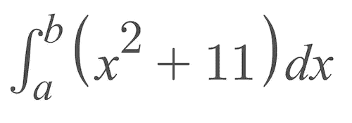
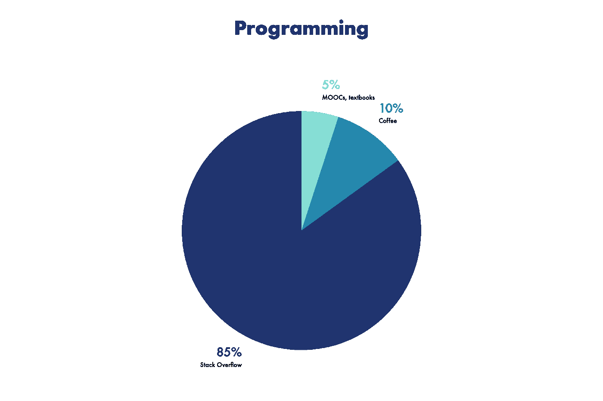
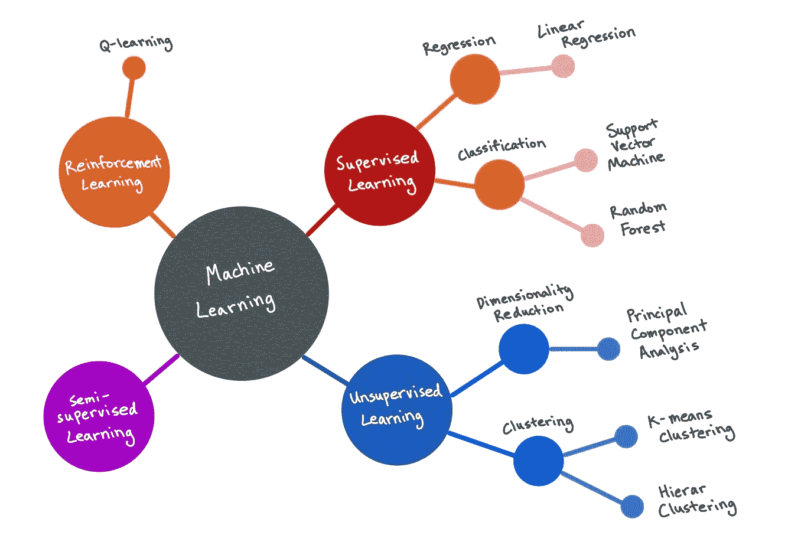

# 开始学习数据科学的最佳方式是理解其背景

> 原文：<https://towardsdatascience.com/the-best-way-to-start-learning-data-science-is-to-understand-its-context-751e917e655e?source=collection_archive---------42----------------------->

## 数据科学教育

## 先学习上下文，再钻研内容

照片由[达瓦尔·帕尔马](https://unsplash.com/photos/dnPniNPUe4o)拍摄

# 目录

1.  [**语境知识的重要性**](#a77b)
2.  [**(可选)研究支持基于上下文的学习**](#3402)
3.  [**数据科学的脉络**](#e520)
4.  [**理解概念，而不是计算**](#4763)
5.  [**子学科的背景**](#99fb)
6.  [**下一步**](#1d7a)

# 语境知识的重要性

在大学四年级的时候，我决定将我的职业道路定位于数据科学。只进行了一两次研究，我就意识到了我面前领域的广阔深度。我知道最终我必须了解卷积神经网络的架构，NLP 的数值化过程，或者主成分分析的基础。然而，我总是需要先建立一个坚实的知识背景基础，而不是凭空跳入这些概念的细枝末节。我将这种方法称为*基于上下文的学习*。

## 什么是基于上下文的学习？

我将粗略地将基于上下文的学习定义为**通过首先关注其上下文元素来学习一个概念**。换句话说，在钻研深层理论之前，先了解大局。在定义中强调“第一”是很重要的，因为学习上下文类似于制造汽车底盘。虽然底盘是必不可少的元素，但它不是一辆汽车，它本身是没有功能的。相反，它是制造汽车的基石。同样，上下文框架是技术内容的基础。

# (可选)支持基于上下文的学习的研究

这种学习方式利用了学习心理学研究充分支持的一个事实——人类通过将知识与他们牢牢掌握的东西联系起来，而不是在空白中记忆新概念，来最有效地保留知识。简而言之，我们通过联想来学习。

伊利诺伊大学已故教育心理学教授 Barak Rosenshine 博士在*教学原则:*中强调了这些背景框架在教育中的重要性

> 当一个人在某一特定主题上的知识丰富且联系紧密时，就更容易学习新的信息，先前的知识也更容易利用

你拥有的背景知识的多少也与你对新材料的理解程度相关[。因此，为了最有效地学习，在钻研细节之前，必须先打下坚实的背景知识基础。](https://www.sciencedirect.com/science/article/pii/1041608094900019)

# 数据科学的背景

那么什么是数据科学的背景知识呢？嗯，我总是通过问许多[问题](https://www.globalcognition.org/questioning-improves-your-learning/)来开始基于上下文的学习。具体来说，我试着问[宽泛的概念性问题](https://eric.ed.gov/?id=EJ994039)，而不是面向细节的问题。

以下是我在开始数据科学之旅时首先问自己的几个问题，以及我提供的答案。我想强调的是，我的回答填补了我当时的知识空白。同样，你应该以一种与你的教育和个人背景直接相关的方式回答这些和其他问题。

## 数据科学如何融入我对其他领域的理解？

数据科学是一个跨学科领域，它利用数学、编程、商业和领域知识来解决困难的数据问题。数据科学和我的专业(具有机器学习和神经计算的认知科学)之间的重叠部分取决于数学(机器学习所必需的)，编程(为整个领域提供计算功能)，以及数据分析技术，如计算神经科学中使用的技术。数据科学中的“科学”来源于其对各种科学方法论的运用，比如[统计显著性。](/statistical-significance-hypothesis-testing-the-normal-curve-and-p-values-93274fa32687)

## 数据科学最重要的元素是什么，它们之间有什么关系？

所有数据科学家都要经历一个被称为“数据科学管道”的过程，本质上是一个循序渐进的端到端过程，概述了数据科学家的工作流程。像 [OSEMN](/a-beginners-guide-to-the-data-science-pipeline-a4904b2d8ad3) 这样的首字母缩略词使得基本的管道很容易记住，但是一般来说，管道的微妙之处各不相同。基本结构如下:

*   数据收集
*   数据清理
*   探索性数据分析
*   模型结构
*   可视化/模型部署

## 什么是机器学习？为什么机器学习与数据科学如此紧密地联系在一起？

机器学习(ML)是一个研究计算机科学算法的领域，这些算法不是传统的“封闭”算法。相反，ML 算法从数据中“学习”。这种对数据的依赖使得 ML 成为数据科学不可或缺的一部分。ML 属于数据科学管道中的“模型构建”和“模型部署”类别。

## 数据科学有哪些子学科？

有许多领域对数据科学有贡献，但构成数据科学的最基本的学科是计算机科学、统计学、机器学习和线性代数。虽然业务和领域知识也很重要，但数据科学的学术范围依赖于前面提到的原始子学科。此外，子学科本身通常有自己的子学科，例如微积分对于理解机器学习算法如何工作是必要的。

# 理解概念，而不是计算

我在大学数学学习早期发现的一个重要的二分法是**计算**和**概念理解**之间的区别。例如，在统计学的例子中，记忆如何计算这个

远不如理解卡方检验统计在检验分类变量之间的假设时的用例重要。或者，对于微积分，理解这一点

描述二次曲线下的面积远比记忆手工求解的奇特方法重要。[(*咳咳*)](https://www.integral-calculator.com/)

实际上，我发现构建程序是一个非常准确的类比。当学习编程时，很明显，很早就知道试图学习每个函数的每个实现是不可能的。一个更有效的策略是理解输入和输出，这样您就可以将代码片段拼凑在一起，让事情正常运行。

作者图片

即使在不使用 google 或 StackOverflow 的情况下，像 [fastai](https://www.fast.ai/) 这样的课程也会将绝大多数实现抽象掉，这样你就可以先构建一个理解*的端到端框架*(在 fastai 的情况下，构建一个端到端模型)，并且只有在之后的*你才可以回过头来尝试理解抽象背后的基本细节。*

这样，学习与计算相对的概念是基于上下文的学习的应用，因为上下文框架已经建立，所以当你需要学习计算时，它们被适当地划分。

# 子学科的背景

遵循基于上下文的学习方法，一旦我们弄清楚了数据科学的子学科，我们就应该挖掘它们的上下文，以了解它们如何适应该领域的整体范围。

## 计算机科学

***为什么所有的数据科学项目都这么重编码？***

现代统计学可以追溯到 19 世纪，然而统计学的应用仅限于小样本，因为没有有效的方法来组织大量数据和计算参数。电脑意味着。

此外，GPU 并行处理的出现使机器学习模型的训练速度提高了数百倍。从本质上说，通过计算机可以获得非常强大的统计工具，因此对编码的重视。

*进一步提问:对于数据科学来说，什么编程语言是最重要的？* [*数据科学我需要多少编程？*](https://medium.com/towards-artificial-intelligence/how-much-programming-do-i-need-in-data-science-64356fdb9ef2)

## 统计数字

***为什么统计学对数据科学很重要？***

鉴于大多数数据科学只是计算统计学，该领域为数据的严格数学分析奠定了基础和工具集。

*进一步提问:* [*贝氏到底在说些什么？*](/bayes-theorem-the-holy-grail-of-data-science-55d93315defb) *数据科学家使用哪些具体的统计库？*

## 线性代数

***什么是线性代数，它与数据科学有什么关系？***

线性代数就是研究线性方程。堆叠在一起的多个线性方程可以表示为一个矩阵。矩阵是行和列中数字的集合，本质上等同于表格数据(表中的数据)。此外，图像数据只不过是元组的 n 维向量(即数字列表的列表)。这就是为什么对线性代数的良好理解提供了对数据本身结构的理解。

*进一步 Qs:什么是张量？* [*线性代数在深度学习中是如何使用的？*](https://medium.com/@jonathan_hui/machine-learning-linear-algebra-a5b1658f0151)

## 机器学习和微积分

***微积分和机器学习有什么联系？***

微积分的一个重要组成部分是最优化的研究。由于所有机器学习算法的目标是最小化误差函数，微积分提供了理解最小化如何发生的工具。

*进一步 Qs:* [*什么是梯度下降？*](https://medium.com/@montjoile/an-introduction-to-gradient-descent-algorithm-34cf3cee752b) *什么是反向传播？* [*为什么会涉及微积分？*](https://www.youtube.com/watch?v=tIeHLnjs5U8)

# 后续步骤

问自己一些概念性的问题。很多概念性的问题。这些问题因人而异，因为它们的目的应该是填补知识空白，让数据科学融入您对该领域的整体理解。

发挥创造力。我的一位同事提到，可视化地图真的帮助她理解了人工智能、机器学习和深度学习的背景，以及它们如何融合在一起。同样，使用地图和流程图来理解您目前正在努力拼凑的数据科学中的任何主题。

作者图片

在您对数据科学有了深刻的背景理解后，继续深入挖掘各种监督算法的细微差别、数据预处理的最佳实践或使用 Tableau 创建漂亮的仪表板可视化。

试着确保每一个新的概念都被放入到整个过程中。