# 塞尔达 BOTW 传说的最佳武器组合

> 原文：<https://towardsdatascience.com/the-best-weapon-combinations-for-the-legend-of-zelda-botw-ac9a54f0eb8a?source=collection_archive---------3----------------------->

## 用 Python 来确定《塞尔达 BOTW 传说》中林克可以拥有的最佳武器组合

最近偶然看到一篇文章，题目是[你该挑哪个 PUBG 武器组合？](/which-pubg-weapon-combination-should-you-pick-f58bdc262082)作者[梅雷迪思万](https://medium.com/u/a5f310f5be59?source=post_page-----ac9a54f0eb8a--------------------------------)我觉得很有意思。这篇文章给了我为我最喜欢的游戏之一 [**《塞尔达传说:野性的呼吸》**](https://www.zelda.com/breath-of-the-wild/) 选择武器组合的想法，使用 Python 和 Pareto 优化。那么，我们开始吧。

***免责声明*** : *本文基于我对 BOTW 武器公开数据集的分析，该数据集可能不包含所有信息，仅用于适应、学习和理解帕累托优化的概念。这不是任何官方研究的一部分，结果可能与现实世界的应用和不同的个人观点相矛盾。*

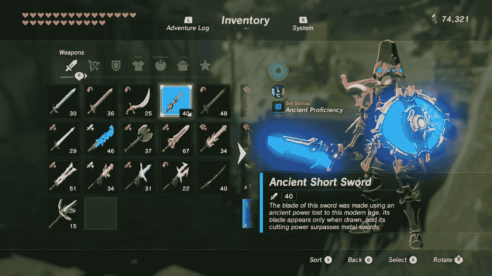

武器库存(来源:我的任天堂 Switch)

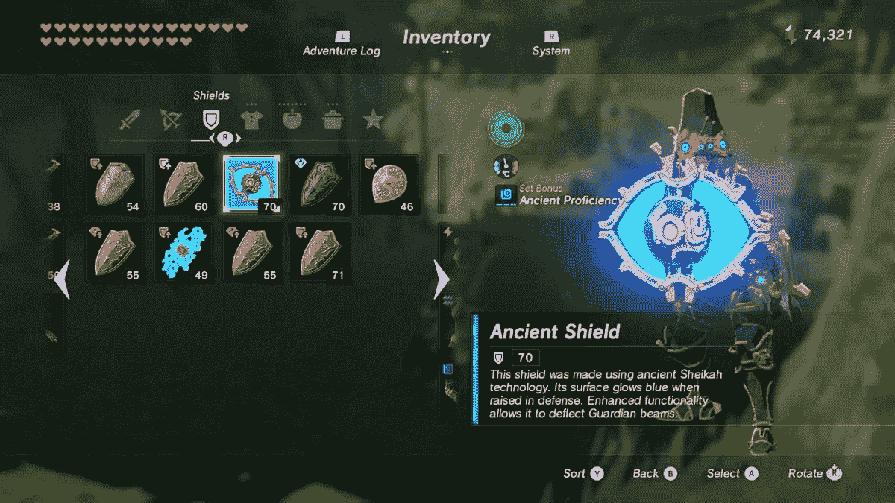

希尔兹库存(来源:我的任天堂 Switch)

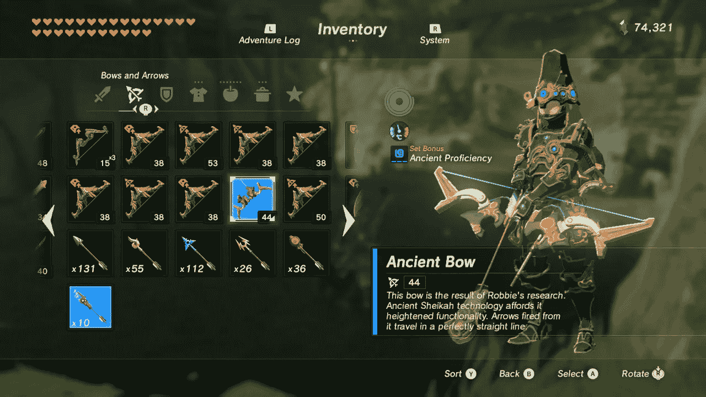

弓箭盘点(来源:我的任天堂 Switch)

# 使用的功能

在塞尔达 BOTW 发现的武器有两个我在这篇文章中考虑过的重要特征。分别是**耐久性**和**强度**。我用一些研究和我自己扮演塞尔达·BOTW 的经验定义了这些术语。

## 1.持久性

**耐久度**是指你可以使用武器的次数，即你可以用武器击中/射杀敌人的次数。之后，武器就坏了。耐久性越高，可以使用武器的次数就越多。

## 2.力量

**力量**(或**攻击力** ) 是你一击能对敌人造成的伤害量。当你击中一个敌人时，这个数量会从敌人的生命值中损失。力量越高，对敌人造成的伤害越大。

# 数据集和预处理

当我在搜索塞尔达 BOTW 发现的武器数据集时，我偶然发现了一个名为 [***完整数据库+搜索 BotW***](https://www.reddit.com/r/zelda/comments/6vp63m/a_complete_database_search_for_botw/) 的 Reddit 线程，在那里他们提供了一个链接，链接到一个惊人的所有武器、盾牌、弓、盔甲、材料和食物的数据库。您可以在[中下载数据集。csv 格式](https://airtable.com/shrI71ZROtt0PXTtr)。

对于我们的分析，我们将需要以下导入。

```
import numpy as np
import pandas as pd
import seaborn as sns
import matplotlib.pyplot as plt
from itertools import combinations
```

我已经使用下面给出的代码将数据加载到熊猫数据框架中。

```
dataframe = pd.read_csv(“Zelda-data.csv”)
```

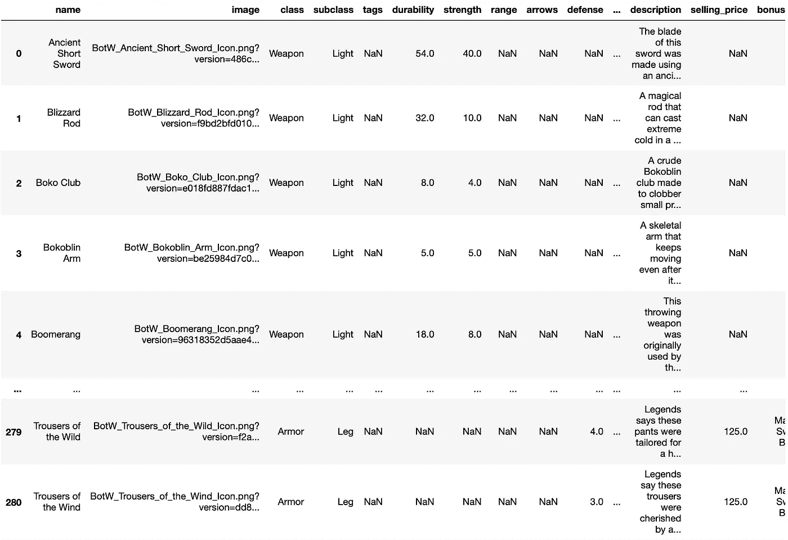

初始数据帧(图片由作者提供)

您可以看到有许多不必要的列和未指定的值。我必须做一些预处理来清理数据集。首先，我删除了所有不必要的列，保留了列`name`、`class`、`subclass`、`durability`和`strength`。

```
columns_to_remove = ["image", "tags", "range", "arrows", "defense", "selling_price", "bonus_set", "upgrade_1", "upgrade_2", "upgrade_3", "upgrade_4", "armor_upgrade", "where_to_find", "notes", "defense_upgrade_lvl1", "defense_upgrade_lvl2", "defense_upgrade_lvl3", "defense_upgrade_lvl4", "bonus", "description"]for col in columns_to_remove:
    dataframe = dataframe.drop(col, axis=1)
```

主剑是塞尔达 BOTW 中最强大的武器之一。它的耐久性是无限的，因为它从不断裂。所以我们会看到大师剑的耐久度并没有规定。因此，我添加了一个大于数据集中最大值的值，以保证其持久性。可用的最大值是 80，我用 200 来测试它的耐用性(根据这里找到的链接)表明在完全加电的版本中，主剑在需要充电之前有近 200 次攻击。


林克得到大师剑(来源:我的任天堂 Switch)

我相应地用 0 或“无”替换了未指定的值。此外，我从数据集中删除了所有类型的箭头，因为它们没有指定任何耐久性或强度值。

我从数据集中移除了**光之弓**，因为这种武器只有在击败**灾难加农**后才可用，并且当你来击败加农的最终形态**黑暗击败加农**时才可用。

现在，我将武器、盾牌和弓分别存放如下。

```
weapons = dataframe[dataframe["class"] == "Weapon"]
shileds = dataframe[dataframe["class"] == "Shield"]
bows = dataframe[dataframe["class"] == "Bow"]
```

# 用于分析的概念

在进入分析细节之前，我将介绍一些我们将用于分析的术语和概念。

## 相关和 C **或相关矩阵**

**相关性**是一种用于显示两个变量相互之间关联程度的技术。我们在一个**相关矩阵**中表示这一点，该矩阵表示变量对之间的**相关**系数。

我们将使用武器的耐久性和强度及其组合的相关矩阵来了解它们之间的关系。

```
weapons = dataframe[dataframe["class"] == "Weapon"]fig, ax = plt.subplots(1,1, figsize=(10,5))
my_cols = ['durability', 'strength']
all_cor = sns.heatmap(weapons[my_cols].corr(), fmt=".3f", annot=True)
```

下图表示武器、盾牌和弓的耐久性和强度的相关矩阵。

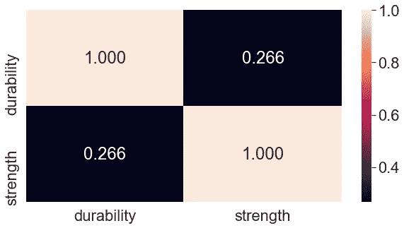

表示武器相关矩阵的热图(图片由作者提供)

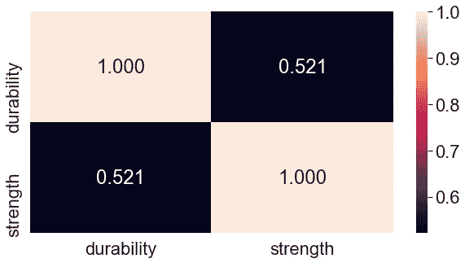

标示护盾相关矩阵的热图(图片由作者提供)

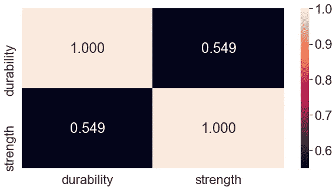

显示弓相关矩阵的热图(图片由作者提供)

正如所料，你可以看到耐用性和强度之间存在完美的正相关关系。我们还可以看到，弓显示出耐久性和强度之间更强的线性关系，因为相关值比盾牌和弓更接近 1。武器显示出耐久性和强度之间最弱的线性关系。

## 基于 Pareto 的多目标学习

根据维基百科，

> [**多目标优化**](https://en.wikipedia.org/wiki/Multi-objective_optimization) (也称为**多目标规划**、**向量优化**、**多目标优化**、**多属性优化**或**帕累托优化**)是多目标决策的一个领域，它涉及的数学优化问题涉及多个同时优化的目标函数。

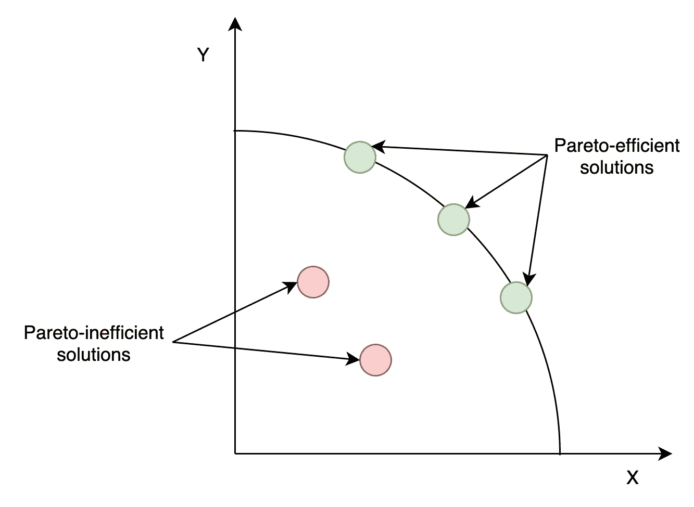

帕累托有效和帕累托无效的解决方案(图片由作者提供)

在多目标优化中，我们有多个目标(例如，在我们的例子中有`durability`和`strength`),我们必须最大化这些目标并确定不同的最优组合。我们得到一个 [**帕累托有效**](https://en.wikipedia.org/wiki/Pareto_efficiency) (或**帕累托最优** ) 解当这个解不受任何其他可行解支配时。简而言之，这个解决方案无法在不使至少一个目标恶化的情况下使一个目标变得更好。可以有多个帕累托有效解，这组帕累托有效解被定义为**帕累托边界**。

在本文中，我将使用一种基于帕累托的方法来确定最佳武器组合，其中我们的目标函数是一个由武器的耐久性和强度值组成的向量`[durability, strength]`。让我们看看什么是我们能为塞尔达·BOTW 获得的帕累托最优武器组合。

# 确定最佳组合

## 1.武器+盾牌

在特定情况下，林克可以装备一件武器和一面盾牌。让我们看看我们能有什么最佳组合。经过预处理，我们有 127 件武器和 33 个盾牌。我们将得到 4191 种武器和盾牌的组合。对于每种组合，我都考虑了平均耐久性和平均强度。

```
weapons_shields = pd.concat([weapons, shields], ignore_index=True)
df2 = weapons_shields.set_index("name", drop = False)my_data = []
my_combinations = list(combinations(df2.index,2))
valid_combinations = []for comb in my_combinations:
    if df2.loc[comb[0],"class"] != df2.loc[comb[1],"class"]:
        valid_combinations.append(comb)
        data_line = []
        data_line.append(np.mean([df2.loc[comb[0],"durability"], df2.loc[comb[1],"durability"]]))
        data_line.append(np.mean([df2.loc[comb[0],"strength"], df2.loc[comb[1],"strength"]]))
        my_data.append(data_line)

my_combinations = pd.DataFrame(my_data, columns = ['durability', 'strength'], index=valid_combinations)
```

我不会绘制热图来显示不同的武器组合及其耐用性和强度，因为有大量的组合。相反，我将绘制一个相关矩阵，显示组合的平均耐久性和平均强度，如下所示。


表示武器+盾牌组合相关矩阵的热图(图片由作者提供)

让我们看看帕累托边界是什么样的。

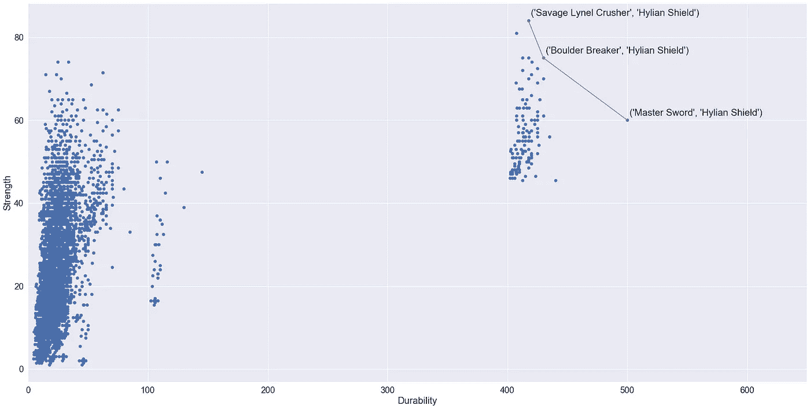

武器+盾牌组合的帕累托边界

你可以看到帕累托有效组合如下:

1.  大师剑+海之盾
2.  巨石破碎者+海之盾
3.  野蛮勒内尔粉碎机+海莲盾

我们不能说这些组合中有哪一种在强度和耐用性方面更好。但是，如果我想让我的武器持续更长时间，那么我会使用组合**大师剑+林之盾**。另一方面，如果我想对敌人造成更多的伤害，那么我会使用组合**野蛮的林内尔破碎机+海莲盾**。

## 2.武器+盾牌+弓

在特定情况下，林克可以装备一件武器、一面盾牌和一把弓。让我们看看我们能有什么最佳组合。经过预处理，我们有 127 件武器，33 个盾牌和 25 把弓。我们将得到 104，775 种武器和盾牌的组合。

类似于武器+盾牌组合，我将绘制一个相关矩阵，显示武器+盾牌+弓组合的平均耐久性和平均强度，如下所示。

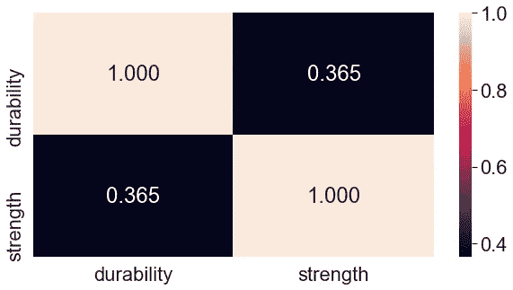

表示武器+盾牌+弓箭组合相关矩阵的热图(图片由作者提供)

让我们看看帕累托边界是什么样的。

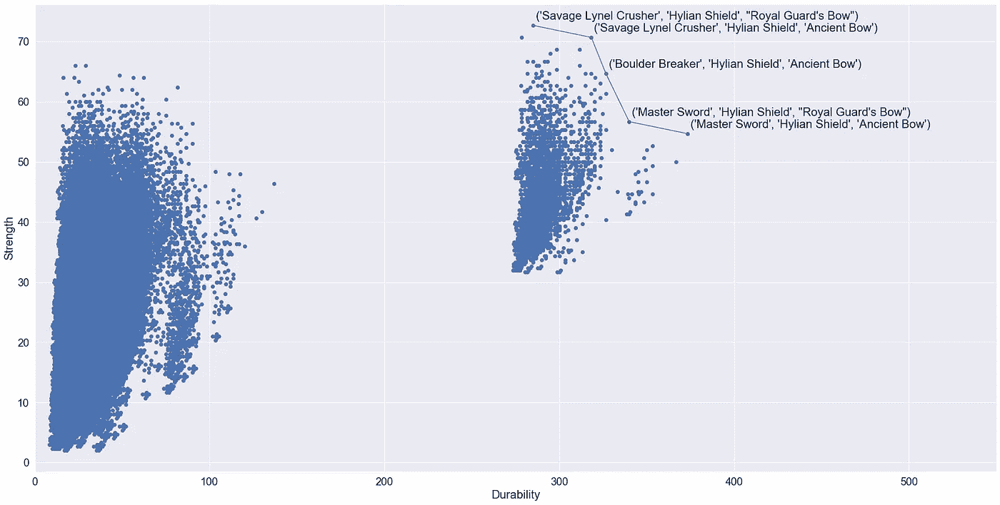

武器+盾牌+弓组合的帕累托边界

你可以看到帕累托有效组合如下:

1.  大师剑+莲盾+古弓
2.  大师之剑+林之盾+锦衣卫之弓
3.  巨石破碎者+海莲盾+古弓
4.  野蛮勒内尔粉碎机+海莲盾+古弓
5.  野蛮的勒内尔破碎机+海连盾+皇家卫队的弓

请注意，我们有 3 种武器+盾牌的组合，这也是我们之前在这些组合中发现的。此外，组合中还有**古弓**和**锦衣卫弓**。

类似于武器+盾牌的组合，我们不能说这些组合中的某一个在强度和耐用性方面更好。但是，如果我想让我的武器更持久，那我就用组合**大师剑+林之盾+古弓**。另一方面，如果我想对敌人造成更多的伤害，那么我会使用组合**野蛮的勒内尔破碎机+海连盾+皇家卫队的弓**。选择完全取决于你！

# 最后的想法

你可能已经在玩游戏的时候想出了这些组合。然而，我很好奇基于帕累托的分析是否能找到最强大的武器，当然，它确实找到了！

有一点需要注意的是，在这个分析过程中，我没有考虑到主剑可能会耗尽能量，需要一些时间来充电。从这个意义上说，大师之剑有它的局限性。此外，我在分析中没有考虑攻击速度、进食后攻击速度的提升、武器是否可以与盾牌、盔甲套装加值和 amiibo 升级一起使用等因素。当考虑武器组合的杀伤率时，这些因素会影响最佳的武器组合。

特别感谢[梅雷迪思万](https://medium.com/u/a5f310f5be59?source=post_page-----ac9a54f0eb8a--------------------------------)分享她的分析代码，这对我分析 BOTW 数据集很有帮助。

你可以从[这里](https://gist.github.com/Vini2/5a84d3a24464895b843070a6f79ebe4c)找到 Jupyter 笔记本的代码。

希望你们都觉得这篇文章很有趣，我很想听听你们的想法。不要忘记与你的 BOTW 朋友分享这些武器组合。

干杯！

# 参考

[1] Y. Jin 和 B. Sendhoff，“基于 Pareto 的多目标机器学习:概述和案例研究”，载于 *IEEE 系统、人和控制论汇刊，C 部分(应用和综述)*，第 38 卷，第 3 期，第 397-415 页，2008 年 5 月，doi:[10.1109/ts MCC . 2008 . 19172](https://doi.org/10.1109/TSMCC.2008.919172)。

[2]多目标优化—维基百科([https://en.wikipedia.org/wiki/Multi-objective_optimization](https://en.wikipedia.org/wiki/Multi-objective_optimization))

[3] Pareto front —用于医疗建模和数据科学的 Python([https://pythonhealthcare.org/tag/pareto-front/](https://pythonhealthcare.org/tag/pareto-front/))