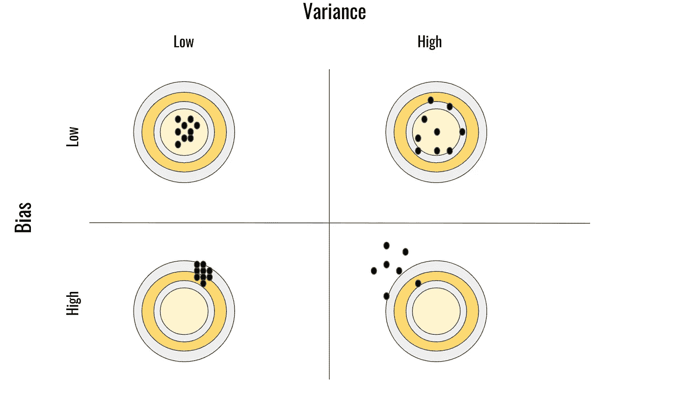

# 每个模型都应该考虑偏差-方差的权衡

> 原文：<https://towardsdatascience.com/the-bias-variance-tradeoff-should-be-considered-for-every-model-16f5e0152524?source=collection_archive---------69----------------------->

## 什么是偏差-方差权衡？

图片来自 [Pixabay](https://pixabay.com/?utm_source=link-attribution&utm_medium=referral&utm_campaign=image&utm_content=755802)

# 为什么面试官会问这个？

关于偏差-方差权衡的问题在数据科学家职位的面试中被频繁使用。它们通常用来描述一个经验丰富、知识渊博的数据科学家与一个资历较浅的数据科学家……更具体地说，是一个不熟悉减轻模型内预测误差的选项的人。

# 那是什么来着？

所以偏差-方差权衡…听说过吗？如果没有，你会想收听。

偏差-方差权衡是一个简单的想法，但它应该告知您所做的许多统计分析和建模，主要是在消除预测误差时。

# 哪里出现了错误

当你创建一个模型时，你的模型会有一些**误差**。有道理！这里没什么新鲜的；新的想法是，所说的误差实际上是由两件事组成的…你猜对了，**偏差&方差！**很抱歉如此深入地探讨这一点，但重要的原因是，一旦你理解了你的错误的组成部分，那么你就可以确定一个计划来最小化它。

您可以采取不同的方法和途径来管理和最小化偏差或差异，但这样做是有其考虑因素的。因此，作为一名数据科学家，了解这两种情况的影响是至关重要的。

# 让我们打破偏见

偏差代表我们的预测和实际之间的差异。

# 高偏置与低偏置

一个高偏差的模型是一个从数据中收集很少数据然后生成预测的模型。你可能听到的一个常见短语是高偏差模型“过于一般化”。它很少依赖于训练数据来确定它的预测，因此，当涉及到根据测试数据生成准确的预测时，它的表现非常差。

我们的方法中可能隐含了一些假设，导致对那些允许模型以更好的性能生成预测的特征关注不足。

相反，低偏差表示模型高度准确。因此，这显然是我们想要最小化的东西。

# 方差对你的模型意味着什么？

方差和听起来差不多。方差与我们预测的分布以及它们的“可变性”有关。如果你听说过“过度拟合”这个术语；这有效地解释了高方差模型的结果。

与高偏差模型非常不同，高方差模型是一种“过度依赖”训练数据的模型。事实上，该模型在其训练数据上可能表现得非常好。它可能非常适合训练数据，以至于乍一看似乎是一个优秀的模型，但是当您试图将您的模型推广到您的测试数据时，它做得非常差。这个模型和你的训练数据太接近了。

# 理解偏差和方差之间的重叠

下图很好地展示了方差或偏差或高或低的模型重叠。这个概念已经被形象化了一百万次，并且仍然是解释与偏差-方差权衡相关的结果的主要依据。

形象归功于我自己:罗伯特·伍德

## 高偏差

让我们来谈谈偏差较高的情况:无论预测的变化如何，模型都隐含地遗漏了它可能需要解释或利用的任何信号；结果发现自己远离靶心。

## 低偏差

在偏差较低的情况下，我们可以看到预测至少以实际值为中心。不管可变与否，我们的方向更好。

## 高度变异

随着高度变化，我们看到结果到处都是，显然与以前看到的数据过度拟合。虽然这些结果看起来方向正确，但它们缺乏对新数据的推广能力……这通常是构建任何模型的目的。

## 低变化

在低变化的情况下，我们可以看到预测本身的变化明显较小。

显然，每种形式的误差都会出现在一个频谱中，但这种可视化有助于巩固这种权衡的挑战。

# 为什么两者很难兼得？

当涉及到你的模型的设计时，你将被迫做出某些决定；这些决定中隐含着向一个方向或另一个方向倾斜的行为。

假设您正在使用随机森林算法，为了提高性能，您开始调整超参数…其中之一是添加越来越多的树和采样变量..虽然这在某种程度上会给你带来一定的性能提升…但是随着时间的推移，你的模型会对它所看到的数据太熟悉了；并且任何随后的生成预测的调用将可能把这个新数据处理得与它已经看到的太相似。

你也可以从包含变量的数量的角度来思考这个问题，尤其是那些分类变量。输入越多，模型就越能理解你的训练数据，但潜在地，它就越不能归纳出它从未见过的数据。我们再次看到人们可能需要考虑减少偏差或方差。

# 结论

所以，我们已经抛出了各种各样的定义，谈论了他们如何一起玩…但是谈论这个有什么意义呢？我会把这一切归结为**考虑**。如果没有意识到模型设计对结果的影响，也没有能力定义我们的错误，我们就没有办法改进。

您现在对您的模型设计最终会如何影响它们的效用有了更深入的了解。利用这种洞察力，有条不紊地考虑问题，并构建一些令人敬畏的模型！

我希望你喜欢这篇文章，更多关于机器学习、数据科学之类的文章，请到 datasciencelessons.com 大学访问我，或者在 medium 上关注我！

祝数据科学快乐！