# 大 O 符号

> 原文：<https://towardsdatascience.com/the-big-o-notation-d35d52f38134?source=collection_archive---------4----------------------->

## 算法复杂性变得简单——这不是矛盾修饰法！


图为[美元吉尔](https://unsplash.com/@dollargill?utm_source=medium&utm_medium=referral)在 [Unsplash](https://unsplash.com?utm_source=medium&utm_medium=referral)

一个算法的性能取决于它需要的步骤数。计算机科学家从数学界借用了术语“大 O 符号”来准确描述算法的效率。许多自学成才的**开发人员和数据科学家要么满足于一个“可行”的解决方案，而不考虑如何提高他们代码的性能，要么在没有真正理解基础知识的情况下进行优化。他们的尝试要么是徒劳的，要么影响很小，而且大多是偶然的。**

衡量一个算法的复杂性并不是一个难以理解的概念——尽管这听起来像是一个矛盾的说法——事实并非如此！
在本文中，我们将省去[数学术语](https://en.wikipedia.org/wiki/Big_O_notation)，并以一种**易于理解的方式**解释 Big-O 概念。我们将通过独立的 Python 片段来完善我们的理解，并且我们将通过一个一体化的备忘单来结束我们的旅程，以供将来参考。

# 介绍

## 时间复杂度

Big-O 不再关注时间单位，而是将**步数**放在聚光灯下。硬件因素已从等式中剔除。因此，我们不是在讨论*运行时间*，而是在讨论*时间复杂度*。
⚠我们将不讨论*空间复杂度*，即一个算法占用多少*内存*。我们下次再说:)

## 大 O 定义

一个算法的 Big-O 符号取决于它如何响应给定数据集的不同大小。例如，当我们向它传递 1 个元素和 10，000 个元素时，它的性能如何。

o 代表 的 ***阶，所以`O(N)`读作“N 阶”——它是给定 N 个输入元素的算法持续时间的一个**近似值**。它回答了这样一个问题:“*随着输入数据元素的增加，步数是如何变化的？****

> O(N)描述了一个算法根据它所作用的元素的数量需要多少步。
> 
> ⭐️就是这么简单！！

## 最佳与最差情景

从一个简单的例子开始:给定一个输入`array[N]`和一个值`X`，我们的算法将通过从头开始遍历数组直到找到该值来搜索值`X`。

给定这个 5 元素数组:`[**2**,1,6,3,**8**]`如果我们搜索`X=8`，算法需要 5 步才能找到它，但是如果我们搜索`X=2`，只需要 1 步。因此，最好的情况是我们在第*个单元格*中寻找一个值，最坏的情况是该值在最后一个单元格*中，或者根本不在那里。*

Big-O 符号对性能采取悲观的方法，指的是最坏的情况。当我们描述下面的复杂性时，以及当你试图计算你自己的算法的复杂性时，这真的很重要:*总是想到最坏的情况*。

现在我们已经定义了规则和词汇，不再多说，让我们深入了解您可能遇到的最常见的复杂性…

# O(1) —常数

`O(1)`表示无论传入多少数据，算法都要执行相同数量的步骤。

## 例子

```
✏️ Determine if the **i-th element** of an array is an odd number.
```

不管我们是访问第 1 个、第 2 个还是第 100 万个条目，都没有关系…我们可以通过使用索引操作符`array[i]`直接访问它。

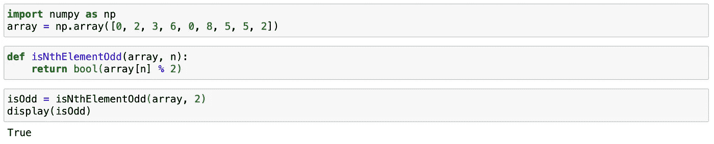

## 情节

如果我们要表示步骤数(y 轴)对输入元素数(x 轴)，`O(1)`是一条完美的水平线，因为无论有多少数据，算法中的步骤数都保持不变。这就是为什么叫*恒时*的原因。

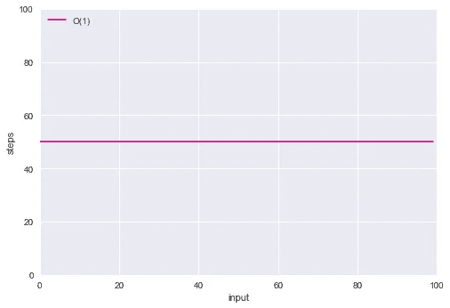

O(1)

# O(N) — *线性*

一个`O(N)`算法将采取和数据元素一样多的步骤。所以当数组的大小增加一个元素时，一个`O(N)`算法就会增加一个步长。

## 例子

```
✏️ **Traverse** an array and print each element.
```

这里，我们需要逐个访问所有元素，因此计算时间与输入同步增长。

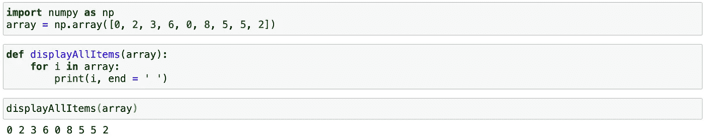

## 情节

`O(N)`是一条完美的对角线，每增加一条数据，算法就多走一步。这就是为什么它也被称为*线性时间*的原因。

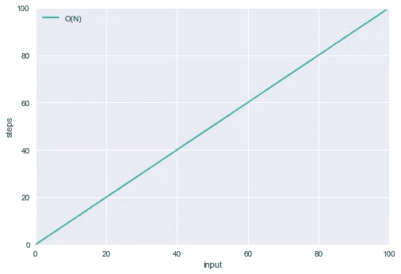

O(N)

让我们将`O(1)`和`O(N)`算法绘制在同一个图中，并假设`O(1)`算法持续进行 50 步。

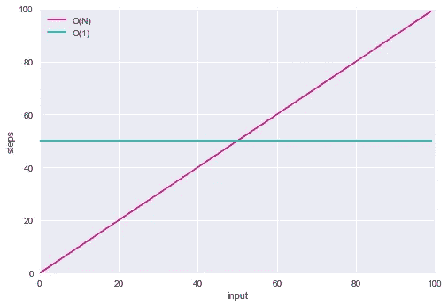

O(1)对 O(N)

我们能观察到什么？

→当输入数组少于 50 个元素时，`O(N)`更有效。
→正好在 50 个元素处，两种算法采取相同数量的步骤。
→随着数据的增加，`O(N)`采取更多的步骤。

由于 Big-O 符号关注的是当数据增长到**无穷大**时算法的表现，这就是为什么`O(N)`被认为不如`O(1)`有效的原因。

# O(N ) — *二次型*

`O(N²)`代表算法的复杂度，其性能与输入元素大小的平方成正比。它通常很慢:如果输入数组有 1 个元素，它将执行 1 次操作，如果有 10 个元素，它将执行 100 次操作，依此类推。

## 例子

```
✏️ Find **duplicates** in an array.
```

这是一个“幼稚”的实现，但是它遍历数组两次:

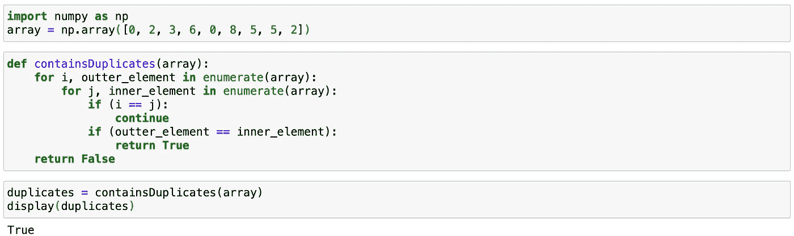

通过输入增加更多的嵌套迭代将增加算法的复杂性:例如，如果迭代次数是 3，那么它的复杂性将是`O(N³)`等等。通常我们要远离*多项式*运行次数(二次、三次、`Nˣ`等)。

## 情节

`O(N²)`线是一个急转弯:

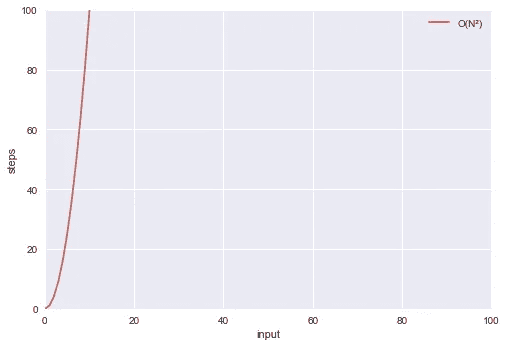

O(N)

# O(logN) —对数

简单来说，`O(logN)`描述了一种算法，它的运算次数在数据每增加一倍时增加一。

```
**📌 Logarithms Refresher:** 
You may not remember what logarithms are, but you probably know what exponents are:
2³ = 2 * 2 * 2 = 8 — Here we multiply the number 2, 3 times.**Logarithms are the flips of exponents.**
log₂8 answers the question: how many 2s do we multiply together to get 8? The answer is 3.In other words, if we keep dividing 8 by 2 until we end up to 1, how many 2s do we have in our equation?8 / **2** / **2** / **2** = 1\. The answer is 3 again.
```

## 例子

对数时间复杂性通常适用于每次将问题分成两半的算法。

```
✏️ **Dictionary** lookup (aka binary search).
```

1)中间打开字典，查第一个单词。如果我们的单词按字母顺序更重要，就看右半部分，否则就看左半部分。再次将余数分成两半，重复步骤 2 和 3，直到找到我们要的单词。

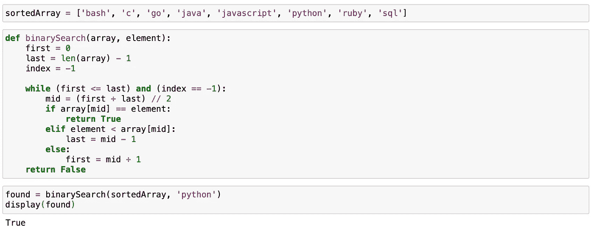

我们每次迭代只能选择一种可能性，并且我们的可能匹配池在每次迭代中被除以 2。这使得二分搜索法的时间复杂度`O(logN)`。

## 情节

随着输入的增加，步骤的数量几乎没有增加(即，每次数据翻倍时只需增加一个步骤):

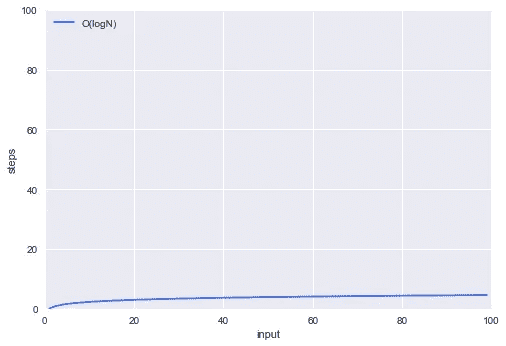

o(登录)

# 诸如此类…

到目前为止，我们已经学习了四个最重要的 Big-O 分类法。当然还有一些，但是我相信你能够理解它们。让我们快速覆盖它们:

## O(N logN) —对数线性

这种复杂度的算法要做`log(N)`次`N`次工作，因此它的性能比`O(N)`稍差。许多实用的算法都属于这一类(从[排序](https://en.wikipedia.org/wiki/Merge_sort)，到[寻路](https://en.wikipedia.org/wiki/Dijkstra%27s_algorithm)，到[压缩](https://en.wikipedia.org/wiki/Huffman_coding)，所以我们为了完整起见才提到它。

**✏️示例**:合并排序——这是一个“分治”算法:它将输入数组分成两半，对每一半调用自己，然后合并排序后的两半。
💡**可扩展性**:一般。

## O(2ᴺ) —指数

指数增长意味着每增加一个新元素，算法需要两倍的时间。

**✏️示例**:查找数据集中的所有子集。
💡**扩展性**:差。

## O(N！)—阶乘

这类算法的运行时间与输入大小的阶乘成正比:`n! = n * (n-1) * (n-2) * (n-3) * . . . * 1`。

**✏️例子**:找出数据集中所有不同的排列。
💡**扩展性**:非常差。

# 增长层次

Big-O 符号提供了一种一致的机制来比较任何两种算法，从而帮助我们使代码更快、更具可伸缩性。将所有的复杂性放在一个图表中，我们可以直观地观察它们在性能方面的比较:

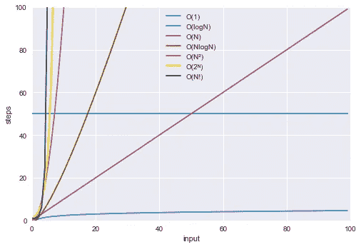

Big-O 复杂性类

# 结论

我希望你现在意识到 Big-O 符号毕竟不是一个可怕的概念！

## 概述

*   算法速度不是以秒来衡量的，而是以增长来衡量的
*   Big-O 符号告诉我们算法如何根据输入数据集大小的变化进行扩展
*   O 代表的*顺序，因此大 O 符号是近似的*
*   算法运行时间以不同的速度增长:

```
O(1) < O(logN) < O(N) < O(N logN) < O(N²) < O(2ᴺ) < O(N!)
```

## 更多资源

*   如果你想更深入地挖掘 Big-O 背后的数学知识，看看斯坦福大学的免费 Coursera 课程。
*   [Big-O 备忘单](https://www.bigocheatsheet.com)
*   我的备忘单:

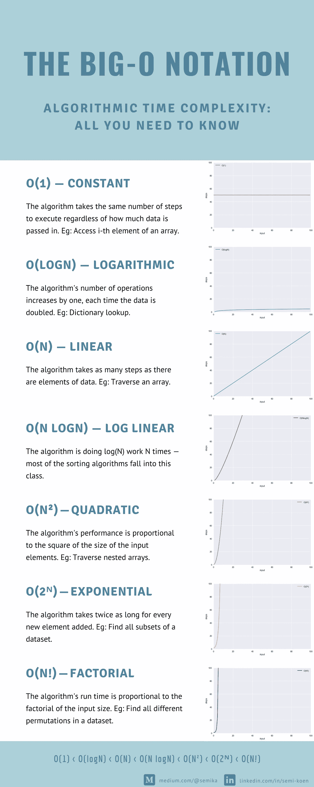

感谢阅读！

*我定期在媒体上写关于领导力、技术&的数据——如果你想阅读我未来的帖子，请*[*‘关注’我*](https://medium.com/@semika) *！*