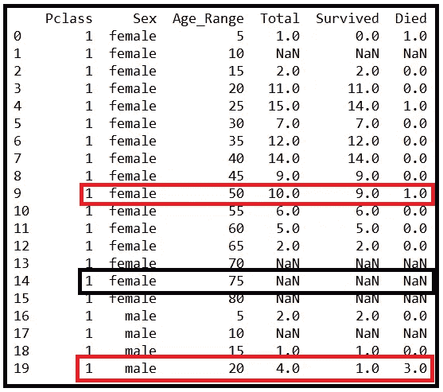

# 二项式回归模型:你需要知道的一切

> 原文：<https://towardsdatascience.com/the-binomial-regression-model-everything-you-need-to-know-5216f1a483d3?source=collection_archive---------4----------------------->


RMS 泰坦尼克号(来源:[维基百科](https://en.wikipedia.org/wiki/Titanic#/media/File:RMS_Titanic_3.jpg)CC0 下)

## 外加一个使用 Python 和 statsmodels 的逐步教程

本文分为两个部分:

1.  **第 1 节:二项式回归模型简介:**我们将介绍二项式回归模型，了解它如何适应广义线性模型家族，以及为什么它可以用于预测随机事件的概率。
2.  **第 2 部分:使用二项式回归模型:**我们将使用 *Python* 和 *statsmodels* 库在真实世界的 Titanic 数据集上训练一个二项式回归模型。我们将看到为什么二项式回归模型是预测泰坦尼克号生存几率的正确模型。我们还将学习如何解释拟合模型的回归系数，这是一项必须学习的技能，在巨大数据集的情况下会产生惊人的结果。

# 第一节

## 二项式回归模型简介

给定回归变量的向量，二项式回归模型可用于预测看到事件的几率。例如，在给定当前温度、湿度、气压、一年中的时间、地理位置、海拔高度等的情况下，可以使用二项式回归模型来预测未来 2 小时内开始下雨的可能性。

在二项式回归模型中，因变量 ***y*** 是一个离散的随机变量，取值为 0、1、5、67 等。每个值代表在 *m 次*试验中观察到的“成功”次数。因此 ***y*** 遵循二项式分布。

下面的等式给出了在独立伯努利试验中观察到 *k* 成功的概率。每次伯努利试验的成功概率=π，失败概率= *(1-* π *)* 。抛硬币是伯努利试验的最简单的例子，其中π = (1-π) = 0.5。


**P** 概率**M**as**F**二项分布随机变量 **y** 的函数(图片由[作者](https://sachin-date.medium.com/)提供)

竖括号中的术语(m k)是‘组合’的符号，读作*‘m choose k’*。它给出了从一组 *m* 可能的结果中选择 *k* 结果的不同方法。

在一个回归模型中，我们会假设因变量 ***y*** 依赖于一个 *(n X p)* 大小的回归变量矩阵 ***X*** 。 ***X*** 中第*行可以表示为 ***x_i*** 是一个大小为 *(1 X p)的向量。*对应第 I 个结果 *y_i* 。*

人们通常以符号形式表示 *y_i* 取某一值 *k* 为*的概率，条件是回归变量* ***X*** *取值* ***x_i.*** ，可以写成*Pr(y _ I = k |****X***

*我们现在可以将二项分布的 ***y*** 在回归 ***y*** 对 ***X*** 的概率分布表述为如下:*

*   *在上面提到的 PMF 方程的 L.H.S .上，我们将无条件概率 *Pr(y=k)* 替换为条件概率*Pr(y _ I = k |****X****=****X _ I****)。**
*   *在 R.H.S 中，我们将用条件概率 *π_i* 代替观察成功的无条件概率 *π* ，其中 *π_i* 是数据集第*行与第*行观察成功的概率，即当回归向量**X***=****X****

*通过这两个替换，二项式分布的 ***y*** 的 PMF 变成如下:*

**

*在 **X** 回归的二项分布 **y** 的条件概率分布(图片由[作者](https://sachin-date.medium.com/)提供)*

*在上面的等式中，对于某个 X=x_i，观察成功的概率 *π_i* ，通常表示为某个函数 g(。)的 ***x_i 的*** 。用象征性的术语来说:*

**

*成功的概率表示为回归矩阵第 I 行的某个函数 **X** (图片由[作者](https://sachin-date.medium.com/)提供)*

*上面的一组概念可以用一个简单的例子形象地描述出来，如下所示:*

**

*二项式分布的 y 对 X(图片由[作者](https://sachin-date.medium.com/)提供)*

*在上图中， *y_1，y_2，y_3，…y_10* 是十个二项分布的随机变量。它们也发生在因变量***【y】***的组成成分上，即一个(10×1)矩阵如下:
***y***=
[【y _ 1】，
【y _ 2】，
【y _ 3】，
…，
【y _ 10】。
在这种情况下，相应的回归变量矩阵 ***X*** 也恰好是一个 10×1 的矩阵，因为只涉及一个回归变量:
***X****=
[[1]，
【2】，
【3】，
【4】，
…，
【10】]。**

*因为，*y 是一个随机变量，具有 spread *m* ，该图显示了对于每个值的***X****=****X _ I***，*y 可以取其*期望值**附近的任何二项分布值)的 ***x_i 的*** 。因此， *y_i* 的期望值，即 *_i* ，可以表示为 ***x_i.*** 的某个函数****

*二项式回归模型是广义线性模型家族的一部分。glm 用于对响应变量*的*期望值*和解释变量向量 ***X*** 的*线性组合*之间的关系进行建模。**

***E(****y****|****X****)*与***×***之间的关系通过合适的*链接函数来表示，如*所示:**

****

**(图片由[作者](https://sachin-date.medium.com/)提供)**

**在上面的等式中， *g(。)*是将 ***X*** 上 ***y*** 的[条件期望](/3-conditionals-every-data-scientist-should-know-1916d48b078a)与回归变量 ***x_i*** 的线性组合联系起来的链接函数。 ***X*** 为大小为 *(n X p)* 的回归变量矩阵，其中 *n=* 行，每一行中的 *p=* 回归变量，***X****=****X _ I***为该大小为(1 X p)的矩阵中第*与*行**

**当***【y】***为二项分布时，我们感兴趣的是确定 ***的条件期望与单次伯努利试验*** *的概率π在****X****=****X _ I****、I。*所以二项式回归模型的 GLM 方程可以写成如下:**

****

**(图片由[作者](https://sachin-date.medium.com/))**

**在二项式回归模型的情况下，**链接函数 *g(。)*****

****逻辑(logit)链接函数，也称为对数优势函数:****

****

**物流环节功能(图片由[作者](https://sachin-date.medium.com/)提供)**

**逻辑函数被称为 log-odds 函数，因为它被表示为成功概率与失败概率的比值，即成功概率的对数。我们将在本文的后面使用这个链接函数。**

****概率单位链接功能:****

****

**probit 链接功能(图片由[作者](https://sachin-date.medium.com/)提供)**

**probit(概率单位的缩写)链接函数用于模拟具有二元是/否结果的事件的发生。该链接函数被表示为累积分布函数φ的倒数。)的标准正态分布 N(0，1)。**

**Colin Cameron 和 Pravin K. Trivedi 所著的《计数数据 的 [**回归分析》一书很好地介绍了第 3.6 节*中的概率单位链接函数:有序和其他离散选择模型*。在那里，你还会发现一个非常清晰的推导，为什么 Probit 模型的链接函数恰好是 CDF 的逆函数。)的正态分布。**](http://cameron.econ.ucdavis.edu/racd/count.html)**

****双对数函数:****

****

**日志-日志链接功能(图片由[作者](https://sachin-date.medium.com/)**

**双对数函数对于模拟“[泊松计数过程](/the-poisson-process-everything-you-need-to-know-322aa0ab9e9a)非常有用，其中概率分布的参数(通常包含平均值)位于概率分布公式的指数中，*和*该参数也表示为回归变量线性组合的指数。因此，它具有双指数格式:exp(exp(—***)β。x_i*** *)* 因此需要两个连续的对数运算来得到 ***β。x_i*** 项下降到‘地平面’。**

****互补双对数链接功能:****

****

**互补的双对数链接功能(图片由[作者](https://sachin-date.medium.com/)提供)**

**之所以称之为互补对数对数，是因为它对 *(1-π_i)* (即故障概率)起作用，而不是对 *π_i.* 起作用**

**在本文中，我们将使用**逻辑**又名**逻辑**又名**对数几率**链接函数来构建我们的二项式回归模型。这又是一次，这一次表达方式略有不同。在 R.H.S .上，我用粗体向量符号代替了求和:**

****

**log-odds 链接功能(图片由[作者](https://sachin-date.medium.com/)提供)**

# **第二节**

## **用二项式回归模型预测泰坦尼克号的生存几率**

**我们将使用 **Titanic 数据集**作为例子来理解适合二项式回归模型的用例种类。**

**这里有一个到[原始数据集](https://web.stanford.edu/class/archive/cs/cs109/cs109.1166/stuff/titanic.csv)的链接。**

**泰坦尼克号数据集包含了命运多舛的远洋客轮泰坦尼克号上 2229 名灵魂中的 887 人的信息。每个乘客的记录包含以下属性:**

*   **名字**
*   **乘客等级(1/2/3)**
*   **性**
*   **年龄**
*   **乘客是否由兄弟姐妹、父母或子女陪同**
*   **他们付的车费，最重要的是，**
*   ****他们是否幸存(1 =幸存，0 =死亡)****

**使用 Python 和 *Pandas* 数据分析库，让我们将数据集加载到 Pandas 数据框中，并打印出前几行:**

```
****import** pandas **as** pddf = pd.read_csv(**'titanic_dataset.csv'**, header=0)df.head(10)**
```

**这将打印出以下输出:**

****

**Titanic 数据集的前 10 行(图片由[作者](https://sachin-date.medium.com/)提供)**

**我们将关注四个关键属性:**

*   **乘客等级**
*   **年龄**
*   **性**
*   **幸存(他们是否幸存)**

**让我们从数据框中删除其余的列:**

```
*****#Drop the columns that our model will not use*** df = df.drop([**'Name'**,**'Siblings/Spouses Aboard'**, **'Parents/Children Aboard'**, **'Fare'**], axis=1)***#print the top 10 rows*** df.head(10)**
```

**这会打印出以下内容:**

****

**精简的 Titanic 数据集的前 10 行(图片由[作者](https://sachin-date.medium.com/)提供)**

## **构建二项式回归模型的案例**

> **我们假设，当泰坦尼克号正在下沉时，*【阶级，年龄，性别】*的组合极大地影响了乘客的生还几率。**

**请注意，*‘幸存’*列包含一个[0，1]伯努利随机变量。**

**那么我们可以说下面的话吗？**

*****回归变量 X****=【p 类别，年龄，性别】，*并且，**

*****因变量是布尔变量 y*** *=【幸存】***

**不，我们不能。让我们看看为什么…**

## **为什么不用 Probit 回归模型？**

**由于 ***y*** 是一个布尔变量，因此使用**概率单位回归模型**似乎是一个简单明了的例子。但是请注意，如果一个人不幸在泰坦尼克号这样的船上，他想知道的是*而不是*这个二元问题的答案:我会 100%确定地活下来还是会 100%确定地死去？相反，更有用的是知道生存几率。**

**例如，如果你是一名 22 岁的女性，在船的二等舱，你会想知道你的生存几率是 1/10，1/4，1/50 等等。**

**但是在组织泰坦尼克号数据集的方式中，幸存的响应变量*具有是/否，即 **1/0 格式。**换句话说，*幸存的*具有伯努利分布，即:***

***Pr(* ***幸存*** *=0) =* π *，
Pr(* ***幸存****= 1)=(1-*π*)* 其中π是介于 0 和 1 之间的某个概率。**

**我们想要的是让 ***y*** 来表示几率，即在 *m* 独立、相同的试验中，成功(存活)与失败(死亡)的比率。**

***换句话说，我们要的是对于***y 来说有一个* ***Log-Odds 分布*** *。****

**因此，我们不是使用真或假、1 或 0 类型的概率单位回归模型，而是要建立一个二项式回归模型，其中响应变量是二项式分布的，链接函数是 **Logit** ，即 log-odds 函数。**

**链接功能将允许我们将生存几率与回归变量***×回归变量****=【p class，Age&Sex】*加截距的线性组合联系起来，如下所示:**

****

**(图片由[作者](https://sachin-date.medium.com/)提供)**

## **如何将 *y* 从伯努利变量转换为二项式变量:**

**要将响应变量***【y】***从伯努利转换为二项式，我们必须将具有相同组合***×***值【Pclass，Age and Sex】的数据集行组合在一起。在我们着手做这件事之前，有一件小事我们需要注意，那就是年龄属性。你看，年龄，在数据集中的表达方式，是一个 0.42 到 80 的连续变量。**

**分别为 0.42 岁和 0.67 岁的婴儿有不同的存活几率，这似乎不太可能。同样的逻辑也适用于 26、27、28、29 岁的年轻人。岁，其他情况以此类推。**

**我们需要使年龄数据更加细化，以便限制组的数量。让我们通过将整个年龄范围分成 5 岁大小的箱来实现这一点，并将每个箱标记如下:
(0，5)→5
(5，10)→10
(10，15)→15 等等。pandas.cut() 方法非常灵活:**

```
****#define the bins** age_range_bins=[0,5,10,15,20,25,30,35,40,45,50,55,60,65,70,75,80]**#define the label for each bin. Num labels = Num bins - 1** age_range_labels=[5,10,15,20,25,30,35,40,45,50,55,60,65,70,75,80]**#Cut up the age range into multiple bins and stuff them into a new Age_Range column** df[**'Age_Range'**]=pd.cut(df[**'Age'**],age_range_bins,labels=age_range_labels)**#Print the output** df.head(10)**
```

**我们得到以下输出。请注意我们添加的新 **Age_Range** 列:**

****

**(图片由[作者](https://sachin-date.medium.com/)提供)**

**让我们删除年龄列，因为我们将使用年龄范围:**

```
****#Drop the age column** df = df.drop([**'Age'**],axis=1)**
```

**现在我们已经按照我们想要的方式设置了解释变量，让我们开始按照组合 *[Pclass，Sex，Age_Range]对样本进行分组。*我们先用熊猫***group by()****的方法。***

```
*****#Group by ['Pclass', 'Sex', 'Age_Range']** groups = df.**groupby**([**'Pclass'**, **'Sex'**, **'Age_Range'**])**#Get the counts for each group. This is the number of passengers in each group who have survived** df_grouped_counts = groups.count()**#Get the size (number of passengers) in each group** df_grouped_survived = groups.sum()***
```

***将每组的幸存者人数和乘客人数合并到每个分组数据框中。(我们马上会看到这对我们有什么帮助):***

```
***df_grouped_counts.to_csv(**'df_grouped_counts.csv'**)
df_grouped_counts_1 = pd.read_csv(**'df_grouped_counts.csv'**, header=0)

df_grouped_survived.to_csv(**'df_grouped_survived.csv'**)
df_grouped_survived_1 = pd.read_csv(**'df_grouped_survived.csv'**, header=0)***
```

***最后，让我们构建一个新的数据帧，它包含:***

*   ***分组的列 Pclass、Sex、Age_Range，***
*   ***每组中相应的幸存者数量，***
*   ***每组的乘客总数，即组的大小，***
*   ***每组死亡的乘客人数。***

```
*****#Create a new Data Frame** df_grouped = pd.DataFrame()**#Copy over the Pclass, Sex and Age Range columns** df_grouped[**'Pclass'**] = df_grouped_counts_1[**'Pclass'**]
df_grouped[**'Sex'**] = df_grouped_counts_1[**'Sex'**]
df_grouped[**'Age_Range'**] = df_grouped_counts_1[**'Age_Range'**]**#Copy over the num passengers from the counts grouped Data Frame** df_grouped[**'Total'**] = df_grouped_counts_1[**'Survived'**]**#Copy over the num survivors from the summation grouped Data Frame** df_grouped[**'Survived'**] = df_grouped_survived_1[**'Survived'**]**#Add a column containing the number who died** df_grouped[**’Died’**] = df_grouped[**’Total’**] - df_grouped[**’Survived’**]***
```

***让我们打印出分组数据集的前 20 行:***

```
***df_grouped.head(20)***
```

******

***泰坦尼克号数据集的前 20 行按[阶级、性别、年龄范围]分组(图片由[作者](https://sachin-date.medium.com/))***

***让我们看看分组数据集告诉我们什么。为了便于说明，我突出显示了第 9、14 和 19 行:***

***在第 9 行中，我们发现有 10 名年龄在(45，50)范围内的女性拥有头等舱机票，其中 9 人幸存。因此，这组女性的生还几率相当高(9 比 1)，尤其是如果她住在头等舱的话。***

***在第 19 排，我们看到有 4 名年龄在 15- 20 岁的男性乘客，其中只有一人幸存。***

***在第 14 排，我们看到没有任何年龄(70-75 岁)的女性乘客占据头等舱。这就是为什么我们在该组的汇总列中看到 NaNs:[1，女性，75]。***

***让我们从数据框中删除所有这样的 NaN 行:***

```
***df_grouped = df_grouped.dropna()***
```

***使用 Python 和 statsmodels 构建二项式回归模型***

***在我们构建二项式模型之前，让我们完成最后一项数据准备任务，即，用整数 1 和 2 替换“女性”和“男性”字符串:***

```
***df_grouped=df_grouped.replace(to_replace={**'female'**: 1, **'male'**: 2})***
```

## ***使用 Python 和 statsmodels 构建二项式回归模型***

***我们将使用 statsmodels 库提供的优秀支持来构建和训练二项式回归模型。***

***让我们划分出训练和测试数据集:***

```
*****import** numpy **as** np***#Separate out the training and test sets*** mask = np.random.rand(len(df_grouped)) < 0.85df_train = df_grouped[mask]df_test = df_grouped[~mask]***
```

**让我们使用[***patsy***](https://patsy.readthedocs.io/en/latest/quickstart.html)*语法来设置回归模型的公式。我们在下面提到的公式中所说的是，因变量是由 dataframe 的**列组成的矩阵，而回归变量是 ***Pclass*** 、 ***Age_Range*** 和 ***Sex*** 。*****

```
*****#Construct the Binomial model's regression formula in Patsy syntax.*** formula = **'Survived + Died ~ Pclass + Age_Range + Sex'****
```

**使用这个公式，让我们从我们一分钟前创建的训练和测试数据帧中雕刻出 ***X*** 和 ***y*** 设计矩阵:**

```
****from** patsy **import** dmatrices**#Carve out the training matrices from the training data frame using the regression formula** y_train, X_train = dmatrices(formula, df_train, return_type=**'dataframe'**)**#Carve out the testing matrices from the testing data frame using the regression formula** y_test, X_test = dmatrices(formula, df_test, return_type=**'dataframe'**)**
```

**接下来，我们将 *X_train* 和 *y_train* 输入到二项式回归模型类的实例中，并训练模型:**

```
****import** statsmodels.api **as** smbinom_model = sm.**GLM**(y_train, X_train, **family**=sm.families.Binomial())binom_model_results = binom_model.fit()**
```

**让我们打印出适合的模型摘要:**

```
**print(binom_model_results.summary())**
```

**这会打印出以下内容:**

****

**二项式回归模型的训练结果(图片由[作者](https://sachin-date.medium.com/)提供)**

## **如何解释回归结果:**

**在上面的输出中，statsmodels 告诉我们，它已经训练了一个类型为**二项式**的**广义线性模型**，因为我们要求它这样做，它使用了**对数比链接函数**，并且使用了 [**迭代加权最小二乘(IRLS)**](https://en.wikipedia.org/wiki/Iteratively_reweighted_least_squares) 算法来训练我们的模型**。****

****

**GLM 模型=二项式(图片由[作者](https://sachin-date.medium.com/)提供)**

****

**链接函数= log-odds(图片由[作者](https://sachin-date.medium.com/)提供)**

****

**训练算法= IRLS(图片由[作者](https://sachin-date.medium.com/)提供)**

**Statsmodels 报告说我们的模型有 3 个自由度: ***【性别、阶级和年龄范围】*** ，这似乎是正确的:**

****

**(图片由[作者](https://sachin-date.medium.com/)提供)**

**对于二项式模型，statsmodels 为您计算三种拟合优度:**最大对数似然、偏差**和**皮尔森卡方**。我们不会进一步检查它们，因为这三个度量只有在比较两个或更多二项式回归模型的拟合优度时才有用，在这种情况下，我们没有用:**

****

**(图片由[作者](https://sachin-date.medium.com/)提供)**

**让我们来看看 ***装上*** 的系数:**

****

***β_0，β_1，β_2，β_3* (图片由[作者](https://sachin-date.medium.com/)提供)**

**如 p 值所示，所有回归系数在 0.1%的误差范围内具有统计显著性，所有 p 值均为< 0.001:**

****

**p values (Image by [作者](https://sachin-date.medium.com/)**

**让我们看看每个系数告诉我们什么。**

## **如何解释模型系数:**

**对于 logit link 函数，拟合系数可解释如下:**

****年龄范围:**其系数为-0.0446。请注意负值。解释这个系数的方法是，保持所有其他变量不变，**乘客年龄每增加一个单位，他们生存的几率*减少*一个因子= exp(-0.0446) = 0.9564。**即乘客的年龄每增加一个单位，需要将他们的生存几率乘以 0.9564，从而每次将生存几率减少一定的量。例如，如果二等舱的 12 岁男性乘客在灾难中的已知生存几率为 8:9，那么二等舱的 22 岁男性乘客的生存几率为(8/9) * 0.9564 ⁰ =大约 6:10。**

****Pclass:**Pclass 的系数为-1.2008。再次注意负号。乘客舱等的降级对乘客在泰坦尼克号上的生还几率有着更加戏剧性的影响。Pclass 变量编码为一等舱=1，二等舱=2，三等舱=3。**因此，客舱等级每增加一个单位*，即从一等舱下降*到二等舱再到三等舱*，在保持年龄和性别不变的情况下，生存几率会降低 exp(-1.2008) = 0.30 的系数！****也就是说，每降一个单位，你的生存几率就会乘以 0.30。例如，如果一个 30 岁的男性乘客在泰坦尼克号上有 7 : 9 的生存几率，只要将他降一级到 2 级，他的生存几率就降低到(7/9)*0.3 =大约 1:4。将等级进一步降低到第三等级会将几率降低到(7/9)*0.3*0.3 = 7 : 100。***

****性别:**最后，注意性别变量的非常大的负系数-2.6526。在沉没的泰坦尼克号上，与女乘客相比，男乘客生还的机会非常渺茫。保持 Pclass 和年龄不变，**男性乘客的生还几率仅为女性乘客的 exp(-2.6526)= 7%**。**

## **预言；预测；预告**

**回想一下，我们已经将测试数据集放在数据帧 *df_test* 中。是时候在这个数据集上测试我们模型的性能了。为此，我们将首先向测试数据帧添加一个*幸存百分比*列，我们将要求我们的模型预测其值:**

```
**df_test['Pcnt_Survived'] = df_test['Survived']/df_test['Total']**
```

**我们将使用 ***。*predict()**方法对结果对象和通过测试的数据集得到预测的存活率:**

```
**predicted_survival_rate = binom_model_results.predict(X_test)**
```

**让我们绘制实际存活率与预测存活率的对比图:**

```
****import** matplotlib.pyplot **as** pltplt.xlabel(**'Actual Survival Rate'**)
plt.ylabel(**'Predicted Survival Rate'**)plt.scatter(df_test['Pcnt_Survived'], predicted_survival_rate, color = **'blue'**)plt.show()**
```

****

**实际存活率与预测存活率(图片由[作者](https://sachin-date.medium.com/)提供)**

**如您所见，当存活率接近该范围的上限(即 1.0)时，拟合变得不可接受。在很大程度上，预测的准确性取决于样本大小，即每组乘客的大小，按元组[类别、性别、年龄范围]分组。对于训练集中的某些组，组大小太小，模型无法以有意义的方式进行训练。对于测试数据集中的这种组合，精确度会很低，这是可以理解的。**

**以下是完整源代码的链接:**

**二项式 _ 回归. py**

**这里是本文中使用的 Titanic 数据集的[链接。](https://gist.github.com/sachinsdate/8b212e2c589a70910dfd04fae7d0f788)**

## **摘要**

*   **二项式回归模型可以用来预测事件发生的几率。**
*   **二项式回归模型是广义线性模型家族中的一员，它使用合适的链接函数来建立响应变量 ***y*** 的条件预期与解释变量 ***X*** 的线性组合之间的关系。**
*   **在二项式回归模型中，我们通常使用对数优势函数作为连接函数。**
*   **逻辑回归模型是二项式回归模型的一种特殊情况，在这种情况下，数据集中每组解释变量的大小为一。**

## **进一步阅读**

**[](/3-conditionals-every-data-scientist-should-know-1916d48b078a) [## 每个数据科学家都应该知道的 3 个条件

### 条件期望、条件概率和条件方差:回归建模者的实践见解

towardsdatascience.com](/3-conditionals-every-data-scientist-should-know-1916d48b078a) 

```
[McCullough, P., Nelder, J. A. (FRS). **Generalized Linear Models**. 2nd Ed. (1989) Chapman & Hall](https://www.crcpress.com/Generalized-Linear-Models/McCullagh-Nelder/p/book/9780412317606)
``` 

***感谢阅读！我写关于数据科学的主题。如果你喜欢这篇文章，请关注我的*[***Sachin Date***](https://timeseriesreasoning.medium.com)*以获得关于如何使用 Python 进行数据科学的信息、见解和编程建议。***