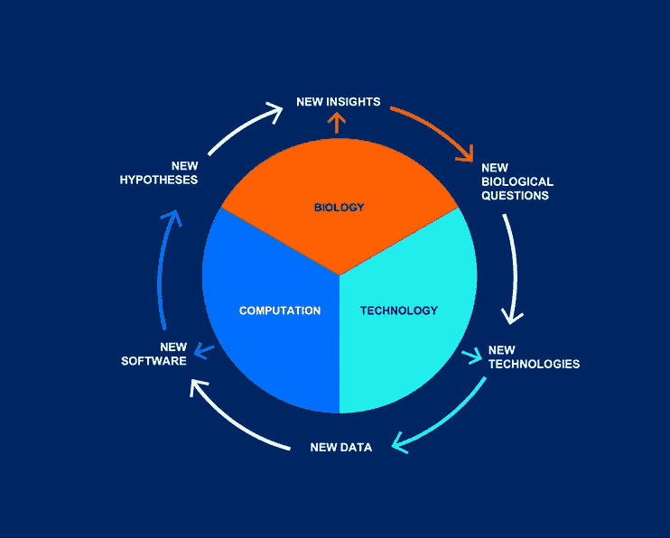

# 生物医药奇点

> 原文：<https://towardsdatascience.com/the-bio-medicine-singularity-a9615708a925?source=collection_archive---------29----------------------->

## 基于机器学习的革命能否在人工通用智能之前改变生物医学和治疗学？

随着我们获得更精确的建模能力和指数级更高的计算能力，我们可以精确建模的系统集成比例地增长。这将应用于许多激动人心的领域:能源系统、健康、技术、太空探索等。我 **更喜欢看看这些预测机制在哪里可以应用于增长和福祉**，而不是干涉我们是否生活在模拟中的讨论。*我们这个资本主义、痴迷于增长的社会的方式是创新问题，而不是试图减少问题的根源。*

硅谷的夕阳。

人工智能领域中常见的术语是“奇点”**，其中技术发展将大大超过人类发展，这是在[Vernor Vigne](https://en.wikipedia.org/wiki/Vernor_Vinge)1993 年的作品“即将到来的技术奇点”中提出的。许多人认为这一时刻“很快”就会到来，并给我们的日常生活带来不可挽回的变化(*我有意省略了关于各种知名思想家将奇点置于我们未来多远的讨论*)。**

****

**来自[系统生物学研究所](https://isbscience.org/about/what-is-systems-biology/)的系统生物学的大致思路。**

**如果一个人假设模拟能力每年都有微小的增长，那么我们肯定会达到某个巨大的能力拐点。生物学的问题是…**

> **当分子生物学的模拟变得足够丰富，可以用于离线药物发现时，会发生什么？**

## **复习:现在新药是如何产生的？**

**目前，美国美国食品药品监督管理局批准一种药物需要花费超过 10 亿美元。这一成本涵盖了临床试验的多层发现和硬科学阶段。生物疗法的机制经常在疗效显现后被修补，所以许多早期临床试验是极其危险的，可能会有长期后果或死亡(T21)。**

## **数字生物系统将把我们带向何方？**

**能够数字化地重复这个过程*将从根本上改变药物制造和设计。我们将允许科学家测试他们最疯狂的想法和学习算法，探索没有边际成本的***可能性。缺乏开发的边际成本是最高产的技术公司能够获得超高利润的原因。******

*****对复杂生物系统建模的早期探索属于系统生物学。从机器学习、大数据分析、形式生物学、化学等方面包装思想。一起将是一个巨大的跨学科的事情。在人体上测试这些新的实验性药物之前所需的验证将是极端的，但潜在的回报是无限的。*****

*****也许一个复杂的嵌入，如[神经常微分方程](https://papers.nips.cc/paper/7892-neural-ordinary-differential-equations)可以导致发现，使复杂系统的丰富建模成为可能。从机器学习的角度来看，这里可以尝试的令人兴奋的途径是很长的。*最终，我会对改变生活的多主体强化学习问题非常感兴趣，这将是数字化解决疾病。******

*****拥有一个有效精确的人类生物学模型将使健康和幸福成为人类可以在电脑上轻松完成的游戏。这是否合乎道德或令人愉快，是机器系统生物学的研究人员现在应该开始问的问题。**我们应该让机器在哪里遇见身体？*******

> *****“**生物医学奇点**:我们可以用数字来表示复杂的生物学，从而以零边际成本来研究它的时刻”——d . a . Wallach*****

*****对于牛顿这样的人来说，世界物理学会不会显得复杂得难以驾驭？答案几乎肯定是肯定的，所以作为科学家，我们有义务尝试并解决这些看似不可能的想法，并获得无限回报。*****

**********

*****不可能知道我们是到达了更好的地方还是把最好的留在了后面。*****

## *****一些资源:*****

***** [## #06 - D.A. Wallach:音乐、医学、长寿和颠覆性技术- Peter Attia

### 录音艺术家、词曲作者、散文家、投资者等等:D.A. Wallach 是一个真正的博学家。在这一集里…

peterattiamd.com](https://peterattiamd.com/dawallach/) 

圣达菲研究所，他的研究部分涉及了新的控制论，涉及生物奇点。[系统生物学](https://en.wikipedia.org/wiki/Systems_biology)是这项工作的正式领域。*****