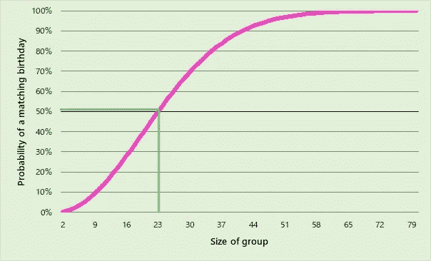

# 生日悖论

> 原文：<https://towardsdatascience.com/the-birthday-paradox-ec71357d45f3?source=collection_archive---------16----------------------->

## 这个反直觉的统计“悖论”是如何与卫星碰撞、DNA 证据和其他巧合联系在一起的

如果你有一群人在一个房间里，你需要多少人来使两个或更多的人有可能在同一天生日？


在 [Unsplash](https://unsplash.com?utm_source=medium&utm_medium=referral) 上由[S O C I A L C U T](https://unsplash.com/@socialcut?utm_source=medium&utm_medium=referral)拍摄

理论上，两个人同一天生日的几率是 365 分之一(不考虑闰年和生日在一年中的不均匀分布)，所以你一生中只会遇到少数几个和你同一天生日的人。这导致很多人直觉猜测 180 左右。

正确答案是 23。

这意味着在你学校的每一个班级里，在上班的公交车上，在足球场上，至少有两个人的生日是同一天。

说到概率，人类的直觉是出了名的差。数十亿美元的博彩业就是证明。

生日悖论中的混乱来源是，概率的增长与可能配对的人数有关，而不仅仅是群体的大小。配对的数量相对于参与者数量的平方而增长，使得 23 人的组包含 253(23×22/2)对不同的人。

在每一对中，有 364/365 的机会拥有不同的生日，但是这需要发生在每一对*身上，因为在整个组中没有匹配的生日。因此，一组 23 个人中有两个人生日相同的概率是:*

```
1 — (364/365)^253 = 50.05%
```

如果我们绘制不同群体规模的概率图，我们会看到概率是如何随着群体规模的增加而增加的。



至少有一个匹配生日的概率与小组规模

该线在组大小为 23 之前穿过 50%。我们之前猜测的 180 有这么接近 100%的概率，不值得展示。事实上，随机选择一组 180 人，并且没有一个人同一天生日的可能性大约是 6x10^-20——比两个人从地球上所有的沙子中挑出同一粒沙子的可能性小 100 倍！

## 不太可能的巧合

我们可以将生日悖论一般化，以观察具有类似结构的其他现象。

两个人的银行卡上有相同 PIN 的概率是万分之一，也就是 0.01%。然而，只需要 119 个人，就有可能有两个人拥有相同的密码。

当然，这些数字假设生日和 pin 是随机抽样、均匀分布的。事实上，[生日在一年中的特定时间达到高峰](https://www.ons.gov.uk/peoplepopulationandcommunity/birthsdeathsandmarriages/livebirths/articles/howpopularisyourbirthday/2015-12-18)，人们更有可能选择特定的数字作为他们的 PIN。但是缺乏统一的分布事实上减少了你需要的组的大小。

如果我们降低同时发生的机率，那麽要有均等的碰撞机会，所需的群组规模显然会增加。然而，它的增长比概率的倒数要慢得多。

例如，概率为万分之一，最小组大小为 119。对于不到 10 倍的巧合，最小的群体是 373，或者只有 3.15 倍大。因此，即使概率非常小，群体规模也不会变得特别大。百万分之一的几率，需要的群体只有 1178 人。

## 太空垃圾


由 [SpaceX](https://unsplash.com/@spacex?utm_source=medium&utm_medium=referral) 在 [Unsplash](https://unsplash.com?utm_source=medium&utm_medium=referral) 上拍摄的照片

这涉及到卫星碰撞和太空垃圾领域。两个特定的轨道物体在一年中相互碰撞的几率几乎微乎其微。然而，鉴于大约有 5500 颗卫星和大约 90 万个大于 1 厘米的物体在我们头顶上呼啸而过，碰撞发生的频率比你想象的要高。

各国政府能够追踪较大的太空垃圾。这样就可以进行规避操作，将运行中的卫星和空间站转移到安全的地方。但是，随着每周约 20，000 例接近手术的发生和增长，这可能会成为一个越来越困难和昂贵的过程。

2009 年，两颗卫星——一颗 16 年前报废的俄罗斯军事卫星和一颗仍在运行的铱星通信卫星——以近 12 公里/秒的相对速度相撞。两颗卫星都破碎成碎片云，超过 1000 块碎片比柚子还大。

更多的太空垃圾意味着发生碰撞的几率更高。每次碰撞都会增加太空垃圾的数量。这种正反馈循环，如果超过物体坠入大气层并燃烧的速度，可能会导致凯斯勒综合症。这是一个连锁反应，碰撞变得越来越常见，喷射出越来越多的碎片，直到将卫星置于低地球轨道变得太危险而不可行。

## **DNA 证据**

在过去的四十年里，DNA 证据已经彻底改变了法医调查领域。当我们处理日常事务时，我们会留下一系列遗传物质，主要是通过皮肤细胞和毛发。政府建立了巨大的 DNA“图谱”数据库，记录了一系列不相关的遗传标记。

对于一些系统，两个人在所有记录的遗传标记上匹配的概率估计为万亿分之一(不包括同卵双胞胎)。鉴于这个数字是地球上人口的 100 倍，如果在现场发现了一个人的 DNA，你可以非常肯定他们在那里，对吗？

嗯，不一定。根据前面的例子，当你有足够大的一群人的时候，一个微小的概率可以膨胀成有形的东西。

在一个像美国这么大的国家(3.28 亿人口)，万亿分之一的匹配率相当于 3000 分之一的概率，你有一个基因图谱“双胞胎”，在某个地方。2019 年，美国发生了 1.6 万起谋杀案。这意味着每年可能有大约 5 起谋杀案，其中犯罪者的 DNA 与另一名美国人的 DNA 完全匹配(再次排除同卵双胞胎)。即使涉及的概率低得令人难以置信，生日悖论的力量意味着你不应该仅仅根据 DNA 证据定罪，还需要考虑其他间接证据。

同样值得考虑的是，DNA 图谱系统在过去的三十年里有了很大的改进。在这项技术应用的早期，十亿分之一的 T2 概率经常被引用。这将导致大约 5000 起 DNA 模糊的谋杀。

## 生日袭击


照片由 [Mauro Sbicego](https://unsplash.com/@maurosbicego?utm_source=medium&utm_medium=referral) 在 [Unsplash](https://unsplash.com?utm_source=medium&utm_medium=referral) 拍摄

生日悖论可用于对数字签名的加密攻击。数字签名依赖于一种叫做*散列函数* f(x)的东西，它将消息或文件转换成一个非常大的数字*(散列值)*。然后，这个数字与签名者的秘密密钥相结合来创建签名。阅读文档的人可以使用签名人的公钥“解密”签名，这将证明签名人已经对文档进行了数字签名。

这些签名可用于验证文件的真实性。通过阅读这篇关于 Medium.com 的文章，你现在正在通过 HTTPS 协议使用数字签名。安全性依赖于找到与签名原件具有相同散列值的另一个文档的难度。

然而，生日悖论让我们有可能通过攻击这个散列函数来滥用这个系统。

假设 Bob 是一个对合同进行数字签名的权威。我们想骗 Bob 在不知情的情况下签署一份欺诈性合同，这样我们就可以在以后暗示他批准了这份合同。我们需要找到的是两个契约，一个合法，一个欺诈，它们在通过 f(x)时产生相同的哈希值。

对于每一份合同，我们可以找出许多方法来微妙地改变它，而不改变它的意义。例如，您可以在每一行的末尾添加不同数量的空白，稍微改变徽标中的像素，或者对格式进行小的更改。总的来说，这给了我们数百万个技术上不同但语义上相同的文档，在 Bob 看来，这些文档都会得到批准。这也给了我们数百万种欺诈性文件。如果我们找到一对文档，一个合法，一个欺诈，产生相同的散列，那么我们可以将合法的传递给 Bob 签名，然后使用该签名来“证明”欺诈合同的真实性。

由于生日悖论，给定散列函数的巨大范围，合法文档之一和欺诈文档之一之间至少一个散列值冲突的可能性比可能预期的要高得多。事实上，您需要生成的文档数量大约是哈希函数可能输出数量的平方根。这是因为没有一个哈希函数是完全均匀分布的，这导致了许多流行的哈希算法[变得不安全](https://en.wikipedia.org/wiki/Secure_Hash_Algorithms)。