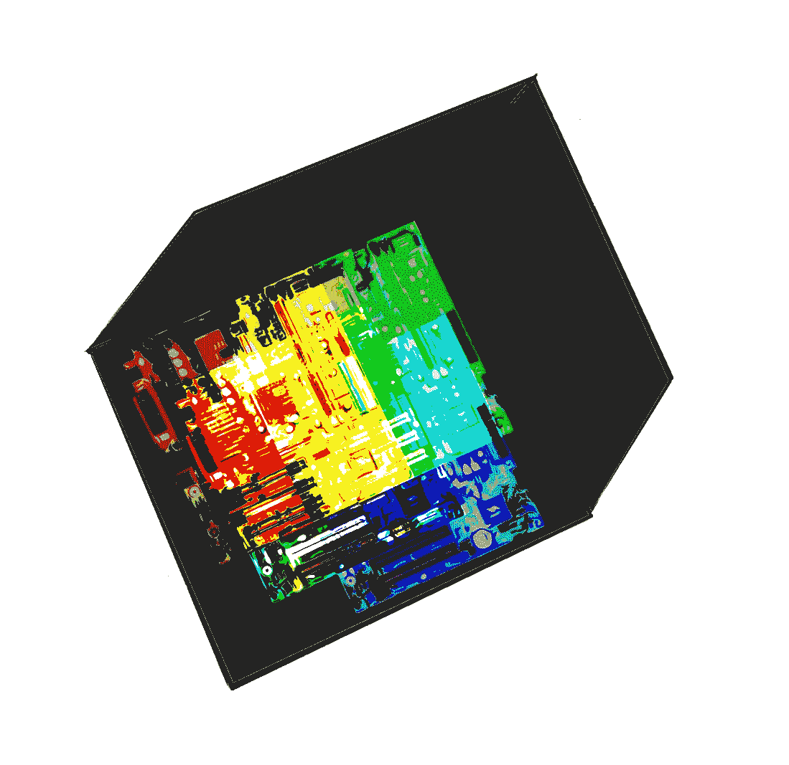
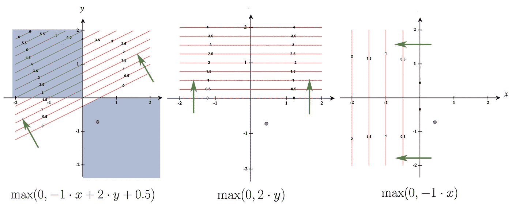

# “黑箱”问题:探索矛盾

> 原文：<https://towardsdatascience.com/the-black-box-problem-exploring-the-contradiction-ba7a75f3abce?source=collection_archive---------32----------------------->

## 俗话说“数据进，预测出，中间发生了什么我们也不知道。”但是如果中间有新东西呢？

关于任何足够复杂的机器学习模型和几乎所有深度学习模型，家乡最喜欢的评论是，它们是所谓的*黑箱*。俗话说“数据进，预测出，中间发生了什么我们也不知道。”对于一些应用程序来说，这并不那么具有破坏性:对于大多数商业应用程序来说，模型工作并产生回报的事实已经足够好了。在某些领域，对模型的理解是首选的，这是为了在例如自动驾驶汽车或医疗诊断中考虑责任。最重要的是，从这些黑箱中可能有学习的潜力，因为它们会产生令人惊讶和强大的结果。如果它们有稍微丰富多彩的一面呢？

我想说明的是，所有的神经网络都是由小的**解释单元**组成的，正因为如此，对于我们声称可以推广到新数据的任何模型，肯定至少有一个可回答的**解释单元**。因为至少有一个可回答的解释，没有模型在本质上是完全不透明的，这是一个强有力的命题。

这是一篇充满语言和争论的文章，但我希望通过例子让任何有深度学习经验的人都能读懂。

在大多数情况下，黑盒范式是一种真实的观察，但在本文中，我希望表明，这并不一定意味着深度学习或复杂模型在某种内在性质上就是黑盒。相反，我把它们的黑箱化分解成一个归约的问题。然后，我解释了模型的非线性复杂性是如何激发出一幅非还原的画面的。最后，我断言一个一般化(深度学习)模型有潜力回答至少一个**解释问题:** *一个要解释的事实或事情，*超出了其部分的总和，因此没有一个模型完全是一个黑盒。然后我谈谈为什么我认为这很重要。

我们从一个思维实验开始，以帮助建立一些最初的直觉。考虑一个经过训练的模型是完全确定的:某个输入将总是产生某个输出。比方说，查理建立了一个模型，它做出了惊人的预测，例如，根据全身核磁共振成像，某人是否会在 10 年内患癌症(这种能力将改变医学，我们正在加大赌注)。查理的模型有 5000 万个参数，“令人惊讶的是”，每个参数的确切值都是已知的，它们相互作用的确切方式也是已知的。当然，这是构建深度学习模型的典型。现在，一名医生使用查理的模型，并希望他们解释为什么它说他们的病人将在 10 年内患癌症。Charlie 说，“正是因为将这些数据插入到一系列具有这 5000 万个参数的非线性函数中，才能产生预测。”查理觉得完全正确。他们可以给你一个闪存盘，里面应该有解释他们的模型如何工作所需的所有信息。

但这个答案很糟糕，重要的问题是为什么:我们感觉这个解释不够好，或者没有谈到正确的事情。正是在这里，我们遇到了黑箱矛盾:即使我们手头有模型的确切结构，我们也有一种我们对模型如何工作一无所知的感觉。这是从哪里来的？

最主要的问题是，医生考虑的是生物学或医学上的相关特征，我们隐含地假设这些特征存在于 MRI 数据中，可以预测癌症。她实际上是要求你根据这些特征对网络进行解释。Charlie 如何描述或看待他们的模型的词是简化论者:*模型所做的一切或它的属性都可以被简化为它的组成部分*。没有“我认为这个灰色像素团是即将发生的癌症的征兆”的节点被触发。所以实际上，当我们说“黑盒”时，我们实际上说的是，神经网络只提供其部分的解释，由于其部分除了其功能上的成功之外与我们期望的解释没有关系，我们说，“数据输入，黑盒中间，预测输出”。

是这个吗？不，神经网络有一个非常重要的属性，表明我们可以安全地采取*非还原*观点。由于我们还假设并观察到模型会推广到新数据，(并且由于 Charlie 的超级模型获得了 FDA 的批准，所以它一定获得了)，我们知道一定存在至少一个超出模型简化视图的特征。论点是这样的:

(1)一个模型 **M** 带结构 **{W}** (是重量，连接等。)是由某个进程创建的，用于从集合 **{X}** 中的 *n* 个输入数据 **X** 的示例中预测 **Y** 。
(2)模型根据从未见过的输入数据**X’**可靠地预测**Y’**。
(3)由于 **{X'}** 与 **{X}** 不相交，所以存在一个在 **{X}** 和 **{X'}中没有完全表现出来的可靠特征。** 【4】**从(1，2，3)中至少有一个由 **M** 表示的可靠特征没有在 **{X}** 和 **{X'}** 中表示。**

****概括新数据的模型不可简化为其定义。****

**为了真正袖手旁观这一点，我们必须提供一个解释，说明某些非还原性行为是如何从模型中出现的，这些行为的特征在模型中并不明显。重要的是要理解，模型的黑盒不是架构的属性，而是我们对架构应该如何工作或者它是如何产生的期望。这是一个偷偷摸摸的转变，但它让我们有可能打开一扇门，让模型感觉“可以解释”。所以让我们试试:**

**我们的开始线索是，神经网络仅仅因为它们的非线性而工作，这是另一种说法，即操作在神经网络中不互换。一个简单的例子是，在 ReLU 激活之后应用矩阵操作(即线性层)将不会产生与在矩阵操作之后应用 ReLU 相同的输出。我在下图中展示了这一点，它是由蒙图法尔*等人启发的。艾尔。*在他们关于深度神经网络线性区域数量的论文*中*他们发现并断言“深度网络能够将每一层输入空间的部分顺序映射到相同的输出。通过这种方式，深度模型可以计算出对不同输入的复杂模式做出同等反应的函数。”**

****

**三个等高线图显示了具有 ReLU 激活的简单 2 节点“网络”(左)与其具有相同权重的 ***y*** 输入(中)和 ***x*** 输入(右)的线性分解。没有轮廓的空白区域(例如蓝点所在的位置)显示所有输入归零的位置。蓝色区域显示 2 节点网络相当于其输入的线性组合。绿色箭头表示决策边界处的梯度。重要的是，只有在非线性“网络”的情况下，这些箭头才不垂直于输入维度。甚至中间和右边的图的总和也产生与输入向量对齐的箭头。**

**由此产生的一个有用的想法是将高维空间“折叠”到自身上的想法。出于这种好奇，我研究了非线性如何改变输出空间，并确实发现，即使是简单的 2 节点网络也能计算出对不同输入做出相同反应的函数。但还有另一个特征:折叠发生和不发生的“折痕”。但是进一步，我发现输入空间中的边界或折痕仅对于输入的非线性组合不垂直于输入维度**。这个折痕是输入空间内的超平面，在一侧，输出与其输入成比例地变化，而在另一侧，它变成挤压成相等的输出。****

**由于该平面的位置是通过优化找到的，因此我们可以说，对于输入的每个组合，线性层解决了其输入重要和不重要的最佳边界*。*这种折叠和折痕效应超出了输入的总和，并形成了一个解释单元:这种边界之所以存在，是因为特征空间中有一些区域解释了结果(以我们希望的解释方式)，因为也有一些区域没有解释结果(否则，就不会有最优解)。在没有硬零点的其他非线性的情况下(例如，sigmoid),“无关紧要”的边界只是软的，某些输入可以映射到越来越相似的值。**

**对于一个概括得很好的模型，比如 Charlie 的超级 FDA 批准的新患者模型，我们发现在他的模型中一定有一个特征或属性不在训练数据中，这部分来自这些折痕和折叠。查理的模型至少有一个解释单元:如果有一个解释单元，就有一个解释单元，或者需要解释的东西。**这意味着，从泛化的神经网络中总会有一些东西可以学习。****

**所以让我们回到起点。我们发现，解决黑箱问题的常用方法回避了机器学习模型简化的问题。然后，我展示了如果模型一般化(这是任何模型的目标)，至少有一个特征不完全存在于训练数据中。然后，我认为深度学习模型可以通过它的非线性产生一些不可简化为某种输入模式的特征。这些特征至少部分地解释了*某些东西，*而且由于有些东西可以用一个模型来解释，这个模型并不是完全不透明的。**

**天啊。好吧。也许所有这些都是一种超级复杂和冗长的方式来表达“它们太复杂了，难以理解”。但是我不同意:我认为这个公式，如果正确的话，可以为寻找这些小的**解释单元**或者想办法创造更容易找到的解释单元提供灵感。**

**在我的工作中，我们使用深度注意力网络从全切片组织图像中预测肿瘤分级。其中的一个关键特征是所谓的注意力地图，即注意力权重在组织上的分布。我们发现，对于这种特定的分类，高权重聚集在肿瘤边界，在那里肿瘤细胞的分化最明显和极端。这是我们更高层次的解释单位，我们很高兴有一个。在最初的地图上看到这个特征*出现*真是不可思议。**

**如果你只有一个有 10 个隐藏层的直线 MLP，没有注意力地图可以观察，那会怎么样呢？它只有数百万个参数，而且能正常工作！我现在没有答案，但也许如果你确信你的网络学到了一些新功能，一些超越训练数据中任何东西的东西，你也会找到灵感，至少去寻找它——我个人认为你可以，而且你应该。如果你的模型推广到新的数据，它已经找到了重要或不重要的输入组合。不仅仅是从噪音中提取信号，还有新的信号，这些信号是如何提取出来的。**

**现在，很明显，这并不意味着很容易将巨大的网络视为半透明的，并解释关于它们的一切。这是困难的部分，但我有一种乐观的感觉，我们会变得更好，并找到新的方法来理解我们建立的这些强大的模型。**