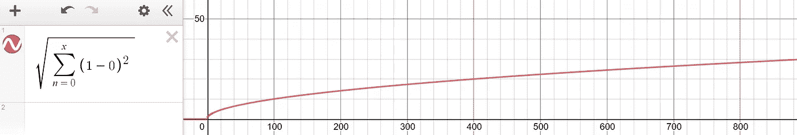
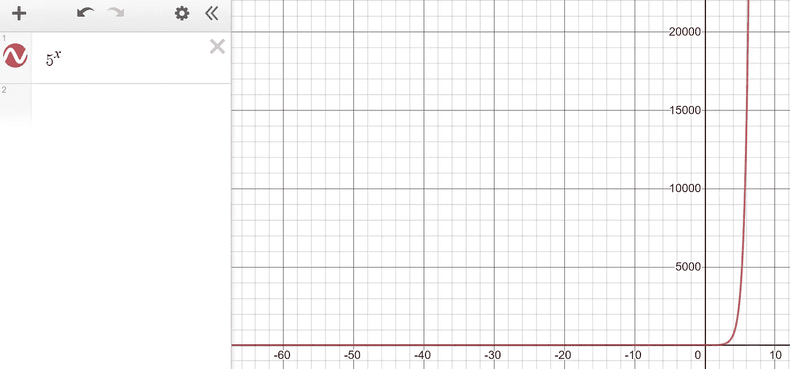
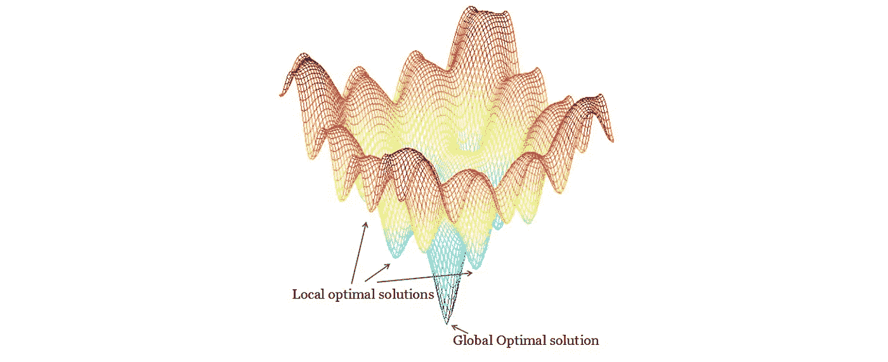

# 维度的祝福:为什么维度的诅咒是一枚双面硬币

> 原文：<https://towardsdatascience.com/the-blessing-of-dimensionality-how-warped-spaces-can-actually-be-beneficial-c5033786cc9a?source=collection_archive---------40----------------------->

来源: [Unsplash](https://unsplash.com/photos/b4D7FKAghoE)

## 扭曲古怪空间的好处

大多数在数据科学领域有一些经验的人都听说过维数灾难。它描述了在高维空间中研究操作和分析数据时出现的大量现象，这些现象在低维空间中不会出现。

例如，考虑一下距离的概念在高维空间中是如何被扭曲的。由坐标( *x，y，*……)定义的两个点 *a* 和 *b* 之间的距离公式如下:

你可以在这里找到公式[的证明](https://medium.com/swlh/understanding-the-mathematics-of-higher-dimensions-ab180e0bb45f)。

当绘制公式时，其中 *x* 是维数，而 *y* 是原点和一个点(1，1，1，…)之间的距离，人们可以看到距离将不可避免地逐渐达到峰值，或者更有可能的是，趋向于一个单一值。

用德斯莫斯画的。

这是高维空间中距离本质的证据——随着维度的增加，任何单一一维线的重要性或价值都在减少，这可以从 *y* 轴上的收益递减中看出。考虑到随着维度的增加，体积和点的可能性增长得有多快，这是可以预料的。

这也是为什么随着维度的增加，超球体的体积趋于零的原因——因为球体被定义为由距离中心点一个半径距离的所有点组成，维度的数量增加，但距离逐渐变小。然而，这看起来并不直观，随着维度趋向于无穷大，超球体的体积将趋向于零，而它所在的超立方体将继续增长(或者保持不变，如果边长为 1)。

让我们考虑一个边长为五个单位的二维超立方体(正方形)。有，那么 5 = 25 个单位。类似的三维超立方体(一个立方体)有 125 个单元。从那里，它扶摇直上。指数的力量真的非常不可思议——仅仅在十个维度内，超立方体就已经拥有了 9765625 个单位的超体积。在空间中增加一个额外的维度会将当前的空间扩大一个巨大的数量级，所以毫不奇怪，微小的一维距离具有递减的价值。

用德斯莫斯画的。

高维数学很奇怪，但在机器学习中，它带来了更大的风险。因为高维空间的体积是难以想象的巨大，而数据点的数量永远无法与这个体积相比，所以高维数据通常非常稀疏。例如，考虑一个 150×150 像素的图像，这是机器学习中非常常见的尺寸。然后，该图像的 150 乘以 150 乘以 3(每个像素三个值来指定 RGB 值，即红色、绿色和蓝色值)等于 67，500 个维度。

比如说，与一万张其他图像一起，每张图像作为特征空间中的一个点存在，67，500 个维度中的每一个维度都有一个值。因为空间的巨大，并且因为在高维空间中距离是如此的小，数据将会非常稀少。这导致模型过度适应数据，因为机器学习算法的数学本质依赖于相对距离的概念，这种概念在如此巨大的空间中被扭曲和淹没。

这就是为什么卷积神经网络在图像中如此受欢迎——它不依赖于许多其他算法使用的空间点模型，而是使用简单的数据改变层来转换一系列矩阵。然而，神经网络的很大一部分是*梯度下降*——参数(权重、偏差等)的更新。)以优化网络路径来减少错误。这需要指出数百万个可训练参数的特定组合会形成什么样的误差。

然而这是维度的*祝福的一个例子。事实上，维度诅咒的弱点在其他情况下可以被重新定义为优点。*

> 维度的祝福和维度的诅咒是一枚硬币的两面。

神经网络的目标是达到误差空间的*全局最小值*；也就是说，找到产生最低误差的最佳参数集。为了达到全局最小值，它从误差空间的某个点开始，并随着每个训练步骤向它认为正确的方向递增。事实证明，在误差空间中，有许多局部最小值——误差空间中的凹陷是最小值，但不是整个误差空间中的最低值。

[来源](https://blog.paperspace.com/intro-to-optimization-in-deep-learning-gradient-descent/)。图片免费分享。

尽管有解决局部极小值的方法，例如不断增长的利用“动量”和其他方法的专门优化器库，但它仍然是神经网络训练中的一个常见问题。如果它不阻止网络找到全局最小值，它至少可以使训练时间长得多。

然而，在高维空间中，距离是扭曲的，并且不成比例地变大，正如前面所展示的。这被证明是局部最小值的一个巨大优势，它曾经看似全局的下降被渲染成任何合理的优化器都可以克服的表面上的小突起。另一方面，全局最小值对于网络来说将是足够明显的，以在该点收敛。因此，在某些情况下，*增加维度*可以带来更好的性能和更快的训练时间。当然，这可能会被参数的过度拟合所抵消，因此需要根据实验和知识仔细制定决策。

在机器学习的其他领域以及从数学到物理的其他领域，维度祝福还有其他应用。需要理解的重要一点是，在机器学习中，*一切都是有得有失。维度诅咒可能没有大多数人想象的那么糟糕。*

# 如果你喜欢，

你可能也会喜欢我其他一些关于数学和机器学习的文章。

 [## 并非所有的无限集合都是相同的大小

### 康托尔著名的对角线论证

medium.com](https://medium.com/dataseries/not-all-infinite-sets-are-the-same-size-5abc3782a1f1)  [## 你需要知道的所有分布

### 二项式、双峰式、泊松、+更多

medium.com](https://medium.com/@andre_ye/all-the-distributions-you-need-to-know-ad570514987b)