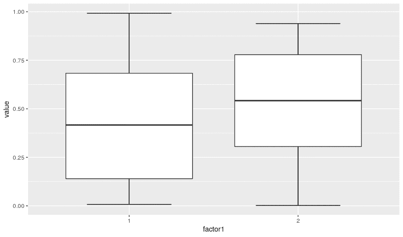
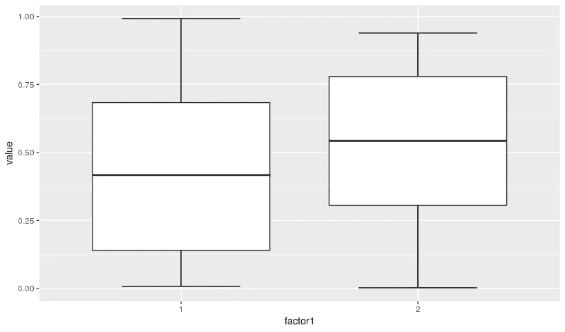
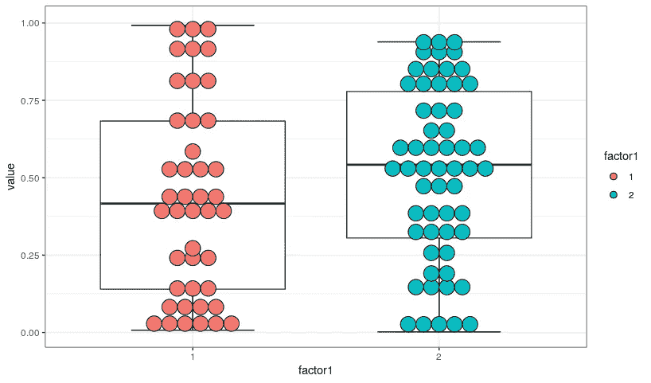
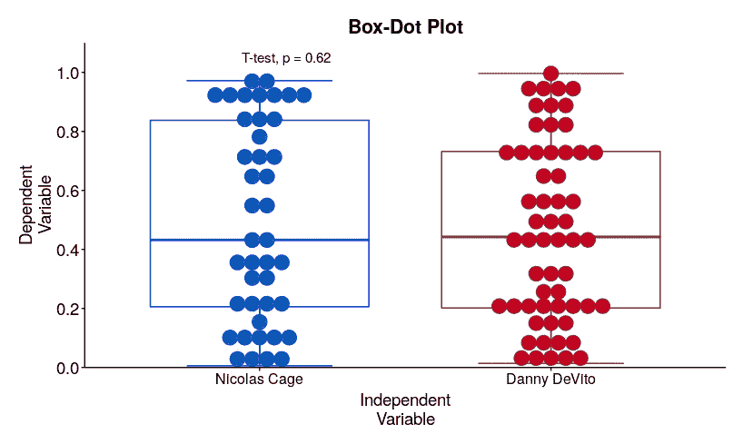

# 当我开始学习 R 的时候，我希望我有这个盒子情节指南

> 原文：<https://towardsdatascience.com/the-box-plot-guide-i-wish-i-had-when-i-started-learning-r-d1e9705a6a37?source=collection_archive---------30----------------------->

## 信息数据可视化是 R！我提供了一些有用的技巧来定制你的情节，使它们更有信息量和色盲友好。



在 R 语言中，定制一个图形来将其转换成一个漂亮的图形并不是炼金术。尽管如此，我还是花了很多时间(也很沮丧)来弄清楚如何让这些情节具有知识性和出版质量。我想分享我用来绘制数据的代码，解释它的每一部分是做什么的，而不是像龙掌管它的宝藏一样囤积这些信息。

首先，让我们加载我们的包并生成一个虚拟数据集，其中包含一个自变量和一个连续因变量。在代码片段之前，我将讨论我们将使用的函数和参数。我们还预先为我们的分类变量设定了一个顺序。

## 虚拟数据集:函数和参数

*   **runif** 生成 100 个介于 0 和 1 之间的数字
*   **抽样**随机抽取数字 1 或 2，100 次
*   **因子**为我们的分组变量设置了一个首选顺序

```
### Load packages
install.packages('ggplot2')
install.packages('RColorBrewer')
install.packages('ggpubr')
library(ggplot2)
library(RColorBrewer)
library(ggpubr)#Create dummy dataset
ndf <- data.frame(
  value     = rep(runif(100)), 
  factor1   = as.char(rep(sample(1:2, replace = TRUE, 100))
)
ndf$factor1 = factor(ndf$factor1, levels = c('1', '2'))
```

## 箱形图:函数和参数

*   **ggplot** 允许我们指定自变量和因变量，以及用于图表的数据集
*   **stat_boxplot** 让我们指定添加到绘图上的胡须类型
*   **geom_boxplot** 指定图形中盒子的自变量和因变量

第一次基本的尝试并没有很大的信息量或视觉吸引力。我们首先关注绘制第一个独立变量， *factor1。*我也不喜欢 ggplot 内默认的灰色主题。

```
plot_data <- ggplot(ndf, aes(y = value, x = factor1)) +
  stat_boxplot( aes(y = value, x = factor1 ), 
                geom='errorbar', width=0.5) +
  geom_boxplot(aes(y = value, x =  factor1))
```



由作者在 R 中生成

## 带点的方框图:函数和参数

*   **theme_bw()** 为剧情设置黑白主题，去掉讨厌的灰色背景
*   **geom _ dot plot:***binaxis*指定哪个变量将与点一起显示。其他参数指定了点的外观，而 *binwidth* 指定了我们希望在绘图的同一行中有多少个点。如果你想让点透明，使用 *alpha* 参数，它可以让你指定点的不透明度从 0 到 1。

现在我们的情节更丰富了，但仍需要改进。我们想修改一些颜色，轴和标签。

```
plot_data <- ggplot(ndf, aes(y = value, x = factor1)) +
    stat_boxplot( aes(y = value, x = factor1 ), 
                  geom='errorbar', width = 0.5) +
    geom_boxplot(aes(y = value, x =  factor1)) +
      theme_bw() +
      geom_dotplot(binaxis='y', 
                   stackdir = "center", 
                   binwidth = 1/20,
                   dotsize = 1, 
                   aes(fill = factor1))
```



## 为小事流汗

*   **scale_fill_manual** 让我们为自变量的特定值设置特定的颜色
*   **xlab 和 ylab** 允许我们分别标记 x 轴和 y 轴。如果你把换行符后面的转义字符放入标题中(\n)，它将在下一行继续标签的其余部分！
*   命名你的情节
*   主题是脚本中非常可定制的部分。它让我们可以定制任何我们想要的参数。由于我不喜欢放置在 ggplots 中的默认网格，我将 *element_blank* 归属于几个面板参数，以消除绘图周围的边界。我把轴涂成黑色而不是灰色。我还用 *plot_margin* 指定了图形周围需要多少空白空间。因为这个情节很简单，所以我们去掉了这个例子的图例。通过各种 *axis_text* 参数，我设置了 axis 文本和标签的大小、字体、颜色和位置。
*   **scale_y_continuous** 设置 y 轴以 0.2 为间隔从 0 增加到 1。通过将剧情的限制扩大到 1 以上，给了标题更多的喘息空间。如果我需要使用带有离散变量名称的 y 轴，我可以使用不同的参数——scale _ y _ discrete。
*   **scale_x_discrete** 让我重新标记两个独立变量。这使您可以快速重命名编码数据。我把自变量重新标为丹尼·德维托和尼古拉斯·凯奇。让我们假设我们正在看尼克·凯奇和丹尼·德维托在票房上的表现，使用 0 到 1 之间的分数。
*   **stat_compare_means** 允许您进行统计测试。这个是给你探索的！只需键入 **stat_compare_means(** 并按 tab 键即可探索您可用的不同选项。不然可以打字？stat_compare_means 获取该功能的帮助手册！

如果你想知道代码中不同元素的 hjust 和 vjust，它只允许我们改变文本元素的位置。我通过改变箱线图的颜色以及点的填充来添加一些光斑。如果您正在构建一个繁忙的地块，检查可访问性也很重要。你可以用这个工具找到色盲友好调色板:[https://colorbrewer2.org/](https://colorbrewer2.org/)。

为了方便起见，我将代码中的任何变化都加粗，以便于理解。

```
plot_data <- ggplot(ndf, 
                    aes(y = value, x = factor1, **color = factor1**))+
                    scale_color_manual(values = 
                                       c(**'1' = 'blue'**, 
                                         **'2' = 'firebrick4'**)) +
      stat_boxplot( aes(y = value, x = factor1 ), 
                    geom='errorbar', width = 0.5) +
      geom_boxplot(aes(y = value, x =  factor1), shape = 2)+
                         theme_bw() +
        geom_dotplot(binaxis='y', 
                     stackdir = "center", 
                     binwidth = 1/20,
                     dotsize = 1,
                     aes(fill = factor1)) + 
  **scale_fill_manual(values = c('1' = '**#0571b0**', '2' = '#ca0020'))** +
  **xlab("Independent\nVariable") + ylab("Dependent\nVariable") +
  ggtitle("Box-Dot Plot") +
  theme(  panel.grid.major = element_blank(),
          panel.grid.minor = element_blank(), 
          axis.line = element_line(colour = "black"), 
          panel.border = element_blank(), 
          plot.margin=unit(c(0.5,0.5, 0.5,0.5),"cm"), 
          legend.position="none", 
          axis.title.x= element_text(size=14, color = 'black', vjust = 0.5),
          axis.title.y= element_text(size=14, color = 'black', vjust = 0.5),
          axis.text.x = element_text(size=12, color = 'black'),
          axis.text.y = element_text(size=14, color = 'black'),
          plot.title  = element_text(hjust = 0.5, size=16, face = 'bold', vjust = 0.5)) +
    scale_y_continuous(expand = c(0,0), breaks = seq(0,1,0.2),
                   limits = c(0,1.1)) +
    scale_x_discrete(labels = c('Nicholas Cage', 'Danny DeVito'))
**    **stat_compare_means(method = 't.test', hide.ns = FALSE, size = 4,   vjust = 2)**
```



在很短的时间内，我们已经从一个简单的箱线图变成了一个视觉上更吸引人、更容易理解的图，为我们提供了关于各个数据点的更多信息。无论何时需要绘制数据，您都可以保存代码并随意修改。这使得定制过程更加容易！没有更多的(好吧，也许少很多)计算机防御！

如果你想下载代码，可以在这里找到:[https://github.com/simon-sp/R_ggplot_basic_dotplot](https://github.com/simon-sp/R_ggplot_basic_dotplot)。我在代码中留下了大量的注释，以防您遇到困难！请记住，在 RStudio 中，在函数前放置一个问号会为您带来一个说明指南！