# 音乐的组成部分

> 原文：<https://towardsdatascience.com/the-building-blocks-of-music-dad1dc84f82f?source=collection_archive---------26----------------------->

## 数学和物理如何帮助我们理解我们的主观音乐体验。有很多音频示例。

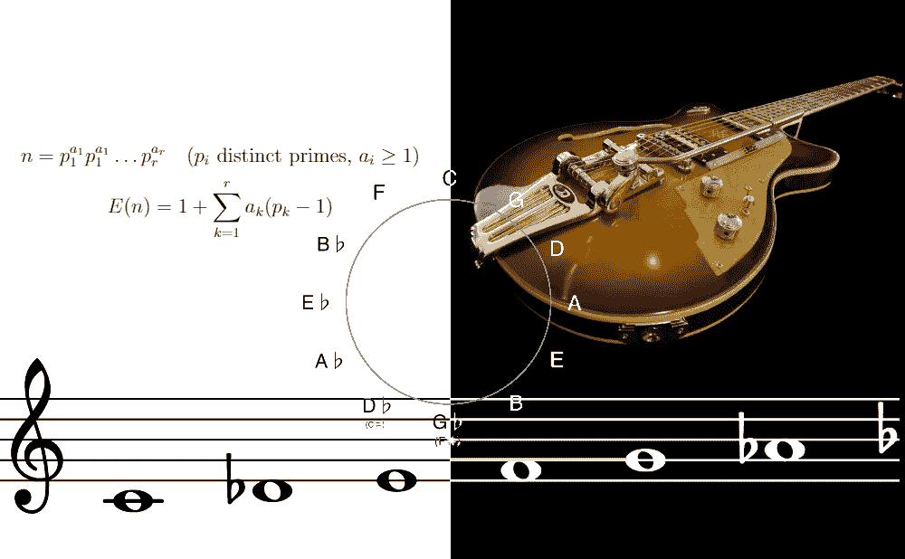

图片部分来自 Pixabay

如果你曾经，作为一个演奏乐器的人，试图通过学习新的音阶来扩展你的音乐视野，你可能会有这样的印象，不仅有无数不同的音阶，都有像乌克兰多里安或超级洛克里安这样的异国名字，而且明显的混乱也是绝对没有秩序的。维基百科页面列出了 63 种音阶，它们都有自己的声音和感觉。

幸运的是，有可能以一种相当优雅的方式对规模进行分类和排序。

# 目录

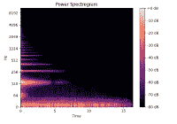

在第一部分中，我们将讲述音乐的物理学以及乐器的声学如何塑造我们如何构建音阶。

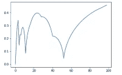

下一节将解释十二平均律是如何成为西方音乐创作的主导方式，以及它的利弊。

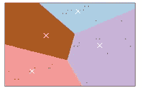

之后，我们将看看一些著名的(和不那么著名的)音阶，它们可以从 12 个音中构建出来。我们将根据亮度和一致性对它们进行排序，然后将它们分成 4 组。


最后一节将演示不同音阶的声音，既有一些流行歌曲作为例子，也有“一闪一闪，小星星”在 45 个不同的音阶中播放。

# 什么是规模

在我们开始组织和分类之前，了解一下规模实际上是什么可能会有所帮助。

在其最广义的形式中，音阶只是一组有序的音高，例如{100Hz，123Hz，230Hz}。但是，尽管这些特定的音高很有趣，而且从中创造出一些有趣的旋律也是可能的，但它们放在一起听起来并不好听。然而，听起来不错的是泛音系列。泛音系列是当您从一个音高开始，然后将该音高的倍数添加到集合中时得到的。例如{ 100 赫兹、200 赫兹、300 赫兹、400 赫兹}。这个系列模仿了我们的许多音调乐器的工作原理。

# 音乐物理学

例如，考虑一根吉他弦(图像中的红色)，张力为 **T** :

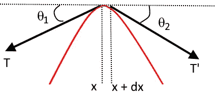

利用牛顿第二定律

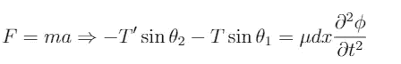

其中 **φ** 为 y 方向的弦位移，**T7 为弦密度。**

通过取极限和做一些代数杂耍，我们最终得到波动方程:

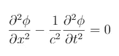

其中 **c** 为传播速度，为 **√T/** 。

波动方程可以通过假设来求解

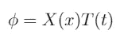

将这个代入等式得出

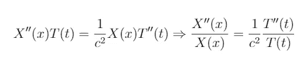

因为 L.H.S .仅仅是 x 的函数，R.H.S .仅仅是 T2 的函数，所以它们都必须是常数。因此，我们只有一个变量的两个微分方程。用通常的方法解决这些问题，把边界条件放进去，在末端固定绳子，一些初始形状，我们得到:

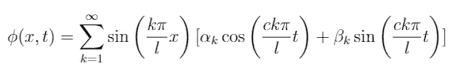

其中α和取决于初始形状。看上面的等式，我们看到在每个固定的 t，项只是

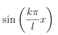

乘以一个常数。即:泛音系列。

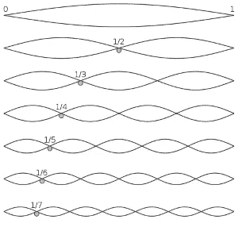

泛音系列波长。图片来自维基百科

这也是我们在吉他弦的声谱图中看到的。

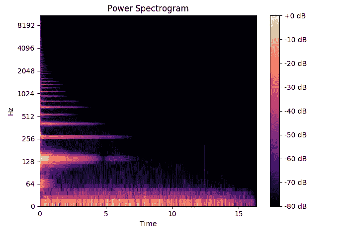

图片来自 StackOverflow。[https://DSP . stack exchange . com/questions/41012/吉他-基频-音高](https://dsp.stackexchange.com/questions/41012/guitar-fundamental-frequency-vs-pitch)

泛音的相对振幅由初始条件(即琴弦被击打的位置)和乐器主体的共振频率决定。

正是这种不同频率的分布赋予了乐器独特的音色。

然而，其他乐器的泛音级数没有这么简单，例如鼓，我们必须求解二维波动方程，从而得到比弦的三角函数更复杂的[贝塞尔函数](https://www.wikiwand.com/en/Bessel_function)之和。对于未修补的仪器来说，这通常是正确的。

让我们在一张纸上标出弦的泛音:

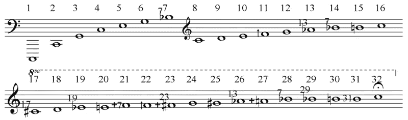

图片来自维基百科

第一个泛音是八度，第二个是完全五度，再次是八度，大三度，降七度等等。

# 毕达哥拉斯论调音

根据传说，毕达哥拉斯通过听铁匠的锤子发现了泛音系列中音乐调音的基础，它们在一起听起来有多好取决于它们大小之间的比例。

这在著名的[加夫留斯](https://www.wikiwand.com/en/Franchinus_Gaffurius)的*音乐理论* (1492)中永垂不朽，如下所示。这个图像很有趣，不仅因为 Gaffurius 显然不能决定如何拼写毕达哥拉斯，还因为左下部分是错误的。记住，所以重量必须是它们在图片中的平方。


图片来自维基百科

# 泛音级数

泛音系列是一个很好的音阶，但它有其局限性。假设我们已经使用{1，5/4，3/2}创建了我们的规模。这对应于主音，大三度音和完全五度音，它们在一起听起来很好。如果主音是 C，我们就有一个 c 大调和弦。但是现在我们想为音阶中的另外两个音，E 大调和 G 大调，创造大和弦。对于 E，我们需要{25/16，15/8}，对于 G，我们需要{15/8，9/8}。但是现在我们有了新的音符，需要更多的音符来配对，它会结束吗？

答案是否定的，但也差不多。为了看到这一点，我们将遵循毕达哥拉斯的想法，将我们的音阶扩展到完美的五分之一，我们得到 1，3/2，9/8，27/32…当我们回到 2 点的八度时有没有一个点？不，那是不可能的，因为 3 和 2 都是质数，所以对于任何 x，y，3^x/2^y 都不可能是 2。但是，让我们看看我们能得到多接近。

```
def get_perfect_interval(size, interval_nominator): 
    intervals = []
    for i in range(size):
        for j in range(size*2):
            intervals.append((i,j, (interval_nominator**i/2**j-2)**2))

    return intervals

[(y[0], y[2]) for y in sorted(get_perfect_interval(64, 3), key=lambda x: x[2])][(53, 1.747765116144801e-05),
 (41, 0.0005196076730230415),
 (12, 0.0007445546943927184),
 (29, 0.002441086870025483),
 (24, 0.0030189899953210067),
 (17, 0.005724679914381747),...
```

显然 53 的音阶让我们非常接近，但是 41 和 12 也很不错。这样，完美的第五和弦听起来总是很好，而对于 12 和弦，我们也能很好地近似泛音级数。17 音阶用于阿拉伯和波斯音乐。

有趣的是，对于 53 和 12，我们的音调间隔非常均匀，这可以通过绘制音调之间距离的标准化标准偏差来看出。

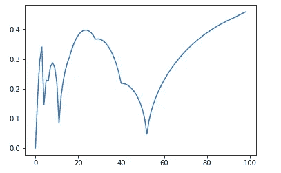

在 12 和 53 音调处存在局部最小值。

顺便说一句，人们已经使用了 53 音音阶:[乘飞机【53edo 微型管弦乐】](https://www.youtube.com/watch?v=sIsfYQATouc)

31 音也相当受欢迎:[量子 7(超越调性)31 音吉他](https://www.youtube.com/watch?v=IWEFhUU5RC0)。这是一个很好的三分之一音阶(大三分之一有 5 个作为提名者):

```
[(y[0], y[2]) for y in sorted(get_perfect_interval(64, **5**), key=lambda x: x[2])][(59, 7.45651434405272e-05),
 (28, 0.00037962303591693847),
 **(31, 0.0007754964530955168),**
 (56, 0.0015333212598040438),
 (3, 0.002197265625),
 (62, 0.0030589445186102343),...
```

但是即使毕达哥拉斯体系产生了大约一个八度，它并不是一个真正的八度，并且它是可能被听到的。一种处理方法是通过向上建立一半规模，通过向下建立另一半规模。那么错配就会出现在主音的另一端，在 C 调中这就是 F#音。这叫狼音，听起来很走调。沃尔夫音调的问题导致了许多调音系统的发展，调和度好，只是语调，四分之一逗号平均音调，直到 20 世纪西方音乐趋向于等音律，所有音符之间的距离都相同。这样，不协和音在整个音阶中以小部分分布。这就是今天几乎所有西方音乐中所听到的。

那么音符之间的距离就是 **√** 2=1.059。

> 我觉得有趣的是，我们今天认为理所当然的音乐的组成部分，是作为许多不同的和相互冲突的规范的“足够好的”解决方案而构建的，而不是作为自然法则被发现的。这让音乐看起来更像是一个工程问题，而不是科学问题。

当然，平等气质量表也有其自身的问题。最值得注意的是，第三个音与它的泛音部分有相当大的距离，听起来有点偏离。红辣椒乐队的歌曲 [Scar Tissue 考虑到了这一点，其中 B 弦被调到泛音音阶，使得引子比正常调音时更好。](https://www.youtube.com/watch?v=mzJj5-lubeM)

音乐家 Jacob Collier 也利用这一点使一首歌从 432 赫兹到 440 赫兹，而我们却没有注意到。[这里由大卫·布鲁斯](https://www.youtube.com/watch?v=Xd54l8gfi7M)解释。

# 十二音

所以现在我们有了 12 音平等律，我们可能会问自己我们能用它做什么。

事实证明，很多。

有多少个 12 音音阶？我们可以将音阶表示为 12 个字符的二进制字符串，其中 1 表示使用的音符，0 表示未使用的音符。

大调音阶因此变成:101010110101。我们不区分不同调的音阶，因此 c 大调和 G 大调是同样的音阶。

这是音乐理论家伊恩·瑞恩给音阶编号的方法。很容易看出有 2 =2048 个刻度。

# 数据收集

好消息是，即使在最进步的金属乐队或前卫爵士猫中，这些音阶中的大部分都没有被使用。在谷歌上搜索诸如“音阶列表”、“音阶与调式”、“爵士乐音阶”、“异国情调音阶”、“吉他音阶”等术语，会得到大约 45 个音阶，这似乎是常见的用法。

如果你对所有的 2048 秤感兴趣，请访问 [Ian Rings 网站](https://ianring.com/musictheory/scales/)，在那里他列出了所有的秤。

# 按区间分类

为了能够从这些量表中找到某种意义，我们需要一种方法来对它们进行分类。一旦这样的方式可能是使用间隔。因此，例如大调音阶的特征是 **-。- .**凡**。**”是半音，“ **-** ”是全音程。赋予这个音阶独特声音的一点是位置 3 和 7 的两个半音阶。这使得它成为 5 个全音调和 2 个半音调的配置，其中半音调彼此相距最远，2 个全音调(因为音阶是循环的，距离 3 是不可能的)。但是也有一些类似的音阶，准确的说是 7 度。我们可以从大调音阶开始产生它们，然后移动起点。更直观的方法是在钢琴上连续向右移动，首先从 C 开始，然后是 D，等等，并且只使用白键。

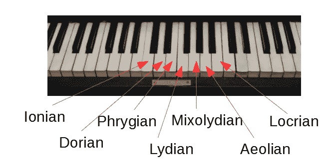

图片来自 Pixabay

这些被称为天平的*模式*。调式是给你的音乐注入一些变化的好方法，因为它们听起来很熟悉(音程是你习惯的)，但同时又不同。因此，从位置 2 开始，我们得到多里安音阶，在位置 3 我们得到弗里吉亚音阶，继续吕底亚音阶、米索利亚音阶、伊奥利亚音阶(自然小调)和洛克里安音阶(都以古希腊不同地区命名)。

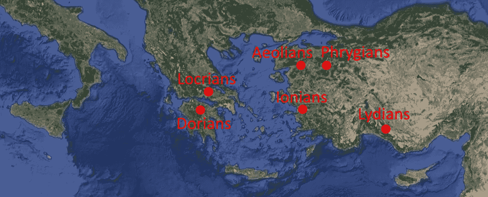

图片来自谷歌地球

但是，这种顺序并不能很好地反映音阶的实际发音。我发现根据亮度对模式进行排序在这方面更有帮助。

# 模式排序

*亮度*与音符之间的距离越大，感觉越“开阔”或“明亮”，距离越短，感觉越“黑暗”的概念有关。因此，大调比小调更明亮，因为我们离大调音阶的第三个音有更大的距离。亮度没有正式的定义，尽管大调音阶的调式排序是一致的，所以我将使用音程的总和，其参数随着离根音的距离而减小。以这种方式，开始时具有许多大音程的音阶会得到较高的明亮度分数。

```
def brightness(scale):
    score = 0
    for place,interval in enumerate(scale):
        interval = interval.replace('.', '1').replace('-', '2')
        score += int(interval)*1.5**(len(scale)-place) return score
```

对我们前面提到的调式进行分类就产生了:吕底亚调式、爱奥尼亚调式(大调)、米索利调式、多里安调式、伊奥利亚调式(自然小调)、弗里吉亚调式、洛克里调式。

这与五度圈的顺序相同，但是这种关系在很大程度上是偶然的，并不能推广到其他音阶。这是一种音阶在半音之间的距离 2 和 3 之间交替变化的效果，取决于开始的位置。

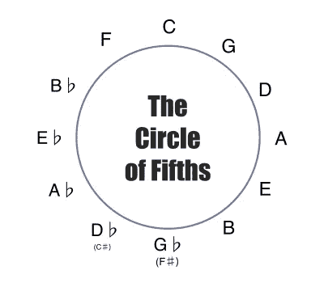

顺便说一句，五度(置 7)和四度(置 5)可以作为 12 音音阶的发生器的原因是 7 和 12 互质，5 和 12 也是互质。此外，11 个可以工作，但其他的都不行。

# 其他七音阶

对大调音阶的调式进行分类后，我们可能会问自己，是否还有 5 个全音程和 2 个半音程的音阶，确实有。

我们可以利用*循环置换的公式:*

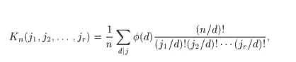

循环置换公式

这种情况下的φ是[欧拉的全能函数](https://www.wikiwand.com/en/Euler%27s_totient_function)。设置 j1=5 和 j2=2，我们看到正好存在 3 个七音音阶，两个半音和五个全音。

通过将秤表示为项链，可以很容易地看出这一点。

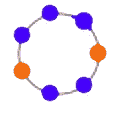

蓝色是全音程，橙色是半音。图片来自 WolframAlpha

其他音阶是半色调之间的距离分别为 1 和 0 的音阶。它们被称为七度音阶 II(包含旋律小调)和七度音阶 III(听起来更像是增加了一个音调的全音阶)。

除了以上几种，还有几种更常见的七音阶，一种是*和声小调* ( **-)。- .3.**)及其模式。

这组音程(3 个半，3 个全，1 个 3-半)根据圆排列公式有 20 种不同的构型，但似乎只有 5 种是常用的，很少用到它们的模式。

我们要看的 7 个音阶的最后一组音程是*双和声*音阶。这个有三个半，一个全和两个半。这种配置有 15 种不同的组织方式。

总之，循环置换公式产生 66 种不同的 7 音配置。

下面是所有常见的 7 个音级，按音程分组，按亮度排序。用**粗体**字体写的那些在下面有一个流行音乐的例子。

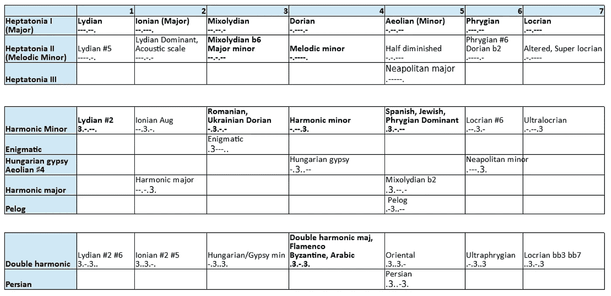

如前所述，还有许多 7 音音阶，但很少听说过。

# 不一致

除了亮度之外，用不和谐来给音阶排序可能会很有趣。像往常一样，欧拉已经来过了。他设计了一个公式，叫做欧拉格拉德函数，用来测量音程的不协和音。

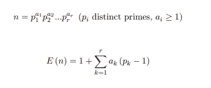

欧拉格拉德斯函数

n 是区间的分母乘以分母。例如，对于区间 7/4，n 变成 7*2。因此，E(7 * 4)= 1+(7–1)+2 *(2–1)= 9。

为了得到整个音阶的不协和音，我已经将音阶中所有音调相对于根音的不协和音相加。

# 大调还是小调

将音阶分为大调或小调可能会很有趣，而且根据我的主观判断，这与第三音是自然音还是降半音有很大关系。我还发现降二度音会产生不同于大调或小调的独特声音，所以我在混音中加入了弗里吉亚音。

用大调/小调分组来绘制协和音(与不协和音相反)和亮度，得出如下结果:

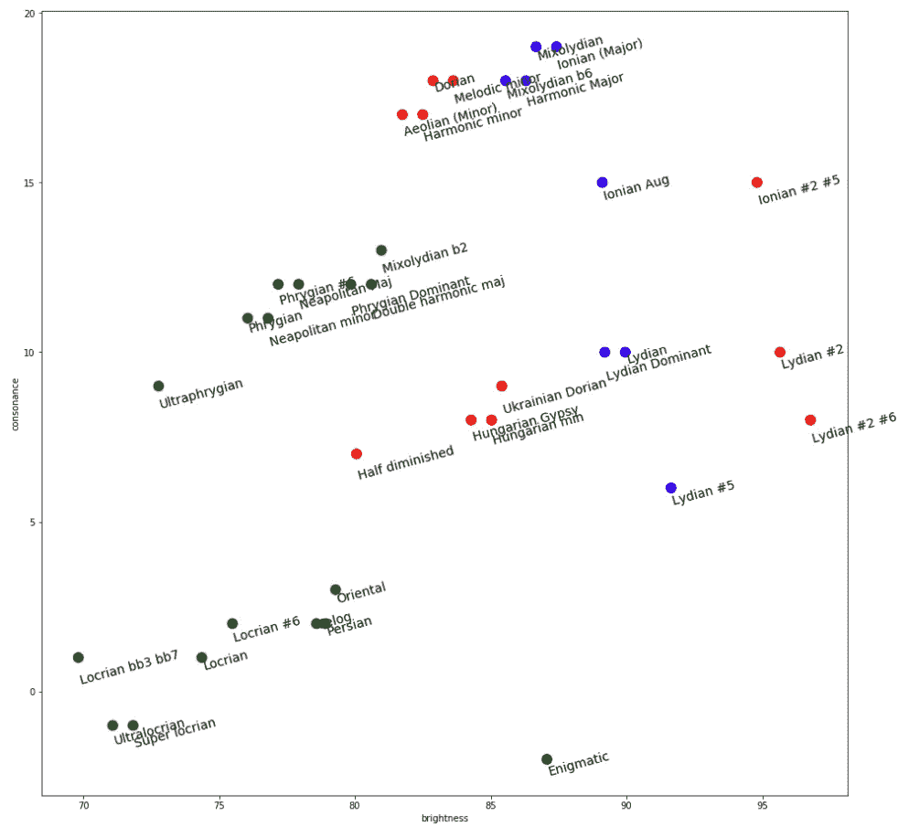

# 使聚集

使用 k-means 将我们的图分成 4 个组。

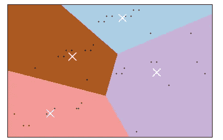

集群可以命名为:

**蓝色:家，**正常且和谐
**紫色:空间，**明亮且有些不和谐
**棕色:夜晚，**黑暗且有些不和谐
**粉色:魔多，**非常黑暗且非常不和谐。

如果你想要一个特定的声音，从这些组中挑选。

# 声音示例

但是这些音阶实际上听起来是什么样的呢？我录了首很棒的曲子《啊！vous dirai-je，maman”，也称为“一闪一闪，小星星”，使用上述不同的音阶。但是，由于我们的耳朵习惯于在大调音阶中听到它，我们有一种感觉其他版本听起来“错误”的倾向，所以我也包括了一些例子，这些例子原本是在我能找到的音阶中出现的。

# 流行歌曲示例

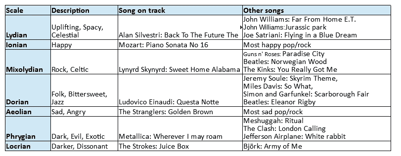

对于吕底亚，我选择了一个电影配乐，我认为它很能代表这种模式。许多电影配乐使用吕底亚语。

今天许多流行歌曲都是小调，但为了真正捕捉完整的风调，我选择了一首既有 iii 小调又有 IV 大调和弦的歌曲。另外，时间标记很有趣。

对于弗里吉亚人，我认为金属乐队是合适的。他们经常在部分歌曲中使用弗里吉亚调式，例如《木偶大师》和《记忆依旧》。

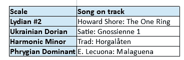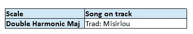

# 闪烁，闪烁的例子

***吕底亚语-爱奥尼亚语-混血儿语-多里安语-伊奥利亚语-弗里吉亚语-洛克里安语***

***吕底亚# 5——吕底亚优势——混合吕底亚 B6——旋律小调——半减——弗里吉亚# 6——超级洛克里安***

*****吕底亚#2 #6 —爱奥尼亚# 2 # 5—匈牙利 min —双调和 maj-Oriental-Ultraphrygian-Locrian bb3 bb7*****

*****高深莫测——和声大调——匈牙利吉普赛语——混血儿语 B2——波斯语——佩洛格语——那不勒斯大调——那不勒斯小调*****

# **更多资源**

**我费了很大的劲才找到双和声音阶的流行例子，但这并不意味着它们是无用的。在这里可以找到用这些模式编写的一些很好的例子:**

**里克·比托和纳赫尔·索尔:史上最黑暗的模式**

**[里克比托:匈牙利小调 vs 超级洛克里人 bb7 最黑？](https://www.youtube.com/watch?v=2O2L-1dKy8g)**

**在更明亮的尺度上，这里有一个吕底亚主导的例子:**

**[以吕底亚语为主写 Prog Metal Djent】](https://www.youtube.com/watch?v=5ElP19vESkY)**

# **绘制其他七音阶**

**我们当然可以在调和亮度轴上画出其他不太为人所知的标度。例如，如果一个人想要使用与吕底亚音阶相似的不寻常的音阶(就亮度和和谐度而言),这可能是有用的。在这种情况下，人们只需在吕底亚音阶所在的(90，10)附近选取一个音阶。由于大多数人不太熟悉，我就不一一列举了，而是写出了所用的笔记。提供梅杰、弗里吉亚和洛克里安作为参考。下面是 20 个随机选择的排列。- -.3.配置(去掉了除 Major、Phrygian、Locrian 以外的通用刻度)。黄色是为悬挂的秤添加的。**

**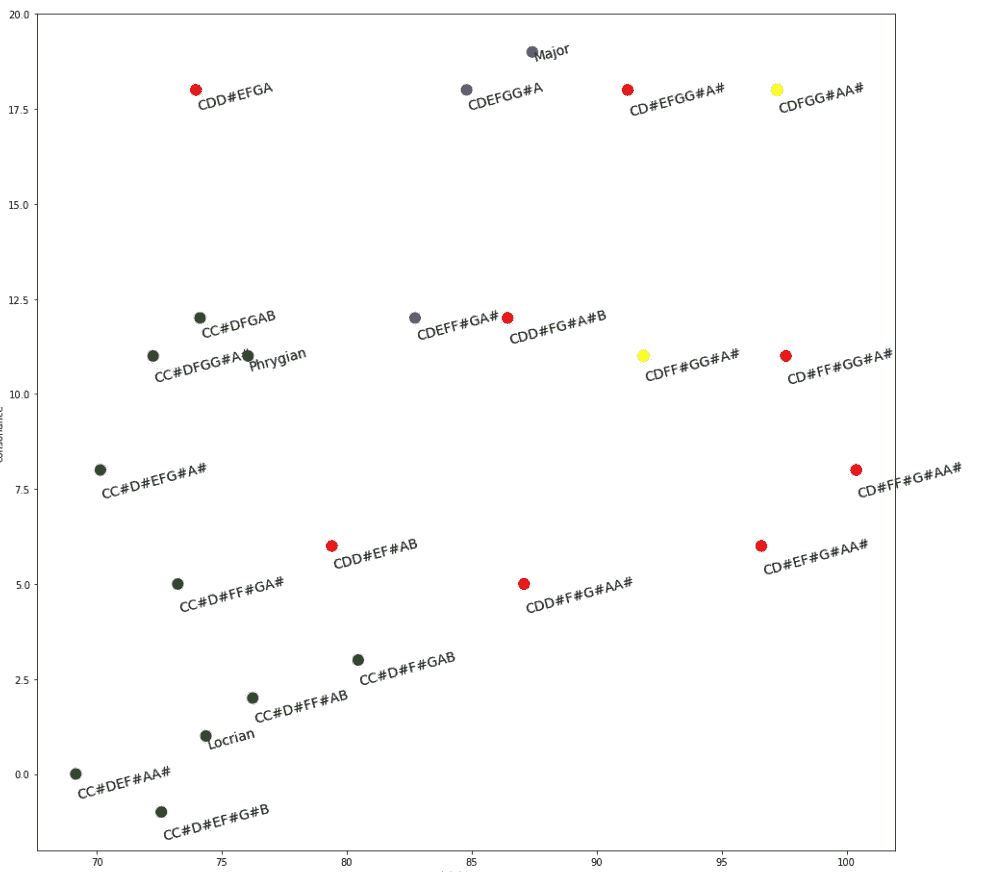**

**这是-.3 的图..3.配置:**

**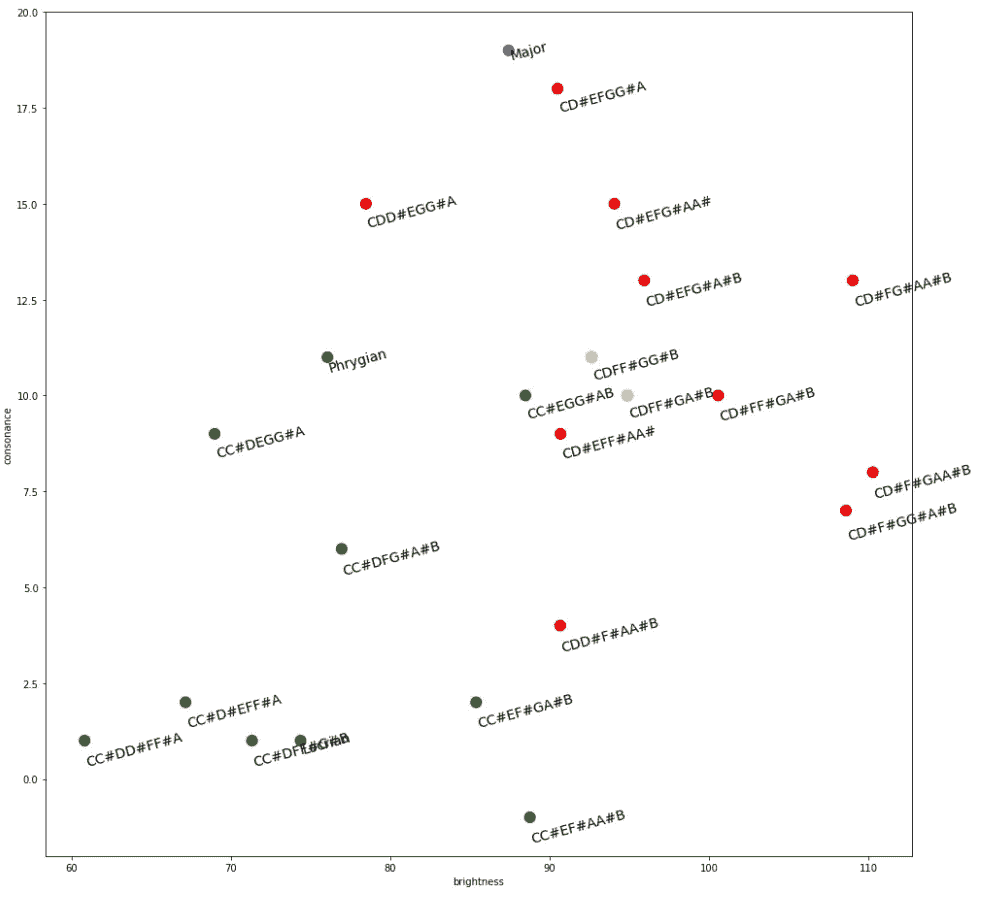**

# **五声音阶**

**除了七声音阶，人们在寻找奇异的音阶时还会遇到许多五声音阶。以下是这些声音和一些声音示例的亮度-协调图:**

**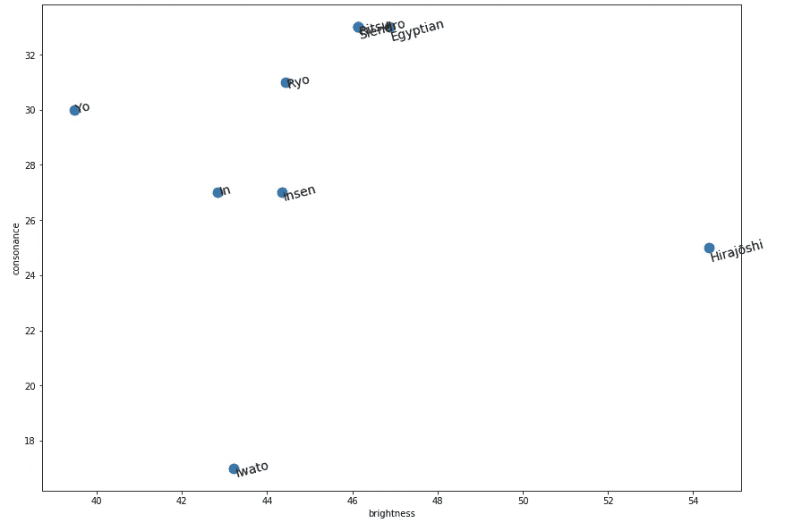****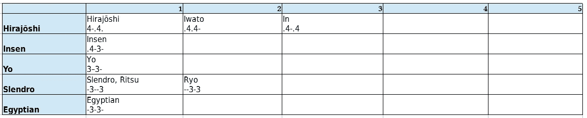******

*****Hirajoshi —埃及—Slendro—Ritsy-Ryo—Insen-Iwato-In-Yo*****

# **其他规模**

**有几个常见的音阶我还没接触过，比如六音音阶(蓝调，全音)，八音音阶(交替音阶，bebop 音阶)。比这更少或更多音调的音阶非常罕见，但也有少数存在(美洲土著音阶——4 个音调)。为了简洁起见，我不会在这里谈论这些。**

# **结论**

**音乐是多样的、丰富的，最重要的是，是人类的努力。为了获得全面的理解，一个人需要进入许多不同的领域，如数学、物理和机器学习，但也包括生理学和生物学，尽管这两个在这里没有涉及。仍有许多有待发现和发明。**

# **参考**

**里克·比托**

**[大卫·布鲁斯作曲](https://www.youtube.com/channel/UCh-PyMficPzVAihCJkFJVAA)**

**[伊恩戒指](https://ianring.com/musictheory/scales/)**

**[通过分离变量求解波动方程](https://www.math.ubc.ca/~feldman/m267/separation.pdf)**

**[辉煌](https://brilliant.org/wiki/wave-equation/)**

**[欧拉和音乐。被欧拉遗忘的算术函数](https://www.uni-miskolc.hu/~matsefi/Octogon/volumes/volume1/article1_25.pdf)**

**[西洋调律简史(理解平等律)](https://www.youtube.com/watch?v=wUBkbrvCmGA)**

**枚举组合学。轮藻属**

**[12 通](https://www.youtube.com/channel/UCTUtqcDkzw7bisadh6AOx5w)**