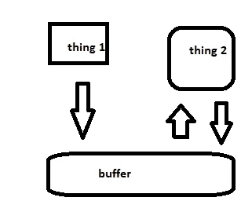
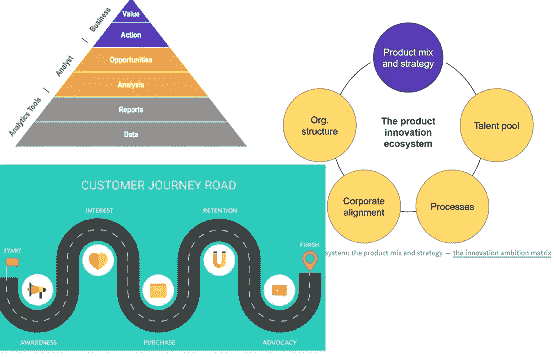

# 数据科学的商业方面:向利益相关者展示的 5 个技巧

> 原文：<https://towardsdatascience.com/the-business-side-of-data-science-5-tips-for-presenting-to-stakeholders-fb624a9a6e54?source=collection_archive---------25----------------------->

## 数据科学不仅仅是算法和建模

Teemu Paananen 在 [Unsplash](https://unsplash.com?utm_source=medium&utm_medium=referral) 上拍摄的照片

# 数据科学的商业方面

当你把一种爱好变成一种职业时，事情会变得很快*令人生畏。虽然我不是专业的数据科学家，也不是机器学习工程师，[我作为软件产品分析师(类似于业务分析师)](/why-did-i-ever-get-into-data-science-aa69d3c74d19)与他们一起在数据科学团队工作。我编写代码，分析数据，帮助制定商业决策，并向 80 多名观众展示我们团队的最新进展。对于任何希望进入该领域的人来说，数据科学不仅仅是算法和建模。当你开始与商界领袖合作时，他们希望你能够以一种易于理解的方式解释事情。*

**我做了以下事情，以确保在向企业高管和利益相关者展示时处于最佳状态**:

**1。准备并练习
2。解释商业价值
3。尽可能包含图像
4。创造一个有凝聚力的故事
5。避免行话和技术术语(主要是)**

虽然这些看起来很简单，但你可能会惊讶于我参加过的许多会议中，主持人没有达到这些标准中的任何一个！即使只是做几件这样的事情，也能让你看起来很专业。

照片由[布鲁克·拉克](https://unsplash.com/@brookelark?utm_source=medium&utm_medium=referral)在 [Unsplash](https://unsplash.com?utm_source=medium&utm_medium=referral) 上拍摄

# 准备和练习

当这个职位空缺时，我的领域知识、技术写作背景和对数据科学的热情让我得到了这份工作。当我经历入职培训并开始接触一些小项目时，我的老板问我是否愿意接管团队在利益相关者面前的 [Sprint review](https://www.google.com/search?q=agile+sprint) 演示。我抓住了这个机会来提高我的演讲技巧。

当我开始做它们的时候，我还比较新，没有对我团队的所有项目有一个坚实的处理，也不了解观众的知识水平，但至少我听起来很抛光。那是因为我做了准备和练习。我没有试图即兴表演！根据我演讲的时间长短(通常是 10-20 分钟)，*我会提前至少 24 小时开始整理我的想法*。我写笔记，制作幻灯片，从头到尾讲一遍，给自己计时，很多次。因为我有很多焦虑，我发现如果我也在睡觉前看一遍演示文稿会特别有帮助。我的目标是让自己听起来自信，表达清晰。

我与我的团队分享我的幻灯片以获得反馈，我通常与他们会面以确保我公正地对待他们的工作，因为我将会谈论它。总的来说，我可能会花 4-6 个小时准备和练习。随着时间的推移，这种感觉可能会减少，但现在，这让我在 80 人面前感到舒服。

# 解释商业价值

如果你面对的听众是商业人士，比如以客户为中心的团队、高管和/或管理层，你应该描述你的工作是如何为企业增加价值的。当我开始做演讲时，我太专注于解释我们在冲刺阶段取得的技术成就。虽然很有趣，但一些观众并不理解我们的工作是如何为企业增加价值的。我调整了我的方法，开始从更高的层面展示我们的工作。我将我们的工作与我们的路线图联系起来，解释我们如何实现增强和创新，并使用可交付成果来传达业务价值。

[皮克雷波](https://www.pikrepo.com/fbnlc/capital-appreciation-arrow-trending-up-over-coins)。com

制定一种方法来将团队的技术工作和公司的使命联系起来可能需要时间，但随着我获得了与业务团队合作的经验，并提高了我的业务分析技能，这变得容易多了。我使用像 batimes.com、哈佛商业评论和媒体这样的资源来了解最新的趋势商业分析内容。我还参加了几门在线业务分析课程，以及敏捷认证介绍，为我打下基础。

# 尽可能包含图像

我在演讲中得到的第一批重要反馈是，我需要包含更多的演示或图表。我的幻灯片没有过多的要点，但是在描述我团队的工作时，我需要多展示，少讲述。我不是向他们展示代码行，而是展示像工作流或拓扑结构这样的东西……容易转化成图像的东西。

示例图

我还包括图像，以帮助传达商业理念和框架。如果你自己做，我发现金字塔或柱子是这类东西的常用工具！例如，我过去用过类似的图片:

各种业务框架和 [getthematic](https://getthematic.com/insights/customer-journey-management-its-not-just-about-the-mapping/)

使用图像有助于让观众集中注意力，也有助于使演示生动活泼。虽然我想让人们认为我是一个专业人士，[但我还是忍不住通过一点点](/using-python-to-analyze-the-brutal-lyrics-of-the-black-dahlia-murder-with-genius-api-spacy-bfc7e0e8577f)让我的傻瓜式个性展现出来。我乐在其中，并试图在其中加入微妙的迷因或复活节彩蛋，只是为了重新吸引观众，让事情变得轻松。在加入个人风格之前，一定要了解观众，并和你的团队确认一下。

# 创造一个有凝聚力的故事

创作一个故事似乎是最困难的事情，但是一旦你变得优秀，你会感觉自己已经从业余爱好者提升到了专业人士。在构思我的故事时，我通常从几个想法开始，当我练习时，幻灯片开始自动排列。我找到了一个很好的表达方式，而且我可以想出一个总的主题，因为我给了自己足够的准备时间！

利用团队的愿景或路线图等东西来提出一个将工作联系在一起的主题。我的团队正在进行的项目比我在 10-20 分钟内所能展示的还要多，所以我使用我们的路线图来对项目进行分组，以便于提出一个主题。例如，一个主题可能是一周的内部分析，下一周的客户产品。团队一起工作来决定什么交付物将准备好展示。

有时一个队友想要演示或展示他们自己的作品，所以我要确保故事顺利过渡到他们的演示中。目标是让球队看起来尽可能好，而不是让我看起来尽可能好。保持自我，专注于与团队沟通，以实现平稳过渡。

# 避免技术术语和行话(主要是)

了解你的受众是技术交流 101。如果听众是来听你描述你的代码的，那就一定要用技术手段。如果听众是来听你如何让他们赚更多钱的，那就别跟他们谈技术了。

[https://www.flickr.com/photos/genewolf/147722422](https://www.flickr.com/photos/genewolf/147722422)

总结一下我们的*学习科学负责人*在讨论利益相关方更新的交付成果时给我的建议:

> “观众从来不关心评估指标。他们认为，如果我们愿意将某样东西投入生产，我们已经对它进行了评估。”

当把图片和交付品放在一起的时候，要记住这样的事情。不要因为有与之相关的视觉输出就简单地试图包含一些东西。为了评估模型，我们看图表。仅仅因为图表对我们有价值，并不意味着它们对业务主管也有价值。

不要使用行话，保持概念简单。如果非要用行话，把事情解释清楚。作为沟通者，你有责任澄清歧义。

# 结束语

当我第一次了解数据科学时，我被技术上的东西淹没了。我对 Python 相当陌生，十多年来没有上过数学课，甚至不确定这两个领域之间有什么区别。我花了很多时间学习，[我参加了一个为期六个月的数据分析训练营](/enter-analytics-from-boot-camp-to-working-in-data-science-8a5a6f563d7d)，我与工作中的人和当地 DS 社区的人建立了联系。当我在这一领域找到一份工作时，我必须加快速度，并向业务团队和利益相关者展示。以下是我在展示你的项目时给人留下的专业印象:

**准备并练习
解释商业价值
尽可能包括图片
创造一个有凝聚力的故事
避免行话和技术术语(主要是)**

查看我的其他教程，了解更多关于数据科学和编程的知识！

 [## 将我的作品转化为赚钱内容的四个原则

### 学习如何写产生收入的文章！问问你自己写作是否适合你。找到一个合适的位置，成为一个…

medium.com](https://medium.com/swlh/the-four-principles-that-transformed-my-writing-into-content-that-earns-money-db9786086cb3) 

# 谢谢大家！

*   *如果你喜欢这个，* [*在 Medium 上关注我*](https://medium.com/@erickleppen) *了解更多*
*   [*通过订阅*](https://erickleppen.medium.com/membership) 获得对我的内容的完全访问和帮助支持
*   *我们连线上*[*LinkedIn*](https://www.linkedin.com/in/erickleppen01/)
*   *用 Python 分析数据？查看我的* [*网站*](https://pythondashboards.com/)

[**—埃里克·克莱本**](http://pythondashboards.com/)