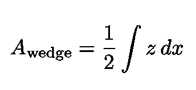
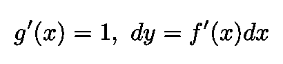

# 莱布尼茨的微积分

> 原文：<https://towardsdatascience.com/the-calculus-according-to-leibniz-5ee1e485a5a2?source=collection_archive---------17----------------------->

## 莱布尼茨如何导出著名的分部积分公式

图片由[皮克斯巴伊](https://pixabay.com/fr/?utm_source=link-attribution&utm_medium=referral&utm_campaign=image&utm_content=1746830)的[加里克·巴尔塞吉安](https://pixabay.com/fr/users/insspirito-1851261/?utm_source=link-attribution&utm_medium=referral&utm_campaign=image&utm_content=1746830)拍摄

现代微积分**、**可定义为**、**、[、](https://en.wikipedia.org/wiki/Calculus)对连续变化的数学研究，是由十七、十八世纪的两位伟大思想家分别独立发展起来的，即[艾萨克·牛顿](https://en.wikipedia.org/wiki/Isaac_Newton)和[戈特弗里德·威廉·莱布尼茨](https://en.wikipedia.org/wiki/Gottfried_Wilhelm_Leibniz)。

在本文中，我的重点将是莱布尼茨的工作，我将主要基于邓纳姆[和梅纳](https://books.google.com.br/books?id=QnXSqvTiEjYC&dq=calculus+gallery+dunham&hl=en&sa=X&ved=0ahUKEwjz1rHMqpPpAhU7HrkGHTdcBaQQ6AEIKDAA)的分析，展示他是如何推导出众所周知的[分部积分公式](https://en.wikipedia.org/wiki/Integration_by_parts)的。

图 1:莱布尼茨的肖像和雕像(没有假发)。

关于艾萨克·牛顿早期数学成就的文章，请看下面的链接。

 [## 艾萨克·牛顿的独特天才

### 一个著名数学结果的漂亮证明

towardsdatascience.com](/the-unique-genius-of-isaac-newton-c7f7a8ad73a1) 

戈特弗里德·威廉·莱布尼茨是典型的学者。他对广泛的主题做出了根本性的贡献，包括哲学、数学、语言学、神学、工程学、法理学、法律、计算机科学和地质学。莱布尼茨[曾经说过](https://adamalonzi.wordpress.com/2015/02/12/transcript-of-leibniz-documentary/)他经常需要用一周的大部分时间来记录仅仅一个早上的想法(关于莱布尼茨的杰出传记，参见 [Antognazza](https://books.google.com.br/books?id=inSAKQEACAAJ&dq=leibniz+antognazza&hl=en&sa=X&ved=0ahUKEwiXiMHCuaXpAhWiK7kGHY7EBnkQ6AEIKDAA) )。

下图左边是他在汉诺威最后一个住所[的工作空间照片。右边是他旅行时随身带的](http://www.gwleibniz.com/leibniz_house/leibniz_house.html)[折叠椅](http://www.gwleibniz.com/leibniz_house/leibniz_house.html)。

图 2:左边是莱布尼茨在汉诺威最后住所的工作室的照片([来源](http://www.gwleibniz.com/office_chair/office_chair.html))。右边是他旅行时随身带的折叠椅([来源](https://writings.stephenwolfram.com/2013/05/dropping-in-on-gottfried-leibniz/))。

莱布尼茨在第一份欧洲德语科学杂志上发表的关于微积分的三篇最著名的文章的标题分别是:

*   [*Nova methodus pro maximize et minimum，itemque tangentibus，quae nec fractas nec 非理性量化 moratur，et singulare pro illis calculi 属*](https://www.maa.org/press/periodicals/convergence/mathematical-treasure-leibnizs-papers-on-calculus-differential-calculus) (1684)
*   *(1686)*

*在英语中，标题分别是:*

*   *一种不受分数或无理数阻碍的求最大值、最小值和切线的新方法，以及一种适用于上述情况的奇异微积分*
*   *“关于隐藏的几何和不可分与无限的分析”*
*   *对测量几何学的补充，或所有受运动影响的正交中最一般的一种:同样，从给定的切线条件出发的曲线的各种构造*

*标题页如下图 3 所示。*

**

*图 3:莱布尼茨在科学杂志*Acta**Eruditorum(*[*来源*](https://www.maa.org/press/periodicals/convergence/mathematical-treasure-leibnizs-papers-on-calculus) *)* 上发表的关于微积分最著名的三篇文章*

# *莱布尼茨蜕变定理*

*这篇文章的目的是说明莱布尼茨的[转化定理](https://math.berkeley.edu/~robin/Leibniz/work.html)(见下面对这个特殊标题的解释)的一个特例给了我们著名的[分部积分公式](https://en.wikipedia.org/wiki/Integration_by_parts)。*

*蜕变定理是关于寻找曲线之间的面积。为了理解莱布尼茨的基本原理，考虑图 4 和图 5，让我们按照莱布尼茨的策略来计算曲线 *AB* 下方的面积(或者等价地，曲线 *y* =0 和曲线 *AB* 之间的面积)。*

*莱布尼茨认为总面积是具有无穷小基数的面积之和:*

**

*等式 1:曲线 AB 下方的面积被莱布尼茨认为是无限多个底长为无限小的矩形的总和(见图 4)。*

**

*图 4:一个无限小底 *dx，高度 y(x)变化的矩形。**

*现在考虑下面的图 5 和带底的无限小矩形 *dx* (注意图中的 *dx* 不是按比例绘制的)。它的面积是 *y dx。*由于曲线下方的面积是所有矩形面积的总和，莱布尼茨选择了众所周知的符号来表示总面积:*

**

*等式 2:代表曲线之间(或下方)区域的莱布尼兹“S”符号。*

*标志或符号 *∫* 是一个拉长的 *S* ，代表单词“sum”(更准确地说，是拉丁语 [*summa*](https://en.wikipedia.org/wiki/Summa) )。*

**

*图 5:用于莱布尼茨推导的构造([来源](https://books.google.com.br/books?id=QnXSqvTiEjYC&dq=calculus+gallery+dunham&hl=en&sa=X&ved=0ahUKEwjz1rHMqpPpAhU7HrkGHTdcBaQQ6AEIKDAA))。*

*根据图 5 中莱布尼茨的构造，以下关系成立:*

**

*等式 3:图 5 所示的 z 的表达式。*

*图 6 示出了图 5 的一部分。从中我们看到角度 WOT 为 *α* ，使得三角形 WOT 和无穷小三角形相似。因此，我们获得:*

**

*等式 4:三角形δOTW 和无穷小三角形的相似性所隐含的关系。*

**

*图 6:图 5 的左部，曲线 AB 的切线与 z 轴相交。*

*由于三角形δOPQ(见图 5)的底和高分别为 *ds* 和 *h，*，使用等式 4，由下式给出:*

**

*等式 5:使用等式。4，我们得到底和高 h 都无穷小的三角形δOPQ 的面积*

*因此，从 *A* 到 *B* 的楔形总面积由以下积分给出:*

**

*等式 6:楔形的面积等于具有无穷小底的三角形之和。*

*最后一步是找到曲线下面积 *AB* 和楔形面积之间的关系。图 5 显示(详见 [Mena](http://web.csulb.edu/~rmena/) ):*

**

*等式 7:曲线 AB 下方的面积“变形”为两部分之和:楔形的面积和差值 y(b)b/2 - y(a)a/2。*

*因此，曲线 *AB* 下方的面积“变形”为两部分之和，即楔形面积和差值*

**

*等式 8:三角形的面积之差 ObB 和 OaA。*

*使用等式。3 和 7(以及[执行一些简单的代数](https://books.google.com.br/books?id=QnXSqvTiEjYC&dq=calculus+gallery+dunham&hl=en&sa=X&ved=0ahUKEwjz1rHMqpPpAhU7HrkGHTdcBaQQ6AEIKDAA)，我们得到:*

**

*等式 9:等式。3 和 7 放在一起。*

*现在考虑图 6。我们看到:*

*   *等式中的第一项。9 是包含垂直线的区域的面积。*
*   *等式右边的第二项。9 是包含水平线的区域的面积。*
*   *移动等式右边的第二项。9 在左手边，我们看到上面两个面积之和等于底边为 *b* 的矩形和底边为 *a* 的矩形之差(见等式 1)。8).*

**

*图 7:对应于等式的图。9.*

*如果我们现在做出以下选择:*

**

*情商。10:莱布尼茨对 g(x)和 y 的选择。*

*这意味着*

**

*情商。11:等式中函数的导数。10.*

*并将这些定义代入等式。9 我们得到:*

**

*情商。12:分部积分公式。*

*我们看到，出乎意料的是，图 5 中复杂的结构给出了微积分中最常用的公式之一，分部积分[！](https://en.wikipedia.org/wiki/Integration_by_parts)*

*感谢您的阅读，再见！一如既往，我们随时欢迎建设性的批评和反馈！*

*我的 [Github](https://github.com/marcotav) 和个人网站 [www.marcotavora.me](https://marcotavora.me/) 有一些其他有趣的材料，既有关于数学的，也有关于物理、数据科学和金融等其他主题的。看看他们！*