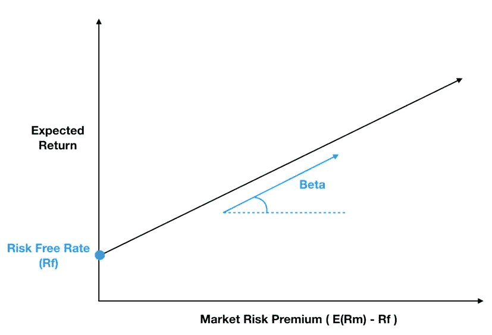
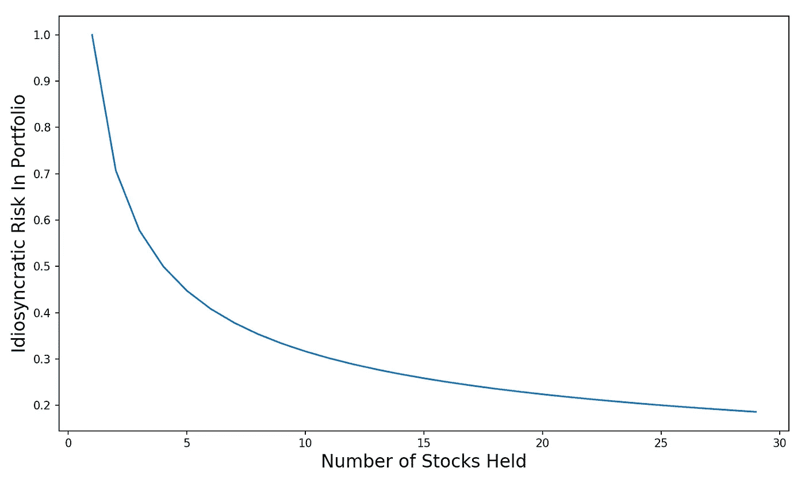

# 资本资产定价模型

> 原文：<https://towardsdatascience.com/the-capital-asset-pricing-model-238a64fefcc2?source=collection_archive---------11----------------------->

阿尔瓦罗·雷耶斯在 [Unsplash](https://unsplash.com?utm_source=medium&utm_medium=referral) 上拍摄的照片

## 一个简单而强大的模型，经受住了时间的考验

如果你和金融人士或 MBA 们相处过，那么你可能听过他们说 CAPM 这个词(读作“cap”，就像棒球帽后面跟着字母“M”)。CAPM 顾名思义是一种定价模型。

在金融领域，定价模型用于对金融资产进行定价。但是，我们不是计算价格，而是通常使用定价模型来估计预期回报(这意味着价格和现金流之间的关系)。CAPM 和它的同类告诉我们，考虑到投资的特性，投资的预期回报应该是多少。

# 伪装的线性回归模型

听起来很复杂，CAPM 实际上只是一个单因素线性回归模型:

> E(Ri)= Rf+B *(E(Rm)-Rf)

其中截距项为 Rf(无风险利率)，斜率项为 B(β)。E(Rm)是市场的预期收益。在实践中，我们通常用标准普尔 500 等广泛的股票指数来代表市场，因此 E(Rm)可以被认为是标准普尔 500 的预期回报。

资本资产定价模式（capital asset pricing model 的缩写）

## 无风险折现率

让我们看一下等式的每一部分。Rf 是无风险利率。即使我们不承担任何风险，这也是我们期望获得的基准回报率。无风险利率源于这样一种观点，即今天的一美元比将来的一美元更有价值。

你愿意今天收到 100 美元还是一年后收到？今天，大多数人都更喜欢他们的钱。因此，为了激励我们等一年(或更长时间)才能拿到钱，借款机构需要向我们支付回报。在 FDIC 承保的银行或美国政府(通过国债)被认为是超级安全的借款人的情况下，他们支付的回报是无风险利率。也就是说，我们今天给美国政府 100 美元，相信山姆大叔一定会在一年后还给我们。然后一年后，我们拿回 102 美元——我们借出的 100 美元和补偿我们与钱分离一年的 2 美元。

## 贝塔

贝塔系数传统上被视为对投资风险的估计。回到 CAPM 方程，假设 Rf=0(就在几年前，美联储将联邦基金利率设定在接近 0 的水平):

> E(Ri) = B* E(Rm)

随着无风险利率归零，我们可以更清楚地看到 beta (B)对 E(Ri)的影响，即我们正在分析的投资的预期回报。当β等于 1 时，E(Ri)=E(Rm)。因此，如果我们预期市场回报率为 10%，那么我们也应该预期我们的投资会有同样的回报。

如果 beta 等于 0.5，那么我们投资的预期回报率将是 5%(市场回报率为 10%)。如果β等于 2，那么我们投资的预期回报率是 20%。一项投资的贝塔系数越高，它对市场的回报就越敏感。

# CAPM 的生活方式

本质上，CAPM 更多的是理论性的，而不是经验性的。通常在统计学或数据科学中，我们通过收集数据来分析现象，并使用线性回归等统计工具来量化现象和其他可观察因素之间的关系。也就是说，我们根据数据建立模型。

另一方面，CAPM 不是从数据开始，而是从市场如何运作和投资者如何为资产定价的理论开始。这更像是一种“生活方式”，你对它的信仰程度会严重影响你的投资方式。所以为了理解 CAPM，我们首先需要理解它背后的理论。

## 并非所有的风险都有回报

资本资产定价模型的驱动力是，并非所有类型的风险都有回报。当我们进行投资时，我们将自己暴露在风险之中——我们不知道我们是否能收回所有的钱。

CAPM 将这种风险分为两种类型——市场风险和特质风险。当我们购买谷歌的股票时，我们将自己暴露在一般的股票市场风险中。谷歌是一家美国公司，它的命运在一定程度上随着美国整体经济的变化而变化。因此，如果美国经济表现良好，我们预计标准普尔 500 也会表现良好，谷歌股票也会产生正回报。相反，如果美国经济进入衰退，标准普尔 500 就会崩溃，谷歌的股票可能也不会这么火。因此，无论其商业模式多么令人惊叹，每家美国公司都对美国经济有一定的敏感性，因此对标准普尔 500 也有一定的敏感性(相对于本国经济而言，外国股票也是如此)。

但这还不是全部。即使在蓬勃发展的美国经济中，谷歌仍然可能失足。它可能会遭遇 Gmail 被黑或者 YouTube 产品发布灾难。这些类型的风险被称为特质风险，因为它们是谷歌独有的，不会被分享。

因此，投资谷歌意味着暴露于一般的股票市场风险和独特的谷歌公司风险。CAPM 属于一个模型家族，该家族假设当涉及到预期回报时，存在重要的风险和不重要的风险。也就是说，作为投资者，我们因承担某些风险而得到补偿——这被称为赚取风险溢价。但并不是所有的风险都值得。那些可以用无形的努力和成本对冲的风险不会给投资者带来风险溢价。

顺便说一下，风险溢价是我们承担风险所赚取的超过无风险利率的金额(回想一下，无风险利率是我们承担零风险所能赚取的回报金额)。因此，一项投资的预期回报等于无风险利率和风险溢价的总和。

## 特质风险很容易分散

CAPM 建立在只有市场风险支付风险溢价的信念之上。随着时间的推移，暴露于特质风险(公司特定风险)被认为不会产生正的风险溢价。

为什么这么问？这是因为通过持有多只股票，或者更好的办法是投资标准普尔 500 这样的市场指数，可以很容易地分散特殊风险。如果你的投资组合中持有 30 只以上的股票(假设你投资组合中的股票不都来自同一个板块)，公司特有的噪音就开始消失了。

在我之前关于相关性和多样化的文章中，我观察到，只要新投资和投资组合中已有投资之间的相关性小于 1，向投资组合中增加更多投资就会产生多样化的效果。两只股票回报的特质成分肯定具有显著小于 1 的低相关性(假设它们不是像 TSMC 和苹果那样密切相关的企业，TSMC 是苹果的主要芯片供应商)。因此，我们的投资组合中包含的股票越多，公司的具体特征就越明显(也就是多样化)。

持有更多股票可以分散公司的特定风险

因此，在资本资产定价模型的框架下，特质风险不会产生风险溢价，因为投资者可以通过在投资组合中增加股票来轻松摆脱它。

请注意，CAPM 并不是说偶尔承担公司特有的风险就不能获得正回报。风险溢价和定期回报之间有一个重要的区别。当我们投资谷歌股票并获得正的定期回报时，那是因为我们对谷歌业务和未来前景的理解是正确的(或幸运的)。因此，要从特质风险中赚钱，我们需要正确(或幸运)。不幸的是，我们不可能都是正确的——在整个投资者群体中，有些人是对的，有些人是错的，所以总的来说，这大约是零和。换句话说，尽管人口中的一部分人有时可能能够获得正回报，但作为一个整体，人口不可能通过承担特殊风险而系统地获得正回报。

风险溢价是不同的，因为每个参与者都可以获得超过无风险利率的正回报——这不是零和游戏(尽管水平会随着时间的推移而变化，这取决于参与者的数量和每个参与者的热情)。我们不需要正确或幸运来获得它(假设问题中的风险溢价实际存在)。当然，这并不意味着你每年的回报一定是正的。相反，这意味着在很长一段时间内，你应该期望你的股票投资组合获得超过无风险利率(来自市场风险敞口)的回报，就像保险公司期望通过承担飓风风险来获得利润一样。

## 市场(股票)风险溢价

因此，在 CAPM 世界中，特质风险不支付风险溢价，但市场风险支付风险溢价。为什么市场要支付风险溢价？嗯，有几个原因:

1.  市场和经济风险不容易分散。当一个经济体经历减速时，公司利润受损，人们失业，虚弱的公司倒闭，股票价格下跌。如果你是经济的参与者或股票投资者，没有办法完全避免痛苦。
2.  鉴于承担市场风险有时会很痛苦，投资者愿意这么做肯定有原因(假设他们是理性的)。随着时间的推移，承担市场风险必须向我们支付超过无风险利率的回报。如果没有，为什么任何理性的人都愿意承担风险，当他们可以赚取无风险利率，而根本不承担任何风险。这就像飓风保险公司——如果没有利润可赚，那么保险公司就完全没有理由承担飓风的风险。
3.  承担市场风险会产生效用。承担市场风险意味着购买股票，这为公司提供了进行资本支出、雇佣员工和扩大经营所需的资金。所有公司都通过债务(向银行或债券投资者借款)和股权(向投资者出售股票)的组合来筹集资金。因此，当投资者购买并持有股票时，他们实际上是在润滑资本主义的齿轮，因此理应得到回报。

随着时间的推移，股票市场确实倾向于跑赢国债(我们传统上认为美国国债是无风险资产，因为美国政府被认为是非常安全的信用)。我在这里只画了过去 10 年，但更长的时间显示了同样的总体趋势，即股票远远跑赢债券。

市场风险溢价——股票的表现往往优于债券

那么，我们如何才能找到股票风险中归因于市场的部分(唯一会产生回报的部分)？古老的线性回归拯救了我们。回忆一下我之前的帖子，如果你读过的话；)，投资的方差被用作其风险的代理。线性回归模型用于分析和解释方差，X 变量用于解释 Y 变量的方差。因此，通过将 X 变量设为市场(S & P 500)的回报率，将 Y 变量设为股票的回报率，我们可以计算出一只股票的市场敞口有多大:

> 股票回报= B*市场回报+ alpha

上述线性回归方程中的βB 与 CAPM 方程中的β(B)相同。在线性回归中，β是 Y 变量对 X 变量变化的敏感度的度量。所以在这种情况下，贝塔是股票回报对市场变化的敏感度。那听起来正是我们想要的。β的等式给出了更多的直觉:

> B = Corr(股票，市场)* Stdev(股票)/Stdev(市场)

贝塔等于股票和市场之间的相关性乘以股票的波动性(也称为标准差)与市场波动性的比率。让我们先考虑第二部分——波动率的比率让我们知道股票的风险有多大。一个高的数字意味着股票的回报比整体市场更不稳定，因此股票可能风险很大。但是在 CAPM 下，并不是所有的风险都有回报。所以我们用股票回报和市场回报之间的相关性乘以波动率。如果相关性很低，那么贝塔系数也会很低——这意味着股票的大部分风险是特殊的，不能归因于市场。

相反，贝塔系数越高，股票的市场风险越大。根据资本资产定价模型，为了补偿我们所承担的所有市场风险，股票的预期回报率就需要越高。

# 把所有的放在一起

快到了！让我们再来看看 CAPM 方程:

> E(Ri)= Rf+B *(E(Rm)-Rf)

好了，现在我们知道了 B 是如何计算的(及其背后的直觉)，让我们为一只 B=2(市场风险很大)的股票填写其余的数字。Rf，无风险利率，通常代表 10 年期美国国债收益率，在撰写本文时，该收益率徘徊在 1.82%左右。

市场风险溢价 E(Rm) — Rf 通常由 10 年期美国国债的标准普尔 500 平均超额回报来近似计算(尽管一些更酷的模型试图计算前瞻性隐含市场风险溢价)。我们会偷懒，从 Damodaran 教授那里得到[，他估计市场风险溢价为 4.8%。现在我们有了计算股票预期收益所需的一切:](http://pages.stern.nyu.edu/~adamodar/)

> E(Ri) = 1.82% + 2* 4.80% = 11.42%

那么这个数字实际上是怎么用的呢？仅仅假设我们的股票会给我们带来 11.42%的年回报率是鲁莽的。相反，可以把这看作是在 CAPM 世界中我们应该从我们的股票中获得的回报(在这个世界中，只有市场风险是有回报的，承担市场风险可以让我们获得超过无风险利率的回报)。因此，如果你认为你不能获得 11.42%，你可能不应该投资。

最后，我想指出的是，多项研究观察到，低贝塔股票的表现往往优于高贝塔股票。等等什么？在 CAPM 的世界里，这是不应该发生的——市场风险大(贝塔系数高)的股票应该比市场风险小的股票表现好。但我们可能并不是生活在一个 100% CAPM 的世界里。所以对这个模型要有所保留。虽然它是思考市场、风险和预期回报的有用框架，但它确实对世界做出了许多假设。当这些假设不成立时，模型的输出也不会成立。

这篇文章是我投资组合优化入门的第四部分。如果你还没有看过，也看看第 1、2 和 3 部分:

[***理解正态分布***](/understanding-the-normal-distribution-with-python-e70bb855b027)

[***了解投资风险***](/understanding-investment-risk-3882c58e00e0)

[***理解相关性和多样化***](/understanding-correlation-and-diversification-661c19a26555)