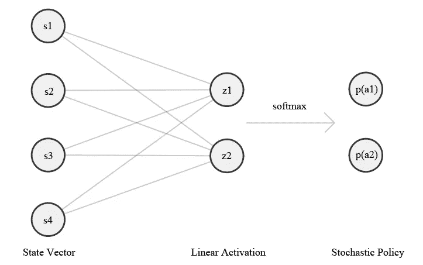

# 标杆问题——粒子群优化算法的竞争性能

> 原文：<https://towardsdatascience.com/the-cartepole-problem-competitive-performance-with-particle-swarm-optimization-672f018ede3c?source=collection_archive---------46----------------------->

## 粒子群元启发式算法在并行深度学习中的性能

OpenAI 的 CartPole 问题是强化学习中的一个主要问题，它是许多 RL 最先进算法应用的基准。然而，并不是只有 RL 算法可以解决控制问题。在这篇文章中，我将概述粒子群优化算法(PSO)；它如何应用于控制问题，以及它如何与深度 Q 学习相比较。

[来源](https://unsplash.com/@citychurchchristchurch)

如果你想了解我为这篇文章编写的所有代码，可以在这个 Jupyter 笔记本上看到:[https://github . com/Adam price 97/Control/blob/master/psocartpole . ipynb](https://github.com/adamprice97/Control/blob/master/PSOCartpole.ipynb)

# 什么是粒子群优化？

粒子群优化是一种元启发式优化算法。元启发式算法搜索给定函数的最大(或最小)值，而不需要函数的太多先验知识。

粒子群通过在搜索空间中移动粒子进行优化。在离散的时间步骤，通过使用粒子的位置作为适应度函数(该函数被优化)的参数来评估粒子。然后，粒子被吸引向全局最佳解(由群中的另一个粒子找到)和他们找到的最佳解。

PSO 是无梯度的，这使得它可以快速地执行更新(当使用大群体时很有用)，但是，它不能保证收敛到局部最小值(或最大值)。

PSO 在行动。By [伊弗马克](https://commons.wikimedia.org/wiki/User:Ephramac)。

单个粒子的速度由 3 个参数控制:

*   全球权重(φᵍ) —全球最佳解决方案所在地的吸引力。
*   局部权重(φˡ) —粒子最佳解决方案位置的吸引力。
*   惯性(ω)——粒子改变轨迹的难易程度。

我们还需要为算法提供:搜索空间边界(阻止粒子离开搜索空间)；优化的适应度函数；和要使用的粒子数量。

我的 PSO 的 python 实现。

# 粒子群算法在横竿问题中的应用

我们创建的 PSO 框架非常灵活。我们只需要给它传递一个函数 f(θ)，其中θ是一个参数向量，它会试图找到使函数最大化的θ。

为了将粒子群算法应用于横竿问题，我们需要使用粒子在搜索空间中的位置，来生成横竿问题要遵循的策略。为此，我们使用具有两个输出的线性网络，这两个输出通过 softmax 函数来创建随机策略。

π(a，s θ)

使用小车的当前状态作为输入层，粒子的位置作为权重，我们产生选择两个动作(向左或向右移动小车)的概率。

粒子位置的适合度由策略的性能(奖励累积)给出。环境的初始状态是随机的，因此我们必须针对多个事件评估策略，以获得对策略质量的估计。这在某些环境中可能被证明是低效，但是运行 CartPole 到终端在计算上是非常便宜的。

有了这些，我们就可以开始实验了！

# 表演

当我们运行上面的脚本时，我们发现 CartPole 问题在平均 2.4 次迭代中得到解决。与其他学习方法相比，这是非常少的迭代。优化良好的深度 Q 学习方法往往需要大约 30 次迭代来求解 CartPole。

那么 PSO 有没有胜过深度学习方法呢？

我们需要记住使用的蜂群。在标准 RL 实现中，使用单个代理，它每次迭代只能运行单个剧集。我们的群每次迭代有效地运行 15 集，因此可以说 PSO 实际上用了 36 (2.4*15)集来解决问题。这和 deep Q 差不多。

另一方面，单个 RL 代理比单个 swarm 代理需要更多的计算。在深度学习实现的情况下，每个时间步长可能会有 1000 个权重被更新。相比之下，我们整个群体在每集之间优化了 120 (8*15)个权重。

也许我们可以根据找到解决方案所需的时间来比较不同的方法？但是我们需要考虑计算机架构。深度方法受益于 GPU，而粒子群算法将受益于并行计算。

最终，很难准确地比较这些不同的方法。但是，我确实认为我们已经设法为控制中的元启发式的进一步研究提供了一个很好的案例。