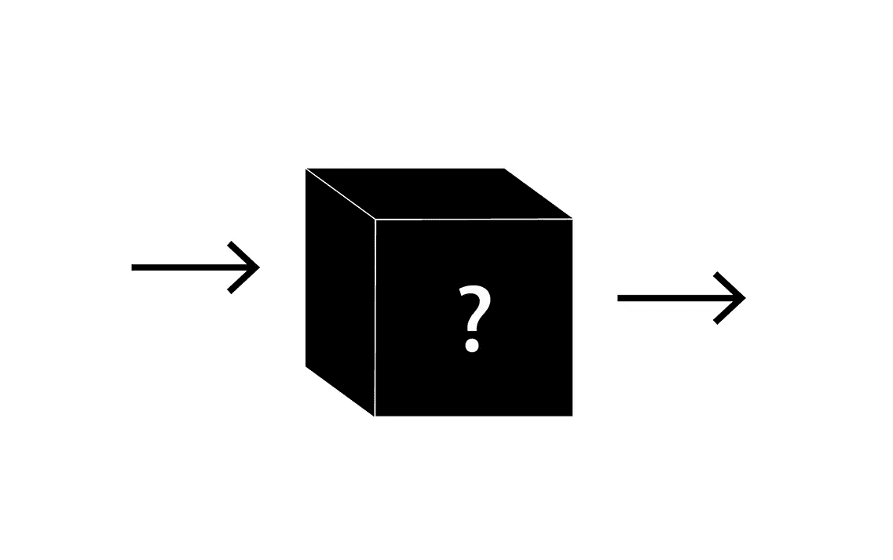
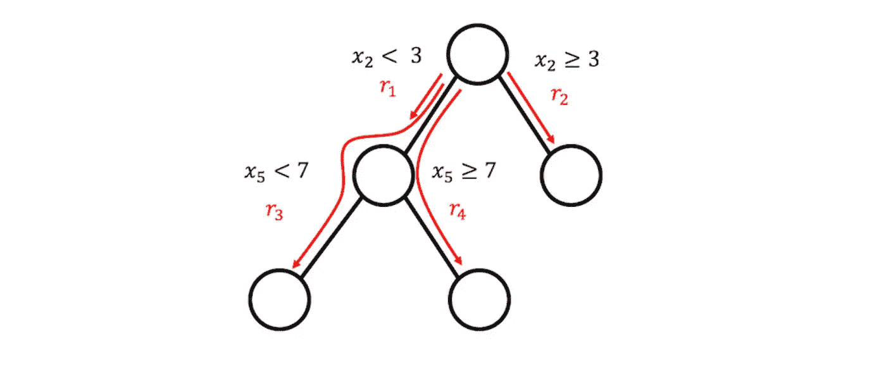
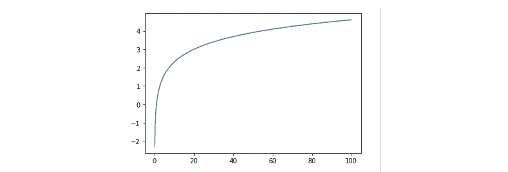
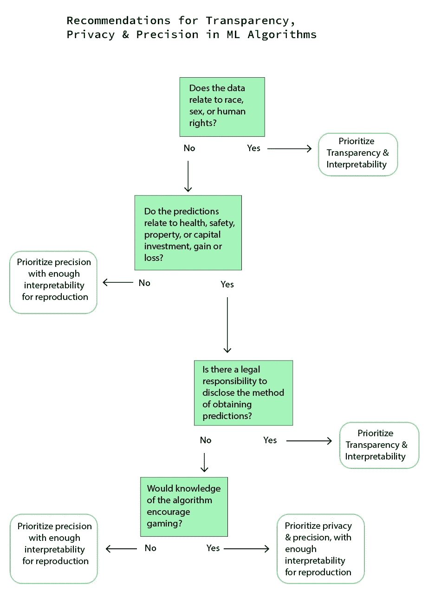

# 机器学习中的神秘案例

> 原文：<https://towardsdatascience.com/the-case-for-mystery-in-machine-learning-6719c1eaf5c8?source=collection_archive---------69----------------------->

## *一个黑盒机器学习算法的用例。*

在寻求越来越精确的预测分析的过程中，黑盒模型，或不经过复杂分析就难以理解的算法，正变得越来越普遍。虽然这些模型带来了数据科学领域的进步，但它们的使用也存在伦理问题。参见[这篇发表在《自然》杂志上的](https://www.nature.com/articles/s42256-019-0048-x)文章，对黑箱模型及其对应的、用于解释它们的二级模型的危险进行了概述。关于模型解释方法的详细说明，参见 Christoph Molnar 所著的《T4》[*可解释机器学习*](https://christophm.github.io/interpretable-ml-book/)*。*

**

*作者图片*

*如果遵循这些解释方法，就不太会有偏见。尽管如此，仍有支持者认为所有的黑盒都是坏的，也有人认为如果小心使用，它们会有用。还有一些人倾向于避免使用“黑盒”这个术语，而简单地称之为或多或少可解释的。*

**

*作者图片*

*在进入什么使黑盒成为黑盒的细节之前，将算法放在机器学习盒内，将机器学习放在 AI 盒内。机器学习是使用算法近似定量估计的科学。以下是可解释的机器学习模型与被认为是“黑箱”的机器学习模型的对比*

## ***易于解释的模型***

*可解释的模型包括线性回归及其同类逻辑回归和 GLM(广义线性模型)、决策树、决策规则、规则拟合、朴素贝叶斯分类器和 K-最近邻。*

**

*规则适合模型。图片来源:[*Christoph Molnar*](https://christophm.github.io/interpretable-ml-book/rulefit.html)*经许可后发布**

## ****不易解释/黑箱模型****

**可解释性较差的模型可以包括除上述模型之外的任何算法，或者应用了许多转换的任何模型。有许多转换有助于提高模型性能，但会降低可解释性。这些可以包括基本的统计操作，如标准化、规范化、插补和对数转换，以及更专业的技术，如子采样、超采样和噪声注入。文志于等人发现*“不同维度的变换算子的随机组合优于大多数传统的数据变换算子，适用于不同种类的数据集。”***

**下面是应用于数据的常用转换的概要。这些只是一个开始。如果有充分的理由，任何可以应用于函数的数学运算都有可能应用于算法。**

****对数变换** 该变换将数据乘以其对数。**

****

****最小-最大缩放**
这种变换将带来 0 和 1 之间的所有值。**

****

****标准化** 这种转换会改变数据的均值和标准差。**

****

****均值归一化**这种变换会使所有数据在-1 和 1 之间，均值为 0。**

****

****单位矢量变换** 该变换对矢量进行转置，使其形状从水平变为垂直，反之亦然。**

****

**每个数据集都有独特的转换应用，这取决于数据本身的结构以及预测的目标。在不试图对一刀切的解决方案发表意见的情况下，机器学习模型的应用在不同的应用中有很大的差异。“黑箱”方法可能对某些情况有用，对另一些情况有害。“黑箱”这个术语有些误导。创建模型的数据科学家应该知道应用了什么转换以及为什么要应用。这种脱节伴随着在创建模型后对结果的解释，以及获得结果的过程是否可以向一个没有数据科学知识的人解释。**

**这篇博客将探索黑盒模型的一个用例，以揭穿应该不惜一切代价避免黑盒模型的观点。**

****

**图片来源:Alexander Abero 经许可发布**

**想想 LEED，或者环境和能源设计领域的领导者。 [LEED](https://www.usgbc.org/leed) 是一个绿色建筑评级系统，奖励具有高环保性能的建筑。建筑根据各种特征来评分，如机械系统的效率或回收材料的数量。有了足够的分数，建筑物可以被评定为认证、银、金或白金。所有点的相对价值通过一个清单公布在网上，因此建筑师和工程师可以设计建筑以达到特定的认证水平。**

**公开发布核对表的问题在于，这很容易让系统陷入游戏。在 LEED 认证上作弊是业内众所周知的问题。每一笔 LEED 信贷都必须有文件支持，这是一个无信任系统的特征。例如，场地边界用于许多计算。这可以以某种方式提取，以获得实际上不应该获得的信用。更糟糕的是，设计团队可能会提交文件，说明安装了特定的系统，但随后可能会在施工中缩小规模，从而导致更差的能源性能。因为相同的系统被用于设计和评估，所以发生了冲突。本质上，这就像是在知道答案的情况下准备考试。**

****

**克里斯·利维拉尼经许可发布**

**继续以标准化考试为例，参加考试的人不知道考试的正确答案。同样，用于计算消费者信用评分的确切公式也是未知的。该公司对这个公式保密，因为如果它被知道，它将被欺骗。在完全透明的情况下，系统的完整性将会崩溃。对于一个人来说，提高他们的信用评分，定性的建议，如“保持循环账户的低余额”，或大致的估计，如“保持余额低于限额的 30%。”然而，循环余额如何影响分数的确切性质是未知的。**

****

**图片来源 [Stephen Phillips](https://unsplash.com/@hostreviews) 经许可发布**

**如果一个建筑师变成了统计学家，希望能够从数量上比较所有建筑。通过行业知识的方式，该系统是游戏，LEED 分数可能不是一个准确的方式来评估建筑的环境性能。相反，可以使用关键性能指标和各种其他数据点。这正是我的创业公司——建筑质量指数(BQI)正在进行的项目。BQI 的目的是为了解决一次性建筑的问题，在这个问题上，建筑的质量越来越差，拆除的时间还不到人的寿命。**

**需要一个全面的质量和风险衡量标准——而且它需要是一个不能被欺骗的标准。例如，业主可能想知道他们是否应该投资翻新一栋建筑，或者他们是否应该购买一栋新建筑。根据一组数据了解未来泄漏、结构问题或地震脆弱性的风险很高，这将是非常有用的信息。但是，如果提供数据的人知道什么被认为是高风险，他们可能会试图篡改输入，以获得有利的结果。**

**出于这个原因，保险业并不透露究竟是什么因素导致它增加和减少保费，以及增加多少。在游戏是一个已知问题的系统中，或者在不准确的结果可能导致财产或生命损失的系统中，使用“黑盒”算法可能是防止游戏的最佳解决方案。**

**“黑箱”可以概括为高精度的代价。一个模型调整得越好，它的可解释性和透明度就越低，维护隐私就越容易。除了上面提到的常见转换，集成方法以及打包和提升也会增加“黑箱”性，或者降低透明度和可解释性。**

**透明度、隐私和精确性之间的权衡是一种微妙的平衡。下图是确定是优先考虑透明度、隐私还是精确度的起点。政府、科学、社会科学和商业中的用例可能有非常不同的优先级。通过提出正确的问题，数据科学家可以为不同类型的用例开发最佳实践。**

****

**作者图片**

****参考文献:****

1.  **达拉斯卡，[，*机器学习中的“黑盒”隐喻*，](/the-black-box-metaphor-in-machine-learning-4e57a3a1d2b0)， 2017，走向数据科学。**
2.  **弗吉尼亚·迪格纳姆(Virginia Dignum)， [*论偏见，黑箱和对人工智能透明性的追求*](https://medium.com/@virginiadignum/on-bias-black-boxes-and-the-quest-for-transparency-in-artificial-intelligence-bcde64f59f5b) *，* 2018，中。**
3.  **杰弗里·赫尔，约瑟夫·m·赫勒斯坦和肖恩·坎德尔，**，* 2015 年，第七届创新数据系统研究双年展(CIDR。)***
4.  ***Milo R. Honegger， [*揭秘黑盒机器学习算法*](https://arxiv.org/pdf/1808.05054.pdf) *，* 2018，卡尔斯鲁厄理工学院。***
5.  ***页（page 的缩写）Krammer，Ondrej Habala，Ladislav Hluch， [*“数据挖掘的转换回归技术”，*](https://ieeexplore.ieee.org/abstract/document/7555134) 2016，IEEE 第 20 届智能工程系统国际大会(国际核事故等级)。***
6.  ***玛丽娜·克拉科夫斯基， [*最后，一窥机器学习系统的‘黑匣子’内部*](https://engineering.stanford.edu/magazine/article/finally-peek-inside-black-box-machine-learning-systems) *，* 2017，斯坦福工程。***
7.  ***Colin Lewis 和 Dagmar Monett， [*AI &机器学习黑盒:透明和问责的需要*](https://www.kdnuggets.com/2017/04/ai-machine-learning-black-boxes-transparency-accountability.html) *，* 2017，KD 掘金。***
8.  ***Rob Matheson， [*破解自动化机器学习的黑匣子 nin*](http://news.mit.edu/2019/atmseer-machine-learning-black-box-0531) *g，* 2019，麻省理工新闻。***
9.  ***本尼摩尔，[*在我们信任的黑盒算法中(或者我们？)*](https://cacm.acm.org/news/214618-in-black-box-algorithms-we-trust-or-do-we/fulltext)*2017，计算机械协会。****
10.  ***ODSC —开放数据科学， [*破解盒子:解读黑盒机器学习模型*](https://medium.com/@ODSC/cracking-the-box-interpreting-black-box-machine-learning-models-bc4bdb2b1ed2) *，* 2019，中。***
11.  ***Arun Rai， [*可交代 ai:从黑箱到玻璃箱*](https://link.springer.com/article/10.1007/s11747-019-00710-5) *，* 2020， [*营销科学院学报*](https://link.springer.com/journal/11747) 。***
12.  ***Cynthia Rudin 和 Joanna Radin *、* [*为什么我们在不需要的时候，却在 AI 中使用黑盒模型？一个可交代的 AI 竞赛的教训*](https://hdsr.mitpress.mit.edu/pub/f9kuryi8/release/5) *，* 2019，麻省理工出版社。***
13.  ***Cynthia Rudin， [*停止解释高风险决策的黑盒机器学习模型，用可解释的模型代替*](https://www.nature.com/articles/s42256-019-0048-x) *，* 2019，Nature。***
14.  ***克里斯·沃克、 [*白盒 vs 黑盒模型:平衡可解释性和准确性*](https://blog.dataiku.com/white-box-vs-black-box-models-balancing-interpretability-and-accuracy) *、* 2020、数据伊库。***
15.  ***于，，王厚三，，，，于，，[，*混合聚类集成框架下基于随机组合的数据变换算子*，](https://www.sciencedirect.com/science/article/abs/pii/S0031320311004687)，*，* 2012，*，*模式识别。***