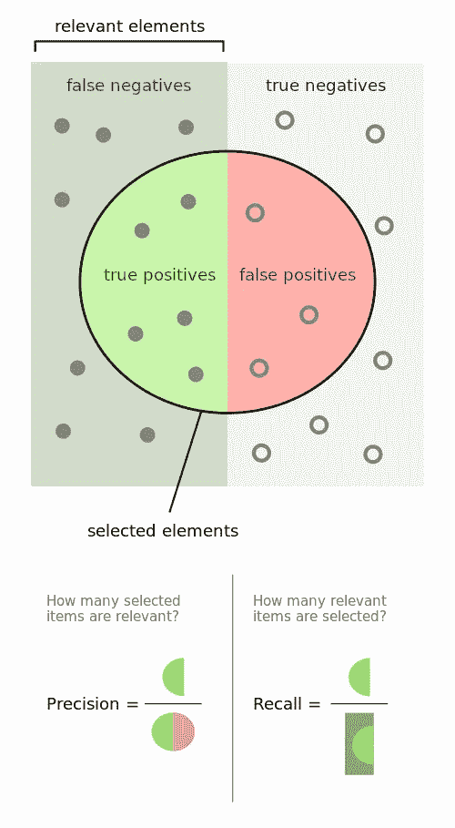

# Precision 诉 Recall 一案

> 原文：<https://towardsdatascience.com/the-case-of-precision-v-recall-1d02fe0ac40f?source=collection_archive---------34----------------------->

## 请允许我试着解开你的困惑

图片来自[皮克斯拜](https://pixabay.com/?utm_source=link-attribution&utm_medium=referral&utm_campaign=image&utm_content=4062633)

P 精确度和召回率是所谓的*评估指标*——用于分析模型性能的指标，尤其是在分类方面。因为分类通常是二元的，因此你要么是正确的，要么是不正确的，这就带来了假阳性和假阴性的问题。

# 精确

在某些情况下，出现假阳性会更加有害。例如，在垃圾邮件检测中，如果一封重要的电子邮件被标记为垃圾邮件(在这种情况下是肯定的),而实际上它不是，这可能是灾难性的，因为您会错过它。因此，控制或防止误报更为重要，因为收件箱中有垃圾邮件比重要邮件中有垃圾邮件要好。如果您的重点是控制假阳性，您会喜欢更高的**精度**分数。

精度是真阳性的数量与真阳性和假阳性的组合数量之比。换句话说，precision 是在所有被判定为肯定的结果中，正确或不正确的结果在所有被标记为垃圾邮件的电子邮件中所占的百分比。

# 回忆

相反，在医学上，假阴性的危害更大。被诊断出患有你最终没有患上的疾病，比得到你确实患有的疾病的阴性检测结果要好。后者可能导致严重的疾病得不到治疗，甚至可能是致命的错误。因此，在这种情况下，必须控制假阴性。如果你的重点是控制假阴性，你会喜欢更高的**召回**分数。

召回率是真阳性的数量与真阳性和假阴性的组合数量的比率。换句话说，召回率是在所有*实际*阳性中，被正确判定为阳性的百分比，判定正确与否——测试结果*正确*在*患有*疾病的人的所有测试结果中，返回阳性，测试结果阳性与否。重要的是要记住假阴性是被错误判定的阳性结果。

正如你可能已经推断出的，精确度和召回率有一个相反的关系——一个上升，另一个下降，因为你选择控制假阳性或假阴性。如果你仍然困惑，这是完全可能的，我很抱歉让你失望了，也许下面的图表可以帮助你理清思路:

由沃尔伯——自己的作品，CC BY-SA 4.0，[https://commons.wikimedia.org/w/index.php?curid=36926283](https://commons.wikimedia.org/w/index.php?curid=36926283)

如果你仍然感到困惑，也许我最近在 LinkedIn 上看到的 Samar Srivastava 的下一个类比会有所帮助:

*“想象一下，最近 10 年，你的女朋友每年都给你一个生日惊喜。*

*然而，有一天，你女朋友问你:*

亲爱的，你还记得我给你的所有生日惊喜吗？

*这个简单的问题让你的生命处于危险之中。*

为了延长你的寿命，你需要从记忆中回忆起所有 10 件令人惊讶的事情。

因此，回忆是你能正确回忆起的事件数量与所有正确事件数量的比率。

*如果你能正确回忆起所有 10 个事件，那么，你的回忆率是 1.0 (100%)。如果你能正确回忆起 7 个事件，你的回忆率是 0.7 (70%)。*

现在，更容易将单词 recall 与该单词在现实生活中的用法联系起来。

然而，有些答案你可能会错。

*比如你回答 15 次，10 个事件是正确的，5 个事件是错误的。这意味着你可以回忆起所有的事件，但不是那么精确。*

*因此，精确度是你能正确回忆起的事件数与你能回忆起的所有事件数之比(正确回忆和错误回忆的混合)。换句话说，就是你的回忆有多精确。*

*从前面的例子(10 个真实事件，15 个答案:10 个正确答案，5 个错误答案)来看，你得到了 100%的召回率但是你的准确率只有 66.67% (10 / 15)。”*

希望这对你有用！