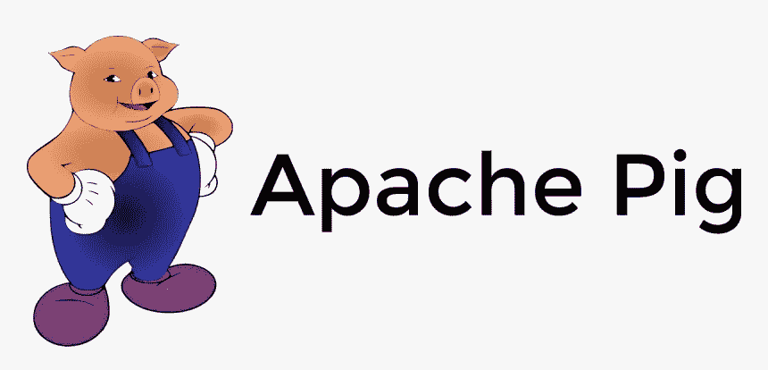
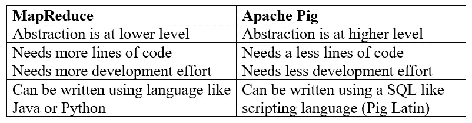
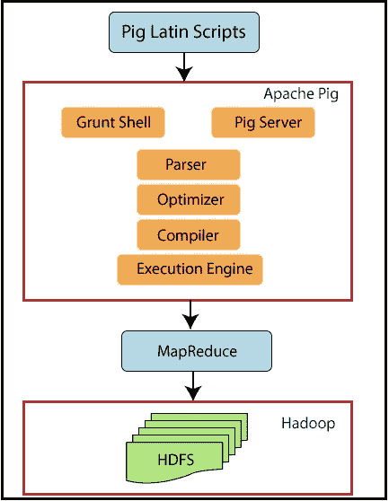

# 阿帕奇猪的魅力

> 原文：<https://towardsdatascience.com/the-charm-of-apache-pig-fdc92b5cc3b4?source=collection_archive---------51----------------------->

## 不容错过的大数据工具



[图像来源](https://www.pngitem.com/middle/hiJhiRR_apache-pig-logo-png-transparent-png/)

Apache Pig 是 Hadoop 生态系统中的核心技术。本文的目的是讨论 Apache Pig 是如何在 Hadoop 技术工具中脱颖而出的，以及为什么以及何时应该利用 Pig 来完成大数据任务。

任何对 Hadoop 有一定了解的人都知道，它能够以分布式方式处理大量数据。Hadoop 的编程模型 MapReduce 通过将一个作业拆分为一组 map 任务和 Reduce 任务来实现并行处理大型数据集。MapReduce 是底层的低级编程模型，这些工作可以使用 Java 和 Python 之类的语言来实现。

考虑一个简单的字数统计任务，我们希望通过 Hadoop 来实现。这项工作的目的是统计每个单词在给定的输入集中出现的次数。下面的代码片段展示了如何使用 Java 编写的 mapper 类和 reducer 类来实现这一点。这是[https://Hadoop . Apache . org/docs/current/Hadoop-MapReduce-client/Hadoop-MapReduce-client-core/MapReduce tutorial . html # Source _ Code](https://hadoop.apache.org/docs/current/hadoop-mapreduce-client/hadoop-mapreduce-client-core/MapReduceTutorial.html#Source_Code)中提供的一个例子

```
import java.io.IOException;
import java.util.StringTokenizer;import org.apache.hadoop.conf.Configuration;
import org.apache.hadoop.fs.Path;
import org.apache.hadoop.io.IntWritable;
import org.apache.hadoop.io.Text;
import org.apache.hadoop.mapreduce.Job;
import org.apache.hadoop.mapreduce.Mapper;
import org.apache.hadoop.mapreduce.Reducer;
import org.apache.hadoop.mapreduce.lib.input.FileInputFormat;
import org.apache.hadoop.mapreduce.lib.output.FileOutputFormat;public class WordCount {public static class TokenizerMapper
       extends Mapper<Object, Text, Text, IntWritable>{private final static IntWritable one = new IntWritable(1);
    private Text word = new Text();public void map(Object key, Text value, Context context
                    ) throws IOException, InterruptedException {
      StringTokenizer itr = new StringTokenizer(value.toString());
      while (itr.hasMoreTokens()) {
        word.set(itr.nextToken());
        context.write(word, one);
      }
    }
  }public static class IntSumReducer
       extends Reducer<Text,IntWritable,Text,IntWritable> {
    private IntWritable result = new IntWritable();public void reduce(Text key, Iterable<IntWritable> values,
                       Context context
                       ) throws IOException, InterruptedException {
      int sum = 0;
      for (IntWritable val : values) {
        sum += val.get();
      }
      result.set(sum);
      context.write(key, result);
    }
  }public static void main(String[] args) throws Exception {
    Configuration conf = new Configuration();
    Job job = Job.getInstance(conf, "word count");
    job.setJarByClass(WordCount.class);
    job.setMapperClass(TokenizerMapper.class);
    job.setCombinerClass(IntSumReducer.class);
    job.setReducerClass(IntSumReducer.class);
    job.setOutputKeyClass(Text.class);
    job.setOutputValueClass(IntWritable.class);
    FileInputFormat.addInputPath(job, new Path(args[0]));
    FileOutputFormat.setOutputPath(job, new Path(args[1]));
    System.exit(job.waitForCompletion(true) ? 0 : 1);
  }
}
```

好的，这段代码由 61 行代码组成。要写这样的东西，你必须清楚地理解 MapReduce 的基本概念和理论。而且，您应该知道以您的首选语言提供的一组库或包，以及它们应该如何组合在一起。映射器、归约器和其他实用方法必须被显式地调用或组合到管道中，以实现整体结果(本例中为 main 方法)。总之，这段代码必须被编译和部署。听起来有点复杂，尤其是如果你没有 MapReduce 或 Java 背景的话？

当我用 Java 编写我的第一个 MapReduce 程序时，我自己也问过这个问题——“有没有更简单的方法来实现这一点？”。答案是‘是的，有，而且是用阿帕奇猪’。

> Apache Pig 是一个高级平台，用于创建在 Hadoop 上运行的程序。这个平台的语言叫做猪拉丁语。

Pig Latin 是一种类似 SQL 的脚本语言，它抽象了 MapReduce 的编程概念。如果您熟悉 SQL 的基本概念，使用 Pig Latin 将 MapReduce 作业放置到位只需几分钟。它将 MapReduce 的底层复杂概念转换成一个非常高级的编程模型。

现在让我们看看上面我们用 Java MapReduce 做的字数统计任务是如何使用猪拉丁([https://en.wikipedia.org/wiki/Apache_Pig](https://en.wikipedia.org/wiki/Apache_Pig))实现的。

```
input_lines = LOAD '/tmp/word.txt' AS (line:chararray);

words = FOREACH input_lines GENERATE FLATTEN(TOKENIZE(line)) AS word;

filtered_words = FILTER words BY word MATCHES '\\w+';

word_groups = GROUP filtered_words BY word;

word_count = FOREACH word_groups GENERATE COUNT(filtered_words) AS count, group AS word;ordered_word_count = ORDER word_count BY count DESC;STORE ordered_word_count INTO '/tmp/results.txt';
```

有了猪拉丁，我们把之前的 61 行压缩到了 7 行。同样的任务是通过操作几个关键字来完成的。像这样的一段代码很容易实现，也很容易被其他人理解。所以，很明显 Apache Pig 降低了 MapReduce 的学习和开发曲线。理解上面的 7 行代码是我留给你们的挑战。有兴趣的话可以从这里开始学习猪拉丁的基础知识:【https://pig.apache.org/docs/r0.17.0/basic.html

下表提供了基于上述示例的 Apache Pig 和 MapReduce 的汇总比较。



MapReduce vs Pig

## 阿帕奇猪架构概述

即使我们试图区分 MapReduce 和 Apache Pig，我们也必须理解 Apache Pig 是建立在 MapReduce 之上的。



猪建筑:[图片来源](https://www.tutorialandexample.com/apache-pig-architecture/)

Pig 脚本通过 ***解析器*** 转换成有向无环图(DAG ),然后输入优化器进行进一步优化。 ***优化器*** 执行逻辑优化，如投影，并将优化后的逻辑计划传递给编译器。 ***编译器*** 将其转换为一组 MapReduce 作业，并传递给 ***执行引擎*** 。这种架构也证明了好处来自于易于实现和易于理解。Apache Pig 充当 MapReduce 复杂概念的高级包装器，并为用户提供一个易于处理的脚本框架。

让我们更深入地挖掘一下 Apache Pig 的一些有趣特性。

1.  **强大的内置功能集** : Pig 自带一系列内置功能。这些函数分为 eval、load/store、math、string、bag 和 tuple 函数。更多关于 Pig 内置函数的细节可以在这里找到:[https://pig.apache.org/docs/r0.17.0/func.html](https://pig.apache.org/docs/r0.17.0/func.html)
2.  **用户定义函数(UDF)**:有人可能会想，我们是否应该只依赖 Pig Latin 提供的一组有限的关键字/功能。用户定义函数是一个解决方案，它扩展了 Apache Pig 的功能。我们可以使用 Java、Python、JavaScript 或 Ruby 等语言编写函数，并在 Pig 脚本中使用它们。UDF 支持定制处理的几乎所有部分，包括数据加载、存储、转换和聚集。
3.  **Tez 模式**:Apache Pig 架构显示它在 MapReduce 之上增加了一些额外的步骤，使得 Pig 比 MapReduce 慢。作为一个解决方案，也可以在 Apache Tez 上执行 Pig 执行。这显著提高了阿帕奇猪的性能。这种性能提升是通过将 Pig 脚本转换成有向非循环图来实现的。如果 pig 脚本的性能是一个问题，那么在 Tez 上运行它是一个选择。你可以在这里找到更多关于阿帕奇技术开发中心的细节:【http://tez.apache.org/ 
4.  **多查询执行** : Pig 具有一次处理整个脚本(一批语句)的能力。首先对整个脚本进行解析，以确定是否可以组合中间任务来减少需要完成的工作总量。这是实现性能优化的另一种方法。
5.  **用户友好的诊断操作符** : Pig Latin 提供了一组诊断操作符，对测试和诊断脚本非常有帮助。描述、解释、转储和说明是支持的诊断运算符。它们有助于检查关系模式、显示结果和观察执行计划等任务。
6.  **支持结构化和非结构化数据**:Pig 基于指定分隔符加载和处理数据的方式有助于处理异构数据。

了解了 Apache Pig 的功能，现在让我们看看它在现实世界中用于什么类型的任务。我们很清楚，优势来自于学习、开发和理解的便利性。因此，如果我们计划将 Apache Pig 集成到真实世界的大数据系统中，我们的目标应该是利用这一优势。可以使用阿帕奇猪，

*   探索大型数据集
*   对大型数据集运行即席查询以进行调试和探索
*   大型数据集的原型处理算法
*   加载和处理时间敏感数据集

我相信我通过这篇文章给了你足够的动力开始学习 Apache Pig。它将始终为您的大数据工具集增值。那你为什么不现在就开始呢？