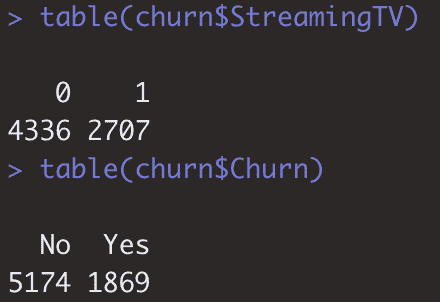
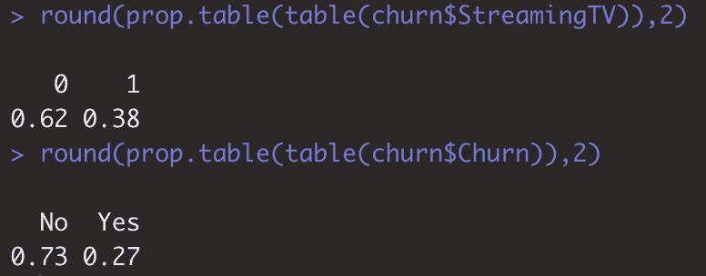
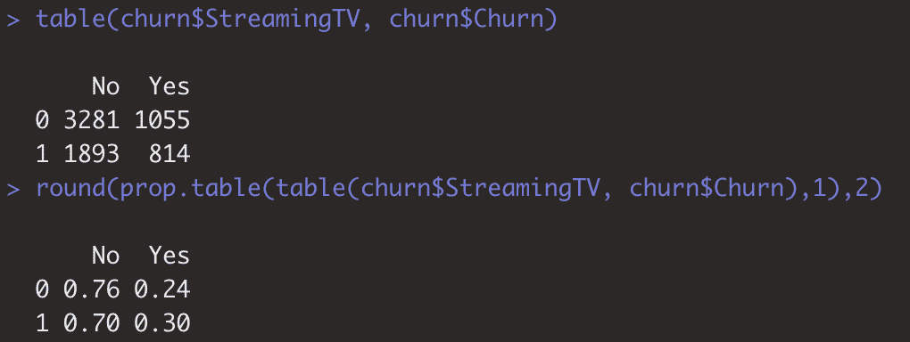
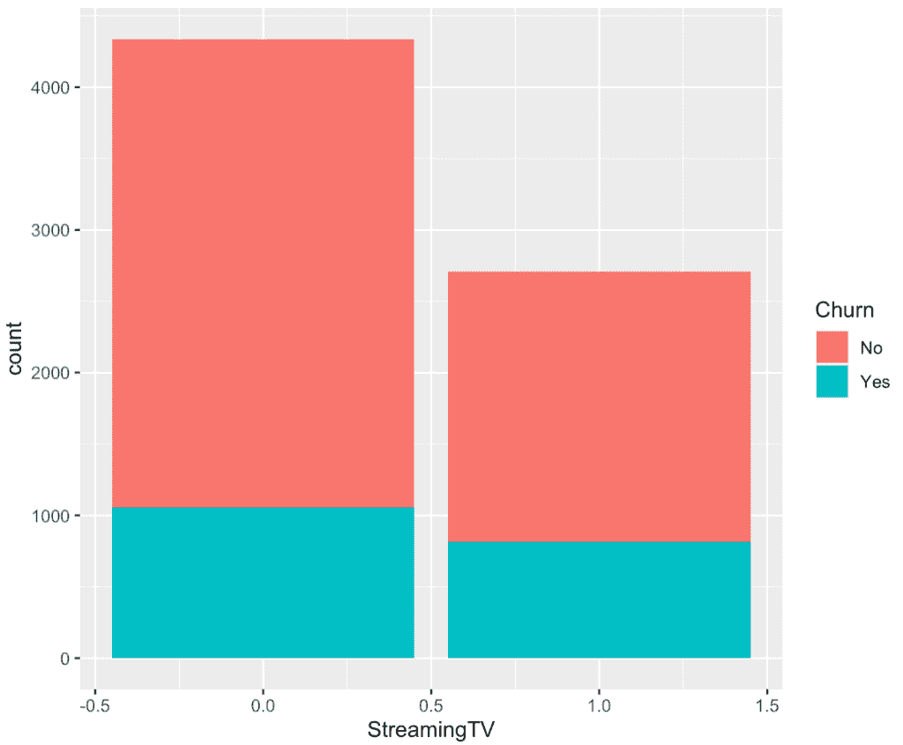
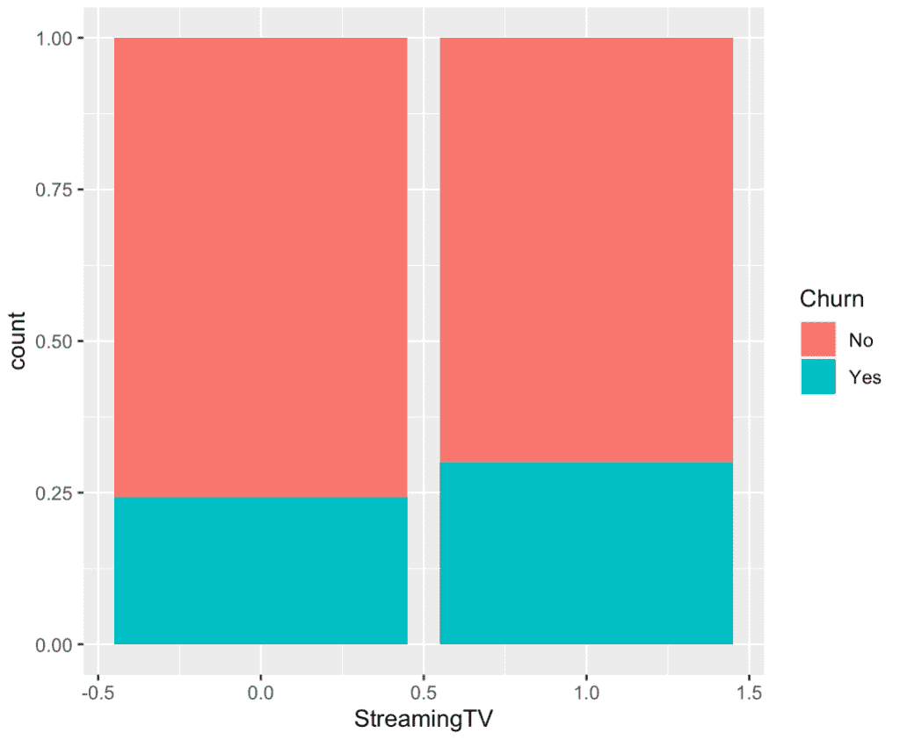
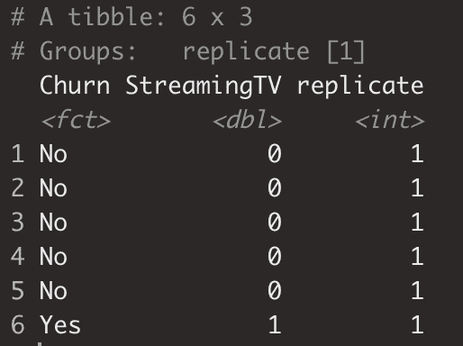
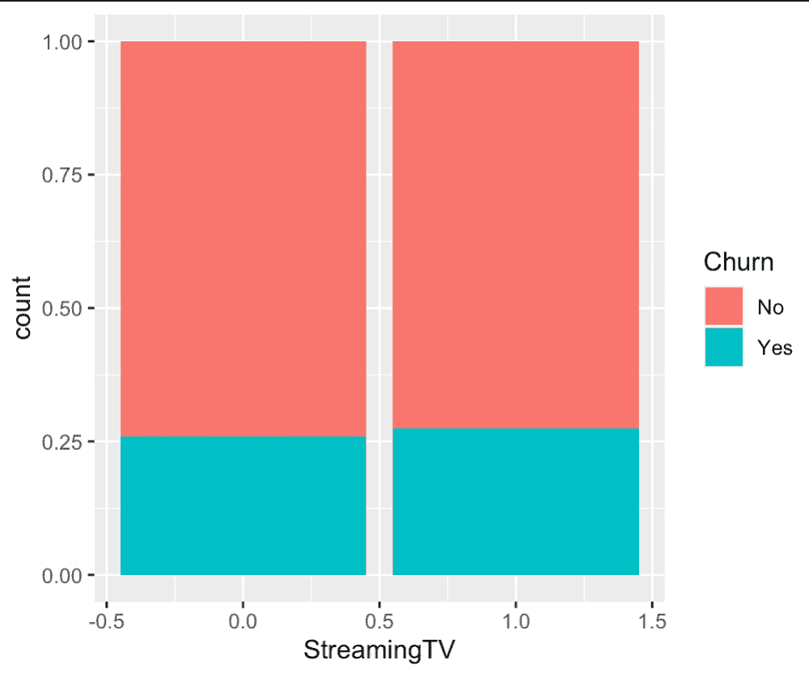
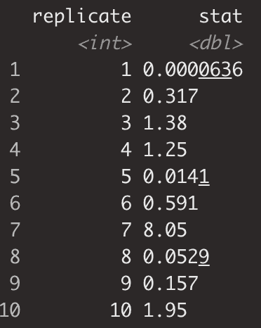
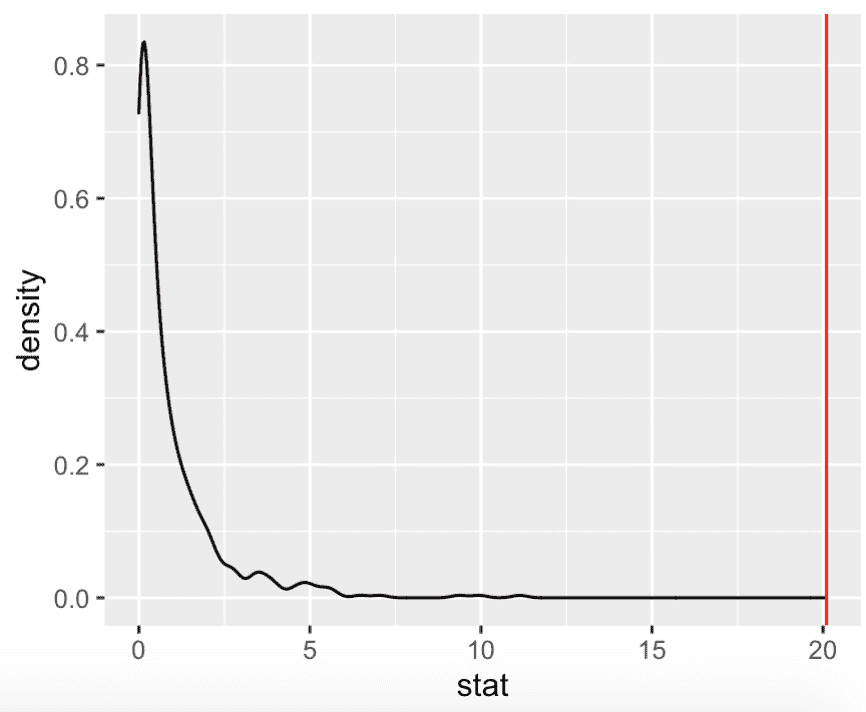

# 卡方检验统计是每个数据科学家的必备工具:客户流失案例研究

> 原文：<https://towardsdatascience.com/the-chi-squared-test-statistic-is-a-must-for-every-data-scientist-a-case-study-in-customer-churn-bcdb17bbafb7?source=collection_archive---------11----------------------->

## 分类变量假设检验的关键


图片来自 [Pavlofox](https://pixabay.com/users/Pavlofox-514753/?utm_source=link-attribution&utm_medium=referral&utm_campaign=image&utm_content=1452987) 来自 [Pixabay](https://pixabay.com/?utm_source=link-attribution&utm_medium=referral&utm_campaign=image&utm_content=1452987)

# 介绍

卡方统计是理解两个分类变量之间关系的有用工具。

举例来说，假设你在一家推出新产品的科技公司工作，你想评估该产品和客户流失之间的关系。在数据、技术或其他领域的时代，许多公司都面临着获取证据的风险，这些证据要么是轶事，要么是高层次的可视化，以表明特定关系的确定性。卡方统计为我们提供了一种量化和评估一对给定分类变量的强度的方法。

# 客户流失

让我们从客户流失的角度来探讨卡方。

你可以从 [kaggle](https://www.kaggle.com/blastchar/telco-customer-churn) 下载我们将要使用的客户流失数据集。该数据集提供了各种电信客户的详细信息，以及他们是否“搅动”或关闭了他们的帐户。

不管你在哪个公司、团队、产品或行业工作，下面的例子应该是非常通用的。

现在我们有了数据集，为了简单起见，让我们快速使用`dplyr`的`select`命令来下拉我们将使用的字段。为了简单起见，我还将把等级数减少到两级。您当然可以对两个以上级别的分类变量进行卡方检验，但是由于我们冒险从头开始理解它，我们将保持它的简单性。

```
churn <- churn %>%
  select(customerID, StreamingTV, Churn)%>%
  mutate(StreamingTV = ifelse(StreamingTV == 'Yes', 1, 0))
```

流失将被分为是或否。正如你刚才看到的，流媒体电视将被编码为 1 或 0。

# 探索性数据分析

在这里，我不会深入探讨探索性数据分析，但是我会给你两个快速的工具来评估两个分类变量之间的关系。

# 比例表

比例表是对两个范畴之间的关系建立一些基本理解的好方法

```
table(churn$StreamingTV)
table(churn$Churn)
```



```
round(prop.table(table(churn$StreamingTV)),2)
round(prop.table(table(churn$Churn)),2)
```



表格让我们快速了解任何给定级别的计数，在`prop.table()`中包装可以让我们看到百分比分解。

现在让我们将两个变量都传递给我们的`table()`函数

```
table(churn$StreamingTV, churn$Churn)
round(prop.table(table(churn$StreamingTV, churn$Churn),1),2)
```



一旦您将另一个变量传递到比例表中，您就能够建立您想要评估相对比例的位置。在这种情况下，我们传递给`prop.table()`函数的第二个参数是“1”，它指定我们希望看到每行记录的相对比例或`StreamingTV`的值。从上表中可以看出，如果客户没有流媒体电视，他们在 76%的时间里保持活跃，相反，如果他们有流媒体电视，他们在 70%的时间里保持活跃。

现在，在我们说流媒体电视肯定会导致更多人流失之前，我们需要评估一下我们是否真的有理由这样说。是的，回头客的比例较低，但差异可能是随机噪音。稍后会有更多内容。

# 是时候想象了

这将为我们提供与我们刚刚看到的类似的信息，但可视化往往有助于更好地快速理解相对价值。

让我们从一个快速条形图开始，图中的`StreamingTV`穿过 x 轴，填充为`Churn`。

```
churn %>%
  ggplot(aes(x = StreamingTV, fill = Churn))+
  geom_bar()
```



正如你所看到的，几乎一样多的电视流媒体播放量和低得多的客户总数。与我们在比例表中看到的类似，100%堆积条形图有助于评估分类变量的值之间的相对分布。我们要做的就是把`position = 'fill'`传给`geom_bar()`。

```
churn %>%
  ggplot(aes(x = StreamingTV, fill = Churn))+
  geom_bar(position = 'fill')
```



# 深入卡方统计

现在，这两个变量之间似乎存在某种关系，但我们还没有统计意义的评估。换句话说，是不是因为电视流媒体和客户之间的关系，也就是说，他们是否非常讨厌这项服务，以至于他们的流失率更高？作为流媒体计划的产品，他们的总账单是否显得过高，以至于他们都在一起搅动？

这些都是很好的问题，我们还没有答案，但我们正在做的是迈出第一步，评估这个更大的调查之旅是否值得。

# 卡方解释

在我们深入创建卡方统计之前，从概念上理解其目的是非常重要的。

我们可以看到两个看似相关的分类变量，但是我们并不确定这种完全不同的比例是随机的还是其他潜在影响的产物。这就是卡方的用处。在两个变量确实完全独立的情况下，卡方检验统计量实际上是我们的分布与我们预期的分布的比较。

首先，我们需要一个数据集来表示这种独立性。

# 生成我们的样本数据集

我们将使用`infer`包。这个包对于创建假设检验的样本数据、创建置信区间等非常有用。

我不会分解如何使用`infer`的所有细节，但是在高层次上，您正在创建一个新的数据集。在这种情况下，我们希望创建一个数据集，它看起来很像我们刚刚看到的客户流失数据集，只是这一次，我们希望确保独立分布，即在客户是电视流媒体的情况下，我们不会看到更大的客户流失。

思考推断的简单方法是遵循指定、假设和生成的步骤。我们指定我们正在建模的关系，我们输入预期的独立分布，最后我们指定我们想要生成的重复的数量。在这种情况下，复制将镜像原始数据集的行数。在有些情况下，您会创建同一数据集的多个副本，并在此基础上进行计算，但这不是流程的这一部分。

```
churn_perm <- churn %>%
  specify(Churn ~ StreamingTV) %>%
  hypothesize(null = "independence") %>%
  generate(reps = 1, type = "permute")
```

让我们快速看一下这个数据集。

```
head(churn_perm)
```



如你所见，我们有两个指定的变量，还有`replicate`。该表中的所有记录都将是 replicate: 1，因为我们只进行了一次复制。

# 示例摘要

现在，让我们快速可视化我们的独立数据集，以可视化相对比例。

```
churn_perm %>%
  ggplot(aes(x = StreamingTV, fill = Churn))+
  geom_bar(position = 'fill')
```



如你所愿，你可以看到相对比例几乎完全一致。有一些随机性在起作用，所以我们可能不会看到这两者完美地排列在一起…但这确实是重点。我们还没有完全做到这一点，但是还记得我提到的创建许多副本的想法吗？

这样做的目的是什么？

如果我们多次创建这个样本数据集，我们是否会看到像我们在观察数据集中看到的那样有 70%到 76%的客户流失率？如果有，我们多久能看到一次？我们是否经常没有理由将这种差异归因于随机噪声之外的任何东西？

好了，说够了……接下来评估一下我们的观察数据与样本数据有多大差异。

# 让我们开始计算

现在我们真正理解了我们的目的，让我们继续计算我们的统计数据。简单地说，我们的目的是计算观察计数表中每个单元格与样本计数表中每个单元格之间的距离。


表示“距离”的公式如下所示:

`sum(((obs - sample)^2)/sample)`

1.  我们从样本中减去观测值，
2.  但是要使它们成正方形，这样它们就不会互相抵消。
3.  我们将它们除以样本数以防止任何单个细胞由于其大小而出现过多，
4.  最后我们算出总和。

我们得到的卡方统计是:20.1

太好了。我们理解卡方统计的目的，我们甚至有它…但是我们仍然不知道… **卡方统计 20.1 有意义吗？**

# 假设检验

在这篇文章的前面，我们谈到了如何使用`infer`包来创建许多许多的副本。假设检验正是这种类型抽样的时机。

让我们再次使用`infer`，只是这次我们将生成 500 个重复&计算每组重复的卡方统计。

```
churn_null <- churn %>%
  specify(Churn ~ StreamingTV) %>%
  hypothesize(null = "independence") %>%
  generate(reps = 500, type = "permute") %>%
  calculate(stat = "Chisq")
churn_null
```



基于上面的输出，你可以看到每个`replicate`都有自己的`stat`。

让我们用一个密度图来看看卡方统计的分布情况。

```
churn_null %>%
ggplot(aes(x = stat)) +
  geom_density()
```


乍一看，我们可以看到卡方统计的分布非常右偏。我们还可以看到，我们的统计值 20.1 甚至不在图上。

让我们添加一条垂直线来显示我们观察到的卡方与置换分布的比较。

```
churn_null %>%
ggplot(aes(x = stat)) +
  geom_density() +
  geom_vline(xintercept = obs_chi_sq, color = "red")
```



当谈到有足够的证据来拒绝零假设，这是有希望的。零假设是两个变量之间没有关系。

# 计算 P 值

作为本课关于如何使用卡方统计的最后一部分，我们来谈谈应该如何计算 p 值。

前面我提到了一个想法，我们可能想知道我们模拟的卡方统计量是否和我们观察到的卡方统计量一样大，如果是这样，它发生的频率是多少。

**这就是 p 值的本质。**

当对我们已知彼此独立的两个变量进行卡方统计时(模拟情况)，这些重复的卡方统计大于或等于我们观察到的卡方统计的百分比是多少。

```
churn_null %>%
  summarise(p_value = 2 * mean(stat >= obs_chi_sq))
```

在我们的示例中，我们的 p 值为 0。至于说在 500 次重复的过程中，我们从未超过 20.1 的卡方统计值。

因此，我们会拒绝无效假设，即流失和流媒体电视是独立的。

# 结论

我们在这么短的时间内做了很多事情。在剖析卡方统计等统计概念时，很容易迷失方向。我的希望是，对这种统计的需求和相应的计算有一个强有力的基础理解，有助于正确的直觉来识别使用这种工具的正确机会。

在短短几分钟内，我们已经了解了:

*   分类变量对的一点 EDA
*   比例表
*   条形图
*   百分比堆积条形图
*   卡方解释和目的
*   如何计算卡方统计量
*   推断假设检验
*   计算 p 值

如果这有帮助，请随时查看我在 datasciencelessons.com 的其他帖子。祝数据科学快乐！