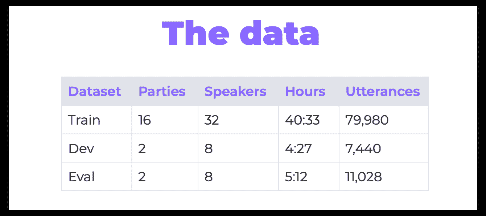
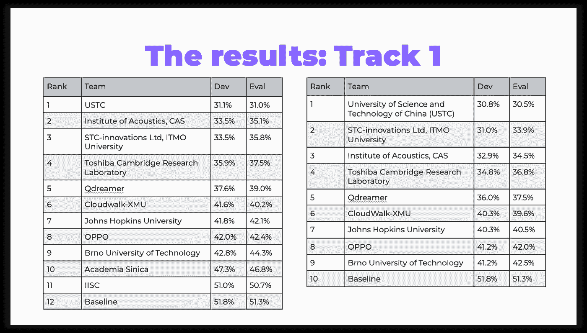
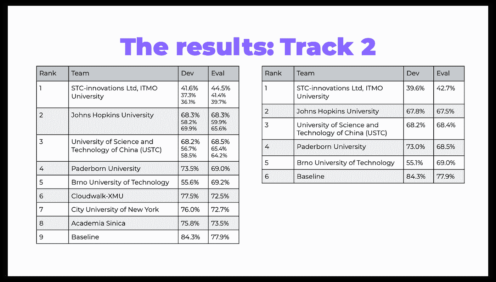
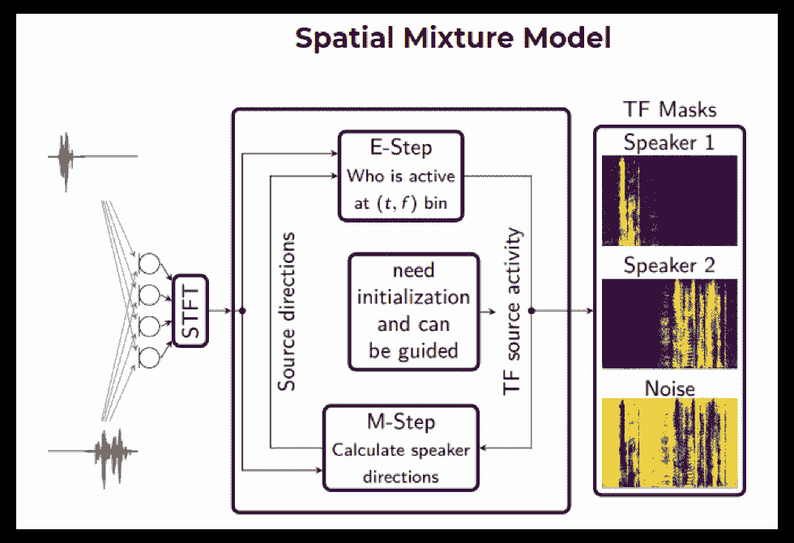
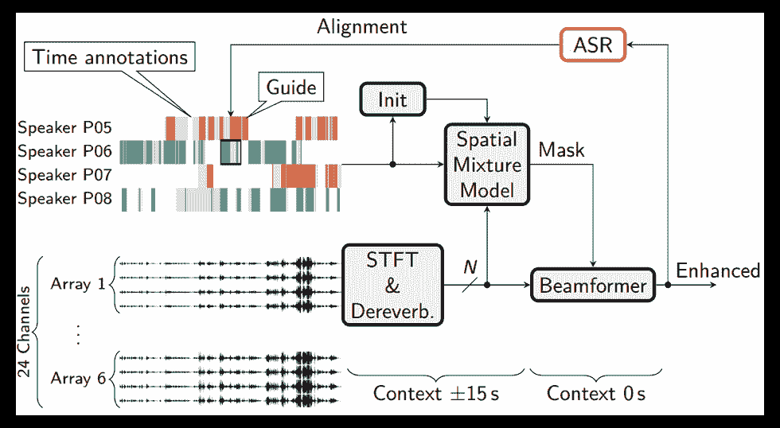
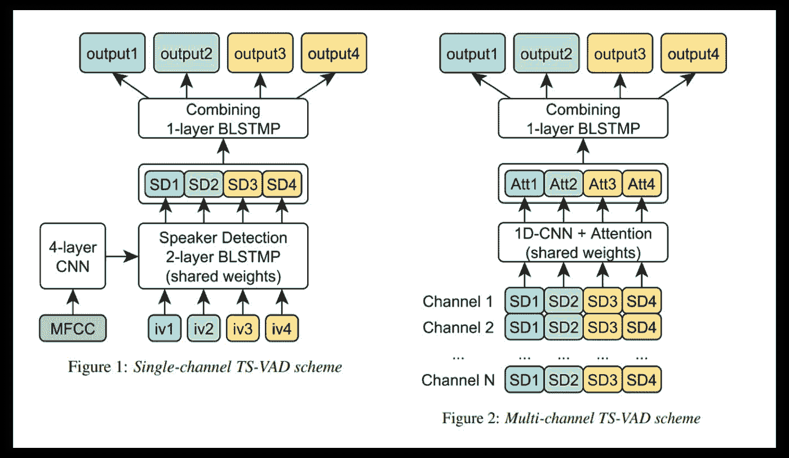

# CHIME-6 挑战回顾

> 原文：<https://towardsdatascience.com/the-chime-6-challenge-review-15f3cbf0062d?source=collection_archive---------40----------------------->

## 在本文中，让我们讨论最近的语音分离和识别挑战的亮点以及获胜者使用的一些技巧。

Allec Gomes 在 [Unsplash](https://unsplash.com/?utm_source=unsplash&utm_medium=referral&utm_content=creditCopyText) 上拍摄的照片

# 关于比赛

不久前，有一个名为 [CHIME-6](https://chimechallenge.github.io/chime6/index.html) 的语音分离和识别挑战。自 2011 年以来一直举办编钟比赛。这些比赛的主要特点是，在日常家庭环境中同时在几个设备上录制的对话语音被用于训练和评估参与者的解决方案。

为比赛提供的数据是在四个参与者的“家庭聚会”期间记录的。这些派对同时在 32 个通道上录制(房间里的 6 个四通道微软 Kinects 个扬声器上的每个双通道麦克风)。

有 20 场派对，都持续了 2-3 个小时。组织者选择了其中一些进行测试:

表 1。数据已经被分成训练、开发测试和评估测试集

顺便说一下，这是在以前的 CHIME-5 挑战中使用的同一数据集。然而，组织者准备了几种技术来提高数据质量(参见 GitHub 上的[软件基线](https://chimechallenge.github.io/chime6/track1_software.html)的描述，章节“数组同步”和“语音增强”)。

要在这里了解更多关于比赛和数据准备的信息，请访问其 GitHub 页面或阅读关于 Arxiv.org 的概述。

今年有两条赛道:

**轨迹 1** —多阵列语音识别；
**轨迹二** —多数组二值化与识别。

每首曲目都有两个独立的排名类别:

**排名 A** —基于传统声学建模和官方语言建模的系统；

**B 级** —所有其他系统，包括基于端到端 ASR 基线的系统或其词典和/或语言模型已被修改的系统。

组织者为参与提供了一个基线，其中包括一个基于 [Kaldi](http://www.kaldi-asr.org/) 语音识别工具包的管道。

评估参与者的主要标准是语音识别指标——单词错误率(WER)。对于第二个轨迹，使用了两个额外的指标——二化错误率(DER)和 Jaccard 错误率(JER ),这允许评估二化任务的质量:

在下表中，您可以看到比赛结果:

表二。赛道 1，排位а(左)，排位 B(右)

表 3。赛道 2，排位а(左)，排位 B(右)

你可以访问 [GitHub](https://chimechallenge.github.io/chime6/results.html#TOP) 上的论文链接。

这里有一些我想讨论的关于挑战的好奇的事情:不希望你错过任何东西！

# 挑战亮点

## **研究型参与**

在之前的 CHiME-5 挑战赛中，在赛道 2 中排名第四的帕德博恩大学团队专注于一项名为[导向源分离](https://groups.uni-paderborn.de/nt/pubs/2018/INTERSPEECH_2019_Boeddeker_Slides.pdf) (GSS)的语音增强技术。CHiME-5 竞赛的结果表明，该技术改进了其他解决方案。

今年，主办方[在声音改进部分正式将](https://arxiv.org/pdf/2004.09249.pdf)引用到 GSS，并将这一技术纳入第一首曲目的基线。

这就是为什么许多参与者，包括所有的领跑者，使用 GSS 或类似的受此启发的改进。

它是如何工作的:你需要构建一个空间混合模型(SMM)，它允许确定说话者的时间-频率掩码(即，给定说话者在什么频率和什么时间说话)。使用 EM 算法执行训练，将说话者的临时注释作为初始化。

图一。空间混合模型

然后，该块被集成到通用语音增强管道中。该管道包括去混响技术(即，从信号中消除回声效应，当声音从墙壁反射时会出现回声效应)和波束形成(即，从几个音轨生成单个信号)。

由于没有第二音轨的说话者注释，语音识别对齐(所说短语的时间戳)被用来初始化用于训练 SMM 的 EM 算法。

图二。语音增强方案

你可以在日立和帕德博恩大学团队在 Arxiv 上的[论文](https://arxiv.org/pdf/1905.12230.pdf)中阅读更多关于该技术及其实施结果的信息，或者看看他们的[幻灯片](https://arxiv.org/pdf/1905.12230.pdfhttps://groups.uni-paderborn.de/nt/pubs/2018/INTERSPEECH_2019_Boeddeker_Slides.pdf)。

## **为自己解决**

在路线 1 中排名第一、在路线 2 中排名第三的中国科技大学团队改进了他们在 CHIME-5 挑战赛中展示的解决方案。这是赢得 CHIME-5 比赛的同一支队伍。然而，其他参与者没有使用他们的解决方案中描述的技术。

受 GSS 思想的启发，中国科技大学实现了其改进的语音增强算法——IBF-SS。

你可以在他们的[论文](https://chimechallenge.github.io/chime2020-workshop/abstracts/CHiME_2020_abstract_du.pdf)中找到更多。

## **基线改善**

在基线中有几个明显的弱点，组织者没有费心去隐藏:例如，只使用一个音频通道来建立二进制化，或者缺乏通过语言模型对排名 b 的重新评分。在基线脚本中，您还可以找到改进的提示(例如，添加来自 CHIME-6 数据的噪声增强来建立 x 向量)。

JHU 团队的解决方案完全消除了所有这些弱点:没有全新的超高效技术，但参与者检查了基线的所有问题领域。在赛道 2，他们排名第二。

他们在管道的每个阶段探索了多阵列处理技术，例如用于增强的多阵列 GSS，用于语音活动检测的后验融合，用于二化的 PLDA 分数融合，以及用于 ASR 的点阵组合。上面描述了 GSS 技术。根据 JHU 的研究，一种足够好的融合技术是简单的最大值函数。

此外，他们还集成了在线多通道 WPE 去混响和基于 VB-HMM 的重叠分配等技术，以分别应对背景噪声和重叠扬声器等挑战。

关于 JHU 解决方案的更详细的描述可以在他们的论文[中找到。](https://chimechallenge.github.io/chime2020-workshop/abstracts/CHiME_2020_abstract_arora.pdf)

# 路线 2 赢家:有趣的把戏

我想强调一下第二站比赛的获胜者 ITMO (STC)团队使用的一些技巧:

## **WRN x 向量**

x 向量是说话人嵌入，即包含说话人信息的向量。这种矢量用于说话人识别任务。WRN x-vectors 是通过使用 ResNet 架构和一些其他技巧对 x-vectors 的改进。它大大降低了 DER，以至于这项技术本身就足以让团队赢得比赛。

你可以在 ITMO 团队的论文中读到更多关于 WRN x 向量的信息。

## **余弦相似度和频谱聚类，自动选择二值化阈值**

默认情况下，卡尔迪二化管道包括从音频中提取 x 向量，计算 PLDA 分数，并使用凝聚层次聚类(AHC)对音频进行聚类。

现在来看一下用来建立说话者矢量之间距离的 PLDA 分量。PLDA 在计算 I 向量的距离时有数学依据。简而言之，它依赖于 I 向量包含关于说话者和通道的信息的事实，并且当聚类时，对我们来说唯一重要的是说话者信息。它对 X 向量也很有效。

然而，使用余弦相似性而不是 PLDA 分数和自动选择阈值的谱聚类而不是 AHC，使得 ITMO 团队在二分化方面取得了另一项重大改进。

要了解更多关于自动选择二值化阈值的谱聚类，请阅读这篇关于 Arxiv.org 的[论文](https://arxiv.org/pdf/2003.02405.pdf)。

## **TS-VAD**

作者在他们的工作中特别关注这项技术。TS-VAD 是一种新颖的方法，它预测每个说话者在每个时间帧上的活动。TS-VAD 模型使用声学特征(例如，MFCC)以及每个说话者的 I 向量作为输入。TS-VAD 提供两种版本:单通道和多通道。该模型的架构如下所示。

图三。TS-VAD 方案

注意，这个网络是为四个参与者的对话量身定制的，这其实是这个挑战的要求所规定的。

单通道 TS-VAD 模型被设计为同时预测所有说话者的语音概率。使用二进制交叉熵之和作为损失函数来训练具有四个输出层的该模型。作者还发现，有必要通过相同的说话人检测(SD) 2 层 BLSTMP 来处理每个说话人，然后通过另一个 BLSTMP 层来组合所有说话人的 SD 输出。

TS-VAD 的单通道版本单独处理每个通道。为了联合处理单独的 Kinect 通道，作者研究了多通道 TS-VAD 模型，该模型使用单个 TS-VAD 模型的 SD 块输出的组合作为输入。每个说话者的所有 SD 向量通过 1-d 卷积层，然后通过简单的注意机制进行组合。所有说话者注意力的组合输出通过单个 BLSTM 层传递，并转换成每个说话者在场/不在场的一组帧概率。

最后，为了提高整体二化性能，ITMO 团队通过计算概率流的加权平均值，融合了几个单通道和多通道 TS-VAD 模型。

你可以在 Arxiv.org 上了解更多关于 TS-VAD 模型的信息。

# 结论

我希望这篇评论有助于您更好地了解 CHiME-6 挑战。如果你决定参加即将到来的比赛，也许你会发现我提到的提示和技巧很有用。如果我错过了什么，你可以随意伸手！