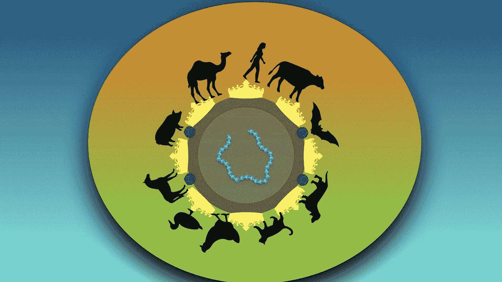
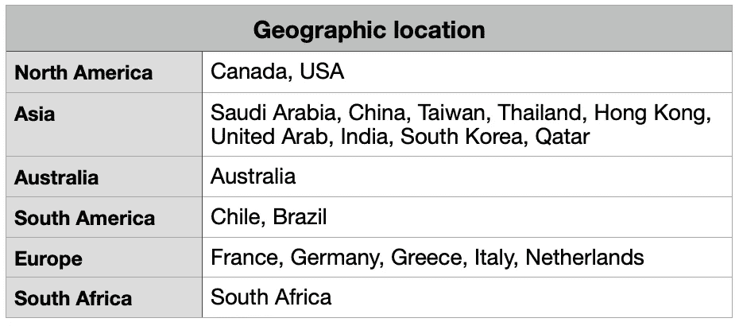
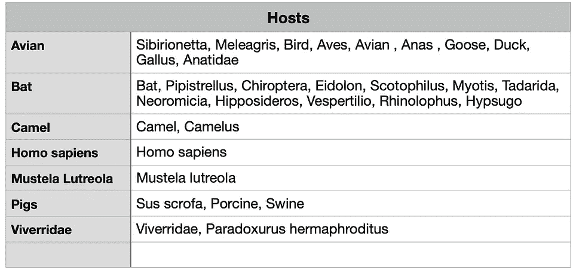
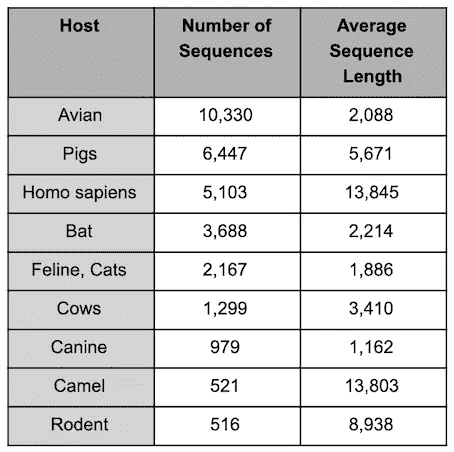
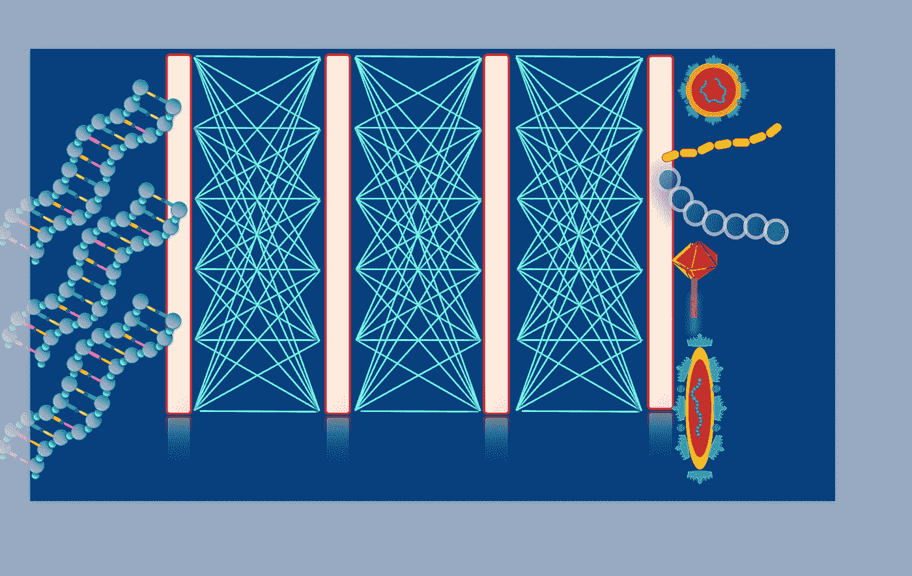
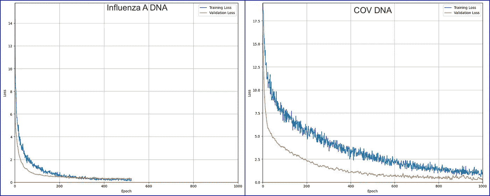
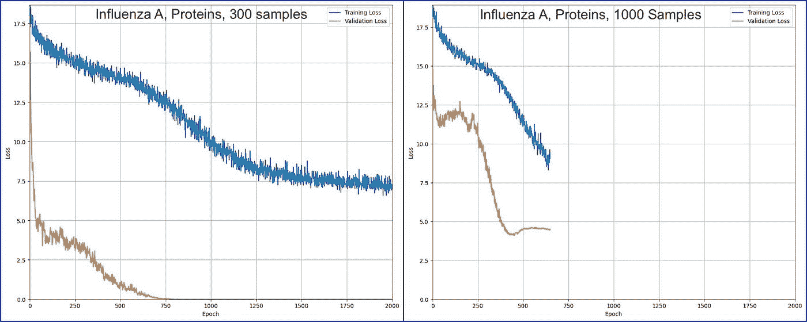
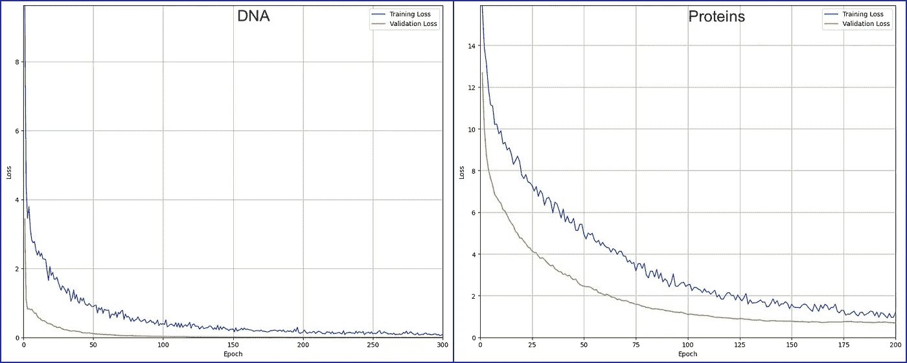
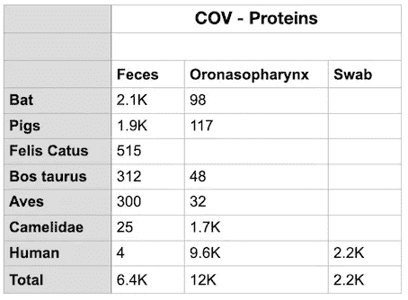

# 病毒生命的循环

> 原文：<https://towardsdatascience.com/the-circle-of-viral-life-on-the-genetic-similarity-during-cross-species-transmission-2294f62a59e0?source=collection_archive---------59----------------------->

## 论跨物种传播中的遗传相似性

新型冠状病毒结构上人类和非人类动物的插图(作者绘制)

在我进入基因研究世界的旅程中，我发现病毒令人着迷，甚至在某种意义上令人鼓舞。这是因为它们的内部结构复杂地适应于产生新的突变，因为它们通过多种不同的途径传播给生物(*宿主)*:空气传播、水传播、鸟类迁徙、粪便传播等等。令人鼓舞的是，当病毒基因的突变使它们能够随着多年来调整生存技能而变得复杂时，进化的本质就显现出来了。我了解到病毒不仅仅是一堆分子，实际上是一种独特类型的粒子，名为*病毒学*，只有在生物学、物理学、地理学，甚至[气候学](https://arxiv.org/pdf/2003.05003)和经济学的多学科背景下才能真正理解(想想病毒有多大的力量，它们可以导致全面封锁)。

病毒转移是病毒在不同宿主物种间传播的途径。动物到人类的病毒传播被称为人畜共患病。动物传染病可以在任何接触或食用动物、动物产品或动物衍生物的环境中传播。以下模式可能会给你一点提示:食物和水、农业、牧场、畜牧业、宠物、狩猎、活的[动物市场](https://www.nature.com/articles/s41586-020-2008-3?fbclid=IwAR1VfqWqfRxS1Fi7Mh8yK4X03bcT8VUnnaymxMGlXYdwzWLPv4XhCIuYmFY)等。这些只是对实际发生的事情的一个小小的了解…

在这项研究的框架内，我重点研究了两个家族的四种病毒:*冠状病毒科* ( [MERS](https://www.nature.com/articles/srep25049) 和[新型冠状病毒](https://www.nature.com/articles/s41586-020-2008-3)病毒)和*正粘病毒科*(甲型流感: [H1N1](https://www.nejm.org/doi/full/10.1056/NeJMoa0903810) 和 [H3N2](http://www.interfetpthailand.net/file/ai_training2006/Resources/Antivirals/Bright_H3N2Drug_resistn_Lancet_05.pdf) 病毒)，并发现了与我处理的问题最匹配的下一个主题:

1.  显示了被诊断患有甲型流感和冠状病毒的宿主的多样性
2.  根据病毒 DNA 和蛋白质序列，检查宿主——人类和非人类动物——之间的遗传相似性
3.  探索病毒传播的动态行为

在钻研算术(这是最容易的部分……)之前，我想分享一下我个人的担忧:我担心我们作为一个国家，以及我们对世界范围内流行病造成的医疗紧急情况的反应。为什么公众仍然遭受像正在进行的[新型冠状病毒](https://www.nature.com/articles/s41586-020-2008-3)这样的流行病，尽管它不是一种“全新”的病毒(只是冠状病毒家族中以前病毒的一种变异)？是因为我们还没有找到预防传播的方法吗？我来提醒你以下之前的疫情事件。一次突出的流行发生在 1918 年，当时甲型流感在智人中流行(第一例发现于 1902 年在 Gallus)。冠状病毒家族的病毒也很“古老”，1941 年、1952 年首次从鸟类身上收集到，最近于 2003 年(在中国)从人类身上收集到。这种病毒就是众所周知的 [SARS](https://www.ncbi.nlm.nih.gov/nuccore/GU553363) (并且仍然活跃)。2008 年在沙特阿拉伯收集到了一种类似的病毒结构，称为 MERS，这涉及到大量骆驼出现这种疾病。关于病毒遗传序列的地理位置和宿主物种的更多细节显示在下面的图表部分。

一方面，似乎 21 世纪的人类在每个可以想象的领域都开发了技术，以应对几乎每个挑战:从金属工具到登月和人工智能。有时感觉好像人类的创造力是无限的。然而，另一方面，我们仍然依赖于保守的，甚至极端的方法，如全面封闭和强制佩戴不透气的口罩(有没有人想到开发一种可以自由呼吸的口罩？…).底线是，这些“现成的”解决方案是不充分的，在我看来是荒谬的。这意味着我们没有做好准备，尽管所有的红色信号和迹象都很明显。

在这些最困难的时期，来自不同背景的科学家团队聚集在一起，通过开发疫苗、药物和大规模数据科学项目等解决方案来“反击”和“拯救世界”，以估计疫情的“轨迹”。但是，我很怀疑这些英雄是不是把大家的命都记在心里了。当我说“每个人”时，我也指非人类动物，如骆驼、猪、鸟类和所有我们人类为了自己的需要(食物、衣服、劳动、娱乐等)而饲养、照料和繁殖的生物。我个人的愿望是所有的动物都应该自由。在那之前，我们至少应该学会如何避免病毒在他们的同类和我们的同类之间传播。

所有生物的基因“机制”是作为一个病毒系统运行的吗？就病毒结构的重建和蛋白质的生成而言，宿主之间的不变量是什么？所有这些问题都让我探索了多种宿主物种之间的遗传相似性。

原来这篇文章不是关于一种新的机器学习技术，而是一种独特的研究和视角。然而，我假设你对神经网络、降维、大数据分析和生物学有一些基本的了解。如果生物学部分你还不清楚，我推荐阅读我博客中的文献综述部分:[研究新冠肺炎的遗传学](https://medium.com/swlh/studying-the-genetics-of-covid-19-8814e978e901)，如果你不熟悉遗传数据上的神经网络，访问我的博客:[弥合遗传学和神经网络之间的鸿沟](/bridging-the-gap-between-genetics-and-neural-networks-4fdb91032f4b)对你来说将是一个很好的开始。

**数据表示**

为了执行大规模的机器学习实验，我在*国家生物技术信息中心* [*NCBI*](https://www.ncbi.nlm.nih.gov/labs/virus/vssi/#/virus?SeqType_s=Nucleotide) 收集了由尽可能多的宿主物种组成的公开可用的病毒数据(如果你不熟悉 *NCBI* ，请阅读我的博客:[破解病毒的遗传](https://medium.com/python-in-plain-english/hacking-the-genetics-of-viruses-7215eaac43e9))。

在对数据进行任何计算之前，我选择了一些关于病毒的详细信息。我根据与每个基因样本共同收集的额外部分，绘制了流行病的规模和比例，没有任何数据处理。这些图显示了每种病毒的地理位置和宿主物种流行率，归一化并乘以 100。可以看出，除了首次从猪身上收集到的 H1N1 病毒外，智人是所有病毒中第一个被诊断出的。蝙蝠是冠状病毒家族中第二个被确诊的。骆驼是 2016 年受 MERS 病毒影响最大的物种，而灵猫在 2006 年排名第一，欧洲水貂在 2020 年追平了被诊断患有新型冠状病毒的智人数量。至于地理位置，H3N2 首先在亚洲收集，其次在南非收集，而 H1N1 在 2009 年涉及所有检查的位置。第五张图集中在亚洲，以区分病毒最初分离的地点。请注意，禽类和猪在遭受甲型流感时对人类群体免疫的贡献在两种病毒中都得到了很好的证明。

下表显示了按地理位置和主机提取和检查的类别:

**基因序列上的长度**

我们如何证明一个基因序列在不同的宿主物种中是相似的？我首先进行了一个简单的实验，对不同病毒家族的基因序列进行了分类。经过进一步的考虑，我意识到不考虑序列的长度来比较序列是有误导性的。这可能是为什么在进行任何序列比较之前，序列比对通常是生物信息学的第一步。然而，我想在不对齐序列的情况下检查神经网络的性能(这可能是该实验独特的原因之一)，同时使用大约相同的序列长度(ε约为+/- 10%，并用零填充缺失数据以完成全尺寸矩阵)。为了适应这些限制，我选择在每个实验中对同一家族的两种病毒进行分类(进行二元分类),这些实验包含尽可能多的宿主物种多样性。下表总结了一些宿主物种在 *NCBI* 中的可用蛋白质序列。请注意，平均长度是根据不同类型的蛋白质计算的。然而，在我的实验中，我为每个样本收集了相同类型的蛋白质。为了在每次实验中保持相同水平的宿主多样性，当一组中的宿主数量超过允许值时，我会过滤掉宿主样本。

**重组基因序列**

回到理论上。病毒在宿主体内产生蛋白质，但不同物种的蛋白质如何排列才能进行比较？通过重组蛋白质。事实上，我发现这部分非常令人兴奋，因为人们可以创造出自然界中不存在的蛋白质序列。术语“重组蛋白质”代表产生一长串连接蛋白质(链)的过程。每个蛋白质链都是输入数据集的样本，由病毒标记(用于监督学习)。链类似于 DNA 序列，但有蛋白质。具体来说，对于冠状病毒，我选择比较常见的蛋白质名称:刺突、包膜、膜、核衣壳、ORF1ab 和 ORF1a 多蛋白，而对于甲型流感，我选择比较聚合酶、核衣壳、神经氨酸酶、血凝素、基质和核输出。

下一个[代码](https://gist.github.com/miritrope/7ce07009741d781b1ad8df8857bc33ba)片段展示了如何生成蛋白质链。该代码只是以重复的顺序“缝合”每个样本中的每种蛋白质。因此，蛋白质链在每个样品中以相同的顺序排列。根据所有样本的最大链长，所有其他样本在其边缘(末端)被零填充。

在我的实验中，这些是最大和最小的重组序列长度。请注意，由于上面讨论的类似原因，每个样本中都包含相同的蛋白质。

**数学定义**

*   设 Sn 为序列样本。
*   样本 Sn 根据其蛋白质是非人类或人类。蛋白质可以是人类或非人类来源的。
*   每个重新设计的序列样本都是蛋白质的串联(一条链)。每种蛋白质类型 Pn 必须准确包含一次，以便集合一个样本。

**架构**

使用神经网络的病毒分类:病毒结构(右)，基因序列(左)——由作者绘制

架构非常简单。两个完全连接的层之后是一个 softmax 层。关于网络的详细解释可以在我的[博客](http://bridging-the-gap-between-genetics-and-neural-networks/)中找到(我这里使用的模型是*改进的*模型)。我分割数据的方式是具有挑战性的部分，源于我试图在这篇文章的框架内解决的主要问题，即:宿主之间的相似性——人类与非人类的比较。由于每个样本都标有病毒索引，因此需要将人类和非人类样本分成不同的类别，以便测试数据揭示模型已经学习到的相似性。如果模型达到高准确度，则宿主(人类和非人类样本)之间具有高相似性。

回到数学定义:如果 Sn 的蛋白质来自非人类物种，它就在训练集中。否则(人类)，Sn 在测试集中。

这些是我应用的方法的主要技术细节。这篇文章的其余部分给出了结果和结论。

**结果**

对于每个病毒家族，在 DNA 或蛋白质类型的序列上测试了两个实验。下表显示了每个实验的精确度。当考虑 DNA 样本时，该模型对甲型流感的准确率达到 98.4%，对冠状病毒的准确率达到 92.2%，而当处理蛋白质时，对两种病毒的准确率几乎都达到 100%。注意，我检查了两种规模的测试数据集。结果表明，样本越多，性能越好，这可能是因为在这种情况下数据的多样性更高。

培训和验证损失可以在下图中看到。这种行为是正确的，既不过度拟合也不欠拟合，这意味着在训练期间，验证损失低于训练损失。这方面的另一个观察结果是冠状病毒蛋白质实验中的学习率行为(右下)，其中需要少量的时期来概括数据(在大约 250 个时期之后，验证停止下降并达到其最大准确度)。

**讨论**

我认为在这个框架中值得一提的结论首先是在技术方面:已经实现的高准确性意味着宿主物种之间的 DNA 和蛋白质序列差异相似，高达 8%的错误分类误差。此外，如果使用神经网络和大致相同的序列长度(这在大多数病毒家族中都是如此)，则没有必要使用比对工具。这是个好消息，因为在很多情况下“少即是多”。第二，在这项研究中探索了传播因素，并强调当(如果)我们处理非人类动物时，需要谨慎和卫生。畜牧业中常见的高密度和恶劣的卫生条件可能需要重新考虑。此外，不必要的接触，如出于娱乐目的使用动物，如骆驼摔跤(在阿拉伯文化中广泛传播)，以及“教育”目的，如抚摸动物园(向公众展示如何强迫一个活着的生物生活在没有自由的笼子里，这没有任何教育意义)。

> 除了本文讨论的病毒性疾病的传播之外，改变我们与非人类动物的互动方式可能会带来实质性的道德和环境利益。

无论如何，我对进一步研究的建议是研究食用来自被诊断患有冠状病毒的动物的产品可能会对人体产生怎样的影响，例如:[未经高温消毒的牛奶或生肉](https://www.ncbi.nlm.nih.gov/pmc/articles/PMC4036761/)。另一个可能出现的问题是如何重新设计我们对待农场动物的方式，并重新检查动物在牛棚、猪圈或鸡舍中是如何被饲养和对待的。

**附录**

*   病毒家族的分类

正如我上面所讨论的，首先我对病毒家族进行了分类。这个实验是一个关键因素，它让我在进行基因分类测试时理解了序列长度的重要性。来自不同病毒家族的训练序列可能误导网络得出不同的结论，从而错过整个研究。我从这个实验中得到的教训是，通过找到可比较的数据来关注你的研究问题，然后测试你的模型。然而，结果达到了很高的精度(误导…)，并且可以在下面的损失函数中看到。

*   冠状病毒——宿主物种的多样性

下表列出了其他冠状病毒宿主物种及其序列信息。注意物种多样性:一场流行病可以影响几乎所有的物种。然而，在我的实验中，我倾向于不使用这些物种的序列，因为它们的序列数量不足以进行大规模实验。

*   病毒学诊断方法

基因样本可以通过多种方法收集，例如，冠状病毒的常见方法是通过粪便和口咽 **(** 鼻子后面的咽喉上部)。下表显示了每台主机的样本数量，按诊断测试分类。请注意，拭子测试在人类中普遍使用，可能是因为它是一种更昂贵的测试(拭子不能重复使用)。

**关闭**

由于科技的发展，世界变得更加美好。如今，比以往任何时候都有更多的人分享快乐——是时候让其他物种也体验快乐，或者至少是类似的快乐了。正如一句佛言:“**愿一切众生皆无苦及其因”**。