# 云:让谷歌云平台变得简单

> 原文：<https://towardsdatascience.com/the-cloud-google-cloud-platform-gcp-made-easy-anish-mahapatra-3d0aed3fe7fa?source=collection_archive---------41----------------------->

## 云是一个复杂的空间。这并不像大多数人想象的那样简单。让我们简化云:GCP 版。

[天一马](https://unsplash.com/@tma?utm_source=medium&utm_medium=referral)在 [Unsplash](https://unsplash.com?utm_source=medium&utm_medium=referral) 上拍照

云是一个复杂的空间。这并不像大多数人想象的那样简单。我们有来自不同背景的人，如开发人员、网络工程师、机器学习工程师、数据架构师等。谁将掌握云的某些组件。

当在企业环境中工作时，专家在各种相关的组件上工作，并且每个人在数据和模型管道生命周期中都有自己的位置，这一点很关键。这可能包括以下角色:

*   **安全**:身份处理和访问管理(IAM)
*   **数据架构**:了解各种云服务之间的交互，深入了解本地服务&需求
*   **模型运营**:亲自了解云上的 IaaS、PaaS、SaaS 特性；管道自动化、优化、部署、监控和扩展
*   **基础设施**:各种项目和产品的动态需求，以最小化公司的成本以及应用的灵活性
*   **支持**:利用专业人员提供的端到端云平台知识来节省调试时间(了解多于学习)

上述技能的健康组合可以成功地从遗留系统迁移到云环境。

[泰勒·维克](https://unsplash.com/@tvick?utm_source=medium&utm_medium=referral)在 [Unsplash](https://unsplash.com?utm_source=medium&utm_medium=referral) 上的照片

## GCP 的数据生命周期

谷歌涉足互联网游戏已经有很长时间了。一路走来，他们打造了多个伟大的产品。当你的努力是实验性的而不是流线型的，首先，它在产品组合中变得明显。

> 相同的工作流可以通过多种方式在云上实现。优化和正确的选择使一个人成为谷歌云数据专家。

数据生命周期是数据从最初收集到最终可视化的周期。它由以下步骤组成:

*   **数据摄取**:从数据源获取原始数据——通常是实时数据或批量数据
*   **存储**:数据需要以合适的格式存储。数据必须可靠且可访问。
*   **数据处理**:数据必须经过处理才能得出可操作的见解
*   **数据探索和可视化**:根据数据的使用情况，必须向利益相关者适当地展示数据

杰西·奥里科在 [Unsplash](https://unsplash.com?utm_source=medium&utm_medium=referral) 上的照片

# 1.数据存储

云上的数据存储是一种企业应该利用的价值产品。一个本地存储选项无法实现多种功能。容错、对减少延迟的多区域支持、基于增加的工作负载的弹性、[可抢占的虚拟机实例](https://cloud.google.com/compute/docs/instances/preemptible)、按使用付费和降低的维护成本等诸多优势。

话虽如此，GCP 在数据存储方面有多种产品。选择合适的服务与针对云的优化同样重要。

## 谷歌云平台的数据湖:谷歌云存储

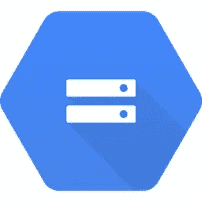

谷歌云存储([信用](https://cloud.google.com/storage))

被认为是终极集结地的[谷歌云存储](https://cloud.google.com/storage)可以灵活地接受所有数据格式、任何类型，并且可以用来以更低的成本存储实时数据和存档数据

Google 云存储是一个 RESTful 在线文件存储 web 服务，用于在 Google 云平台基础设施上存储和访问数据。该服务将谷歌云的性能和可扩展性与高级安全和共享功能相结合。

将谷歌云存储视为网络文件系统的等价物，它是可靠的，可以接受你扔给它的任何东西，并且根据你的[数据需求](https://cloud.google.com/storage#all-features)在成本上是灵活的——标准、近线、冷线、存档

## 谷歌云 SQL

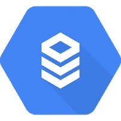

谷歌云 SQL ( [信用](https://cloud.google.com/sql))

[Google Cloud SQL](https://cloud.google.com/sql/?utm_source=google&utm_medium=cpc&utm_campaign=japac-IN-all-en-dr-skws-all-super-trial-e-dr-1009137&utm_content=text-ad-none-none-DEV_c-CRE_438601772143-ADGP_Hybrid+%7C+AW+SEM+%7C+SKWS+~+T1+%7C+EXA+%7C+Storage+%7C+1:1+%7C+IN+%7C+en+%7C+SQL+%7C+cloud+sql-KWID_43700028140250069-kwd-297124208290&userloc_9061994-network_g&utm_term=KW_cloud%20sql&ds_rl=1264446&gclid=CjwKCAjw4MP5BRBtEiwASfwAL9C40p1pdxXTO5BW7gwvAaJFxbhbBUQu-HQfhcA51SshITJv8_YO3RoCIoAQAvD_BwE) 是一个完全托管的数据库服务，可以帮助您设置、维护、管理和控制您的关系数据库。

**用例:**基于 Web 框架的结构化数据。例如，仓库记录、物品

当选择通过为您管理的维护堆栈直接提升和转移传统 SQL 工作负载时，可以利用云 SQL。

最佳实践:更多更小的表，而不是更少更大的表

## 谷歌云数据存储

谷歌云存储([信用](https://cloud.google.com/datastore))

[Google Cloud Datastore](https://cloud.google.com/datastore) 是一个高度可扩展、完全可管理的 [**NoSQL**](https://www.geeksforgeeks.org/introduction-to-nosql/) 数据库服务。

[**用例**](https://www.geeksforgeeks.org/use-of-nosql-in-industry/) **:** 半结构化数据；用于键值类型数据。例如，存储产品 SKU 目录和存储游戏检查点

云数据存储可用作无运营、高度可扩展的非关系型数据库。可以根据业务需求定义数据的结构。

## 谷歌云 Bigtable

谷歌云 Bigtable ( [信用](https://cloud.google.com/bigtable))

Google Cloud Bigtable 是一个完全托管的、可扩展的 NoSQL 数据库单区域服务，用于大型分析和运营工作负载。它与多区域部署不兼容。

**使用案例:**高吞吐量分析，低于 10ms 的响应时间，每秒百万次读取/写入。用于金融、物联网等。

云 Bigtable 不符合 No Ops，更改磁盘类型(HDD/ SDD)需要一个新实例。通过一个标识符，即行键来识别。

好的行键导致分布式负载，差的行键导致[热点](https://www.quora.com/What-is-hot-spotting-in-Hbase)。不良行键的指示器:域名、顺序 id、时间戳。

## 谷歌云扳手

谷歌云扳手([信用](https://cloud.google.com/spanner)

[Google Cloud Spanner](https://cloud.google.com/spanner) 是一个完全托管的关系数据库，规模不限，一致性强&可用性高达 99.999%。它本质上是为最大程度减少停机时间和完全可靠性而构建的。

**用例:** RDBMS 和大规模事务。例如，全球供应链、PoS 的零售跟踪等。

Cloud Spanner 是一个完全托管的、高度可扩展/可用的关系数据库，具有很强的事务一致性(ACID 合规性)。

## 谷歌大查询(存储)

谷歌大查询([信用](https://cloud.google.com/bigquery))

[Google BigQuery](https://cloud.google.com/bigquery) 是一个完全托管的、无服务器的数据仓库，能够对数 Pb 的数据进行可扩展的分析。它是一个无服务器的软件即服务，支持使用 ANSI SQL 进行查询。它还内置了机器学习功能。

**使用案例:**需要规模和一致性的任务关键型应用。用于使用 SQL 的大型数据分析处理。

Google BigQuery 也支持有限的机器学习实现。

干得好！你已经对谷歌云平台中的存储有了相当的了解。下图说明了这一切是如何组合在一起的。

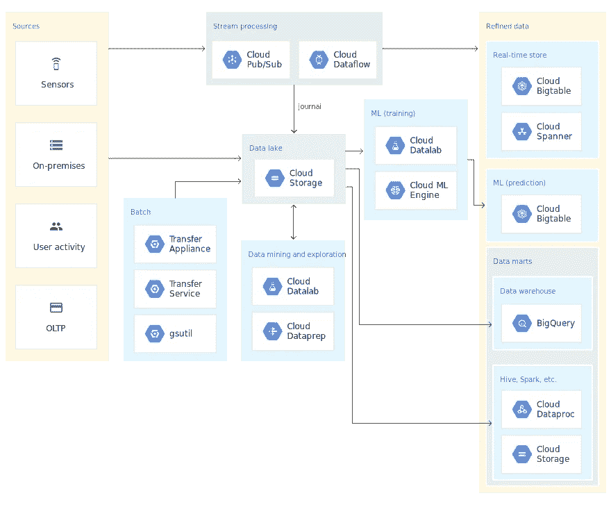

在 GCP 建立一个数据湖

我想在这里重申，类似的工作流和工作负载可以通过多种方式在 GCP 上执行，但哪种方式是最佳选择取决于项目/组织的短期和长期扩展和使用计划。

[田宽](https://unsplash.com/@realaxer?utm_source=medium&utm_medium=referral)在 [Unsplash](https://unsplash.com?utm_source=medium&utm_medium=referral) 上拍照

 [## Jupyter 笔记本崩溃了，所以我在 15 分钟内就把我的数据科学项目部署到了云中(对于…

### 你可以用一个很老很老的系统免费进行奇特的数据科学研究——只要动动脑筋，从这个博客中获得帮助。

medium.com](https://medium.com/datadriveninvestor/jupyter-notebook-crashed-so-i-deployed-my-data-science-project-in-the-cloud-in-15-minutes-for-56edc0ac4d0d) 

# 2.设置数据管道

现在，我们已经知道了数据的去向，接下来要解决的问题是我们如何将数据带到那里。这就是所谓的数据管道。我们必须开始构建我们的数据管道，以确保任何时候使用的数据都符合最终用户的期望。

三种主要的数据类型是:

*   **历史/存档数据:**这是可能在某个时候使用的旧数据。我们通过可用的[方法](https://cloud.google.com/storage/docs/uploading-objects)将所有这些数据上传到 GCP
*   **流式(或实时)数据:**这将包括实时生成的数据和我们希望近实时分析的数据，如金融数据
*   **批量(或批量)数据:**这将包括批量更新的数据，低延迟不是优先级

现在让我们了解一下谷歌云平台是如何通过其各种服务来实现这一点的。

## 谷歌云发布/订阅:

谷歌发布/订阅([积分](https://cloud.google.com/pubsub/docs/overview))

[Google Pub/Sub](https://cloud.google.com/pubsub/?utm_source=google&utm_medium=cpc&utm_campaign=japac-IN-all-en-dr-bkws-all-all-trial-e-dr-1008074&utm_content=text-ad-crcloudmatrixver01ctr-none-DEV_c-CRE_308495403335-ADGP_Hybrid+%7C+AW+SEM+%7C+BKWS+~+T1+%7C+EXA+%7C+Big+Data+%7C+M:1+%7C+IN+%7C+en+%7C+Cloud+PubSub-KWID_43700029827958853-kwd-395094646964&userloc_9061994&utm_term=KW_google%20pub%20sub&ds_rl=1264446&gclid=CjwKCAjw4MP5BRBtEiwASfwALwKcqANn7TNsdmNxOOUL_o9L8tZtmpvsh4RVDiYs6Fg6DFUQjEenABoCfPgQAvD_BwE) 代表发布者和订阅者。这项服务允许您实时地从数据源传输数据。开源的对等物是阿帕奇卡夫卡。

发布/订阅是一种异步消息服务，它将产生事件的服务与处理事件的服务分离开来。

**用例:**流分析，异步微服务集成。例如，从各种制造机器单元流式传输物联网数据。

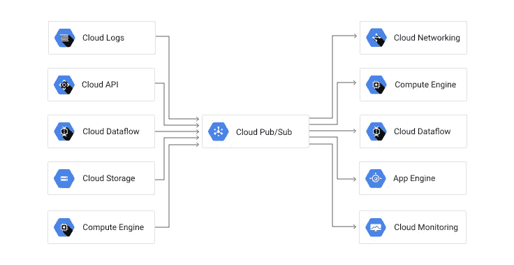

发布/订阅集成([信用](https://cloud.google.com/pubsub/docs/overview))

当需要快速行动来快速收集数据、获得洞察力并针对信用卡欺诈等情况采取行动时，该服务可用于流式传输数据。

## 谷歌云数据流

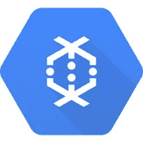

谷歌云数据流([积分](https://cloud.google.com/dataflow/?utm_source=google&utm_medium=cpc&utm_campaign=japac-IN-all-en-dr-skws-all-all-trial-e-dr-1009137&utm_content=text-ad-none-none-DEV_c-CRE_308515844521-ADGP_Hybrid+%7C+AW+SEM+%7C+SKWS+~+T1+%7C+EXA+%7C+Big+Data+%7C+M:1+%7C+IN+%7C+en+%7C+Cloud+Dataflow-KWID_43700029827958982-kwd-317056134128&userloc_9061994-network_g&utm_term=KW_cloud%20dataflow&ds_rl=1264446&gclid=CjwKCAjw4MP5BRBtEiwASfwALxdELheTIh_fqSarZwJKf82fVNpvpm5U7G9bZLKhlq7AdvGAGJGVKRoCP3cQAvD_BwE))

[谷歌云数据流](https://cloud.google.com/dataflow/?utm_source=google&utm_medium=cpc&utm_campaign=japac-IN-all-en-dr-skws-all-all-trial-e-dr-1009137&utm_content=text-ad-none-none-DEV_c-CRE_308515844521-ADGP_Hybrid+%7C+AW+SEM+%7C+SKWS+~+T1+%7C+EXA+%7C+Big+Data+%7C+M:1+%7C+IN+%7C+en+%7C+Cloud+Dataflow-KWID_43700029827958982-kwd-317056134128&userloc_9061994-network_g&utm_term=KW_cloud%20dataflow&ds_rl=1264446&gclid=CjwKCAjw4MP5BRBtEiwASfwALxdELheTIh_fqSarZwJKf82fVNpvpm5U7G9bZLKhlq7AdvGAGJGVKRoCP3cQAvD_BwE)是一种统一的流和批量数据处理，无需服务器，速度快，成本低。

Dataflow 的开源等价物是 [Apache Beam](https://beam.apache.org/documentation/) 。

**用例:**流分析、实时人工智能、异常检测、预测预报、传感器和日志处理

处理来自云发布/订阅的事故都是在谷歌云数据流中完成的。可以对流程进行管理，以决定我们接受数据的时间点以及如何监控数据。

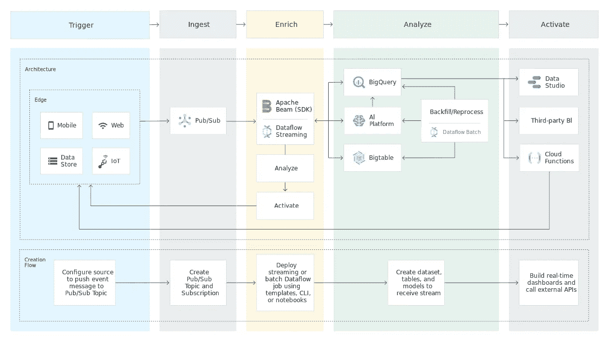

利用发布/订阅和数据流的流分析([信用](https://cloud.google.com/dataflow))

Google Cloud Dataflow 将数据流的多个实例纳入所需的工作流，处理多个一致性边缘情况，并简化数据以进行近实时分析的预处理。

## 谷歌云数据平台

Google Dataproc ( [信用点](https://cloud.google.com/dataproc))

[Google Dataproc](https://cloud.google.com/dataproc) 让开源数据和分析处理在云中变得更快、更容易、更安全。该服务支持基于触发器自动加速和减速的自动化集群管理。这使得它们极具成本效益，但对多种使用情况有效。

**用例:**可用于运行机器学习任务，用于 NLP 的 PySpark 等。例如，对电信数据进行客户流失分析。

可调整大小的集群、自动缩放功能、版本控制、高可用性、集群计划删除、自定义映像、灵活的虚拟机、组件网关和从指定的 Dataproc 集群访问笔记本电脑是 Dataproc 集群的几个行业领先功能。

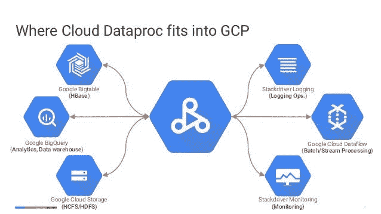

GCP 工作流中的云 data proc([积分](https://www.slideshare.net/huguk/google-cloud-dataproc-easier-faster-more-costeffective-spark-and-hadoop-65909195))

Cloud Dataproc 是运行流程的最佳服务之一。人工智能平台也是另一个很好的选择。云数据过程的最新好处是，使用 Google Cloud Composer(Apache air flow)，Data proc 集群可以以敏捷和可伸缩的方式加速和减速。这成为一个精益流程，同时成本降低，效率提高。

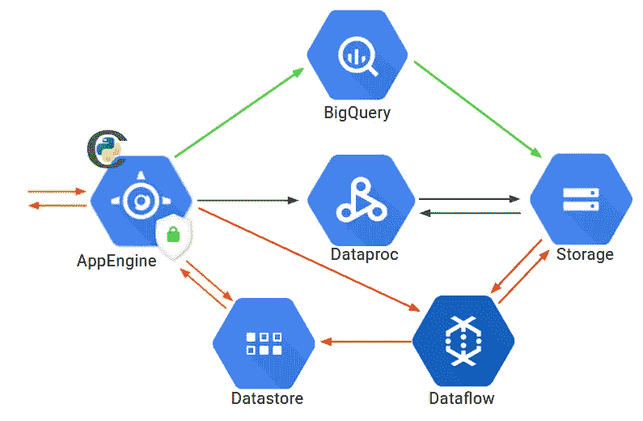

GCP 上的完全无服务器实施—示例([信用](https://medium.com/google-cloud/how-we-implemented-a-fully-serverless-recommender-system-using-gcp-9c9fbbdc46cc)

## 谷歌大查询(管道)

谷歌大查询([信用](https://cloud.google.com/bigquery))

请注意，BigQuery 是第二次引入，因为它在建立分析管道方面也很高效

[Google BigQuery](https://cloud.google.com/bigquery) 是一款完全托管的数据仓库、自动扩展和无服务器服务，可对 Pb 级数据库进行近乎实时的分析。存储在 BigQuery 中的数据应该是列优化的，应该更经常地用于分析，存档数据应该存储在 Google 云存储中。

阿帕奇 Avro ( [学分](https://avro.apache.org/docs/current/))

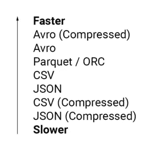

影响 BigQuery 速度的数据类型([信用](https://www.cardinalpath.com/blog/bigquery-performance-optimization-and-cost-governance))

数据类型是相关的，会影响查询性能和速度，并最终影响成本。

[Apache Avro](https://avro.apache.org/docs/current/) 是具有最佳性能的数据类型，对于 BigQuery 上的分析任务，Json 相对较慢。这可以通过云外壳或 Web UI 来使用。

## 谷歌云作曲家

Google Cloud Composer ( [学分](https://commons.wikimedia.org/wiki/File:Cloud-Composer-Logo.svg))

[Google Cloud Composer](https://codelabs.developers.google.com/codelabs/intro-cloud-composer/index.html#0) 是一种完全托管的工作流编排服务，使您能够创作、调度和监控跨云和内部数据中心的管道。

Cloud Composer 建立在流行的 [Apache Airflow](https://airflow.apache.org/) 开源项目之上，使用 Python 编程语言运行，不受限制，易于使用。

让我激起你的兴趣。网飞使用这种建筑。它是最先进的，可扩展性极强。

## 你为什么要在乎？

如果你做过 Ubuntubash 脚本，我们调度任务的方式是使用 [cron jobs](https://www.google.com/url?sa=t&rct=j&q=&esrc=s&source=web&cd=&ved=2ahUKEwiW2rLSjZHrAhXe4HMBHTBTA7YQFjAHegQIGRAF&url=https%3A%2F%2Fwww.hivelocity.net%2Fkb%2Fwhat-is-cron-job%2F%23%3A~%3Atext%3DA%2520cron%2520job%2520is%2520a%2Cjobs%2520to%2520perform%2520certain%2520functions.&usg=AOvVaw2XHjAZpjiP7_BuFqRH0DV5) ，在那里我们可以自动化任何手动完成的任务。如果你用过 Excel，[宏](https://support.microsoft.com/en-us/office/quick-start-create-a-macro-741130ca-080d-49f5-9471-1e5fb3d581a8#:~:text=If%20you%20have%20tasks%20in,your%20mouse%20clicks%20and%20keystrokes.)相当于 Apache Airflow 所能做的，但是是在云级别。

这种自动化程度令人难以置信。本质上，你可以设置脚本(在 python 和 bash 中)从 Google 云存储中拉出最新的数据，在 Google Dataproc 中旋转一个集群，执行数据预处理，关闭集群，在 AI 平台上实现数据模型，并将结果输出到 BigQuery 上。

照片由 I [srael Palacio](https://unsplash.com/@othentikisra?utm_source=medium&utm_medium=referral) 在 [Unsplash](https://unsplash.com?utm_source=medium&utm_medium=referral) 上拍摄

你是个摇滚明星！很好地理解了数据存储和谷歌云存储上数据流管道的各种实现。既然你在这里，我建议你回去刷新你的记忆，看看你能回忆起多少。

现在，让我们开始了解如何利用我们已经存储的数据和我们已经建立的管道。

## 谷歌云数据实验室

谷歌云数据实验室([学分](https://cloud.google.com/datalab))

[Google Cloud Datalab](https://cloud.google.com/datalab) 是一款易于使用的交互式工具，用于数据探索、分析、可视化和机器学习。

Datalab 支持强大的数据探索、集成的开源、可扩展的数据管理和可视化，以及具有生命周期支持的机器学习。

## 你为什么要在乎？

作为一名数据科学家，这相当于 Jupyter 笔记本，其中的数据可以位于 GCP 的各个组件中。您可以从云 shell 通过 SSH 连接，并通过端口 8081 运行它(如果这没有意义，请忽略)。

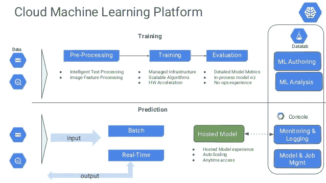

在 GCP 使用谷歌云数据实验室([信用](https://softwareengineeringdaily.com/2017/10/18/model-training-with-yufeng-guo/)

云数据实验室是一个在线 Jupyter 笔记本电脑

## 谷歌云数据准备

谷歌云数据准备([学分](https://commons.wikimedia.org/wiki/File:Cloud-Dataprep-Logo.svg))

Google Cloud Dataprep 是一种智能云数据服务，可以可视化地探索、清理和准备用于分析和机器学习的数据。

这是一种无需服务器的服务，支持快速探测、异常检测、简单而强大的数据探测。

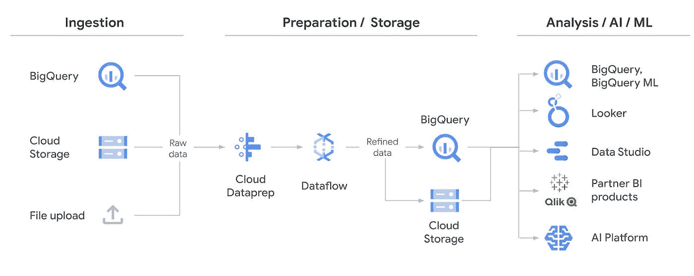

Google Cloud Dataprep 在工作流程中的位置

> 可以把 Google Cloud Dataprep 想象成一个带有智能建议的 excel GUI。

 [## Gartner 炒作周期中的 AutoML 分析的未来？

### 你对数据科学或其未来了解多少？某人的一篇观点文章。

medium.com](https://medium.com/voice-tech-podcast/automl-on-the-gartner-hype-cycle-the-future-of-analytics-daab144d8406) 

## 谷歌人工智能平台

谷歌人工智能平台([学分](https://medium.com/ci-t/scale-scikit-learn-models-at-google-ai-platform-f151351fb025))

[谷歌人工智能平台](https://cloud.google.com/ai-platform)是一项托管服务，使您能够轻松构建机器学习模型，该模型可以处理任何类型、任何规模的数据。人工智能平台让用户为模型开发准备、构建和运行、管理和共享机器学习端到端周期。

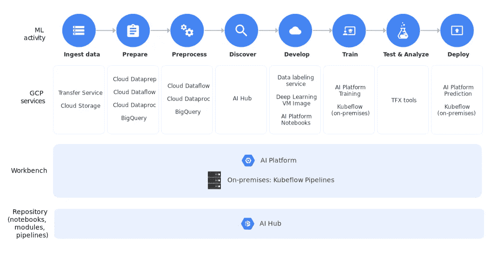

机器学习开发:端到端循环([学分](https://cloud.google.com/ai-platform))

AI 平台是下一代云 Dataproc。

ML 工作流程([学分](https://cloud.google.com/ai-platform/docs/ml-solutions-overview))

AI 平台是一个完全托管的平台，可扩展到数十个 CPU/GPU/TPU，您可以在其中训练您的模型并使其自动化。

## 谷歌数据工作室

谷歌数据工作室([学分](https://marketingplatform.google.com/about/data-studio/))

很简单。谷歌数据工作室是一个在线的交互式仪表板工具，其来源位于 GCP。您可以在一个平台上同步多个开发人员完成的工作。

它不像 Power BI 或 Tableau 那么先进，但它可以完成工作。它是 G 套件的一部分，可以连接 BigQuery、Cloud SQL、GCS、Google Cloud Spanner 等。

 [## 在 15 分钟内在云上运行 Jupyter 笔记本电脑#Azure

### 文章做到了标题所说的。在 Azure 笔记本电脑(免费或付费)上运行 Jupyter Notebook，其成本仅为……

towardsdatascience.com](/running-jupyter-notebook-on-the-cloud-in-15-mins-azure-79b7797e4ef6) 

卢卡斯·布拉塞克在 [Unsplash](https://unsplash.com?utm_source=medium&utm_medium=referral) 上的照片

我建议你反复阅读上面的文章，以了解云:谷歌云平台。一如既往，了解该平台的最佳方式是深入了解 Google 云平台的实际操作方面。这需要相当大的努力，如果你觉得这在某种程度上对你有帮助，我会很感激你的想法和评论。欢迎联系我，进一步讨论数据科学在云上的应用。

 [## Anish Mahapatra —数据科学家— Mu 适马公司| LinkedIn

### 我正在努力理解数学、商业和技术如何帮助我们在未来做出更好的决策…

www.linkedin.com](https://www.linkedin.com/in/anishmahapatra/) 

所以，关于我的一点点。我是一家顶级数据科学公司的数据科学家，目前正在攻读数据科学硕士学位。我花很多时间学习和工作。如果你喜欢这个，给我点爱！😄我也写关于[千禧一代的生活方式](https://medium.com/@anishmahapatra/the-millennial-burn-out-is-real-a0acebff25ae)、[咨询](https://medium.com/@anishmahapatra/my-top-5-learnings-as-a-consultant-accc5989ec34)、[聊天机器人](https://chatbotslife.com/how-you-can-build-your-first-chatbot-using-rasa-in-under-15-minutes-ce557ea52f2f)和[财经](https://medium.com/@anishmahapatra/the-investment-guide-for-smart-noobs-9d0e2ca09457)！如果您对此有任何问题或建议，请随时在 [LinkedIn](https://www.linkedin.com/in/anishmahapatra/) 上联系我或关注我[这里](https://medium.com/@anishmahapatra)，我很想听听您的想法！

作为本系列后续步骤的一部分，我将发布更多关于我们如何在现实世界中利用云的用例。欢迎[关注我](https://medium.com/@anishmahapatra)并与我联系了解更多信息！

 [## Anish Mahapatra - Medium

### 阅读 Anish Mahapatra 在媒体上的文章。专业数据科学家攻读数据科学硕士学位。在…工作

medium.com](https://medium.com/@anishmahapatra)