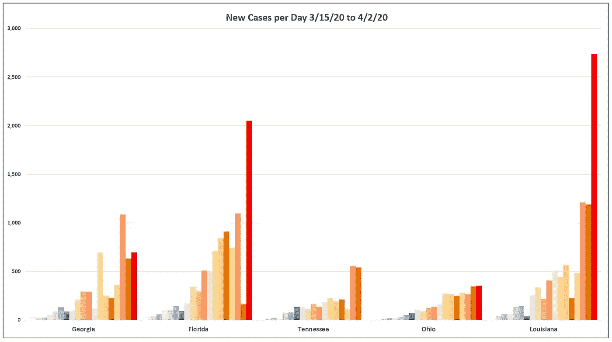

# 冠状病毒病例的商业测试积压和指数增长——比我们想象的要晚

> 原文：<https://towardsdatascience.com/the-commercial-testing-backlog-and-exponential-growth-of-coronavirus-cases-its-later-than-we-28c45c9207e3?source=collection_archive---------29----------------------->

几周来，广泛流传的轶事和相对较少的小报告表达了对由于商业实验室积压的测试而需要等待时间才能收到测试结果的担忧。3 月 31 日, [The Atlantic](https://www.theatlantic.com/health/archive/2020/03/next-covid-19-testing-crisis/609193/) 终于发表了一篇关于这个主题的深度文章。加州似乎是积压的中心，大约有 57，000+项测试仍未完成，平均每天处理约 2，100 项测试。然而，加州的 Quest 实验室已经接受了来自全国各地的测试。几个因素导致了第一个提供测试的商业实验室的积压——Quest Diagnostics 和 Labcorp。最初的测试设计是一项非常劳动密集型的测试，缺乏对测试操作的及时扩展，并且新的高速测试机制(瑞士罗氏公司)与以前收集的测试不兼容。Quest 坚持认为，全国范围内的平均测试周转时间约为 4-5 天，但在田纳西州，3 月 24 日在 Kefauver 联邦大楼测试一个案例时，直到 3 月 31 日才收到结果(7 天，结果为负)。当我的家人通过我丈夫在田纳西州的工作场所被曝光时，那个人的检测结果 10 天没有返回。

虽然很高兴看到这一问题得到解决，各公司也在争相解决这一问题，但这只是全国范围内准确病例数这一更大问题的冰山一角。很难完全定义这个问题，因为每个州都在使用不同的测试来源——例如，截至 3 月 13 日，纽约州有 [28 个私人实验室](https://www.politico.com/states/new-york/albany/story/2020/03/13/cuomo-fda-flexibility-will-allow-new-york-to-dramatically-expand-coronavirus-testing-1266926)处理测试。华盛顿州严重依赖华盛顿大学医学院进行快速开发和部署的测试，直到他们的实验室不堪重负，停止接受测试。据[Covid 追踪项目](https://covidtracking.com/)称，在几个州悬而未决的测试显示没有数据。不是零，没有数据。很可能许多国家没有报告这一信息，而不是没有任何未决测试。鉴于 Quest Diagnostic 自己关于 4-5 天平均处理速度的官方公开言论，如果每个州使用这些商业实验室，它们应该有一些待测试的报告。

关于测试滞后时间令人担忧的是，报告的数字实际上反映了 4 到 10 天之前的情况。在指数增长的情况下，就像我们目前所处的情况，确诊测试中的 4 到 5 天的滞后时间意味着比报告的病例多数千例。7 到 10 天的滞后时间很可能意味着比报告的病例多成千上万。对于像加利福尼亚这样的积极主动的州来说，这种测试滞后可能不会有太大的影响。对于那些好战地坚持推迟采取抑制传播的强有力措施的州，如佐治亚州、佛罗里达州和田纳西州，这种数据滞后将转化为医院利用率的增加，以及冠状病毒和其他急性医疗问题造成的更多生命损失。由于冠状病毒患者数量导致的医疗配给，这些问题无法解决。

这段时间对于减缓扩散是绝对关键的。指数增长已经在每个州确立。需要整整两周或更长时间——取决于就地安置等措施的力度和执行力度——才能真正看到这些措施颁布时正在发生的传播的全部结果。[矩阵模型](https://necsi.edu/pandemic-math)和同行评议的[研究](https://necsi.edu/the-effect-of-travel-restrictions-on-the-domestic-spread-of-the-wuhan-coronavirus-2019-ncov)都表明，限制人口中心之间的流动和限制社会群体的相互作用可以有效地减缓指数式扩散，如果措施得以维持，最终会逆转这种扩散。

对传播的指数速率同样重要的是限制传播的时机。 [**越早制定限制传播的措施，就能越早解除**](https://necsi.edu/eliminating-covid-19-a-community-based-analysis) 。这就像炉子上的一壶开水——仅仅因为你关了火并不意味着水马上就凉了——这需要时间。指数增长也是如此。我们越早关闭暴露的热量，病例的增长就越早冷却。这也给了关键的检测和治疗基础设施必要的时间来扩大规模。可以通过积极的检测和隔离病人来限制进一步的传播。但是测试系统必须有适当的规模，而不是不堪重负。

每天新增病例的增加表明呈指数级增长。

下图比较了佐治亚州、佛罗里达州、田纳西州、俄亥俄州和路易斯安那州从 3 月 15 日到 4 月 2 日每天的新增病例。

数据来源:[https://coronavirus.jhu.edu/map.html](https://coronavirus.jhu.edu/map.html)

该图中唯一一个在确诊病例相对较低的情况下实施强制留院令和关闭学校的州是俄亥俄州(437)，对新病例的增长率产生了显著影响。路易斯安那州也在 3 月 23 日实施了留在家中的命令，与俄亥俄州同一天，但他们没有执行，该州的病例数是他们发布命令时的 3 倍(1137 例)。直到 4 月 1 日，佛罗里达州、佐治亚州和田纳西州的州长拒绝发布强制留在家中的命令，当时佛罗里达州确诊病例达到 8，864 例，佐治亚州为 5，268 例，田纳西州为 2，809 例。田纳西州可能已经达到了传播的宽限期，这表现为明显缓慢的病例增长，这纯粹是由于学校的春假时间，这要早得多(大多数学校和大学为 3 月 9 日至 13 日和 3 月 16 日至 20 日)。所有其他州的春假都在 2-3 周后。

这就是测试积压破坏快速和决定性行动的地方。不知道病例的真实数量，并且没有有效和快速的测试来确认它们，只会加剧州和联邦领导人的问题，他们不努力理解科学的政策含义，而是等待问题出现在他们的门口，然后制定强有力的措施来减缓和阻止指数增长。