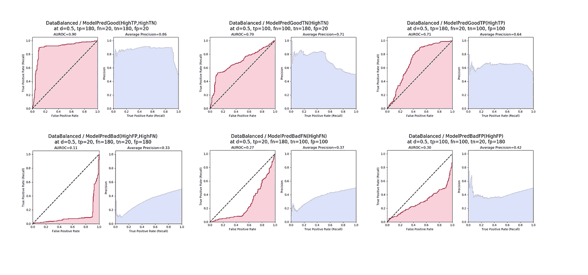
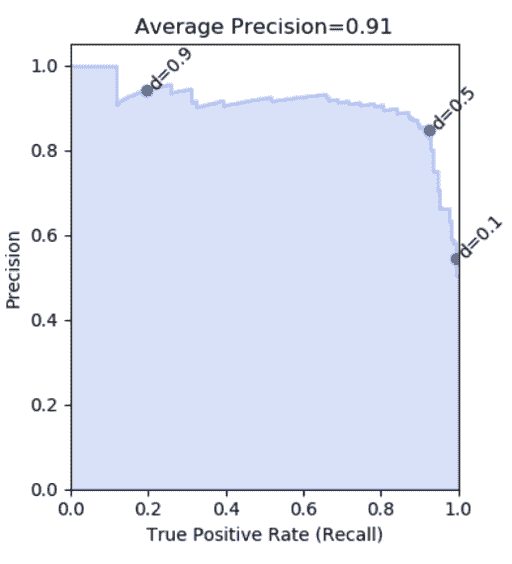
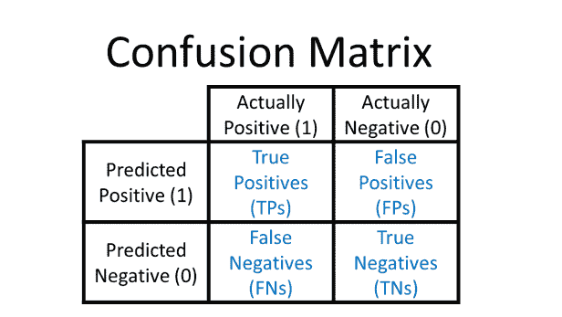
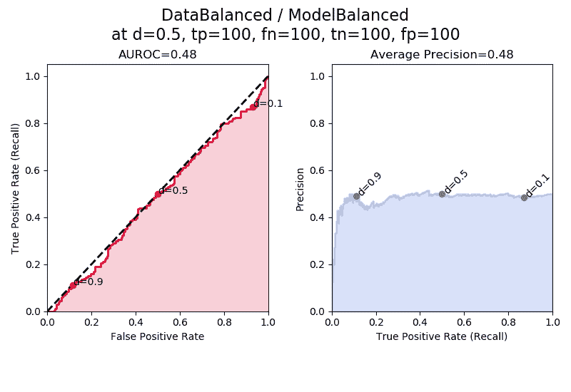
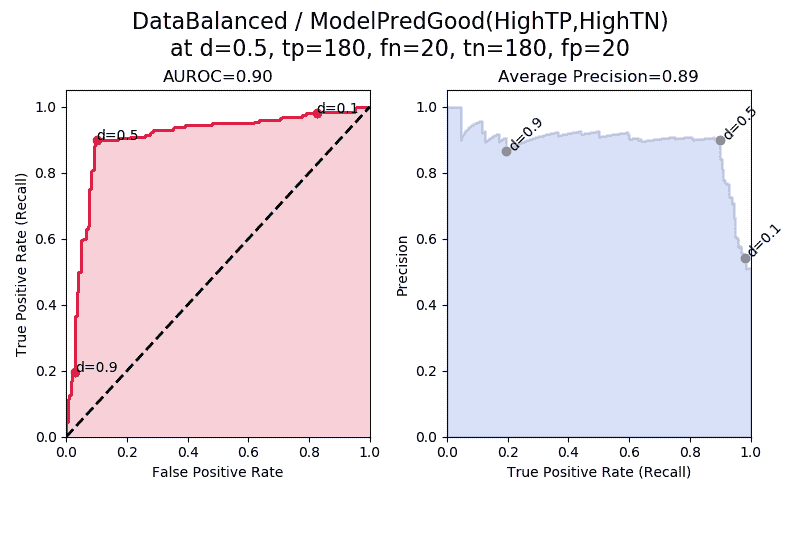
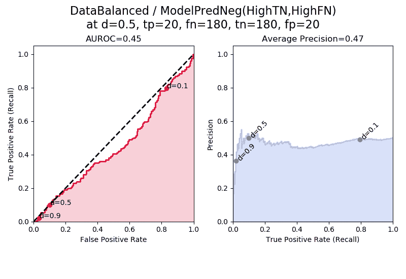
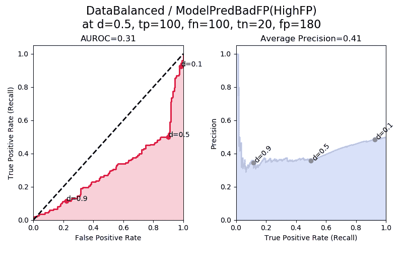
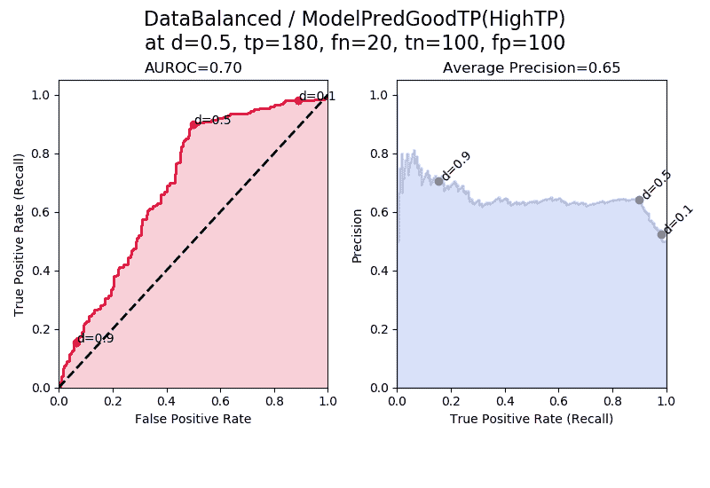
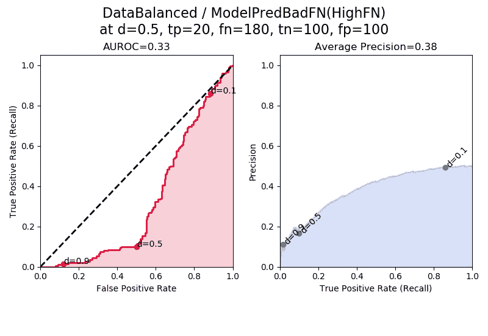

# AUC 和平均精度完全指南

> 原文：<https://towardsdatascience.com/the-complete-guide-to-auc-and-average-precision-cf1d4647efc3?source=collection_archive---------31----------------------->

## 模拟和可视化

这篇文章在网上提供了最清晰的解释，说明如何使用流行的指标 AUC (AUROC)和平均精度来理解分类器如何对平衡数据进行处理，下一篇文章将重点关注不平衡数据。这篇文章包括许多模拟和 AUROC/平均精度图，用于不同属性的分类器。在 [GitHub](https://github.com/rachellea/glassboxmedicine/tree/master/2020-07-14-AUROC-AP) 上提供了复制绘图和模拟的所有代码。

首先，简单介绍一下 AUROC 和平均精度:

# **AUROC:接收机工作特性下的面积**

AUROC 表明您的模型是否能够正确地对示例进行排序。AUROC 是随机选择的正面例子比随机选择的负面例子具有更高的正面预测概率的概率。AUROC 计算为测量不同决策阈值下真阳性率(TPR)和假阳性率(FPR)之间权衡的曲线下面积:

随机分类器(如抛硬币)的 AUROC 为 0.5，而完美分类器的 AUROC 为 1.0。更多关于 AUROC 的细节，请看[这篇文章](https://glassboxmedicine.com/2019/02/23/measuring-performance-auc-auroc/)。

# **平均精度(又名 AUPRC):精度-召回曲线下的面积**

平均精度表示您的模型是否能够正确识别所有的正例，而不会意外地将太多的负例标记为正例。因此，当您的模型能够正确处理正值时，平均精度较高。平均精度计算为曲线下的面积，用于衡量不同决策阈值下精度和召回率之间的权衡:

随机分类器(例如抛硬币)的平均精度等于该类中阳性样本的百分比，例如，如果该类中有 12%的阳性样本，则为 0.12。完美的分类器的平均精度为 1.0。关于平均精度的更多细节，见[本帖](https://glassboxmedicine.com/2019/03/02/measuring-performance-auprc/)。

# 模拟设置

在模拟中，我生成指示一系列示例的真实标签的基本真实向量(例如，[0，0，1]用于三个示例[负，负，正])，以及指示假设模型对该系列示例的预测的预测向量(例如，[0.1，0.25，0.99])。

我生成基本事实和预测，因此存在不同数量的真阳性、假阳性、真阴性和假阴性:

关于混淆矩阵的更详细的回顾，见本帖。

本文中的模拟模型结果是相对于假设的决策阈值 0.5 创建的。例如，为了从假设的决策阈值 0.5 创建真阳性，我对 0.5001 和 1.0 之间的预测值进行了统一采样，并将每个采样值的基本事实标记为 1。请注意，0.5 的决策阈值仅用于模拟地面实况和预测向量。AUROC 和平均精度是根据它们的定义，用滑动决策阈值计算的。

复制这篇文章中的结果和数字的所有代码可以在 [GitHub](https://github.com/rachellea/glassboxmedicine/tree/master/2020-07-14-AUROC-AP) 上找到。

# **平衡数据模拟**

让我们看看平衡数据集上的 AUROC 和平均精度的图，即实际阳性数和实际阴性数相等的数据集。

# **随机模式**

在上面的“模型平衡”图中，左边的图(红色)显示了接收器工作特性(ROC ),标题报告了 ROC 下的面积，或 AUROC，在本例中为 0.48。

右边的图(蓝色)显示了精密度-召回曲线，标题报告了使用平均精密度方法计算的精密度召回曲线下的面积(AUPRC)。

这里，AUROC 是 0.5 左右的基线，平均精度也是 0.5 左右的基线，因为阳性率是 0.50。由于模拟中涉及随机均匀采样，这些值并不精确为 0.500。“ModelBalanced”意味着模型不会偏向于做出积极或消极的预测，也不会偏向于做出正确的预测。换句话说，这是一个随机的、无用的模型，相当于抛硬币。

图标题下方的行报告了决策阈值为 0.5 (d=0.5)时的真阳性(tp)、假阴性(fn)、真阴性(tn)和假阳性(fp)的数量:“在 d=0.5 时，tp=100，fn = 100，tn = 100，fp = 100。”对于“决策阈值= 0.5”，该点也在曲线上绘制为标记为“d = 0.5”的点

此外，我在曲线上显示了决策阈值等于 0.9、0.5 和 0.1 的点。这些点被标记为 d = 0.9、d = 0.5 和 d = 0.1。我们可以看到，当我们从左向右扫描时，决策阈值从 1 到 0。曲线本身相对平滑，因为它们是使用许多决策阈值创建的；只有 3 个决策阈值明确显示为点，以强调曲线的特性。

# **糟糕的模型预测**

在“模型预测错误”中，模型倾向于做出错误的预测，即，它倾向于得到错误的答案，并且具有高的假阴性和高的假阳性。请注意，这里的 AUROC 和平均精度都低于基线。这说明了一个关于分类器的有趣事实——在实践中，如果你有一个“非常糟糕”的模型，那么你可以翻转分类决策，得到一个好的模型。如果我们翻转这里所有的分类决策，我们可以得到一个 1.0–0.11 = 0.89 AUROC 的模型。这就是为什么 AUROC 的基线总是 0.5；如果我们有一个 AUROC 低于 0.5 的分类器，我们翻转它的决定，得到一个 AUROC 在 0.5 和 1.0 之间的更好的分类器。

AUROC 和平均精度图中 d = 0.5 处的“肘”是由于模拟结果相对于 d = 0.5 的决策阈值的创建方式。

# **良好的模型预测**

在“模型预测好”中，我们有一个很好的模型，它产生了许多真正和真负。我们可以看到，AUROC 和平均精度都很高。

# **负偏态模型预测**

在“ModelPredNeg(higtn，HighFN)”中，我们有平衡的数据和一个偏向于预测负面的模型。虽然它总共预测了更多的否定，但它预测的真否定和假否定的数量是一样的。因为 tp == fp 和 tn == fn，所以 AUROC 和 average precision 再次接近它们的基线值 0.5，这意味着这是一个无用的模型。

我们可以通过考虑 TPR(真阳性率、召回率)、FPR(假阳性率)和精确度的公式来证实这一点。由于我们有 tp == fp，我们可以称这个值为 a，即 tp == fp == a .由于我们有 tn == fn，我们可以称这个值为 b，即 tn == fn == b .那么我们可以写成:

对于 AUROC: TPR = tp/(tp+fn) = a/(a+b)，FPR = fp/(fp+tn) = a/(a+b)。因此，TPR 和 FPR 总是彼此相等，这意味着 ROC 在 y = x 处是一条直线，这意味着 AUROC 是 0.5。

对于平均精度:precision = TP/(TP+FP)= a/(a+a)= 1/2，从之前的 TPR = recall = tp/(tp+fn) = a/(a+b)。因此，不管召回的值是多少，精度总是约为 1/2，因此我们得到 PR 曲线下的面积为 0.5。

# **正偏模型预测**

在“modelrepedpos(HighTP，HighFP)”中我们可以看到与在“modelrepedneg(HighTN，HighFN)”中看到的效果相同的效果。该模型偏向于预测阳性，但尽管它预测的阳性总数较大，但它预测的真阳性数与假阳性数相同，因此它是一个无用的模型，AUROC 和平均精度处于它们的基线值。

观察曲线上对应于 d = 0.9、0.5 和 0.1 的点也很有趣。这里，当模型倾向于预测阳性时，d=0.5 和 d=0.1 的点被挤得更近。紧接着上面，在“数据平衡/模型预测负”中，我们将 d=0.5 压缩到更接近 d=0.9。

# **良好的模型预测:高 TNs**

在“modelrepedgoodtn(HighTN)”中，该模型尤其擅长识别真正的否定。这产生了优于随机的 AUROC 和优于随机的平均精度。

在 ROC 图(红色)中，我们看到决策阈值 d = 0.9 至 d = 0.5 跨越了 FPR = fp/(fp+tn)的一个小区间。这是因为对于这些高决策阈值，fps 特别低，而 tns 特别高，这产生了小的 FPR。

请注意，平均精度不会因为真阴性的数量而明显提高，因为真阴性不会用于平均精度的计算。平均精度由于假阳性的减少而提高，因为一些例子从假阳性转变为真阴性，这是为了保持数据集平衡的假设所需要的。精度= tp/(tp+fp)，所以当我们让 fp 变小的时候，我们就提高了精度。此外，当判定阈值最高时(图的左侧)，精度往往最高，因为判定阈值越高，标记为正的要求就越严格，这通常会增加 tps 并降低 fps。

# **坏模型预测:高 FPs**

在“modelrepedbadfp(HighFP)”中，模型产生了大量的误报。再一次，因为这个模型是“战略上糟糕的”,我们可以通过翻转它的分类决策得到一个好的模型。如果我们翻转它的分类决策，那么 FPs 将变成 TNs，我们将有一个偏向于预测 TNs 的模型——上面“modelrepedgoodtn(HighTN)”中显示的确切模型。

# **良好的模型预测:高 TPs**

这是我们倒数第二个数字。在“modelrepedgoodtp(HighTP)”中，模型产生了许多真阳性。这导致优于随机的 AUROC 和优于随机的平均精度。

注意这个 ROC 曲线是如何更接近顶部的，而在“modelrepedgoodtn(HighTN)”中，ROC 曲线是如何更接近底部的。这里的 ROC 更接近顶部，因为 TPR=tp/(tp+fn)的小范围被较低的决策阈值 d = 0.5 到 d = 0.1 所覆盖。这是因为当决策阈值较低时，在这种 tp 偏向模型中，我们最终会得到大量 TP 和少量 fn，从而在这些不同的较低决策阈值之间产生高召回率。在 d = 0.5 处出现“肘形”是因为合成结果是相对于 0.5 的决策阈值而生成的。

# **坏模型预测:高 FNs**

这是最后的情节。“modelrepedbadfn(high fn)”显示产生大量假阴性的模型的图。如果我们翻转这个坏模型的分类决策，所有的 fn 将变成 TP，我们将得到上面显示为“modelrepedgoodtp(HighTP)”的好模型。

# **总结**

*   ROC 是跨不同决策阈值的 TPR 对 FPR 的图。奥罗克是中华民国管辖的地区。AUROC 表示随机选择的正面例子比随机选择的负面例子具有更高的正面预测概率的概率。
*   AUROC 的范围从 0.5(随机模型)到 1.0(完美模型)。请注意，如果模型“非常糟糕”,则有可能计算出小于 0.5 的 AUROC，但在这些情况下，我们可以翻转模型的决策，得到 AUROC 大于 0.5 的好模型。
*   PR 曲线是跨不同决策阈值的精确度与召回率(TPR)的曲线图。平均精度是计算 PR 曲线下面积的一种方法。平均精度表示您的模型是否能够正确识别所有的正例，而不会意外地将太多的负例标记为正例。
*   平均精度范围从正例的频率(平衡数据为 0.5)到 1.0(完美模型)。
*   如果模型做出“平衡”的预测，不倾向于错误或正确，那么我们有一个随机模型，其平均精度为 0.5 AUROC 和 0.5(阳性频率= 0.5)。这由“ModelBalanced”、“ModelPredNeg”(预测许多负面，但同样预测 TNs 和 FNs)、“ModelPredPos”(预测许多正面，但同样预测 TPs 和 FPs)来例证。
*   如果一个模型“非常糟糕”，这意味着它倾向于选择错误的答案。“内行坏”的模型有“modelrepedbad(HighFP，HighFN)”、“modelrepedbadfn(HighFN)”和“modelrepedbadfp(HighFP)”。这些模型非常善于挑选错误的答案，以至于通过翻转它们的决定，它们可以变成有用的模型。
*   “ModelPredGood(HighTP，HighTN)”获得最佳性能，因为它标识了许多 TP 和 TN。“ModelPredGoodTN(HighTN)”和“ModelPredGoodTP(HighTP)”也获得了比随机更好的性能，因为它们倾向于选择正确的答案。

*原载于 2020 年 7 月 14 日*[*【http://glassboxmedicine.com】*](https://glassboxmedicine.com/2020/07/14/the-complete-guide-to-auc-and-average-precision-simulations-and-visualizations/)*。*