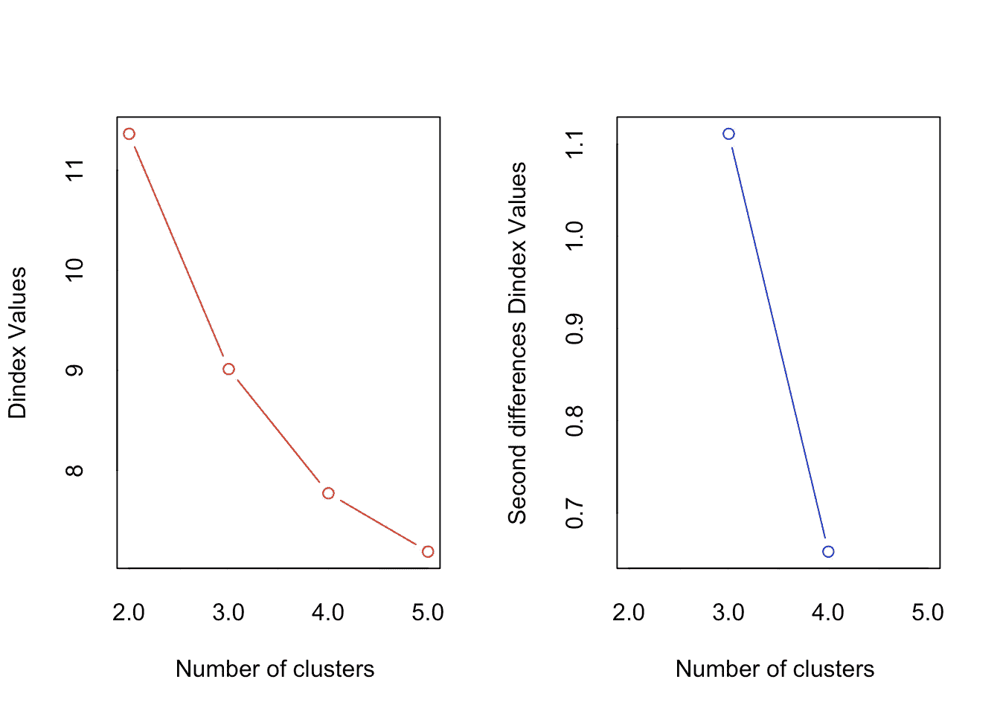
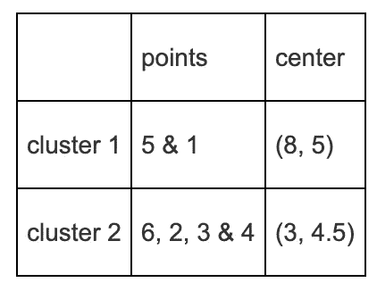
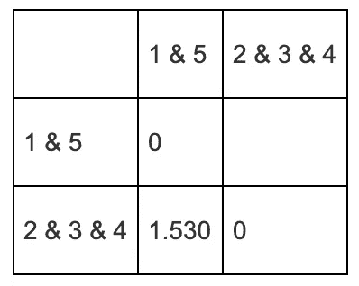

# 聚类分析完全指南

> 原文：<https://towardsdatascience.com/the-complete-guide-to-clustering-analysis-10fe13712787?source=collection_archive---------3----------------------->

## 手动和 R 中的 k-means 和层次聚类


照片由[尼古拉·约翰尼·米尔科维奇](https://unsplash.com/@thejohnnyme?utm_source=medium&utm_medium=referral)

# 什么是聚类分析？

C 聚类分析是探索性数据分析的一种形式，在这种分析中，观察结果被分成具有共同特征的不同组。

聚类分析(也称为分类)的目的是构建组(或类或*聚类*，同时确保以下性质:**在一个组**内，观察值必须尽可能**相似**，而属于**不同组**的观察值必须尽可能**不同**。

有两种主要的分类类型:

1.  *k*-表示聚类
2.  分层聚类

第一种通常在**类的数量预先固定**时使用，而第二种通常用于**未知数量的类**并帮助确定该最佳数量。下面通过手工应用和 r 中的应用说明了这两种方法。注意，对于层次聚类，本文中只介绍了*升序*分类。

聚类算法使用**距离**来将观察结果分成不同的组。因此，在开始介绍这两种分类方法之前，先介绍一下如何计算点之间的距离。

# 应用 1:计算距离

设一个包含点 **a** = (0，0)′、 **b** = (1，0)′、以及 **c** = (5，5)′的数据集。手动计算点与点之间的欧氏距离矩阵。

# 解决办法

要点如下:

```
# We create the points in R
a <- c(0, 0)
b <- c(1, 0)
c <- c(5, 5)X <- rbind(a, b, c) # a, b and c are combined per row
colnames(X) <- c("x", "y") # rename columnsX # display the points##   x y
## a 0 0
## b 1 0
## c 5 5
```

通过勾股定理，我们将记住两点之间的距离


由给出


例如，对于上面陈述中给出的点 **b** = (1，0)’和 **c** = (5，5)’之间的距离，我们有:


我们可以对所有的点对进行类似的手动查找距离矩阵。在 R 中，`dist()`函数允许您以非常简单的方式找到矩阵或数据帧中各点的距离:

```
# The distance is found using the dist() function:
distance <- dist(X, method = "euclidean")
distance # display the distance matrix##          a        b
## b 1.000000         
## c 7.071068 6.403124
```

注意，参数`method = "euclidean"`不是强制的，因为欧几里德方法是默认的。

由`dist()`函数产生的距离矩阵给出了不同点之间的距离。点 b 和 c 之间的欧几里得距离是 6.403124，这与我们上面通过毕达哥拉斯公式得到的结果相对应。

**注意**:如果两个变量没有相同的单位，在计算欧几里得距离时，一个变量可能比另一个变量具有更大的权重。在这种情况下，最好对数据进行缩放。缩放数据允许获得独立于其单位的变量，这可以通过`[scale()](https://www.statsandr.com/blog/data-manipulation-in-r/#scale)`函数完成。

现在距离已经给出，让我们看看如何用 k-means 算法执行聚类分析。

# k 均值聚类

第一种分类形式是称为 *k 均值聚类*或移动中心算法的方法。作为提醒，该方法旨在将 n 个观察值划分为 k 个聚类，其中每个观察值属于具有最接近平均值的聚类，作为该聚类的原型。

下面通过一个 R 语言的应用程序手工展示。

# 应用 2: k 均值聚类

# 数据

在这个练习中，使用了可用的`Eurojobs.csv`数据库[这里](https://www.statsandr.com/blog/data/Eurojobs.csv)。

该数据库包含了 1979 年 26 个欧洲国家不同行业的就业人口百分比。它包含 10 个变量:

*   `Country` -国家的名称(标识符)
*   `Agr` - %的劳动力从事农业
*   `Min` - %在采
*   `Man` - %在制造业
*   `PS` - %在电源行业
*   `Con` - %在建
*   `SI` -服务业中的%
*   `Fin` - %在金融
*   `SPS` - %从事社会和个人服务
*   `TC` - %在交通和通信业

我们首先导入数据集。如果您需要提醒，请参见[如何将数据导入 R](https://www.statsandr.com/blog/how-to-import-an-excel-file-in-rstudio) 。

```
# Import data
Eurojobs <- read.csv(
  file = "data/Eurojobs.csv",
  sep = ",", dec = ".", header = TRUE
)
head(Eurojobs) # head() is used to display only the first 6 observations##      Country  Agr Min  Man  PS  Con   SI Fin  SPS  TC
## 1    Belgium  3.3 0.9 27.6 0.9  8.2 19.1 6.2 26.6 7.2
## 2    Denmark  9.2 0.1 21.8 0.6  8.3 14.6 6.5 32.2 7.1
## 3     France 10.8 0.8 27.5 0.9  8.9 16.8 6.0 22.6 5.7
## 4 W. Germany  6.7 1.3 35.8 0.9  7.3 14.4 5.0 22.3 6.1
## 5    Ireland 23.2 1.0 20.7 1.3  7.5 16.8 2.8 20.8 6.1
## 6      Italy 15.9 0.6 27.6 0.5 10.0 18.1 1.6 20.1 5.7
```

注意，在第一个变量`Country`之前有一个编号。为了更清楚起见，我们将用国家来代替这个编号。为此，我们在导入函数`read.csv()`中添加参数`row.names = 1`，以指定第一列对应于行名:

```
Eurojobs <- read.csv(
  file = "data/Eurojobs.csv",
  sep = ",", dec = ".", header = TRUE, row.names = 1
)
Eurojobs # displays dataset##                 Agr Min  Man  PS  Con   SI  Fin  SPS  TC
## Belgium         3.3 0.9 27.6 0.9  8.2 19.1  6.2 26.6 7.2
## Denmark         9.2 0.1 21.8 0.6  8.3 14.6  6.5 32.2 7.1
## France         10.8 0.8 27.5 0.9  8.9 16.8  6.0 22.6 5.7
## W. Germany      6.7 1.3 35.8 0.9  7.3 14.4  5.0 22.3 6.1
## Ireland        23.2 1.0 20.7 1.3  7.5 16.8  2.8 20.8 6.1
## Italy          15.9 0.6 27.6 0.5 10.0 18.1  1.6 20.1 5.7
## Luxembourg      7.7 3.1 30.8 0.8  9.2 18.5  4.6 19.2 6.2
## Netherlands     6.3 0.1 22.5 1.0  9.9 18.0  6.8 28.5 6.8
## United Kingdom  2.7 1.4 30.2 1.4  6.9 16.9  5.7 28.3 6.4
## Austria        12.7 1.1 30.2 1.4  9.0 16.8  4.9 16.8 7.0
## Finland        13.0 0.4 25.9 1.3  7.4 14.7  5.5 24.3 7.6
## Greece         41.4 0.6 17.6 0.6  8.1 11.5  2.4 11.0 6.7
## Norway          9.0 0.5 22.4 0.8  8.6 16.9  4.7 27.6 9.4
## Portugal       27.8 0.3 24.5 0.6  8.4 13.3  2.7 16.7 5.7
## Spain          22.9 0.8 28.5 0.7 11.5  9.7  8.5 11.8 5.5
## Sweden          6.1 0.4 25.9 0.8  7.2 14.4  6.0 32.4 6.8
## Switzerland     7.7 0.2 37.8 0.8  9.5 17.5  5.3 15.4 5.7
## Turkey         66.8 0.7  7.9 0.1  2.8  5.2  1.1 11.9 3.2
## Bulgaria       23.6 1.9 32.3 0.6  7.9  8.0  0.7 18.2 6.7
## Czechoslovakia 16.5 2.9 35.5 1.2  8.7  9.2  0.9 17.9 7.0
## E. Germany      4.2 2.9 41.2 1.3  7.6 11.2  1.2 22.1 8.4
## Hungary        21.7 3.1 29.6 1.9  8.2  9.4  0.9 17.2 8.0
## Poland         31.1 2.5 25.7 0.9  8.4  7.5  0.9 16.1 6.9
## Rumania        34.7 2.1 30.1 0.6  8.7  5.9  1.3 11.7 5.0
## USSR           23.7 1.4 25.8 0.6  9.2  6.1  0.5 23.6 9.3
## Yugoslavia     48.7 1.5 16.8 1.1  4.9  6.4 11.3  5.3 4.0dim(Eurojobs) # displays the number of rows and columns## [1] 26  9
```

我们现在有一个“干净”的数据集，包含 26 个观察值和 9 个定量连续变量，我们可以在此基础上进行分类。请注意，在这种情况下，没有必要将数据标准化，因为它们都以相同的单位(百分比)表示。如果不是这样，我们将不得不通过`scale()`函数标准化数据(不要忘记，否则您的结果可能完全不同！).

所谓的*k*-意味着通过`kmeans()`函数进行聚类，自变量`centers`对应于所需的聚类数。在下文中，我们以 2 个类别和 3 个类别为例应用分类。

# `kmeans()`同 2 组

```
model <- kmeans(Eurojobs, centers = 2)# displays the class determined by
# the model for all observations:
print(model$cluster)##        Belgium        Denmark         France     W. Germany        Ireland 
##              1              1              1              1              2 
##          Italy     Luxembourg    Netherlands United Kingdom        Austria 
##              1              1              1              1              1 
##        Finland         Greece         Norway       Portugal          Spain 
##              1              2              1              2              2 
##         Sweden    Switzerland         Turkey       Bulgaria Czechoslovakia 
##              1              1              2              2              1 
##     E. Germany        Hungary         Poland        Rumania           USSR 
##              1              2              2              2              2 
##     Yugoslavia 
##              2
```

注意，参数`centers = 2`用于设置预先确定的集群数量。在本练习中，集群的数量是任意确定的。应该根据您的分析的背景和目标，或者根据本[部分](https://www.statsandr.com/blog/clustering-analysis-k-means-and-hierarchical-clustering-by-hand-and-in-r/#optimal-number-of-clusters)中解释的方法来确定集群的数量。叫`print(model$cluster)`还是`model$cluster`都一样。该输出指定了每个国家所属的组(即 1 或 2)。

每个观察值的聚类可以作为列直接存储在数据集中:

```
Eurojobs_cluster <- data.frame(Eurojobs,
                               cluster = as.factor(model$cluster))
head(Eurojobs_cluster)##             Agr Min  Man  PS  Con   SI Fin  SPS  TC cluster
## Belgium     3.3 0.9 27.6 0.9  8.2 19.1 6.2 26.6 7.2       1
## Denmark     9.2 0.1 21.8 0.6  8.3 14.6 6.5 32.2 7.1       1
## France     10.8 0.8 27.5 0.9  8.9 16.8 6.0 22.6 5.7       1
## W. Germany  6.7 1.3 35.8 0.9  7.3 14.4 5.0 22.3 6.1       1
## Ireland    23.2 1.0 20.7 1.3  7.5 16.8 2.8 20.8 6.1       2
## Italy      15.9 0.6 27.6 0.5 10.0 18.1 1.6 20.1 5.7       1
```

# k-均值划分的质量

通过使用以下公式计算分区“解释”的 *TSS* 的百分比，可以发现 *k* 均值分区的质量:


其中 *BSS* 和 *TSS* 分别代表和*平方和*之间的*。百分比越高，分数越好(因此质量也越好),因为这意味着 *BSS* 大和/或 *WSS* 小。*

下面是如何检查 R 中分区的质量:

```
# BSS and TSS are extracted from the model and stored
(BSS <- model$betweenss)## [1] 4823.535(TSS <- model$totss)## [1] 9299.59# We calculate the quality of the partition
BSS / TSS * 100## [1] 51.86826
```

分区质量为 51.87%。这个值没有真正的绝对解释，除了更高的质量意味着更高的解释百分比。但是和其他分区的质量比起来就更有见地了(集群数量相同！)以便在所考虑的分区中确定最佳分区。

# `nstart`对于多个初始中心和更好的稳定性

*k* -means 算法使用一组随机的初始点来达到最终的分类。由于初始中心是随机选择的，相同的命令`kmeans(Eurojobs, centers = 2)`每次运行时可能会给出不同的结果，因此分区的质量会略有不同。`kmeans()`函数中的`nstart`参数允许使用不同的初始中心运行该算法几次，以获得潜在的更好的分割:

```
model2 <- kmeans(Eurojobs, centers = 2, nstart = 10)
100 * model2$betweenss / model2$totss## [1] 54.2503
```

根据最初的随机选择，这个新分区会比第一个更好或更差。在我们的示例中，随着质量增加到 54.25%，分区变得更好。

关于 *k* -means 经常引用的一个主要限制是结果的稳定性。由于初始中心是随机选择的，运行相同的命令可能会产生不同的结果。在`kmeans()`函数中添加`nstart`参数限制了这个问题，因为它将生成几个不同的初始化，并采取最佳的一个，从而导致分类的更好的稳定性。

# `kmeans()`同 3 组

我们现在使用 3 个聚类执行 *k* 均值分类，并计算其质量:

```
model3 <- kmeans(Eurojobs, centers = 3)
BSS3 <- model3$betweenss
TSS3 <- model3$totss
BSS3 / TSS3 * 100## [1] 74.59455
```

可以看出，分成三组的分类允许更高的解释百分比和更高的质量。情况总是这样:类越多，划分就越精细，BSS 的贡献就越大。另一方面，“模型”会更复杂，需要更多的类。在极端情况下 *k = n* (每个观察都是单例类)，我们有 *BSS = TSS* ，但是分区已经失去了所有的兴趣。

# 最佳聚类数

为了找到一个 *k* 均值的最佳聚类数，建议根据以下条件进行选择:

*   手头问题的背景，例如，如果您知道您的数据中有特定数量的组(这是一个主观选项)，或者
*   以下四种方法:

1.  肘方法(使用组内平方和)
2.  平均轮廓法
3.  差距统计法
4.  `NbClust()`功能

我们在下面展示了这 4 种方法的 R 代码，更多的理论信息可以在[这里](https://www.datanovia.com/en/lessons/determining-the-optimal-number-of-clusters-3-must-know-methods/)找到。

## 肘法

肘方法将总的类内平方和(WSS)视为类数量的函数。

```
# load required packages
library(factoextra)
library(NbClust)# Elbow method
fviz_nbclust(Eurojobs, kmeans, method = "wss") +
  geom_vline(xintercept = 4, linetype = 2) + # add line for better visualisation
  labs(subtitle = "Elbow method") # add subtitle
```


图中拐点的位置通常被认为是适当聚类数的指示，因为这意味着添加另一个聚类并不能更好地改善分区。这种方法似乎暗示了 4 个集群。

肘法有时是不明确的，一个替代方法是平均剪影法。

## 剪影法

剪影方法测量聚类的质量，并确定每个点在聚类中的位置。

```
# Silhouette method
fviz_nbclust(Eurojobs, kmeans, method = "silhouette") +
  labs(subtitle = "Silhouette method")
```


剪影法建议 2 组。

## 差距统计法

```
# Gap statistic
set.seed(42)
fviz_nbclust(Eurojobs, kmeans,
  nstart = 25,
  method = "gap_stat",
  nboot = 500
) + # reduce it for lower computation time (but less precise results)
  labs(subtitle = "Gap statistic method")
```


聚类的最佳数量是使间隙统计最大化的数量。该方法仅建议 1 个聚类(因此是无用的聚类)。

正如你所看到的，这三种方法不一定导致相同的结果。这里，所有 3 种方法都建议使用不同数量的集群。

## `NbClust()`

第四种选择是使用`NbClust()`函数，它提供了 30 个指数来选择最佳的集群数量。

```
nbclust_out <- NbClust(
  data = Eurojobs,
  distance = "euclidean",
  min.nc = 2, # minimum number of clusters
  max.nc = 5, # maximum number of clusters
  method = "kmeans"
) # one of: "ward.D", "ward.D2", "single", "complete", "average", "mcquitty", "median", "centroid", "kmeans"
```


```
## *** : The Hubert index is a graphical method of determining the number of clusters.
##                 In the plot of Hubert index, we seek a significant knee that corresponds to a 
##                 significant increase of the value of the measure i.e the significant peak in Hubert
##                 index second differences plot. 
##
```



```
## *** : The D index is a graphical method of determining the number of clusters. 
##                 In the plot of D index, we seek a significant knee (the significant peak in Dindex
##                 second differences plot) that corresponds to a significant increase of the value of
##                 the measure. 
##  
## ******************************************************************* 
## * Among all indices:                                                
## * 5 proposed 2 as the best number of clusters 
## * 16 proposed 3 as the best number of clusters 
## * 2 proposed 5 as the best number of clusters 
## 
##                    ***** Conclusion *****                            
##  
## * According to the majority rule, the best number of clusters is  3 
##  
##  
## *******************************************************************# create a dataframe of the optimal number of clusters
nbclust_plot <- data.frame(clusters = nbclust_out$Best.nc[1, ])
# select only indices which select between 2 and 5 clusters
nbclust_plot <- subset(nbclust_plot, clusters >= 2 & clusters <= 5)# create plot
ggplot(nbclust_plot) +
  aes(x = clusters) +
  geom_histogram(bins = 30L, fill = "#0c4c8a") +
  labs(x = "Number of clusters", y = "Frequency among all indices", title = "Optimal number of clusters") +
  theme_minimal()
```


基于所有 30 个指标，最佳的聚类数是 3 个聚类。

(参见文章《[R 中的图形与 ggplot2](https://www.statsandr.com/blog/graphics-in-r-with-ggplot2/) 》了解如何在`{ggplot2}`中创建这种剧情)。

# 形象化

为了确认您的类数确实是最佳的，有一种方法可以通过剪影图(在 *y* 轴上显示剪影系数)来评估您的聚类质量。

我们绘制了两个集群的轮廓图，如平均轮廓法所建议的:

```
library(cluster)set.seed(42)
km_res <- kmeans(Eurojobs, centers = 2, nstart = 20)sil <- silhouette(km_res$cluster, dist(Eurojobs))
fviz_silhouette(sil)##   cluster size ave.sil.width
## 1       1    5          0.33
## 2       2   21          0.54
```


提醒一下，剪影系数的解释如下:

*   > 0 表示观察值分组良好。系数越接近 1，观察值分组越好。
*   < 0 表示观察值被放置在错误的聚类中。
*   = 0 表示观察值在两个聚类之间。

上面的侧影图和平均侧影系数有助于确定你的聚类是否良好。如果大部分轮廓系数是正的，则表明观察值被放置在正确的组中。因此，该轮廓图可用于选择最佳类别数。

也可以使用`fviz_cluster()`功能绘制聚类图。注意，执行主成分分析来表示二维平面中的变量。

```
library(factoextra)fviz_cluster(km_res, Eurojobs, ellipse.type = "norm")
```


既然在 R 中已经详细描述了 k()均值聚类，那么在接下来的章节中就来看看如何手工实现这个算法。

# R 中的手动应用和验证

以 *k* = 2，点 *i* = 5 和 *i* = 6 为初始中心，手动执行下图所示点的 *k* 均值算法。计算你刚刚找到的分区的质量，然后**检查**你在 R 中的答案**。**

*假设变量具有相同的单位，因此无需缩放数据。*


## 手工解决方案

第一步。这是 6 个点的坐标:


最初的中心是:

*   第 1 组:带中心的点 5*(9，7)*
*   第二组:带中心的点 6*(6，8)*

第二步。用勾股定理逐点计算距离矩阵。提醒点 *a* 和点 *b* 之间的距离由下式得出:


我们将该定理应用于每一对点，最终得到以下距离矩阵(四舍五入到两位小数):

```
round(dist(X), 2)##       1     2     3     4     5
## 2  3.61                        
## 3  5.10  2.24                  
## 4  7.28  5.66  3.61            
## 5  4.47  5.39  7.62 10.82      
## 6  5.10  3.61  5.66  9.22  3.16
```

第三步。基于步骤 2 中计算的距离矩阵，我们可以将每个点放入其最近的组中，并计算中心的坐标。

我们首先将每个点放在其最近的组中:

*   点 1 比点 6 更靠近点 5，因为点 1 和 5 之间的距离是 4.47，而点 1 和 6 之间的距离是 5.10
*   点 2 比点 5 更靠近点 6，因为点 2 和点 5 之间的距离是 5.39，而点 2 和点 6 之间的距离是 3.61
*   点 3 比点 5 更靠近点 6，因为点 3 和点 5 之间的距离是 7.62，而点 3 和点 6 之间的距离是 5.66
*   点 4 比点 5 更靠近点 6，因为点 4 和点 5 之间的距离是 10.82，而点 4 和点 6 之间的距离是 9.22

注意，计算每个点与点 5 和 6 之间的距离就足够了。例如，当我们将每个点与初始中心(即点 5 和 6)进行比较时，不需要计算点 1 和 2 之间的距离。

然后，我们通过取坐标 *x* 和 *y* 的平均值来计算两组中心的坐标:

*   组 1 包括以 *(8，5)* 为中心的点 5 和 1:8 =(9+7)/2 和 5 = (7 + 3) / 2
*   第二组包括以 *(3，4.5)* 为中心的点 6、2、3、4:3 =(6+4+2+0)/4 和 4.5 = (8 + 5 + 4 + 1) / 4

因此，我们有:



第四步。我们通过检查每个点是否在最近的聚类中来确保分配是最优的。由于毕达哥拉斯定理，一个点和一个簇的中心之间的距离再次被计算。因此，我们有:


点和两个聚类之间的最小距离用绿色表示。

我们检查每个点是否在正确的组中(即最近的聚类)。根据上表中的距离，点 6 似乎比聚类 2 更靠近聚类 1。因此，分配不是最佳的，点 6 应该被重新分配给簇 1。

第五步。在这种重新分配之后，我们再次计算聚类的中心。通过取属于群集的点的坐标 *x* 和 *y* 的平均值来找到中心。因此，我们有:


例如，3.33 就是(5 + 4 + 1) / 3。

第六步。重复步骤 4，直到分配达到最佳。如果分配是最优的，则算法停止。在我们的示例中，我们有:


所有点都被正确地分配到其最近的聚类，因此分配是最优的，并且算法停止。

第七步。陈述最终分区和中心。在我们的例子中:


现在我们有了聚类和最终中心，我们计算刚刚找到的分区的质量。记住，我们需要计算 BSS 和 TSS 来确定质量。下面的步骤通过 *k* 来计算这个分区的质量——意思是，基于这个汇总表:


第一步。计算 *x* 和 *y* 坐标的总平均值:


第二步。计算 TSS 和 WSS:


关于 WSS，它分为群组 1 和群组 2。对于群组 1:


对于群组 2:


总 WSS 是

WSS = WSS[1]+WSS[2]= 18.67+16.67 = 35.34

要找到 BSS:

BSS = TSS WSS = 88.67 35.34 = 53.33

最后，分区的质量是:


所以分区质量是 60.14%。

我们现在将在 r 中验证所有这些解决方案(分区、最终中心和质量)。

## R 中的溶液

可以想象，R us 中的解决方案要短得多，并且在用户端需要的计算也少得多。我们首先需要以矩阵或数据框的形式输入数据:

```
X <- matrix(c(7, 3, 4, 5, 2, 4, 0, 1, 9, 7, 6, 8),
  nrow = 6, byrow = TRUE
)
X # display the coordinates of the points##      [,1] [,2]
## [1,]    7    3
## [2,]    4    5
## [3,]    2    4
## [4,]    0    1
## [5,]    9    7
## [6,]    6    8
```

我们现在通过以点 5 和点 6 为初始中心的`kmeans()`功能执行 *k* 均值:

```
# take rows 5 and 6 of the X matrix as initial centers
res.k <- kmeans(X, centers = X[c(5, 6), ],
                algorithm = "Lloyd")
```

与前面的数据集`Eurojobs.csv`应用不同，其中初始中心由 R 随机选择，在第二个应用中，我们希望指定哪些点将成为两个初始中心。为此，我们需要设置`centers = X[c(5,6), ]`来指示有 2 个中心，它们将是点 5 和 6(如果需要，参见[如何子集化数据帧](https://www.statsandr.com/blog/data-manipulation-in-r)的提示)。

增加参数`algorithm = "Lloyd"`的原因可以在 R 函数`kmeans()`的用法中找到。事实上， *k* -means 算法有几种变体。默认选择是 Hartigan 和 Wong (1979)的版本，它比手动解决方案中详述的基本版本更复杂。通过使用 Lloyd (1982)的原始版本，我们在 R 和手工中找到了相同的解决方案。要了解更多信息，您可以查阅`kmeans()`功能的文档(通过`?kmeans`或`help(kmeans)`)并阅读提到的文章。

然后通过提取找到 R 中的解

*   带`$cluster`的隔断:

```
res.k$cluster## [1] 1 2 2 2 1 1
```

点 1、5 和 6 属于聚类 1，点 2、3 和 4 属于聚类 2。

*   最终中心点的坐标用`$centers`:

```
# We extract the coordinates of the 2 final centers, rounded to 2 decimals
round(res.k$centers, digits = 2)##   [,1] [,2]
## 1 7.33 6.00
## 2 2.00 3.33
```

*   然后通过将 BSS 划分为 TSS 来确定划分的质量:

```
res.k$betweenss / res.k$totss## [1] 0.6015038
```

3 个结果与我们手动发现的结果相同(除了由于四舍五入导致的质量略有不同)。

# 分层聚类

提醒一下，与用 *k* -means 划分的区别在于，对于层次聚类，类的数量是**而不是事先指定的**。分层聚类将有助于确定最佳聚类数。

在手工和在 R 中应用层次聚类之前，让我们一步一步地看看它是如何工作的:

1.  它首先将每个点放在自己的簇中，所以每个簇都是单个的
2.  然后，它会根据距离矩阵中的距离合并彼此最接近的两个点。结果是少了一个集群
3.  然后，它重新计算新旧聚类之间的距离，并将它们保存在新的距离矩阵中，该矩阵将在下一步中使用
4.  最后，重复步骤 1 和 2，直到所有聚类合并成包括所有点的单个聚类。

有 5 种主要方法来测量集群之间的距离，称为链接方法:

1.  单一链接:在合并簇之前计算它们之间的最小距离。
2.  完全链接:在合并簇之前计算它们之间的最大距离。
3.  平均链接:在合并聚类之前计算它们之间的平均距离。
4.  质心链接:计算两个簇的质心，然后在合并它们之前计算两者之间的距离。
5.  Ward(最小方差)准则:最小化总的类内方差，并找到合并后导致总的类内方差最小增加的那对类。

在下面的章节中，只介绍了前三种连接方法(首先是手动连接，然后在 R 中验证结果)。

# 应用 3:层次聚类

# 数据

使用图表和下表中的数据，手动执行**3 种算法(单一、完全和平均连接)并绘制树状图。然后**检查**你的答案**在 R** 。**


```
##      V1    V2
## 1  2.03  0.06
## 2 -0.64 -0.10
## 3 -0.42 -0.53
## 4 -0.36  0.07
## 5  1.14  0.37
```

# 手工解决方案

第一步。对于所有 3 种算法，我们首先需要根据勾股定理计算 5 个点之间的距离矩阵。提醒点 *a* 和点 *b* 之间的距离由下式得出:


我们将该定理应用于每一对点，最终得到以下距离矩阵(四舍五入到三位小数):

```
##       1     2     3     4
## 2 2.675                  
## 3 2.520 0.483            
## 4 2.390 0.328 0.603      
## 5 0.942 1.841 1.801 1.530
```

## 单键

第二步。从步骤 1 中计算的距离矩阵中，我们看到点 2 和 4 之间的最小距离**= 0.328。0.328 对应于第一个高度(稍后在绘制树状图时会详细介绍)。因为点 2 和点 4 彼此最接近，所以这两个点放在一起形成一个组。这些组是:1，2 & 4，3 和 5。组 2 & 4 和所有其他点之间的新距离现在为:**


要构建这个新的距离矩阵，请逐点进行:

*   点 1 和 3 之间的距离没有改变，因此与初始距离矩阵(在步骤 1 中找到)相比，距离没有改变，初始距离矩阵为 2.520
*   点 1 和 5 以及点 3 和 5 之间的距离也是如此；距离与初始距离矩阵中的距离相同，因为点没有改变
*   由于点 2 和点 4 现在在一起，点 1 和点 2 和点 4 之间的距离已经改变
*   由于我们应用了**单连杆**标准，点 1 和 2 & 4 之间的新距离对应于点 1 和 2 之间的距离以及点 1 和 4 之间的距离的最小距离
*   **点 1 和 2 之间的初始距离是 2.675，点 1 和 4 之间的初始距离是 2.390**
*   **因此，这两个距离之间的最小距离是 2.390**
*   **因此，2.390 是点 1 和 2 & 4 之间的新距离**
*   **我们对点 3 和 2 & 4 应用相同的过程:点 3 和 2 之间的初始距离是 0.483，点 3 和 4 之间的初始距离是 0.603。这两个距离之间的最小距离是 0.483，因此点 3 和 2 & 4 之间的新距离是 0.483**
*   **对所有其他点遵循相同的过程**

**第三步。基于步骤 2 中的距离矩阵，点 3 和 2 & 4 之间的最小距离是 0.483(树状图的第二个高度)。因为点 3 和 2 & 4 彼此最接近，所以它们被组合形成一个新组，组 2 & 3 & 4。因此，分组是:1、2、3、4 和 5。我们基于步骤 2 中详述的相同过程来构建新的距离矩阵:**

****

*   **点 1 和点 5 没有改变，因此这两点之间的距离与上一步中的相同**
*   **从步骤 2 中，我们看到点 1 和 2 & 4 之间的距离是 2.390，点 1 和 3 之间的距离是 2.520**
*   **因为我们应用了单一链接标准，所以我们采用最小距离，即 2.390**
*   **因此，点 1 和 2 & 3 & 4 之间的距离为 2.390**
*   **第 5 点和第 2 点以及第 3 点和第 4 点的过程相同**

**第四步。基于步骤 3 中的距离矩阵，点 1 和 5 之间的最小距离是 0.942(树状图中的第三个高度)。因为点 1 和点 5 彼此最接近，所以它们被组合形成一个新的组，组 1 & 5。因此，分组是:1 & 5 组和 2 & 3 & 4 组。我们基于步骤 2 和 3 中详述的相同过程来构建新的距离矩阵:**

****

*   **唯一需要计算的距离是点 1 & 5 和 2 & 3 & 4 之间的距离**
*   **从上一步我们看到，点 1 和 2 & 3 & 4 之间的距离是 2.390，点 5 和 2 & 3 & 4 之间的距离是 1.530**
*   **因为我们应用了单一链接标准，所以我们采用最小距离，即 1.530**
*   **因此，点 1 & 5 和 2 & 3 & 4 之间的距离为 1.530**

**第五步。点的最终组合是点 1 & 5 和点 2 & 3 & 4 的组合，最终高度为 1.530。在第六步也是最后一步，高度被用来绘制树状图。**

**第六步。由于上面找到的点和高度的结合，画出了树状图。请记住:**

*   **第一个点组合位于点 2 和点 4 之间，高度为 0.328**
*   **第二个组合在点 3 和 2 & 4 之间，高度为 0.483**
*   **第三个组合位于点 1 和点 5 之间，高度为 0.942**
*   **最终组合在点 1 & 5 和点 2 & 3 & 4 之间，高度为 1.530**
*   **这正是下图所示的树状图:**

****

**在层次聚类中，树状图用于显示聚类组合的顺序。聚类之间的合并距离称为高度，在 y 轴上示出。**

## **完全连锁**

**除了在计算已分组的点之间的新距离时不采用最小距离，而是采用**最大距离**之外，完全联动与单一联动非常相似。**

**下面详细描述了使用完整链接(最大值)执行分层聚类的步骤。**

**第一步。第一步与单链完全相同，也就是说，我们根据勾股定理计算 5 个点的距离矩阵。这为我们提供了以下距离矩阵:**

```
##       1     2     3     4
## 2 2.675                  
## 3 2.520 0.483            
## 4 2.390 0.328 0.603      
## 5 0.942 1.841 1.801 1.530
```

**第二步。从步骤 1 中计算的距离矩阵中，我们看到点 2 和 4 之间的最小距离 = 0.328。值得注意的是，即使我们应用了完整的链接，在距离矩阵中，这些点也是基于最小距离集合在一起的。这是所有 3 种算法的情况。3 种算法的区别在于如何计算新的点组合之间的新距离(单个连杆取距离之间的最小值，完全连杆取最大距离，平均连杆取平均距离)。0.328 对应于第一个高度(将在绘制树状图时使用)。因为点 2 和点 4 彼此最接近，所以这两个点放在一起形成一个组。这些组是:1，2 & 4，3 和 5。组 2 & 4 和所有其他点之间的新距离现在为:**

****

**为了构建这个新的距离矩阵，逐点进行，就像我们对单个连杆所做的那样:**

*   **点 1 和 3 之间的距离没有改变，因此与初始距离矩阵(在步骤 1 中找到)相比，距离没有改变，初始距离矩阵为 2.520**
*   **点 1 和 5 以及点 3 和 5 之间的距离也是如此；距离与初始距离矩阵中的距离相同，因为点没有改变**
*   **由于点 2 和点 4 现在在一起，点 1 和点 2 和点 4 之间的距离已经改变**
*   **由于我们应用了**完全联动**标准，点 1 和 2 之间的新距离& 4 对应于点 1 和 2 之间的距离以及点 1 和 4 之间的距离的**最大距离****
*   **点 1 和 2 之间的初始距离是 2.675，点 1 和 4 之间的初始距离是 2.390**
*   **因此，这两个距离之间的最大距离是 2.675**
*   **因此，2.675 是点 1 和 2 & 4 之间的新距离**
*   **我们对点 3 和 2 & 4 应用相同的过程:点 3 和 2 之间的初始距离是 0.483，点 3 和 4 之间的初始距离是 0.603。这两个距离之间的最大距离是 0.603，因此点 3 和 2 & 4 之间的新距离是 0.603**
*   **对所有其他点遵循相同的过程**

**第三步。基于步骤 2 中的距离矩阵，点 3 和 2 & 4 之间的最小距离是 0.603(树状图的第二个高度)。因为点 3 和 2 & 4 彼此最接近，所以它们被组合形成一个新组，组 2 & 3 & 4。因此，分组是:1、2、3、4 和 5。我们基于步骤 2 中详述的相同过程来构建新的距离矩阵:**

****

*   **点 1 和点 5 没有改变，因此这两点之间的距离与上一步中的相同**
*   **从步骤 2 中，我们看到点 1 和 2 & 4 之间的距离是 2.675，点 1 和 3 之间的距离是 2.520**
*   **因为我们应用了完全链接标准，所以我们取最大距离，即 2.675**
*   **因此，点 1 和 2 & 3 & 4 之间的距离是 2.675**
*   **第 5 点和第 2 点以及第 3 点和第 4 点的过程相同**

**第四步。基于步骤 3 中的距离矩阵，点 1 和 5 之间的最小距离是 0.942(树状图中的第三个高度)。因为点 1 和点 5 彼此最接近，所以它们被组合形成一个新的组，组 1 & 5。因此，分组是:1 & 5 组和 2 & 3 & 4 组。我们基于步骤 2 和 3 中详述的相同过程来构建新的距离矩阵:**

****

*   **唯一需要计算的距离是点 1 & 5 和 2 & 3 & 4 之间的距离**
*   **从上一步我们看到，点 1 和 2 & 3 & 4 之间的距离是 2.675，点 5 和 2 & 3 & 4 之间的距离是 1.841**
*   **因为我们应用了完全链接标准，所以我们取最大距离，即 2.675**
*   **因此，点 1 & 5 和 2 & 3 & 4 之间的距离是 2.675**

**第五步。点的最终组合是点 1 & 5 和点 2 & 3 & 4 的组合，最终高度为 2.675。在第六步也是最后一步，高度被用来绘制树状图。**

**第六步。由于上面找到的点和高度的结合，画出了树状图。请记住:**

*   **第一个点组合位于点 2 和点 4 之间，高度为 0.328**
*   **第二个组合在点 3 和 2 & 4 之间，高度为 0.603**
*   **第三个组合位于点 1 和点 5 之间，高度为 0.942**
*   **最终组合在点 1 & 5 和点 2 & 3 & 4 之间，高度为 2.675**
*   **这正是下图所示的树状图:**

****

## **平均连锁**

**使用平均链接标准，在计算已分组的点之间的新距离时，采用的不是最小或最大距离，而是，正如您现在所猜测的，点之间的平均距离。**

**使用平均链接执行分层聚类的步骤详述如下。**

**第一步。步骤 1 与单个和完全连锁完全相同，也就是说，我们根据勾股定理计算 5 个点的距离矩阵。这为我们提供了以下距离矩阵:**

```
##       1     2     3     4
## 2 2.675                  
## 3 2.520 0.483            
## 4 2.390 0.328 0.603      
## 5 0.942 1.841 1.801 1.530
```

**第二步。从步骤 1 中计算的距离矩阵中，我们看到点 2 和 4 之间的最小距离 = 0.328。重要的是要注意，即使我们应用平均链接，在距离矩阵中，点也是基于最小距离集合在一起的。这是所有 3 种算法的情况。3 种算法的区别在于如何计算新的点组合之间的新距离(单个连杆取距离之间的最小值，完全连杆取最大距离，平均连杆取平均距离)。0.328 对应于第一个高度(将在绘制树状图时使用)。因为点 2 和点 4 彼此最接近，所以这两个点放在一起形成一个组。这些组是:1，2 & 4，3 和 5。组 2 & 4 和所有其他点之间的新距离现在为:**

****

**为了构建这个新的距离矩阵，逐点进行，就像我们对前两个标准所做的那样:**

*   **点 1 和 3 之间的距离没有改变，因此与初始距离矩阵(在步骤 1 中找到)相比，距离没有改变，初始距离矩阵为 2.520**
*   **点 1 和 5 以及点 3 和 5 之间的距离也是如此；距离与初始距离矩阵中的距离相同，因为点没有改变**
*   **由于点 2 和点 4 现在在一起，点 1 和点 2 和点 4 之间的距离已经改变**
*   **由于我们应用了**平均关联**标准，点 1 和 2 之间的新距离& 4 对应于点 1 和 2 之间的距离以及点 1 和 4 之间的距离的**平均距离****
*   **点 1 和 2 之间的初始距离是 2.675，点 1 和 4 之间的初始距离是 2.390**
*   **因此，这两个距离的平均距离为(2.675 + 2.390) / 2 = 2.5325**
*   **因此，2.5325 是点 1 和 2 & 4 之间的新距离**
*   **我们对点 3 和 2 & 4 应用相同的过程:点 3 和 2 之间的初始距离是 0.483，点 3 和 4 之间的初始距离是 0.603。这两个距离之间的平均距离是 0.543，因此点 3 和 2 & 4 之间的新距离是 0.543**
*   **对所有其他点遵循相同的过程**

**第三步。基于步骤 2 中的距离矩阵，点 3 和 2 & 4 之间的最小距离是 0.543(树状图的第二个高度)。因为点 3 和 2 & 4 彼此最接近，所以它们被组合形成一个新组，组 2 & 3 & 4。因此，分组是:1、2、3、4 和 5。我们基于步骤 2 中详述的相同过程来构建新的距离矩阵:**

****

*   **点 1 和点 5 没有改变，因此这两点之间的距离与上一步中的相同**
*   **从步骤 2 中我们看到，点 1 和 2 & 4 之间的距离是 2.5325，点 1 和 3 之间的距离是 2.520**
*   **因为我们应用平均链接标准，所以我们取平均距离**
*   **然而，我们必须考虑到第 2 和第 4 组中有 2 个点，而第 3 组中只有一个点**
*   **1 和 2 & 3 & 4 之间的平均距离是:[(2 * 2.5325)+(1 * 2.520)]/3 = 2.528333**
*   **第 5 点和第 2 点以及第 3 点和第 4 点的过程相同:[(2 * 1.6855) + (1 * 1.801)] / 3 = 1.724**

**第四步。基于步骤 3 中的距离矩阵，点 1 和 5 之间的最小距离是 0.942(树状图中的第三个高度)。因为点 1 和点 5 彼此最接近，所以它们被组合形成一个新的组，组 1 & 5。因此，分组是:1 & 5 组和 2 & 3 & 4 组。我们基于步骤 2 和 3 中详述的相同过程来构建新的距离矩阵:**

****

*   **唯一需要计算的距离是点 1 & 5 和 2 & 3 & 4 之间的距离**
*   **从上一步中，我们看到点 1 和 2 & 3 & 4 之间的距离是 2.528333，点 5 和 2 & 3 & 4 之间的距离是 1.724**
*   **因为我们应用平均链接标准，所以我们取平均距离，即(2.528333 + 1.724) / 2 = 2.126167**
*   **因此，点 1 & 5 和 2 & 3 & 4 之间的距离是 2.126167**

**第五步。点的最终组合是点 1 & 5 和点 2 & 3 & 4 的组合，最终高度为 2.126167。在第六步也是最后一步，高度被用来绘制树状图。**

**第六步。由于上面找到的点和高度的结合，画出了树状图。请记住:**

*   **第一个点组合位于点 2 和点 4 之间，高度为 0.328**
*   **第二个组合在点 3 和 2 & 4 之间，高度为 0.543**
*   **第三个组合位于点 1 和点 5 之间，高度为 0.942**
*   **最终组合位于点 1 & 5 和点 2 & 3 & 4 之间，高度为 2.126167**
*   **这正是下图所示的树状图:**

****

# **R 中的溶液**

**要使用 R 中的 3 个标准中的任何一个来执行分层聚类，我们首先需要输入数据(在这种情况下，以矩阵格式输入，但也可以以 dataframe 格式输入):**

```
X <- matrix(c(2.03, 0.06, -0.64, -0.10, -0.42, -0.53, -0.36, 0.07, 1.14, 0.37),
  nrow = 5, byrow = TRUE
)
```

## **单键**

**由于具有参数`method = "single"`的`hclust()`函数，我们可以应用具有单一链接标准的分级聚类:**

```
# Hierarchical clustering: single linkage
hclust <- hclust(dist(X), method = "single")
```

**注意`hclust()`函数需要一个距离矩阵。如果你的数据还不是一个距离矩阵(就像在我们的例子中，矩阵`X`对应于 5 个点的坐标)，你可以用`dist()`函数把它转换成一个距离矩阵。**

**我们现在可以提取高度并绘制树状图，以手动检查上面的结果:**

```
round(hclust$height, 3)## [1] 0.328 0.483 0.942 1.530plot(hclust)
```

****

**从树状图中可以看出，点的组合和高度与手工得到的是一样的。**

## **最佳聚类数**

**请记住，层次聚类用于确定最佳的聚类数。聚类的最佳数量可以通过树状图来确定。为此，我们通常着眼于最大的高度差:**

****

**如何从树状图中确定聚类数？取高度差的最大值，数一数你看到多少条垂直线**

**树状图中最大的高度差出现在最终组合之前，也就是在第 2 & 3 & 4 组与第 1 & 5 组组合之前。要确定聚类的最佳数量，只需数一数在这个最大差异内您看到了多少条垂直线。在我们的例子中，聚类的最佳数量是 2。**

**在 R 中，我们甚至可以用`rect.hclust()`函数直接在树状图中突出显示这两个集群:**

```
plot(hclust)
rect.hclust(hclust,
  k = 2, # k is used to specify the number of clusters
  border = "blue"
)
```

****

**请注意，通过树状图确定最佳聚类数并不局限于单个连锁，它也可以应用于其他连锁方法！**

**下图解释了如何确定最佳集群数量:**

****

**如何确定层次聚类中的最优聚类数？来源:走向数据科学**

**(参见[层次聚类备忘单](https://www.statsandr.com/blog/files/Hierarchical-clustering-cheatsheet.pdf)以获得更多类似的可视化效果。)**

**最后，我们还可以通过高度柱状图(存储在聚类输出的`$height`中)来确定最佳聚类数:**

```
barplot(hclust$height,
  names.arg = (nrow(X) - 1):1 # show the number of cluster below each bars
)
```

****

**再次，寻找最大的跳跃高度。在我们的例子中，最大的跳跃是从 1 级到 2 级。因此，最佳的班级数是 2。**

**请注意，使用树状图或柱状图来确定聚类的数量并不是一个严格的规则。您还可以考虑其他方法，如*轮廓图*、*肘图*或一些数值测量，如邓恩指数、休伯特伽玛等。，它显示了误差随聚类数( *k* )的变化，您选择误差最小的 *k* 的值。此外，由于邓恩指数(指数越高越好)，可以测量聚类的良好性。然而，这些方法超出了本课程的范围，用树状图展示的方法一般就足够了。**

## **完全连锁**

**由于具有参数`method = "complete"`的`hclust()`函数，我们可以应用具有完整链接标准的层次聚类:**

```
# Hierarchical clustering: complete linkage
hclust <- hclust(dist(X), method = "complete")
```

**注意`hclust()`函数需要一个距离矩阵。如果你的数据还不是一个距离矩阵(就像在我们的例子中，矩阵`X`对应于 5 个点的坐标)，你可以用`dist()`函数把它转换成一个距离矩阵。**

**我们现在可以提取高度并绘制树状图，以手动检查上面的结果:**

```
round(hclust$height, 3)## [1] 0.328 0.603 0.942 2.675plot(hclust)
```

****

**从树状图中可以看出，点的组合和高度与手工得到的是一样的。**

**与单个连锁相似，树状图中最大的高度差出现在最终组合之前，即在第 2 & 3 & 4 组与第 1 & 5 组组合之前。在这种情况下，聚类的最佳数量因此是 2。在 R 中，我们甚至可以用`rect.hclust()`函数直接在树状图中突出显示这两个集群:**

```
plot(hclust)
rect.hclust(hclust,
  k = 2, # k is used to specify the number of clusters
  border = "blue"
)
```

****

## **平均连锁**

**由于具有参数`method = "average"`的`hclust()`函数，我们可以应用具有平均链接标准的分级聚类:**

```
# Hierarchical clustering: average linkage
hclust <- hclust(dist(X), method = "average")
```

**注意`hclust()`功能需要一个距离矩阵。如果您的数据还不是距离矩阵(就像我们的例子一样，因为矩阵`X`对应于 5 个点的坐标)，您可以使用`dist()`函数将其转换为距离矩阵。**

**我们现在可以提取高度并绘制树状图，以手动检查上面的结果:**

```
round(hclust$height, 3)## [1] 0.328 0.543 0.942 2.126plot(hclust)
```

****

**从树状图中可以看出，点的组合和高度与手工得到的是一样的。**

**像单个和完全连锁一样，树状图中最大的高度差出现在最终组合之前，也就是说，在第 2 & 3 & 4 组与第 1 & 5 组组合之前。在这种情况下，聚类的最佳数量因此是 2。在 R 中，我们甚至可以用`rect.hclust()`函数直接在树状图中突出显示这两个集群:**

```
plot(hclust)
rect.hclust(hclust,
  k = 2, # k is used to specify the number of clusters
  border = "blue"
)
```

****

# **k-means 与层次聚类**

**聚类是一种主观的统计分析，根据手头的数据集或要解决的问题类型，可能有不止一种合适的算法。因此，在均值和层次聚类之间做出选择并不容易。如果您有充分的理由认为您的数据集中有特定数量的聚类(例如，如果您想根据一些特征区分患病和健康的患者，但您不知道患者属于哪个组)，您可能应该选择*k*-这意味着聚类，因为当组的数量预先指定时，会使用这种技术。如果您没有任何理由相信您的数据集中有一定数量的组(例如，在营销中，当试图区分客户时，没有任何关于不同类型客户数量的预先信念)，那么您可能应该选择层次聚类来确定您的数据应该划分为多少个聚类。**

**除此之外，如果你仍然犹豫不决请注意，一方面，对于大量的变量， *k* -means 在计算上可能比层次聚类更快，如果聚类的数量很少。另一方面，分层聚类的结果是一个比由*k*means 返回的非结构化平面聚类集更具信息量和可解释性的结构。因此，在 *k* 均值的情况下，通过查看层次聚类的树状图来确定聚类的最佳数量比试图预先预测该最佳数量更容易。**

**感谢阅读。我希望这篇文章能帮助您理解不同的聚类方法，以及如何手工和在 r。**

**和往常一样，如果您有与本文主题相关的问题或建议，请将其添加为评论，以便其他读者可以从讨论中受益。**

****相关文章:****

*   **[安装和加载 R 包的有效方法](https://www.statsandr.com/blog/an-efficient-way-to-install-and-load-r-packages/)**
*   **我的数据符合正态分布吗？关于最广泛使用的分布以及如何检验 R 中的正态性的注释**
*   **[R 中的 Fisher 精确检验:小样本的独立性检验](https://www.statsandr.com/blog/fisher-s-exact-test-in-r-independence-test-for-a-small-sample/)**
*   **[R 中独立性的卡方检验](https://www.statsandr.com/blog/chi-square-test-of-independence-in-r/)**
*   **[如何在简历中创建时间线](https://www.statsandr.com/blog/how-to-create-a-timeline-of-your-cv-in-r/)**

# **参考**

**哈迪根 J. A .和 M. A. Wong。1979."一个 K-均值聚类算法."*应用统计学*28:100–108。**

**劳埃德斯图尔特。1982." Pcm 中的最小平方量化." *IEEE 信息论汇刊*第 28 卷第 2 期。IEEE:129–37。**

***原载于 2020 年 2 月 13 日 https://statsandr.com**[*。*](https://statsandr.com/blog/clustering-analysis-k-means-and-hierarchical-clustering-by-hand-and-in-r/)***