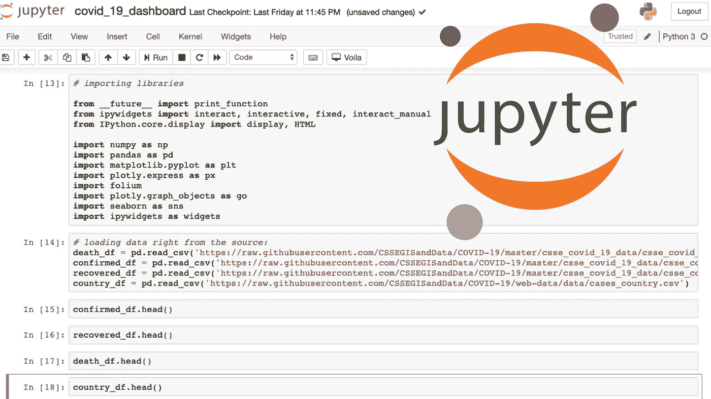
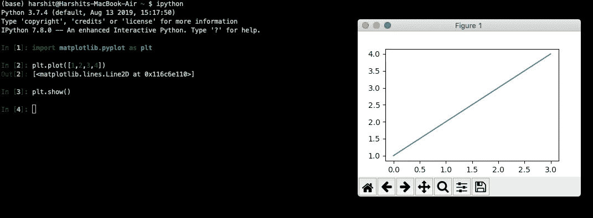
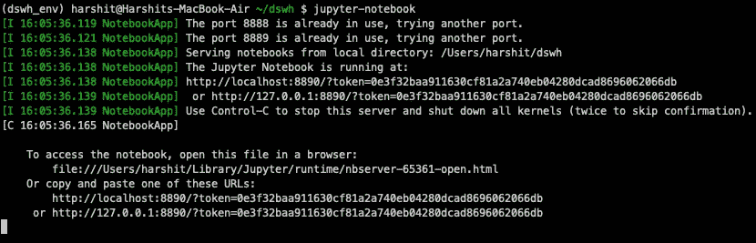
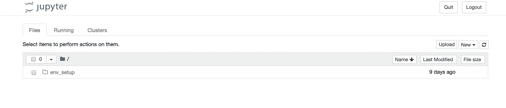
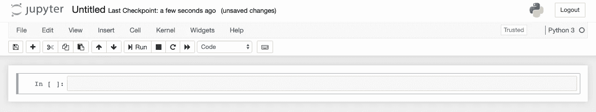
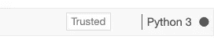
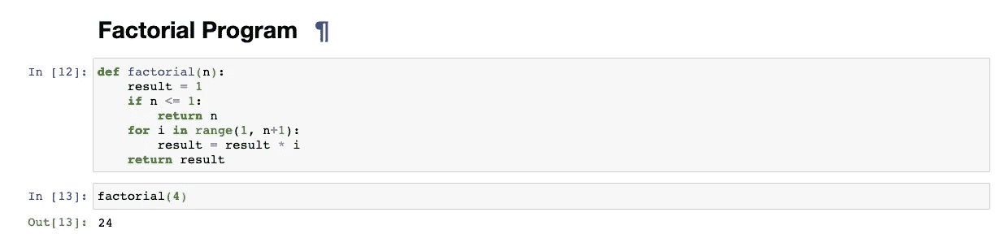
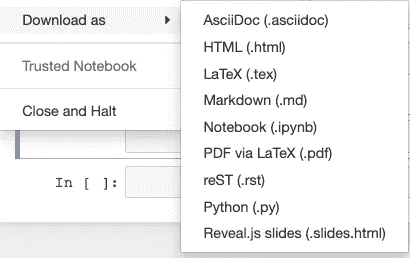

# 面向数据科学的 Jupyter 笔记本完全指南

> 原文：<https://towardsdatascience.com/the-complete-guide-to-jupyter-notebooks-for-data-science-8ff3591f69a4?source=collection_archive---------14----------------------->

## Ipython 笔记本初学者指南

Python 可以以多种方式运行，常见的方法包括使用终端或使用 python shell 运行 python 脚本。随着数据分析/科学成为新闻，我们有了基于 ipython 的 jupyter 笔记本，初学者和专家都在使用。

**Ipython** 为交互式 python 开发提供了一个 REPL (Read-Evaluate-Print-Loop)外壳。它使我们能够使用 GUI 工具包可视化图表和绘图，并为 jupyter 提供了一个**内核**。

具有简单情节的 Ipython shell

Project Jupyter 继承了 Ipython Notebook，它基于 Ipython，因为它利用其内核来完成所有计算，然后将输出提供给前端接口。内核为 Jupyter 笔记本提供了多语言支持(R、Python、Julia、Java 等)，并扩展了 Ipython 的存储和输出功能，以构建一个超级直观和交互式的基于浏览器的 GUI。在我们的 Harshit 数据科学系列中，我们将关注使用 Jupyter 笔记本学习 Python。

让我们从 Jupyter 笔记本开始吧…

## Jupyter 笔记本的一切

**安装先决条件**

首先，您必须有正确的环境设置，以便使用 jupyter 笔记本开始任何项目。这里是**设置 python 环境**指南的链接

 [## 数据科学的理想 Python 环境设置

### 设置 python 环境以开始数据科学项目的指南。

towardsdatascience.com](/ideal-python-environment-setup-for-data-science-cdb03a447de8) 

**创建新笔记本**

现在，一旦您使用 conda 设置了 python 环境。激活您的环境并导航到您的工作目录。现在，要启动 jupyter notebook，输入终端`jupyter notebook`来实例化一个新的本地主机服务器。

这将打开您输入命令的目录结构。

这里是我的`dswh`目录的主页:

如上图所示，共有 3 个选项卡:

1.  **文件—** 这是保存您所有文件和目录的地方。
2.  **运行—** 跟踪所有正在运行的进程。
3.  **集群—** 该选项卡允许您控制扩展的 ipython 内核的各个引擎。它是由 Ipython 并行计算框架提供的。

现在，要创建一个新笔记本，你必须点击 ***新建*** 下拉菜单，然后点击 *Python 3* 。

这是为您创建的新*无标题* jupyter 笔记本，并在新标签页中打开。您可以通过单击顶部的名称字段或从目录中重命名该文件。

如果您现在在另一个选项卡中查看您的目录，有一个名为 ***Untitled.ipynb*** 的新文件以绿色突出显示，表示它当前正在运行。

## 一个. ipynb 文件包含什么？

标准的 jupyter 笔记本文件格式是**。ipynb** 。它是一个文本文档，以包含笔记本内容的 **JSON** 格式存储。笔记本中可能有许多单元，每个单元的内容可以是 python 代码、文本或视频附件，它们已被转换为文本字符串，并可与笔记本的元数据一起使用。

如果您想手动进行更改，可以使用编辑选项编辑所有这些信息。尽管这很少被要求。

## 演练界面

为您创建的笔记本开始工作后，您可以查看位于顶部的笔记本的名称，它现在必须是无标题的。

在标题下面，我们有一个菜单栏，里面有很多可用的选项和功能，即文件、视图、单元格等，还有一些常用的图标。**运行**图标是您执行单元所需的图标。右侧的命令选项板图标列出了所有键盘快捷键。

## Ipython 内核

忙碌的内核的形象

内核是一个运行并解释用户代码的程序。Jupyter Notebook 使用的不同语言有不同的内核，但对于 Python，它扩展了 Ipython 内核。
内核执行单元中的代码，并将输出(如果有)返回给前端接口。内核的状态与整个文档有关，而不仅仅是单个的单元格。在一个单元中实现的任何东西都可以在下一个单元中使用。

我们可以使用各种内核设置选项:

1.  中断—停止任何无法产生任何输出的停滞操作。
2.  重新启动—它以空白状态重新启动内核。
3.  重启并清除输出—它将重启并清除所有显示的输出。
4.  重启并运行全部——它将重启内核，然后从头开始运行所有单元。
5.  关闭—关闭内核。

## 笔记本电池

jupyter 笔记本中有 4 种类型的单元格:

1.  **Code —** 这是我们编写 python 代码的单元格，这些代码将由 ipython 内核计算，输出显示在单元格下。这是一个代码单元的例子。

2. **Markdown —** 这是您添加文档的地方，通过使用 Markdown 放置格式化的文本。运行时，输出显示在单元格的位置。

以下是降价备忘单的链接，供您参考:

 [## 亚当-p/markdown-这里

### 这旨在作为快速参考和展示。欲了解更完整的信息，请参阅约翰格鲁伯的原始规格和…

github.com](https://github.com/adam-p/markdown-here/wiki/Markdown-Cheatsheet) 

3. **Raw NBConvert —** 这是另一个工具，可以将你的 jupyter 笔记本转换成另一种文件格式，如 PDF、HTML 等。

4.**标题—** 这与在 Markdown 中写标题(以#开头的行)是一样的。要给你的笔记本添加标题，你可以使用这个。

无论是哪种类型的单元，都需要运行每个单元来查看输出。你可以使用顶部任务栏中的**运行**选项，也可以按下键盘上的 **(Shift + Enter)** 命令。

当每个单元运行时，它将显示带有星号标记的单元，如[*] 中的**，一旦获得输出，该单元将变成[1]** 中的**。**

## 分享您的分析/工作

我添加 git 作为数据科学项目环境设置的一部分，部分原因是为了与你的前辈、潜在雇主、开源社区等分享你的分析。但是您可能并不总是需要共享代码，而是共享您从分析中获得的洞察力的静态预呈现版本。

现在，有几种方法可以共享您的笔记本:

1.  **将笔记本的精确副本导出为 HTML、Markdown 或 PDF。您可以使用文件菜单中的`Download as`按钮。**

**2。GitHub** —你可以分享你的 GitHub 公共资源库的链接，或者在你的私人项目中添加合作者。Github 拥有超过 200 万台笔记本电脑，是托管您的。ipynb 文件。此外，GitHub 允许您查看。ipynb 文件，因为您可以在本地查看它们。

*   以下是学习使用 GitHub 和其他指南的链接:

 [## GitHub 指南

### GitHub 非常适合管理围绕代码的所有信息。本指南有助于解释我们的问题跟踪系统…

guides.github.com](https://guides.github.com/) 

**3。nbviewer —** 这是最简单也是最流行的渲染笔记本的工具。这是来自 Project Jupyter 的免费工具。它只需要你托管的 Jupyter 笔记本的 URL，无论是在 GitHub、Bitbucket 还是其他地方，NBViewer 都会为你提供一个你的笔记本的渲染版本以及一个可共享的链接。以下链接:

 [## nbviewer

### 在此输入 Jupyter 笔记本的位置以进行渲染:

nbviewer.jupyter.org](https://nbviewer.jupyter.org/) 

# 结论

编程 python 被这些笔记本赋予了新的画面。现在，您可以利用这些功能，开始您的数据科学之旅，这些单元格包含您的逐步分析以及文档和可视化见解。

下一篇文章是关于数据科学的基础 Python。敬请关注 Harshit，继续学习**数据科学。**

# Harshit 的数据科学

通过这个渠道，我计划推出几个涵盖整个数据科学领域的系列。以下是你应该订阅[频道](https://www.youtube.com/channel/UCH-xwLTKQaABNs2QmGxK2bQ)的原因:

*   该系列将涵盖每个主题和副主题的所有必需/要求的高质量教程。
*   解释了为什么我们在 ML 和深度学习中做这些事情的数学和推导。
*   与谷歌、微软、亚马逊等公司的数据科学家和工程师以及大数据驱动型公司的首席执行官的播客。
*   项目和说明，以实现迄今为止所学的主题。

你可以在 [LinkedIn](https://www.linkedin.com/in/tyagiharshit/) 、 [Twitter](https://twitter.com/tyagi_harshit24) 或 [Instagram](https://www.instagram.com/upgradewithharshit/?hl=en) 上与我联系(在那里我谈论健康和福祉。)

注意:在这些黑暗的时期，自我隔离为自我提升腾出了一些空间，我们可以利用这些空间来发展新的技能、爱好，并帮助未来的自己。