# 线性回归分析完全指南

> 原文：<https://towardsdatascience.com/the-complete-guide-to-linear-regression-analysis-38a421a89dc2?source=collection_archive---------9----------------------->

## 这篇文章是关于理解所有统计术语的线性回归。

[瑞安·塞尔在 Unsplash 上拍摄的照片](https://unsplash.com/photos/7Ku54ZgKEcs)

# 介绍

在这篇文章中，我们将一步一步地用线性回归分析一个商业问题，并试图解释每一步的统计术语，以理解其内部运作。虽然线性回归算法很简单，但为了进行正确的分析，应该解释统计结果。

首先，我们将看看简单的线性回归，然后将问题扩展到多元线性回归。

> 为了便于理解，请跟随 [python 笔记本](https://github.com/abjidge/The-Complete-Guide-to-Linear-Regression-Analysis-with-Business-Problem)一起看。

# 什么是线性回归？

回归是寻找变量之间关系的统计方法。因此，**线性回归**假设变量之间存在线性关系。根据输入变量的数量，回归问题分为

1)简单线性回归

2)多元线性回归

# 商业问题

在本文中，我们使用的是**广告数据集**。

让我们考虑有一家公司，它必须提高产品的销售。该公司花钱在不同的广告媒体上，如电视、广播和报纸，以增加其产品的销售。公司记录在每个广告媒体上花费的钱(以千美元计)和售出的产品数量(以千单位计)。

现在，我们必须帮助公司找到最有效的方法，在广告媒体上花钱，以较少的广告预算提高下一年的销售额。

# 简单线性回归

简单线性是一种基于单一预测变量 x 预测定量响应 Y 的方法。

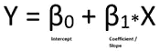

这是斜率为β1、截距为β0 的直线方程。

让我们用简单的线性回归开始给定广告数据的回归分析。最初，我们将考虑电视广告媒体的销售额和花费的简单线性回归模型。

那么数学方程式就变成了 **𝑆𝑎𝑙𝑒𝑠 = 𝛽0 + 𝛽1 * 𝑇𝑉.**

## 第一步:估计系数:(让我们找到系数)

现在，为了找到广告预算的销售额估计值，我们必须知道β1 和β0 的值。对于最佳估计，预测销售额和实际销售额之间的差异(称为**剩余**)应该是最小的。

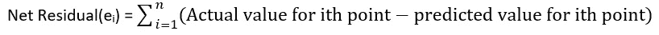

由于残差可能是负的或正的，因此在计算净残差时，它可能导致抵消项和净效应的减少，从而导致系数的非最佳估计。为了克服这一点，我们使用残差平方和(RSS)。

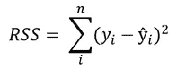

通过简单的计算，我们可以找到最小 RSS 值的β0 和β1 的值。

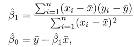

使用 python 中的 stats 模型库，我们可以找出系数，

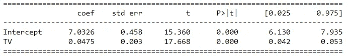

表 1:电视销售的简单回归

β0 和β1 的值分别为 7.03 和 0.047。那么关系就变成了， ***销售额= 7.03 + 0.047 *电视。***

**这意味着如果我们在电视广告媒体上多花 1000 美元，产品的销量就会增加 47 个单位。**

***这让我们看到电视广告媒体与销售的关联是多么强烈。***

## 步骤 2:评估系数估计的准确性(这些系数有多准确？)

***为什么系数不是完美的估计值？***

真实的关系可能不是完美的线性关系，因此使用更复杂的模型(如多项式回归模型)可以减少误差。这些类型的误差称为 ***可约误差。***

另一方面，由于测量和环境条件的误差，可能会引入误差，例如由于大雨影响销售，办公室关闭一周。这些类型的误差称为 ***不可约误差*** 。

由于这些误差，我们可以说这些系数不是完美的估计。

现在， ***如何解决这些错误？***

为了找出系数估计中的误差，我们使用标准误差(se)。系数的 SE 代表观察值偏离回归线的平均距离。如果一个变量的系数估计的标准误差较小，那么该模型可以更精确地估计该变量的系数。

TV 和截距系数的 SE 可由下式给出:

标准误差用于计算，

## 1]置信区间:

95%置信区间意味着该范围有 95%的概率包含参数的真实未知值。该范围由上限和下限定义。a β的 95%置信区间可以计算为 ***β 2*SE(β)。***

*从表[1]，* ***可以看出，β0 的 95%置信区间为[6.130，7.935]，这表明在没有任何广告的情况下，平均销量将在 6，130 至 7，935 辆之间。***

***β1 的 95%置信区间为[0.042，0.053]显示，电视广告每增加 1000 美元，销量平均会增加 42 至 53 台。***

## 2]要进行假设检验:

现在借助假设检验让我们弄清楚， ***销售和电视广告预算之间是真的有关系/关联还是我们偶然得到的结果？***

让我们定义模型的假设。

H0 =销售和电视广告之间没有关系。(β1 = 0)

Ha =销售和电视广告是有关系的。(β1 ≠ 0)

为了证明销售和电视广告预算之间存在真实的关系/关联，我们需要确定 *β* 1 离零足够远，这样我们就可以确信 *β* 1 在计算的 SE 下非零。

求β1 离零有多远(这个，取决于 *β* 1 的精度——也就是取决于 SE( *β* 1)。)我们使用 t 统计量作为

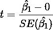

从表[1]中可以看出， *β* 1 的 t 统计值是 17.668。

让我们考虑显著性水平(α) = 0.01，它是当零假设为真时做出错误决策的概率。

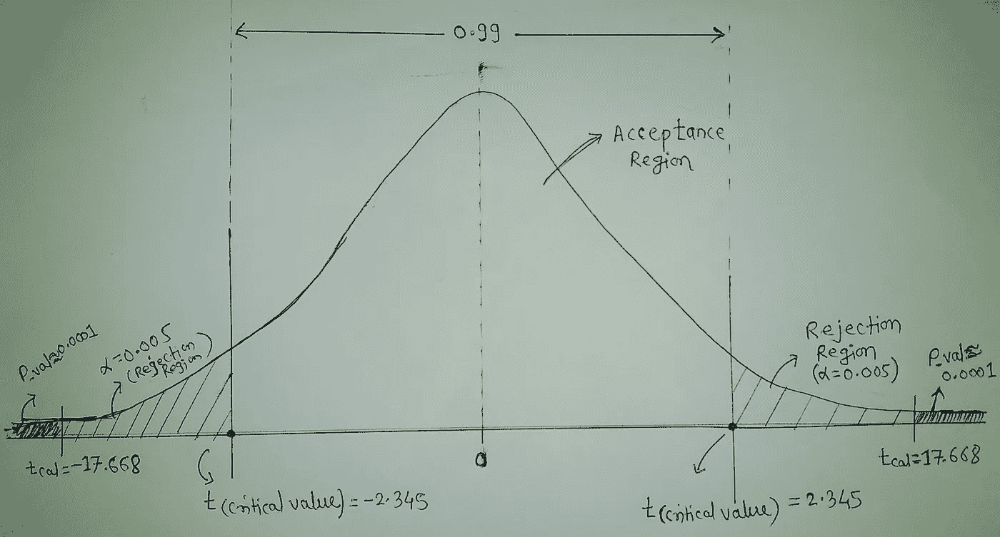

t 分布

我们可以用两种方法进行假设检验

**1】临界值法:**

双尾假设检验中α = 0.01 的临界值是 **2.345** 的意思是，0.01 的面积等于 t 值 2.345，如图所示。

现在根据上面的公式计算出来的 t 值是 17.668。由于计算出的 T 值在数值上大于临界值，因此它落在如图所示的剔除区域内。

所以我们有足够的证据拒绝零假设。

所以β1 ≠ 0。

**2】P 值法**

t 统计= 17.668 的 p 值为 **0.0001。**

即假设零假设(β1 = 0)为真，获得等于或大于 17.668 的 T 值的概率仅为 0.0001。

显著性水平(α) = 0.01 意味着只有当至少有 1/100 的机会获得等于 17.668 或极值的 T 值时，我们才能接受零假设。所以作为 P 值(0.0001) << α (0.01) So we can reject the null hypothesis. Simply, the P-value is area corresponds to the given test statistics.

So, from the above results, we can conclude that *β* 0 ≠ 0 和≠ 0。

关于假设检验的详细了解，可以阅读[这篇文章](/hypothesis-testing-the-what-why-and-how-867d382b99ca)。

## 第三步:模型的准确性(模型与数据的吻合程度如何？)

在验证了系数之后，现在我们要量化模型与数据的拟合程度。这可以通过剩余标准误差(RSE)和 R 平方统计来评估。

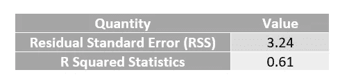

**剩余标准误差(RSE):**

尽管我们知道未知系数的真实值( *β* 0 和 *β* 1)，但是由于不可约误差(如前所定义的ε),也将存在等于 RSE**T5 的平均误差量，并且它由下式给出:**

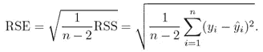

对于线性回归的广告数据，我们的 RSE 值等于 3.242，这意味着实际销售额平均偏离真实回归线约 3 *、* 260 台。

RSE 是模型的**与数据在 y 方向上的【不匹配】的**度量。残差越低，模型与数据的匹配越好(在这种情况下，数据越接近线性关系)。****

**RSE 没有固定的比例，价值以 Y(电视广告)表示，为了克服这一点，我们使用 R 平方统计。**

****R 平方统计:****

**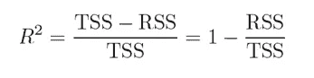**

**其中 TSS(总平方和)和 RSS(剩余平方和)**

****

**R 平方统计测量 Y 中可以用 x 解释的可变性的比例。如果 R 平方统计接近 1，则表明响应中的大部分可变性已经由回归解释。R 平方统计值始终介于 0 和 1 之间。**

**该模型的 R 平方统计值为 0.61，这意味着只有 61%的销售可变性可以通过电视上的线性回归来解释。**

**现在我们已经借助简单的线性回归分析了电视广告和销售之间的关系。用类似的方法，让我们用简单的线性回归分析广播广告、报纸广告和销售之间的关系。**

## **电台销售的简单线性回归**

**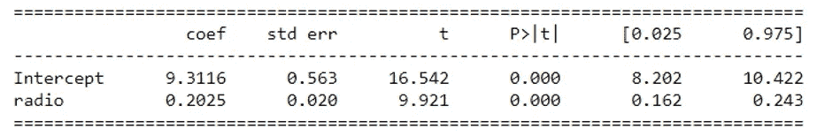**

**表 2:电台销售的简单线性回归**

**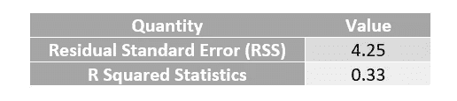**

## **报纸销售的简单线性回归**

**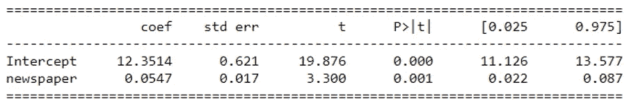**

**表 3:报纸销售的简单线性回归**

**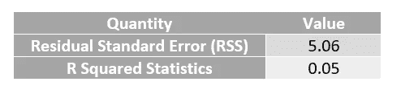**

**现在从上面的结果中，我们可以看到简单的线性回归不能解释销售中的可变性，并且模型不能很好地工作。**

**让我们看看多元回归是如何工作的，**

# **多元线性回归:**

**在多元线性回归中，我们将一起分析销售和三种广告媒体之间的关系。**

****𝑆𝑎𝑙𝑒𝑠 = 𝛽0 + 𝛽1 * 𝑇𝑉 + 𝛽2 *电台+ 𝛽3 *报纸+艾司隆****

**现在让我们遵循类似于简单线性回归的步骤，**

## **1]估计系数:**

**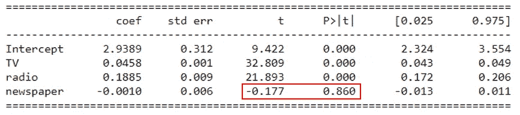**

**表 4:电视、广播、报纸销售的多元线性回归**

**上表显示了当电视、广播和报纸广告预算用于预测产品销售时，使用广告数据的多元回归系数估计值。**

****𝑆𝑎𝑙𝑒𝑠 = 2.94 + 0.045 * 𝑇𝑉 + 0.189 *广播+ (- 0.001) *报纸****

**我们可以分析出报纸的系数估计值接近于零，p 值不再显著(p 值> > 0.005)，其值约为 0 *。* 86。这表明花在报纸广告媒体上的钱与产品的销售无关。**

*****问)为什么在多元线性回归的情况下花在报纸广告媒体上的钱与产品的销售没有关系，而在另一方面用简单的线性回归，这个变量是高度显著的？*****

**现在为了理解为什么会发生这种情况，让我们分析一下相关矩阵。**

**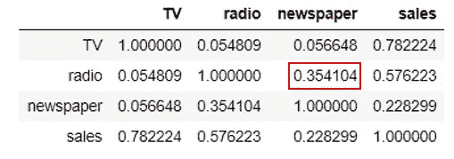**

***广告数据的相关矩阵***

**广播和报纸之间的相关性为 0.354，这揭示了在广播花费更多的市场中，报纸广告花费更多的趋势。销售与报纸广告的相关性较小，这说明报纸广告对销售没有直接影响。**

**花在报纸广告上的钱越多，花在电台广告上的钱就越多，所以电台广告预算的增加会增加销售额。简单的线性回归只检查销量与报纸的对比，所以报纸因广播对销量的影响而获得好评。**

**因此，从上面的分析，我们可以说，报纸广告变量没有增加产品的销售。因此，让我们通过移除报纸广告变量来建立一个模型。**

**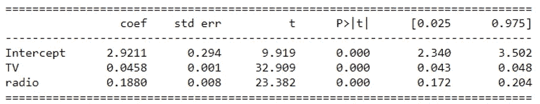**

**表 5:电视和广播销售的多元线性回归**

****𝑆𝑎𝑙𝑒𝑠 = 2.92 + 0.045 * 𝑇𝑉 + 0.188 *电台****

# **模型比较**

**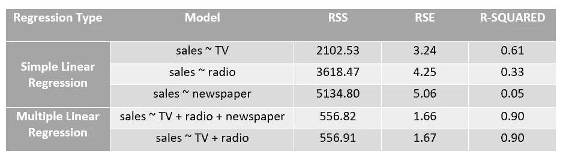**

**表 6:模型比较**

**从上表中，我们可以说，电视和广播销售的多元线性回归将给出一个更好的销售估计。**

# **商业计划:**

**从上面的回归分析，让我们创建一个商业计划，帮助公司明智地花钱。**

*****1】哪些媒体对销售没有贡献？*****

**花在报纸广告媒体上的钱不影响销量。**

****2】*****每种媒介对销售的作用有多大？*****

**系数估计值越大的广告媒体对销售的影响越大。**

**从电视和广播销售的多元线性回归来看(表 6)，广播广告对销售的影响最大。在广播广告和电视广告上每花 1000 美元，产品的销售量就会分别增加 188 和 45 个单位。**

****3】*这种关系有多牢固？*****

**表 6 显示了模型精度测量的比较。电视和广播销售的多元线性回归的 RSE 值为 1.67。销售额的平均值为 14022，因此百分比误差为 1670/14022 **≈** 12%。**

**r 的平方值为 0.90，这表明 90%的销售差异可以通过电视和广播销售的多元线性回归来解释。**

**我们能多准确地预测未来的销售额？**

**为此，我们使用置信区间和预测区间。预测区间比置信区间宽，因为预测区间捕捉不可约误差。**

****5】销售和广告预算有关系吗？****

**在简单线性回归的情况下，我们通过使用 t 统计来进行假设检验，以查看电视广告和销售之间是否有任何关系。**

**同样，对于多元线性回归，我们可以执行 f 检验来检验假设，**

**H0: β1 = β2 = = βp = 0**

**Ha:至少有一个βj 非零。**

# **资源**

**最后，我想提几个很棒的资源，你可以用它们来学习更多关于线性回归的知识。**

**[统计学习导论:在 r (Book)中的应用](https://faculty.marshall.usc.edu/gareth-james/ISL/ISLR%20Seventh%20Printing.pdf)**

**[可汗学院统计课程(视频讲座)](https://www.khanacademy.org/math/ap-statistics)**

**[线性回归(Statsmodels 文档)](https://www.statsmodels.org/stable/regression.html)**

# **结论**

**在本文中，我们回顾了什么是线性回归，它是如何工作的，以及我们如何在用 python 实现建模的每一步分析结果。**

**如果您有任何问题，请随时在 LinkedIn[*上给我发 DM*](https://www.linkedin.com/in/abhay-jidge-043926169)或留下评论。**