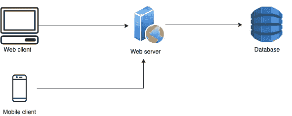
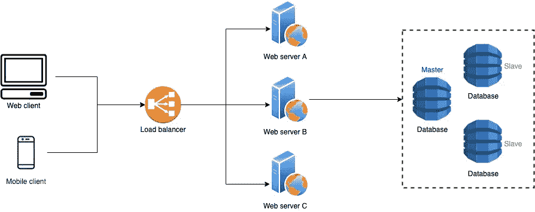

# 破解系统设计面试的完整指南

> 原文：<https://towardsdatascience.com/the-complete-guide-to-the-system-design-interview-ba118f48bdfc?source=collection_archive---------0----------------------->

## 回答任何系统设计问题的模板&所有附加系统设计问题的链接。

图片由 Ben kolde 在 Unsplash 上提供

## 这篇文章由 3 部分组成—准备指南、系统设计模板和带链接的设计问题。

对于我在亚马逊的系统设计面试，我观看了视频讲座，阅读了博客文章，并与我的朋友讨论了设计系统的各种方法。在我做了大量准备后，我想出了一个模板，我在面试时遵循了这个模板，我想与大家分享，并希望它能帮助任何准备系统设计面试的人。

## 准备

首先，在设计系统之前，学习基本概念是很重要的。了解所有的概念有助于你在设计系统时做出正确的决定。

这个精选的 YouTube 播放列表涵盖了理解系统设计步骤所需的所有概念。

系统设计概念播放列表

(可选)有关更全面的概念，请参考下面的 Github repo。

 [## donne Martin/系统设计初级读本

### 学习如何设计大型系统。准备系统设计面试。学习如何设计可扩展的系统…

github.com](https://github.com/donnemartin/system-design-primer/blob/master/README.md) 

学完所有的基本概念后，现在是设计的时候了。首先，你要想出一个用例(例:Instagram)，并尝试设计所有的组件。主要考虑如何让你的系统，**容错**(系统一直启动运行)，以及**可伸缩**(处理不断增长的流量)。集体讨论如何解决瓶颈。这整个过程帮助你应用你在设计系统中学到的概念。如果您在设计系统时遇到任何困难，请参考下面提供的设计模板。

> 我给你的建议是使用这个系统，探索所有的功能

**问自己的问题**

*   有哪些不同的**架构组件**可以使用？
*   这些组件是如何相互作用的？
*   我们如何最好地利用这些组件:什么是**正确的权衡**？

来源:腮红

***提示*** *:你问面试官的问题越多，你从面试官那里得到的信息就越多，你的设计就越好*。

> **面试要点:**
> 不要使用任何流行词汇(技术堆栈)，不要过早地进入细节，证明你的设计决策

# **面试系统设计模板**

## **1。要求**

**功能性**

系统或应用程序能为用户提供什么功能？例如:在 Twitter 中，一个用户可以关注另一个用户，发推文，喜欢一条推文，转发其他人的推文，并分享一条推文(专注于基本功能，不要钻研 Twitter 的复杂功能)

**非功能性**

*强制知道* ***上限定理*** *:* [*博客*](https://mwhittaker.github.io/blog/an_illustrated_proof_of_the_cap_theorem/)

对于任何分布式系统，以下是需要考虑的基本概念:

*   **高可用性:**大部分系统必须具有高可用性。
*   **一致性:**具有高可用性的系统将具有最终的一致性。任何银行系统都倾向于一致性而不是可用性，因为数据(账户余额)中不能有差异。
*   **可靠性:**不丢失用户数据。
*   **延迟:**用户行为的响应时间，比如加载网页、喜欢帖子等。

## **2。存储估计**

*   **基于数据形态**:粗略估计必须存储多少数据，以了解可以使用什么类型的数据库和**用于存储图像/视频的文件存储**。
*   **对服务的请求数量** —了解如何扩展服务。读取量大的服务可以进行扩展，以处理高流量的请求。
*   **读写比率** —决定系统是否为重读。

## **3。数据库设计**

在讨论了数据和用户可以执行的与系统交互的动作之后。下一步是谈论你将使用哪种类型的数据库以及为什么。有关 SQL 与 NoSQL 的详细区别，请阅读

## **4。高层系统设计**

最初从一个非常基本的设计开始

作者照片

**扩展设计—创建特定组件**

*   **隔离服务**——便于扩展和流量控制

作者照片

*   **复制服务和数据库**——提到单点故障——[视频](https://www.youtube.com/watch?v=-BOysyYErLY)
*   **负载均衡器** —应用端&数据库端如果需要— [视频](https://www.youtube.com/watch?v=K0Ta65OqQkY&list=PLMCXHnjXnTnvo6alSjVkgxV-VH6EPyvoX&index=3)，[博客](https://www.educative.io/courses/grokking-the-system-design-interview/3jEwl04BL7Q)
*   **消息队列** —紧密耦合到失去耦合/同步到异步通信—读取[消息队列](https://aws.amazon.com/sqs/)，[MQ 的好处](https://aws.amazon.com/message-queue/benefits/)
*   **数据划分** —基于位置、基于用户标识— [视频](https://www.youtube.com/watch?v=5faMjKuB9bc&list=PLMCXHnjXnTnvo6alSjVkgxV-VH6EPyvoX&index=7)、[博客](https://www.educative.io/courses/grokking-the-system-design-interview/mEN8lJXV1LA)
*   **内容交付网络** —避免往返主服务器(减少延迟)。[视频](https://www.youtube.com/watch?v=Bsq5cKkS33I)，[面试提问](https://www.youtube.com/watch?v=dzzPP87zUq4)
*   **缓存** —分布式缓存和客户端缓存(用于更快的读取访问)——[视频](https://www.youtube.com/watch?v=U3RkDLtS7uY)、[博客](https://aws.amazon.com/caching/)、[初级](https://github.com/donnemartin/system-design-primer/blob/master/README.md#cache)

## **5。附加组件(可选)**

如果您在面试中还有时间，可以将这些组件添加到设计中。了解这些组件有助于您回答任何深入的后续问题。一般来说，上面提到的部分就足够了，也会占用你面试的大部分时间。

*   **加密** (msgs) —用于消息服务以保护数据— [博客](https://blog.storagecraft.com/5-common-encryption-algorithms/)
*   **分析服务** —用于分析请求和用户数据
*   **ML 服务** —推荐/新闻订阅排名(如果用例(网飞)需要，则将其添加到基本组件中)—讨论您的推荐/排名模型所需的数据。
*   **API 网关** — [视频](https://www.youtube.com/watch?v=TYw-lzL3-Kc)，详细微服务，API 网关— [播放列表](https://www.youtube.com/watch?v=5OMx4R9VT-0&list=PLkQkbY7JNJuDqCFncFdTzGm6cRYCF-kZO&index=5)
*   **服务发现** —动态识别微服务— [视频](https://www.youtube.com/watch?v=6dpcU3fnSBE)

按照这个模板，任何系统都可以在面试中设计出来。

**免责声明**:以下提供的视频链接是一个系统的详细设计，可以参考真实系统的深入设计。教育性博客链接简洁明了，涵盖了特定系统的设计概念的使用。

# 设计问题

## **一般服务**

1.  **微小网址** : [视频](https://www.youtube.com/watch?v=JQDHz72OA3c)，[博客](https://www.educative.io/courses/grokking-the-system-design-interview/m2ygV4E81AR)
2.  **PasteBin** : [视频](https://www.youtube.com/watch?v=josjRSBqEBI&list=PLkQkbY7JNJuBoTemzQfjym0sqbOHt5fnV&index=30)，[博客](https://www.educative.io/courses/grokking-the-system-design-interview/3jyvQ3pg6KO)
3.  **搜索服务** : [视频](https://www.youtube.com/watch?v=CeGtqouT8eA)，[博客](https://www.educative.io/courses/grokking-the-system-design-interview/xV9mMjj74gE)
4.  **提前输入建议服务** : [视频](https://www.youtube.com/watch?v=xrYTjaK5QVM&list=PLkQkbY7JNJuBoTemzQfjym0sqbOHt5fnV&index=8)，[博客](https://www.educative.io/courses/grokking-the-system-design-interview/mE2XkgGRnmp)
5.  **网络爬虫** : [视频](https://www.youtube.com/watch?v=BKZxZwUgL3Y)，[博客](https://www.educative.io/courses/grokking-the-system-design-interview/NE5LpPrWrKv)
6.  **API 限速器** : [视频](https://www.youtube.com/watch?v=xrizarXJgC8)，[博客](https://www.educative.io/courses/grokking-the-system-design-interview/3jYKmrVAPGQ)

## **社交媒体系统**

1.  **Instagram** : [视频](https://www.youtube.com/watch?v=QmX2NPkJTKg)，[博客](https://www.educative.io/courses/grokking-the-system-design-interview/m2yDVZnQ8lG)
2.  **推特** : [视频](https://www.youtube.com/watch?v=wYk0xPP_P_8)，[博客](https://www.educative.io/courses/grokking-the-system-design-interview/m2G48X18NDO)
3.  **脸书新闻供稿** : [博客](https://www.educative.io/courses/grokking-the-system-design-interview/gxpWJ3ZKYwl)

## **云服务**

1.  **Google drive** : [视频](https://www.youtube.com/watch?v=U0xTu6E2CT8)，[博客](https://www.educative.io/courses/grokking-the-system-design-interview/m22Gymjp4mG)
2.  **谷歌文档** : [视频](https://www.youtube.com/watch?v=2auwirNBvGg)
3.  **亚马逊 S3** : [视频](https://www.youtube.com/watch?v=UmWtcgC96X8)

## **视频流**

视频是主要数据，必须存储不同格式的视频。**推荐服务**在这里很关键。

1.  **网飞** : [视频](https://www.youtube.com/watch?v=psQzyFfsUGU&list=PLkQkbY7JNJuBoTemzQfjym0sqbOHt5fnV&index=5)，[博客](https://www.educative.io/courses/grokking-the-system-design-interview/xV26VjZ7yMl)，
2.  网飞如何登上新电影:[视频](https://www.youtube.com/watch?v=x9Hrn0oNmJM)。

类似的系统:YouTube，Prime Video。

## **网上购物**

1.  **亚马逊** : [视频](https://www.youtube.com/watch?v=EpASu_1dUdE)

类似的系统:沃尔玛、Airbnb、易贝

## **消息系统**

对于消息传递系统来说，了解 HTTP、长池和 WebSockets 之间的区别是很重要的

1.  **WhatsApp** : [视频](https://www.youtube.com/watch?v=vvhC64hQZMk)

## **驾驶室使用案例**

1.  **优步** : [视频](https://www.youtube.com/watch?v=umWABit-wbk)，[博客](https://www.educative.io/courses/grokking-the-system-design-interview/YQVkjp548NM)

类似系统:Lyft

## **视频会议**

1.  **变焦** : [视频](https://www.youtube.com/watch?v=G32ThJakeHk)

类似的系统:Skype，Google Meet

## **餐厅审查系统**

1.  **Yelp** : [视频](https://www.youtube.com/watch?v=TCP5iPy8xqo)，[博客](https://www.educative.io/courses/grokking-the-system-design-interview/B8rpM8E16LQ)

## **约会应用**

1.  火绒:[视频](https://www.youtube.com/watch?v=tndzLznxq40)

## **支付服务**

什么是支付网关:[视频](https://www.youtube.com/watch?v=GUurzvS3DlY)

1.  贝宝

## **游戏**

1.  在线多人游戏:视频[第一部分](https://www.youtube.com/watch?v=EU81tjgoKoI)，[第二部分](https://www.youtube.com/watch?v=K3Z1PY2vr3Q)

## **管理系统**

1.  **票主** : [视频](https://www.youtube.com/watch?v=lBAwJgoO3Ek)，[博客](https://www.educative.io/courses/grokking-the-system-design-interview/YQyq6mBKq4n)

类似的系统:图书馆管理系统，电影预订，酒店预订，机票预订。

**谷歌地图** : [视频](https://www.youtube.com/watch?v=jk3yvVfNvds)

**结论:**我是根据自己的理解，在准备系统设计面试后写的这篇博客。这个博客通过整合所有与系统设计相关的重要资源来帮助软件工程师准备面试。

## 资源

 [## donne Martin/系统设计初级读本

### 学习如何设计大型系统。准备系统设计面试。学习如何设计可扩展的系统…

github.com](https://github.com/donnemartin/system-design-primer/blob/master/README.md)  [## 科技假人

### 我的名字是那仁，我在这里帮助你学习软件工程工作所需的技能，也帮助…

www.youtube.com](https://www.youtube.com/channel/UCn1XnDWhsLS5URXTi5wtFTA)  [## 高拉夫·森

### 算法和系统设计是强有力的结合！以下是我谈论的一些事情:1)竞争性编程…

www.youtube.com](https://www.youtube.com/channel/UCRPMAqdtSgd0Ipeef7iFsKw)  [## 达到目标

### 在这个频道中，我将谈论 1)系统设计 2)软件开发原则、操作问题 3)…

www.youtube.com](https://www.youtube.com/channel/UCY8JVhRabrcrqDJ9gi9lHNg)  [## 探索系统设计面试——互动学习

### 系统设计问题已经成为软件工程面试过程的标准部分。在这些方面的表现…

www.educative.io](https://www.educative.io/courses/grokking-the-system-design-interview)