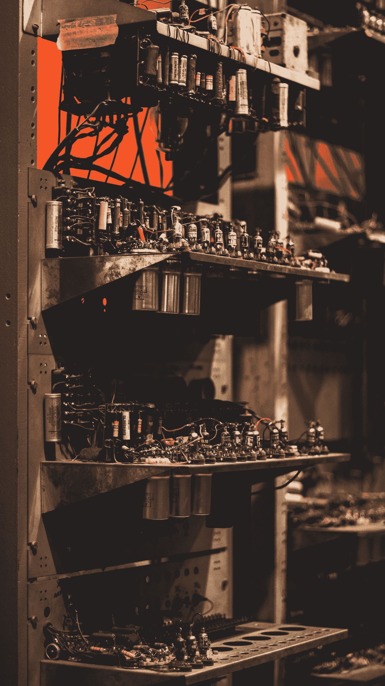

# 神经网络的完整有趣和复杂的历史！

> 原文：<https://towardsdatascience.com/the-complete-interesting-and-convoluted-history-of-neural-networks-2764a54e9e76?source=collection_archive---------42----------------------->

## [关于 DL 的一切](http://towardsdatascience.com/tagged/Everything%20about%C2%A0DL)

## 重温人工神经网络发展背后的迷人历史

由[瓦伦丁·彼得科夫](https://unsplash.com/@thefreak1337?utm_source=medium&utm_medium=referral)在 [Unsplash](https://unsplash.com?utm_source=medium&utm_medium=referral) 上拍摄

我们将会看到神经网络的历史。在彻底查阅了各种资料后，我发现神经网络的历史激起了我的兴趣，我开始全神贯注。我玩得很开心，因为研究这个话题是令人满意的。下面是目录的列表。随意跳到你最感兴趣的话题。

## 目录:

1.  介绍
2.  思想和观念的产生
3.  黄金时代
4.  进步
5.  神经网络的失败与解散
6.  神经网络的重新出现和完全统治
7.  结论

# 简介:

自上个世纪以来，神经网络和人工智能一直是一个热门话题。不可否认，人工智能机器人在流行文化电影中接管世界的流行引发了许多好奇的想法。神经网络从生物神经元中提取灵感。神经网络是一种受编程范式启发的方法，它使深度学习模型能够在复杂的观察数据集上有效地学习和训练。神经网络在上个世纪经历了不同的阶段。神经网络从一个解决复杂计算问题的强大前景，然后被嘲笑为仅仅是一个理论上的想法，最后，突出了一个更可取的未来。让我们按时间顺序回顾一下神经网络历史上的每个阶段。

> **注意:**这将是题为“深度学习的一切”系列的第一部分在这个主题中，我们将尝试涵盖每一个事实，算法，激活函数，以及人工神经网络和深度学习的未来。今天，我们将从神经网络的完整历史开始。在接下来的部分中，我们将涵盖实现神经元功能的基础知识，在后续部分中，我们将涵盖与深度学习相关的所有概念。

照片由 [Pixabay](https://www.pexels.com/@pixabay) 在[像素](https://www.pexels.com/photo/abstract-art-blur-bright-373543/)上拍摄

# 思想和观念的产生:

自上个世纪以来，生物学家、神经学家和研究人员一直在研究神经元的功能。美国哲学家威廉·詹姆斯(William James)在 1890 年提出了一个颇有见地的理论，该理论反映了许多研究人员的后续工作。简单来说，该假说认为，大脑皮层中任何给定点的活动都是整体运动趋势的总和。简单地说，在下面的陈述中，它意味着一个神经元的兴奋会刺激所有其他的神经元，直到信号成功地到达目标。

1943 年，麦卡洛克和皮茨为单个神经元建立了第一个数学模型。所构建的神经元模型是全面而深远的。即使在现代，这种模型也被修改和广泛使用。这一时刻给神经网络的研究者和实践者带来了巨大的思想转变。大多数生物学家对类似人脑的神经元模型的数学功能感到惊讶。从这一刻开始，支持人工智能成功的热潮和对人工智能接管世界的担忧开始了。

在下一系列教程中，我们还将更详细地了解这些概念。从头开始理解神经网络的每个概念，包括单个神经元的工作，也将在本系列中完成。

# 黄金时代:

从 1949 年到 1969 年，在接下来的二十年里，进行了大量的实验。现有的方法有了巨大的发展和扩展。说这一时期是神经网络的黄金时代不会错。由于唐纳德·赫布在其名为《行为的组织》的书中引入了赫布理论，这个时代开始了。简而言之，Hebbian 理论指出，在特定的突触上，电导随着一个神经元被另一个神经元重复激活而增加。

在这一阶段，在学习过滤器、梯度下降、神经动力学的发展以及大规模大脑活动的触发和传播等突出主题方面有了一些进展。在同步激活多个神经元以代表每一位信息方面有广泛的研究。具有香农熵原理的信息论成为该领域的一个重要研究领域。然而，最重要的发明是罗森布拉特在 1958 年提出的感知机模型。

感知器模型是神经网络中最重要的发现之一。Rosenblatt 介绍的反向传播方法对于训练多层网络是有用的。由于广泛的研究和持续的发展，这个时代无疑是神经网络的黄金时代。泰勒构建了一个赢者通吃的电路，输出单元之间的抑制和感知机模型中的其他进展也完成了。

# 进步之处:

在 20 世纪 70 年代至 90 年代，有许多课题被研究和调查。不幸的是，事态发展毫无结果。人们研究了许多神经元的组合，以形成比单个神经元更强大的神经网络，并执行复杂的计算。由于梯度下降法在获得复杂任务的期望解方面不成功，所以有必要发展其他数学随机、概率或随机方法。在此期间，进一步的理论结果和分析得以确立。

用于复杂计算问题的玻尔兹曼机器和混合系统也在进步时期成功地完成了。玻尔兹曼机器成功地解决了数学问题。由于硬件和软件的限制，无法实现对各种缺陷的解决方案。然而，在此期间，进行了大量成功的研究。在此期间，对现有研究进行了更新和改进。

然而，尽管取得了这些进步，但没有什么对神经网络的发展至关重要或富有成效。对人工神经网络的迅速增长的需求不再存在。其中一个重要的原因是由于一个简单的感知器的局限性演示。Minsky 和 Papert 在 1969 年进行了这个演示，展示了简单感知机的缺陷。它从理论上证明了简单的感知器模型在计算上是不通用的。这一时刻臭名昭著，因为它标志着神经网络的黑色一天。对神经网络领域研究的资金支持急剧减少。这个动作引发了神经网络的崩溃。

# 神经网络的失败和解散；

在此期间，对人工神经网络的宣传达到了前所未有的高峰，但在适当的时候，所有与神经网络相关的宣传都消失了。人工智能成为下一个大事件，不再是知识分子的话题。人工神经网络和深度学习被嘲笑为只是一个理论概念。出现这种情况的主要原因是缺乏数据和先进技术。

当时，没有足够的资源来计算复杂的任务，如图像分割、图像分类、人脸识别、基于自然语言处理的聊天机器人等。在此期间可用的数据非常有限，没有足够的数据用于复杂的神经网络架构来提供所需的结果。尽管如此，即使有了所需的数据，用当时可用的资源来计算如此大量的数据也是一项极具挑战性的任务。

有乐观的迹象，如强化学习的成功和其他较小的积极因素。不幸的是，这还不足以重建它曾经的大规模宣传。多亏了具有非凡眼光的研究人员和科学家，他们才能够在人工神经网络领域继续发展。然而，对于人工神经网络来说，要恢复它们失去的声望和宣传，还需要 20 年的时间。

# 神经网络的重新出现和完全统治；

接下来的二十年对于深度学习的状态和普及来说是干涸的。在这个时代，支持向量机(SVM 的)和其他类似的机器学习算法更占优势，并被用来解决复杂的任务。对于大多数数据集，机器学习算法表现良好，但是对于更大的数据集，机器学习算法的性能没有显著提高。机器学习算法的性能在某个阈值之后停滞不前。能够随着数据的增加而不断学习和改进的模型变得非常重要。

2012 年，乔治·e·达尔(George E. Dahl)领导的团队利用多任务深度神经网络预测一种药物的生物分子靶点，赢得了“默克分子活性挑战”。2014 年，Hochreiter 的团队使用深度学习来检测营养物质、家用产品和药物中环境化学物质的脱靶和毒性效应，并赢得了 NIH、FDA 和 NCATS 的“Tox21 数据挑战”。(参考:[维基](https://en.wikipedia.org/wiki/Deep_learning#:~:text=The%20impact%20of%20deep%20learning,speech%20recognition%20started%20around%202010.))

一个革命性的时刻就在这个时候开始了，深度神经网络现在被认为是游戏规则的改变者。深度学习和神经网络现在是任何高水平比赛的显著特征。卷积神经网络、长短期记忆(LSTM 氏)和生成对抗网络非常受欢迎。

深度学习的强化每天都在快速增加，尤其是有了巨大的改进。看到深度神经网络和人工智能的未来令人兴奋。

# 结论:

由[亚历山大·德比耶夫](https://unsplash.com/@alexkixa?utm_source=medium&utm_medium=referral)在 [Unsplash](https://unsplash.com?utm_source=medium&utm_medium=referral) 上拍摄的照片

神经网络的旅程是即将到来的时代要记住的。神经网络和深度学习从一个奇妙的前景发展到现在成为解决几乎任何复杂问题的最佳方法之一。我很高兴看到深度学习领域将会发生的进步，我很高兴我是能够为这一变化做出贡献的当代人的一部分。

大多数阅读这篇文章的观众可能也很感兴趣。在题为“关于 DL 的一切”的系列中，我将尝试涵盖从神经网络的历史到每个深度学习算法和架构的工作和理解的每个主题让我们在这个旅程中团结一致，征服深度学习。你可能会喜欢的其他文章—

 [## 5 个关于 Python、机器学习和深度学习的超棒的计算机视觉项目创意！

### 讨论 5 个很酷的计算机视觉项目，学习新的技能，增强你的简历

towardsdatascience.com](/5-awesome-computer-vision-project-ideas-with-python-machine-learning-and-deep-learning-721425fa7905)  [## 人工智能的 6 个最佳创业选择

### 想用 AI 创业成功？

towardsdatascience.com](/6-best-startup-choices-with-artificial-intelligence-360260ccf89e)  [## 虚拟助手项目——走向数据科学

### 阅读《走向数据科学》中关于虚拟助手项目的文章。分享概念、想法和…

towardsdatascience.com](https://towardsdatascience.com/tagged/virtual-assistant-project) 

我希望你们都喜欢阅读这篇文章。祝你有美好的一天！