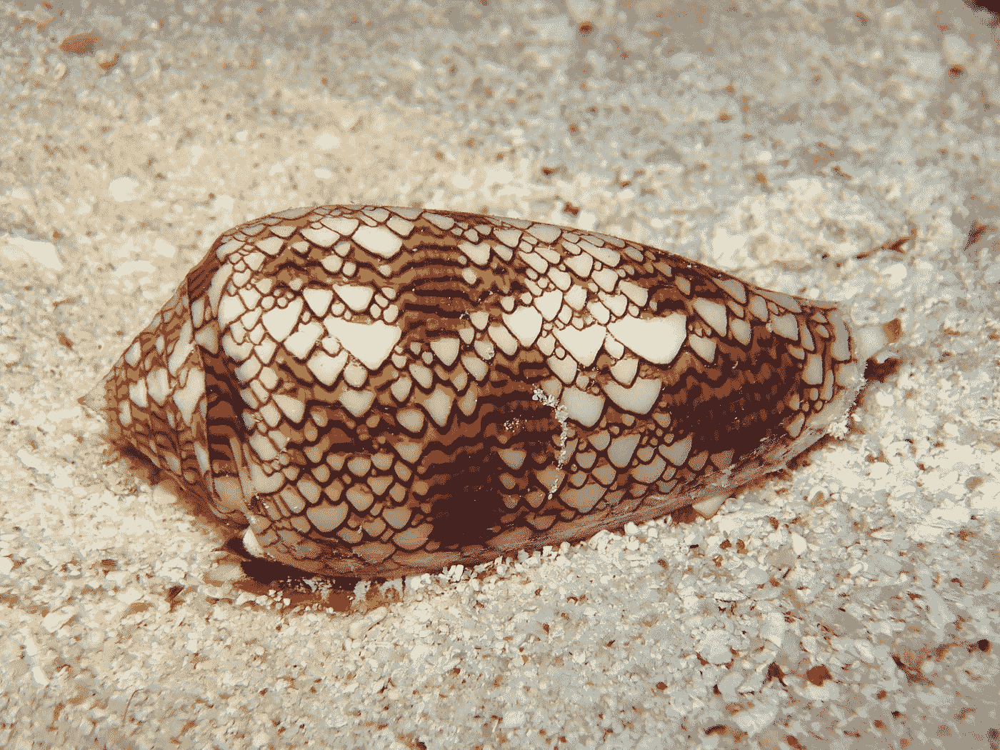
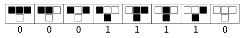
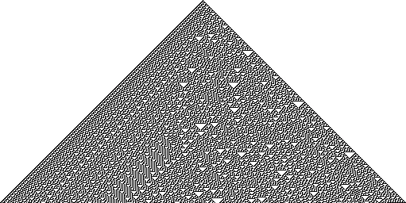
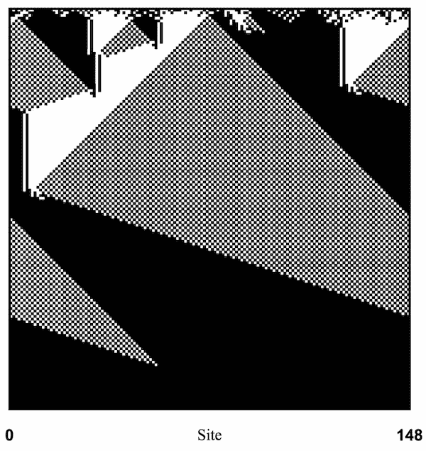
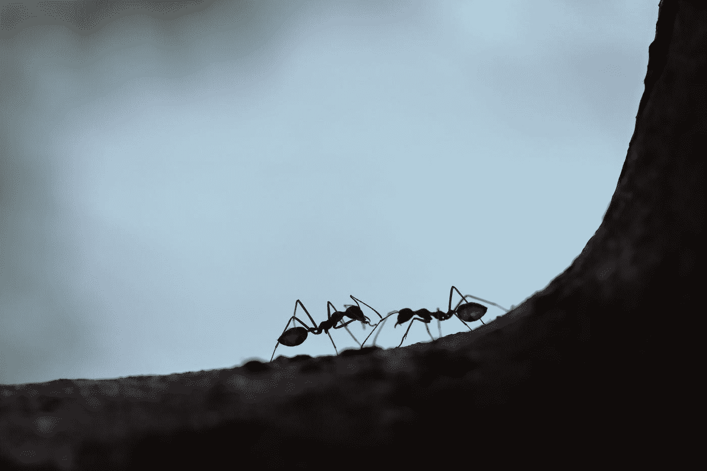

# 大自然的计算机

> 原文：<https://towardsdatascience.com/the-computers-of-nature-2f1019f9a1b8?source=collection_archive---------53----------------------->

## 细胞自动机和自然系统中计算的出现



金锥布，一种有毒的海螺。它的外壳模式类似于细胞自动机。(来源:[维基百科](https://en.wikipedia.org/wiki/Rule_30))

计算历史上最重要的里程碑之一是*通用图灵机*的想法，这是一种概念化的机器，旨在对任何输入数据运行任何程序。20 世纪 30 年代，数学家和计算机科学家艾伦·图灵证明了这种机器确实存在。十年后，在 1945 年，物理学家约翰·冯·诺依曼提出了这样一个通用机器的实际外观设计。它将包含:

*   执行计算的*处理单元*，
*   存储数据和指令的*存储单元*，以及
*   一种读取输入和显示输出的机制。

这个设计被称为*冯-诺依曼架构*，它是今天几乎每一台现代计算机的蓝图。据说是*图灵完全*。

我们可以向这样一台图灵完备机器抛出各种各样的问题。例如，考虑多数类问题:在 0 和 1 的输入字符串中，两者中的哪一个是多数？对于配备了 CPU 和内存的冯-诺依曼式计算机来说没有问题，我们可以按照下面的思路设计程序。

```
**def** get_majority(input):
    counter_0, counter_1 = 0,0
    **for** i in input:
        **if** i==0:
            counter_0 +=1
        **else**:
            counter_1 +=1
    **return** int(counter_1 > counter_0)
```

对于许多问题，我们可以编写一个程序，可以在冯-诺依曼式的机器上运行，并找到解决方案。这是一个非常强大的概念。

然而，对于计算机是什么存在着不同的观点，这种观点更多的是受到自然界中观察到的现象的启发。这就是我们进入细胞自动机迷人世界的地方。

## 细胞自动机——从简单到复杂

在其最简单的形式中，细胞自动机可以被描述为“细胞”的网格，可以呈现两种不同的状态，比如黑色和白色。然后，我们可以定义这些细胞应该如何相互作用的“规则”，如下所示。



细胞自动机“规则 30”(来源: [Wolfram Mathworld](https://mathworld.wolfram.com/ElementaryCellularAutomaton.html) )

这套特殊的规则，也被称为“30 号规则”，是 256 种可以以这种方式构建的规则之一，计算机科学家史蒂夫·沃尔夫勒姆在 20 世纪 80 年代对其进行了详细研究。根据规则 30，被两个黑色单元格包围的黑色单元格将变成白色，被两个白色单元格包围的白色单元格将保持白色，以此类推。如果我们从由单个黑色单元格组成的网格开始，并继续应用规则 30 来生成下一行，则会出现以下结构:



规则 30 细胞自动机，从顶部的单个黑色细胞开始，按照规则向下传播。(来源:[维基百科](https://en.wikipedia.org/wiki/Rule_30))

最终的结构看起来非常复杂，右边是各种比例的三角形和看似随机的位置，左边是对角线。引人注目的结论是，高度复杂的结构可以从简单的、确定性的规则中产生。

但是，回到正题，元胞自动机和计算有什么关系？

## 作为计算机的细胞自动机

1996 年，计算机科学研究员 Melanie Mitchell 和她的合作者设计了一个细胞自动机，可以解决我们上面遇到的多数类问题。任务是，给定黑白单元格的输入，确定两者中的哪一个是多数类，并通过最终将所有单元格切换到该类来显示它。这是他们的细胞自动机解决问题的快照:



解决多数类问题的细胞自动机。(来源:梅勒妮·米切尔,《复杂性——导游》)

有点难以看清，但第一行包含随机分布的黑白细胞，黑色细胞占多数。然后，细胞以某种方式“传播”有关其局部邻域的信息，这些传播在最终的结构中显示为对角线。最终，所有的细胞都变成了黑色，细胞自动机可以说已经“解决”了多数类问题。

因此，这种特殊的细胞自动机可以说像计算机一样工作。这很有趣，因为这台“计算机”缺少冯-诺依曼式机器的任何元素:它既没有中央处理器，也没有存储单元。*相反，细胞本身承担着双重角色，同时传播信息和指令。*

然而，这里有一个大的警告:米切尔的团队花了相当大的努力来设计一个细胞自动机，它可以解决某些初始条件下的一个非常简单的问题，很难想象这样一个系统可以解决更具挑战性、更普遍和更有意义的问题。即使细胞自动机可以被证明是图灵完全的(像[生命游戏](https://en.wikipedia.org/wiki/Conway%27s_Game_of_Life)和[规则 110](https://en.wikipedia.org/wiki/Rule_110) )，它们也远不是*实用*计算机。

那么，也许细胞自动机真的是描述世界的工具，而不是预测世界的工具。

## 自然界中的细胞自动机



照片由[马克西姆·舒托夫](https://unsplash.com/@maksimshutov?utm_source=medium&utm_medium=referral)在 [Unsplash](https://unsplash.com?utm_source=medium&utm_medium=referral) 上拍摄

蚁群通常被描述为自然细胞自动机。类似于我们在上面看到的 Wolfram 规则 30，每只蚂蚁都遵循简单的规则，然而整个群体表现出非常复杂的行为。

例如，蚂蚁有一个寻找食物的规则，最初是随机行走。如果一只蚂蚁成功并带着食物返回巢穴，它会留下一串信息素，向其他蚂蚁发出信号，让它们沿着相同的路径前进。随着更多的蚂蚁跟随并带回食物，信息素信号被放大，形成一个强化循环，直到食物来源减少，信息素信号消失。因此，在任何给定的时间，现有的踪迹和它们的信息素信号的强度形成了集体发现的食物环境的地图。

因此，蚁群可以有效地“计算”个体蚂蚁最优路径问题的解决方案，例如最大化食物产量——这种计算是以分散的方式进行的，没有冯-诺依曼式的中央处理器或中央存储器。每只蚂蚁都是一个计算单元，也是一个信息载体。蚂蚁部署的策略被证明是如此有效，以至于科学家们试图模仿它来解决人类规模的问题:*蚁群优化算法*被用来解决街道或互联网上的最佳路由问题。

自然界中的许多现象都可以描述为细胞自动机:免疫系统中的白细胞、大脑中的神经元、植物中的气孔细胞或通过种群传播的病毒。在所有这些系统中，基本细胞遵循一套简单的规则，然而涌现的结构却显得非常复杂。

最终，细胞自动机可以被认为是自然界解决生存的非平凡计算问题的方式。

*如果你喜欢这个故事，也一定要看看这些:*

[](/the-limits-of-knowledge-b59be67fd50a) [## 知识的极限

### 哥德尔、图灵和关于我们能知道什么和不能知道什么的科学

towardsdatascience.com](/the-limits-of-knowledge-b59be67fd50a) [](/the-origin-of-intelligent-behavior-3d3f2f659dc2) [## 智能行为的起源

### 为什么真正的人工智能需要的不仅仅是模式识别

towardsdatascience.com](/the-origin-of-intelligent-behavior-3d3f2f659dc2)