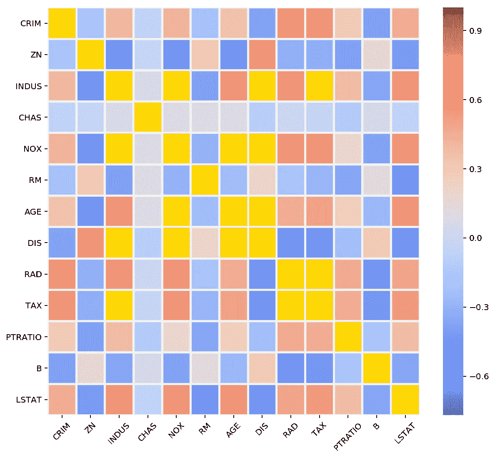

# Python 2021 中的遮罩概念

> 原文：<https://towardsdatascience.com/the-concept-of-masks-in-python-50fd65e64707?source=collection_archive---------2----------------------->


照片由[皮勒-张力尹·普里斯克](https://unsplash.com/@pillepriske?utm_source=medium&utm_medium=referral)在 [Unsplash](https://unsplash.com?utm_source=medium&utm_medium=referral) 拍摄

## NumPy 的一个有趣特性是过滤不需要的数据

> 所有的男人都是雕塑家，不断凿掉他们生活中不想要的部分，试图创造出他们心目中的杰作……艾迪·墨菲

如果您想知道如何在您的数据科学项目或 Python 编程中过滤或处理不需要的、缺失的或无效的数据，那么您必须学习有用的概念**屏蔽**。在这篇文章中，我将首先引导你通过一个一维数组的例子，然后是二维数组(矩阵)，然后提供一个数据科学问题中屏蔽的**应用。**

# 一维数组

假设我们有以下 NumPy 数组:

```
import numpy as nparr = np.array([1, 2, 3, 4, 5, 6, 7, 8])
```

现在，我们想计算小于 4 和大于 6 的元素之和。一个**繁琐的方法**是使用 for 循环，检查一个数字是否满足这些条件，然后将它添加到一个变量中。这将类似于:

```
total = 0    # Variable to store the sumfor num in arr:
    if (num<4) or (num>6):
        total += numprint(total)
>>> 21
```

您可以使用**列表理解**将这段代码简化为一行代码，

```
total = sum([num for num in arr if (num<4) or (num>6)])
>>> 21
```

使用**屏蔽**的概念可以实现相同的任务。它基本上使用一个布尔值列表**(真/假)**，当应用于原始数组时，返回感兴趣的元素。这里，**真**是指满足条件的元素(在我们的例子中小于 4 且大于 6)，假**是指不满足条件的元素。**

让我们首先手动创建这个遮罩。

```
mask = [True, True, True, False, False, False, True, True]
```

接下来，我们使用索引将这个掩码(布尔列表)传递给我们的数组。这将只返回满足条件的元素 **。然后你可以对这个子数组求和。下面的片段解释了它。您会注意到，您没有得到 4、5 和 6，因为相应的值为**假**。**

```
arr[mask]
>>> array([1, 2, 3, 7, 8])arr[mask].sum()
>>> 21
```

# Numpy 的 MaskedArray 模块

Numpy 提供了一个名为`ma`的**内置 MaskedArray 模块**。该模块的`masked_array()`功能允许您直接创建一个“屏蔽数组”，其中不满足条件的元素将被渲染/标记为**“无效”**。这是通过使用`mask`参数实现的，该参数包含真/假或值 0/1。

**注意**:现在，当`mask=False`或`mask=0`时，字面意思是**不要**将该值标记为无效。简单地说，**在计算过程中包含**它。同样，`mask=True`或`mask=1`表示将该值标注为无效。相比之下，之前你看到当我们使用索引时，假值被**排除在外。**

因此，你现在必须在使用 `**ma**` **模块**的同时**交换真假值。所以，新的面具变成了**

`mask = [False, False, False, True, True, True, False, False]`

```
import numpy.ma as ma"""First create a normal Numpy array"""
arr = np.array([1, 2, 3, 4, 5, 6, 7, 8])ma_arr = ma.masked_array(arr, mask=[False, False, False, True, 
                                    True, True, False, False])
>>> masked_array(data=[1, 2, 3, --, --, --, 7, 8],
             mask=[False, False, False,  True,  True,  True, False, 
                   False], fill_value=999999)
ma_arr.sum()
>>> 21
```

屏蔽(无效)值现在由`--`表示。得到的 **masked_array** 的形状/大小与原始数组**相同**。以前，当我们使用`arr[mask]`时，得到的数组与原始数组长度不同，因为无效元素不在输出中。这个特性允许对长度相等但掩码不同的数组进行简单的算术运算。

像以前一样，您也可以使用列表理解来创建遮罩。然而，因为您想要交换**真值**和**假值**，所以您可以使用波浪号运算符`~`来反转布尔值。

```
"""Using Tilde operator to reverse the Boolean"""
ma_arr = ma.masked_array(arr, mask=[~((a<4) or (a>6)) for a in arr])ma_arr.sum()
>>> 21
```

也可以使用由 0 和 1 组成的掩码。

```
ma_arr = ma.masked_array(arr, mask=[0, 0, 0, 1, 1, 1, 0, 0])
```

根据屏蔽条件的类型，NumPy 提供了几个其他的内置屏蔽，可以避免您手动指定布尔屏蔽的任务。很少有这样的情况:

*   小于(或小于等于)一个数字
*   大于(或大于等于)一个数字
*   在给定的范围内
*   在给定范围之外

## **小于(或小于等于)一个数**

功能`masked_less()`将屏蔽/过滤数值**小于**的数值。

```
arr = np.array([1, 2, 3, 4, 5, 6, 7, 8])ma_arr = ma.masked_less(arr, 4)
>>> masked_array(data=[--, --, --, 4, 5, 6, 7, 8],
                 mask=[True, True, True, False, False, False, 
                       False, False], fill_value=999999)ma_arr.sum()
>>> 30
```

要将小于或等于的值**过滤为一个数字，使用`masked_less_equal()`。**

## **大于(或大于等于)一个数字**

我们使用函数`masked_greater()`来过滤大于 4 的值**。**

```
arr = np.array([1, 2, 3, 4, 5, 6, 7, 8])ma_arr = ma.masked_greater(arr, 4)>>> masked_array(data=[1, 2, 3, 4, --, --, --, --],
                 mask=[False, False, False, False, True, True, 
                       True, True], fill_value=999999)ma_arr.sum()
>>> 10
```

同样，`masked_greater_equal()`将大于或等于的值**过滤为 4。**

## 在给定的范围内

函数`masked_inside()`将屏蔽/过滤位于两个给定数值之间的值(包括两个给定数值)。以下过滤值介于 4 和 6 之间。

```
arr = np.array([1, 2, 3, 4, 5, 6, 7, 8])ma_arr = ma.masked_inside(arr, 4, 6)
>>> masked_array(data=[1, 2, 3, --, --, --, 7, 8],
                 mask=[False, False, False, True, True, True, 
                       False, False], fill_value=999999)ma_arr.sum()
>>> 21
```

## 在给定范围之外

函数`masked_inside()`将屏蔽/过滤位于两个给定数值之间的值(包括两个给定数值)。以下过滤值在 4-6 之外。

```
arr = np.array([1, 2, 3, 4, 5, 6, 7, 8])ma_arr = ma.masked_outside(arr, 4, 6)
>>> masked_array(data=[--, --, --, 4, 5, 6, --, --],
                 mask=[True, True, True, False, False, False, 
                       True, True], fill_value=999999)ma_arr.sum()
>>> 15
```

## 算术运算期间忽略`NaN`和/或`infinite`值

***这是一个很酷的功能！*** 现实的数据集往往有很多缺失值(nan)或者一些奇怪的无穷大值。这样的值在计算中会产生问题，因此要么被忽略，要么被估算。

例如，这个一维 NumPy 数组的和或平均值将是`nan`。

```
arr = np.array([1, 2, 3, np.nan, 5, 6, np.inf, 8])
arr.sum()
>>> nan
```

您可以使用`masked_invalid()`很容易地排除 NaN 和 infinite 值，这将从计算中排除这些值。这些无效值现在将被表示为`--`。在处理数据科学问题中大型数据集中的缺失数据时，这个特性**非常有用**。

```
ma_arr = ma.masked_invalid(arr)
>>> masked_array(data=[1.0, 2.0, 3.0, --, 5.0, 6.0, --, 8.0],
                 mask=[False, False, False, True, False, False,
                       True, False], fill_value=1e+20)ma_arr.mean()
>>> 4.166666666666667
```

假设您想用剩余有效值的平均值估算或填充这些 **NaNs** 或 **inf** 值。你可以使用`filled()`很容易地做到这一点，

```
ma_arr.filled(ma_arr.mean())
>>> [1., 2., 3., 4.16666667, 5., 6., 4.16666667, 8.]
```

# 屏蔽二维阵列(矩阵)

通常，您的大数据是大型二维矩阵的形式。让我们看看如何对矩阵使用掩码。考虑下面的 3×3 矩阵。

```
arr = np.array([[1, 2, 3],
                [4, 5, 6],
                [7, 8, 9]])
```

假设我们想计算列方向的总和，排除大于 4 的数字。**现在，我们必须使用** **一个二维遮罩**。如前所述，你也可以在下面使用真/假的二维遮罩。

```
ma_arr = ma.masked_array(arr, mask=[[0, 0, 0],
                                    [0, 1, 1],
                                    [1, 1, 1]])>>> masked_array(data=[[1, 2, 3],
                       [4, --, --],
                       [--, --, --]],
                 mask=[[False, False, False],
                       [False, True, True],
                       [True, True, True]], fill_value=999999)"""Column-wise sum is computed using the argument axis=0"""
ma_arr.sum(axis=0)>>> masked_array(data=[5, 2, 3], mask=[False, False, False],
                 fill_value=999999)
```

在上面的代码中，我们使用 0 和 1 手动创建了一个二维遮罩**。通过使用与前面一维情况相同的**功能**，您可以使您的生活更加轻松。这里可以用`masked_greater()`排除大于 4 的值。**

```
ma_arr = ma.masked_greater(arr, 4)ma_arr.sum(axis=0)
>>> masked_array(data=[5, 2, 3], mask=[False, False, False],
                 fill_value=999999)
```

**注意:**你可以使用所有的函数，前面显示的函数适用于一维，也适用于二维数组。

# 数据科学问题中屏蔽的使用

任何数据科学项目的常规任务都是探索性数据分析(EDA)。这方面的一个关键步骤是可视化输入要素之间的统计关系(相关性)。例如，皮尔逊相关系数提供了两个变量之间线性相关性的度量。

让我们考虑一下**波士顿住房数据集**并计算相关矩阵，得出范围在-1 和 1 之间的系数。

```
import pandas as pd
import seaborn as sns
import matplotlib.pyplot as plt
from sklearn.datasets import load_bostonboston = load_boston()
df = pd.DataFrame(boston.data, columns=boston.feature_names)
```

现在让我们使用 Seaborn 库绘制相关矩阵。

```
correlation = df.corr()ax = sns.heatmap(data=correlation, cmap='coolwarm', 
                 linewidths=2, cbar=True)
```


波士顿住房数据集的输入要素的相关矩阵。

现在，假设您想要突出显示或轻松区分**绝对相关性超过 70%的值，即 0.7** 。上面介绍的掩蔽概念在这里发挥了作用。您可以使用前面解释过的`masked_outside()`函数来屏蔽您需要的值，并在 Seaborn 图中使用特殊颜色突出显示它们。

```
correlation = df.corr()"""Create a mask for abs(corr) > 0.7"""
corr_masked = ma.masked_outside(np.array(correlation), -0.7, 0.7)"""Set gold color for the masked/bad values"""
cmap = plt.get_cmap('coolwarm') 
cmap.set_bad('gold')ax = sns.heatmap(data=correlation, cmap=cmap, 
                 mask=corr_masked.mask, 
                 linewidths=2, cbar=True)
```



波士顿住房数据集的相关矩阵，其中掩膜值以金色高亮显示。

这就是我这篇文章的结尾。如果您想用即将发布的 Python 3.10 版本和 Matplotlib 3 中的最新特性来更新自己，请阅读我的以下文章。

[](/python-in-2021-timeline-and-upcoming-features-c8369abbcc52) [## 2021 年的 Python 时间表和即将推出的功能

### Python 3.10 的一些新特性的预览

towardsdatascience.com](/python-in-2021-timeline-and-upcoming-features-c8369abbcc52) [](/whats-new-in-matplotlib-3-1b3b03f18ddc) [## Matplotlib 3 的新特性

### 第 3 代中最重要的更新概述

towardsdatascience.com](/whats-new-in-matplotlib-3-1b3b03f18ddc)