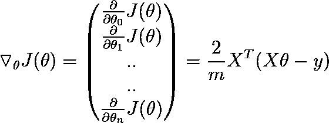

# 什么是线性回归？

> 原文：<https://towardsdatascience.com/the-concepts-behind-linear-regression-and-its-implementation-ffbab5a4d65e?source=collection_archive---------8----------------------->

## -建立自己的线性回归模型


照片由[弗兰基·查马基](https://unsplash.com/@franki?utm_source=medium&utm_medium=referral)在 [Unsplash](https://unsplash.com?utm_source=medium&utm_medium=referral) 上拍摄

**在本文中，您将了解到—**

1.  **什么是线性回归？**
2.  **它如何找到输入特征和目标之间的关系？**
3.  **它是如何预测的？**
4.  **如何评价预测？**
5.  **如何用代码实现？**

# 什么是线性回归？

它试图找出输入特征和目标变量(y)之间的最佳线性关系。

就是这样！这就是线性回归的作用。很简单，对吧？😃

在机器学习行话中，上述内容可以表述为“这是一种受监督的机器学习算法，它最适合将目标变量(因变量)作为输入特征(自变量)的线性组合的数据。”

**注**

1.  目标变量也称为独立变量或标签。
2.  输入特征也称为因变量。

# 如何可视化线性回归？


(左)萨斯维克的图像(右)萨斯维克的图像

现在，当您考虑线性回归时，请考虑拟合一条直线，使数据点和直线之间的距离最小。如上所示，红线比其他蓝线更符合该数据。

在 2D，输入要素和输出之间的线性关系就是一条直线。

是啊！线性回归试图找出输入和输出之间的最佳线性关系。

```
y = θx + b  # Linear Equation
```

线性回归的目标是找到代表给定数据的θ和 b 的最佳值。

我们将在本文后面详细了解它。

好吧！是时候深入研究线性回归了。

# 线性回归算法如何预测？

现在，让我们认为我们已经获得了输入要素和标注之间的适当线性关系(稍后解释)。现在，我们关注线性回归模型如何利用获得的关系预测实例的值。


线性回归(数据不是原始的，它是为了举例而创建的)

根据上图中的数据，线性回归将获得方程 y= 0.5*x + 1 的直线关系。(如果你不知道如何找到线性关系，不要担心，找到它的方法将在后面详细讨论。)

y =年收入

x =经验

`1`是截距或偏差项，`0.5`是`Experience`的特征权重

因此，如果该模型给出了一个有 8 年工作经验的人的新的点数据点(橙色点)，那么它会预测此人每年会赚 50k 美元左右。

模型预测的一般形式


线性回归模型的预测


这包含了特定点的所有特征值，除了相应的目标值。

θ是模型的参数向量，包含偏差项θ0 和特征权重θ1 至θn。(n =特征数量)

您可以将特征权重视为线性方程中特征的系数。

x 是实例(数据集中的一个数据点)的特征向量，包含 x0 到 xn，其中 x0 始终等于 1

θ x 是矢量θ和 x 的点积，当然等于θ0x0 + θ1x1 + θ2x2 + … + θnxn。

θj 是第 j 个模型参数(包括偏差项θ0 和特征权重θ1，θ2，⋯，θn)。

这里θ，x 是列向量，你们马上会看到。

该模型替换模型预测方程中给定的新实例 x^(i 特征值，并将获得的值作为预测返回。

请记住，我们使用的是线性回归，它假设输入和输出(目标变量)之间只有线性关系。它不适用于数据中没有线性关系的问题。

这就是为什么模型预测方程的输入特征幂为 1(线性),这也解释了为什么我们在模型预测方程中没有(x0)或(x2)这样的项。

**注:**

如果这些符号没有意义，请继续阅读后面的部分，这些符号用一个例子解释，可以帮助你理解它们。然后回来重新阅读这一部分，这可能会使事情变得更容易。

**偏置项**

在线性回归中，我们将添加一个偏差项以获得无偏的结果。(如果我们**不**添加此项，则不会有截距，并且假设最佳拟合线穿过原点，同时截距为零，但并非每个数据集都是如此)。

*我们已经知道了线性回归模型是如何预测的，但是我们如何评估这些预测并衡量它们的准确性呢？*

*[***成本函数***](https://en.wikipedia.org/wiki/Loss_function) *将为我们完成这项工作。**

# *评估预测*

***成本函数***

*它评估模型的预测，并告诉我们模型的预测有多准确。成本函数值越低，模型的预测就越准确。有许多成本函数可供选择，但我们将使用均方误差(MSE)成本函数。*

*MSE 函数计算预测值和实际值(y)之差的平均值。*

**

*均方误差*

*让我们分解等式中的每个变量。*

************

*记住 x⁰(bias)的任何实例 j 是 1*

***举例理解符号***

*如果你在理解变量代表什么方面有困难，让我们试着用一个例子来理解它们。*

*让我们假设您有一个数据集，其中预测了具有以下特征的房子的价格— *大小、房间、家庭(“偏差”列表示将添加到每个样本中的偏差项，它不是一个特征)*。它有五个样本。根据面积、房间数量、家庭成员等属性，我们可以预测房子的价格。*

*特征=大小、房间、家庭=因变量*

*目标(或)标签=价格=自变量*

**

*m = 5*

****

# *它如何找到目标和输入特征之间的关系？*

*找到正确的关系意味着找到每个特征的精确特征权重(θj ),因为只有找到正确的特征权重才能给出可用于预测的正确线性方程。*

*有两种方法可以在数据中找到正确的关系。*

1.  *正态方程*
2.  *梯度下降*

***正规方程***

**

*正态方程*

****

*这是一个直接方程，它将直接给出优化值，无需任何进一步的步骤。*

*通过计算上述等式，您将得到特征权重的优化值。*

*现在让我们看看如何在代码中实现这一点。*

*首先，让我们创建一些具有线性关系的数据。*

*准备数据*

*现在我们有了数据，让我们看看如何借助法线方程找出特征权重(θ0，… θn)的值。*

*正规方程线性回归*

*您已经看到，它预测的特征权重非常接近实际值(y = 5 + 3*X +高斯噪声)，但是由于数据中的噪声，它无法预测精确值，但是预测值足够接近。*

***正规方程的缺点***

1.  *如果您有大量的要素，那么计算成本会很高。*
2.  *如果在你的数据中有任何冗余特征，它们在正规方程中的矩阵求逆是不可能的。在这种情况下，逆可以用伪逆代替。*

***梯度下降***

**

*照片由[凯文·克拉克](https://unsplash.com/@donnay_ca?utm_source=medium&utm_medium=referral)在 [Unsplash](https://unsplash.com?utm_source=medium&utm_medium=referral) 上拍摄*

*我们可以使用梯度下降法，而不是进行复杂的矩阵运算(当我们有大量特征时，这可能会减慢处理速度),梯度下降法将在更短的时间内产生大量特征的良好结果。*

***直觉***

*假设你在一座山顶上，你想尽快下山，但是天很阴，你看不到下山的路。你可能会想到的一个解决方案是考虑你周围所有可能的方向，并朝着最有可能下降的方向前进。*

*同样的想法可以应用于线性回归，但这里的问题是最小化成本函数。*

**如果你* ***不知道*** *什么是梯度，记住计算一个函数的梯度给了我们最大化函数值的方向。**

***应用梯度下降找到优化的特征权重***

*首先，特征权重必须用随机值初始化。*

*然后对每个模型参数(特征权重)θj 计算函数的梯度，换句话说，它估算了如果我们把θj 改变一点点，代价函数会改变多少(这就是所谓的偏导数)。*

**

*计算每个特征权重θj 的偏导数的矢量化形式为*

**

*矢量化形式*

*计算一个函数的梯度给出了使该函数最大化的方向，但是我们想要最小化它，所以我们将向相反的方向移动。*

*优化特征权重θ的步骤是*

**

*梯度下降步骤*

**

*在最小化成本函数的方向上采取步骤之后，我们将获得成本函数值最小的特征权重的优化值。*

***学习率***

**

*(左)学习率小时(右)学习率大时。*

*我们将在最小化成本函数的方向上采取多个小步骤，而不是在正确的方向上大量改变特征权重的值，这可能超过实际的最小值。学习速度决定了步长的大小。*

*我们必须小心选择学习速度。如果学习率太低，需要很长时间才能收敛到正确的解，或者学习率太高，可能会过冲全局最小值。*

***局部最小值的问题***

*您正在使用梯度下降来最小化成本函数，但是如果您陷入局部最小值怎么办？*

*幸运的是，对于均方误差成本函数，我们没有这个问题，因为它是一个凸函数，即它只有一个全局最小值，没有局部最小值。*

**

*均方误差函数(图像由 Sathwick 提供)*

***实施梯度下降***

*梯度下降线性回归*

*有趣的是，我们从梯度下降法中得到了与正规方程相同的结果，同样只需要 50 次迭代。*

*好吧！那很好。但是我们如何知道在哪个迭代中我们将得到优化的特征权重呢？*

*当我们接近成本函数的最小值时，梯度下降中的偏导数接近零，并且当乘以小于 1 的学习时，学习步骤变得更小，这确保了在所有迭代结束时，我们将非常接近实际的特征权重(假定您已经选择了不太大的适当学习速率)*

***梯度下降的缺点***

1.  *如果使用另一个非凸形的成本函数，梯度下降有可能陷入局部最小值。*
2.  *你应该为学习率找到合适的值。*

***在 Scikit-Learn 中实现线性回归***

*使用 sklearn 进行线性回归*

*Scikit-Learn 提供了一个 LinearRegression 类来执行线性回归*

*正如你所看到的，我们从正规方程，梯度下降，sklearn 得到的值几乎是一样的。*

*好吧，如果你已经读到这里，一切都有意义，拍拍自己的背吧！。你已经学习了线性回归的所有基本概念。*

***高维(多特征)数据怎么办？***

**

*3D 线性回归(图片由 Sathwick 提供)*

*到目前为止，我们已经看到了二维数据的线性回归。我们知道，二维的线性回归是通过一条线实现的，类似地，在三维数据中，这条线被一个平面代替，对于高于三维的数据，我们使用一个超平面，其余步骤是相同的。*

*简单地说，输入要素的数量增加，要素权重计算增加。*

*我会让你自己在更高的维度上研究更多的数据，但基本概念保持不变。*

*干得好！👏你成功了。现在你可能对线性回归有了更好的了解。*

# *结论*

*线性回归是一种广泛应用于回归问题的技术。它可以用来从自变量预测因变量。它在自变量的数据(训练数据)中搜索因变量的关系。在二维数据的情况下，它仅仅是一个线性方程。它使用这个线性方程(在训练期间从数据中找到的关系)来预测它以前没有见过的数据的值。这就是线性回归背后的全部思想。*

*确保你理解梯度下降部分。梯度下降是最广泛使用的优化技术之一。梯度下降技术在机器学习甚至深度学习中几乎无处不在。*

***感谢阅读！***

*   *如果你喜欢这篇文章， [*在 medium*](https://medium.com/@sathwickreddy) 上关注我。*
*   *下面我们连线上 [*LinkedIn*](https://www.linkedin.com/in/sathwick-reddy-mora-a546451b6) *。**