# 混乱矩阵被可视化

> 原文：<https://towardsdatascience.com/the-confusion-matrix-visualized-e778584c8834?source=collection_archive---------37----------------------->

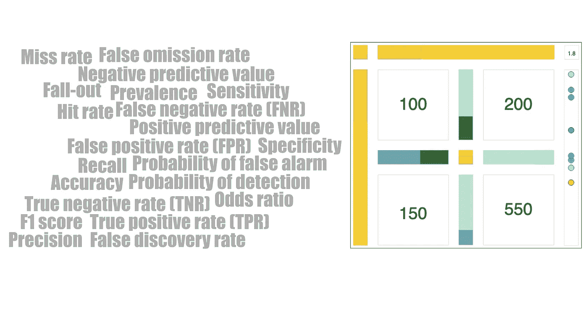

## 图形化的方法使与 2×2 矩阵相关的许多指标变得清晰明了。

我总是对 2×2 混淆矩阵的丰富性感到惊讶。毕竟，这只是四个数字，有多复杂？事实证明，我们可以获得丰富的见解。但是，混淆矩阵被用于商业、工程和科学的许多领域，每个领域都有自己的词汇，这一事实使情况变得模糊不清。

由于倾向于可视化，我创建了一个图表来帮助说明和理解许多概念。基本上，它是带有许多装饰者的混淆矩阵本身。

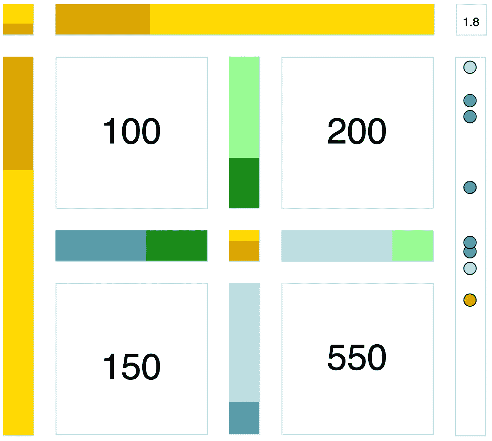

该图表是用 python 可视化包 Altair 创建的。带有图表代码的 Jupyter 笔记本可以从我的 GitHub([https://github.com/SorenLaursen/confusion_matrix_chart](https://github.com/SorenLaursen/confusion_matrix_chart))下载。此处，图表显示了所有图形项目的实际数值，例如作为工具提示的条块。

# 词汇

混淆矩阵将两个二进制类相互映射。我们在这里将这些分别称为行和列的( *Y* 、 *N* )和( *y* 、 *n* )。说明性地，这些可以表示一些标准的评估，例如一些组的成员资格(是，否)。

让我们开始探索混淆矩阵周围的词汇[1]。首先是四个数字本身:

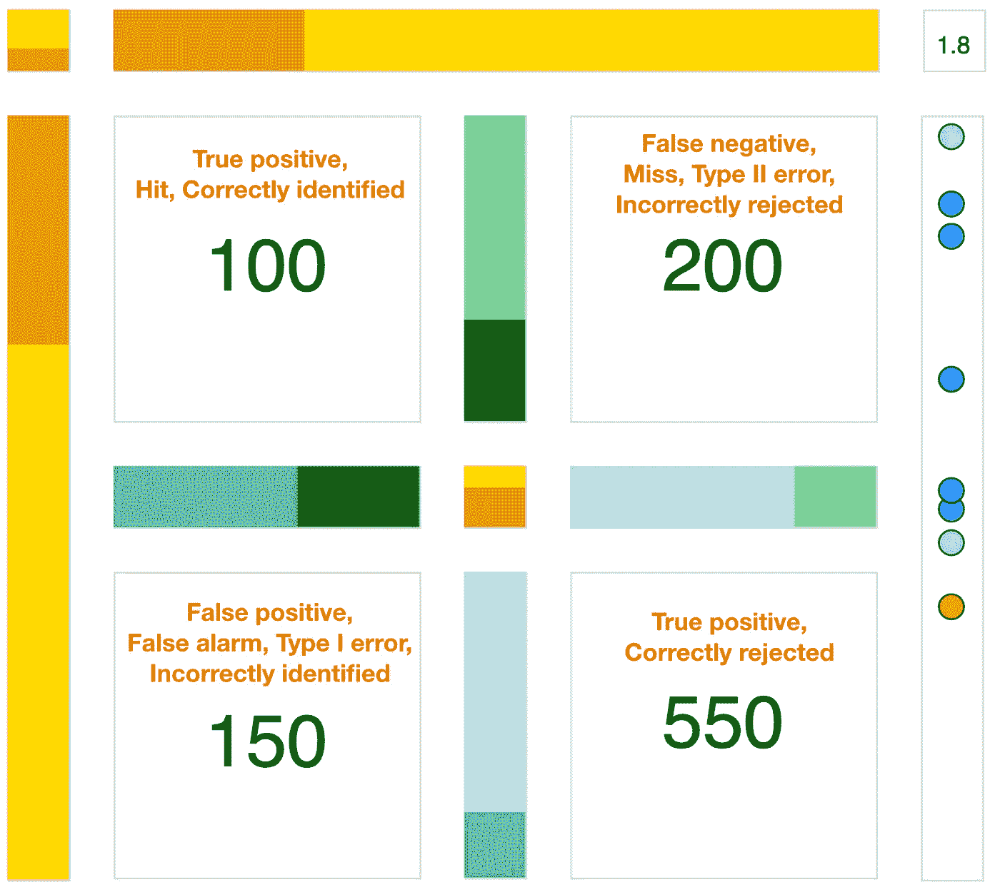

大多数选择都是直观易懂的。从四个数字衍生出的许多比率的众多名称变得更加混乱:

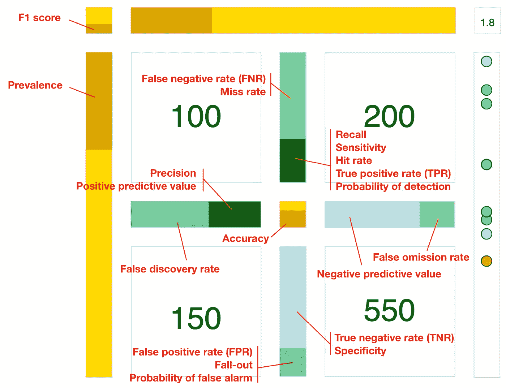

右边的装饰器稍微复杂一些，但是仍然基于这四个数字。

作为参考，我将介绍一个在实现代码中也使用的更简单的命名约定:

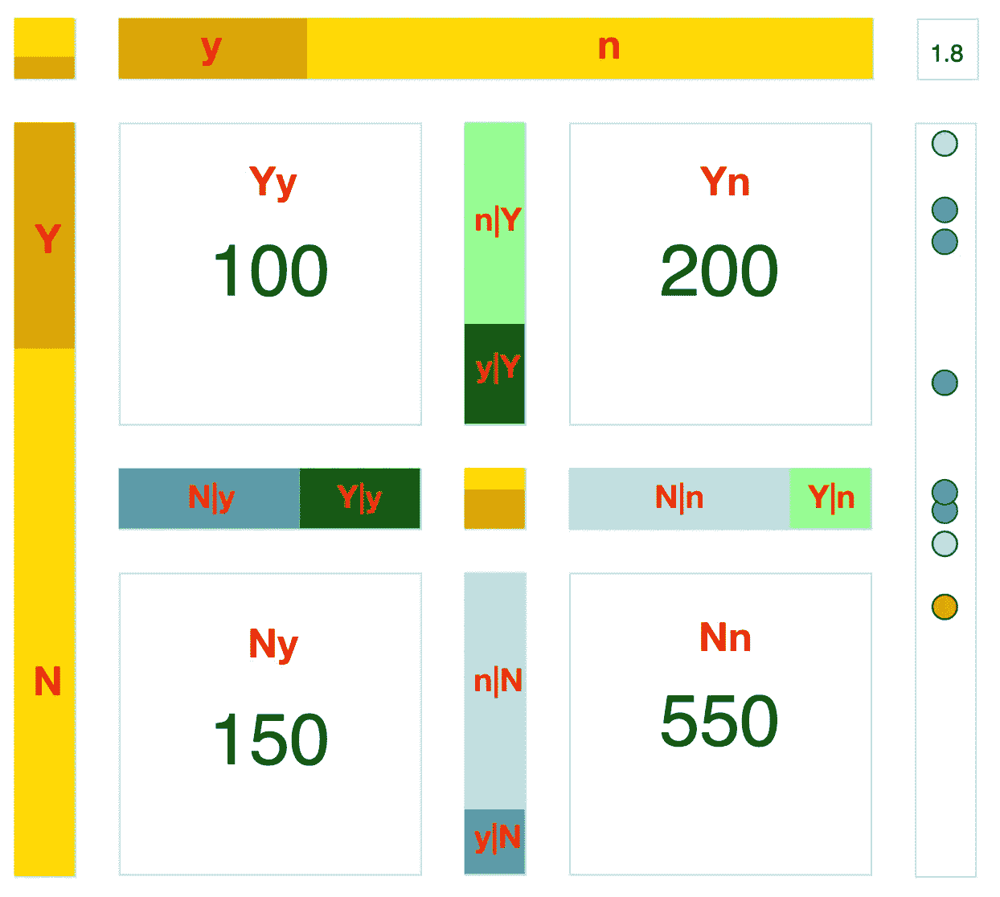

# 定义

接下来，让我们转向定义。四个数字之间的横条简单地说明了每个数字与成对总和的比率。换句话说，每个条形都是两个相邻数字的标准化堆积条形。

我们在这里将这四个杆称为*成对杆*。

当然， *a* | *b* 符号用于命名成对杆的段，暗示了将这些段理解为条件概率。

线对中线段的排序惯例是，与对角线上的数字相关的部分最靠近图表的中心。

左侧和顶部的金色条分别代表行总和和列总和。这两个条形都包含所有四个数字的信息。同样，条形应被认为是标准化的。

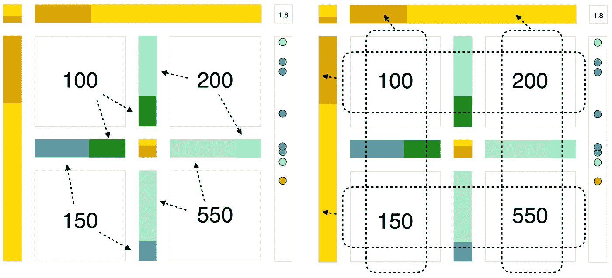

同样，中间的横条汇总了所有四个数字，这次不是以行和列的形式，而是以对角线和非对角线的形式。

与此相反，左上角的横条只代表四个数字中的三个。就是 F1 的分数即 2 ∙(*Y*|*Y*∙*Y*|*Y*)/(*Y*|*Y*+*Y*|*Y*)。换句话说，它是从两个深绿色段计算出来的。因子 2 意味着该条也被归一化。

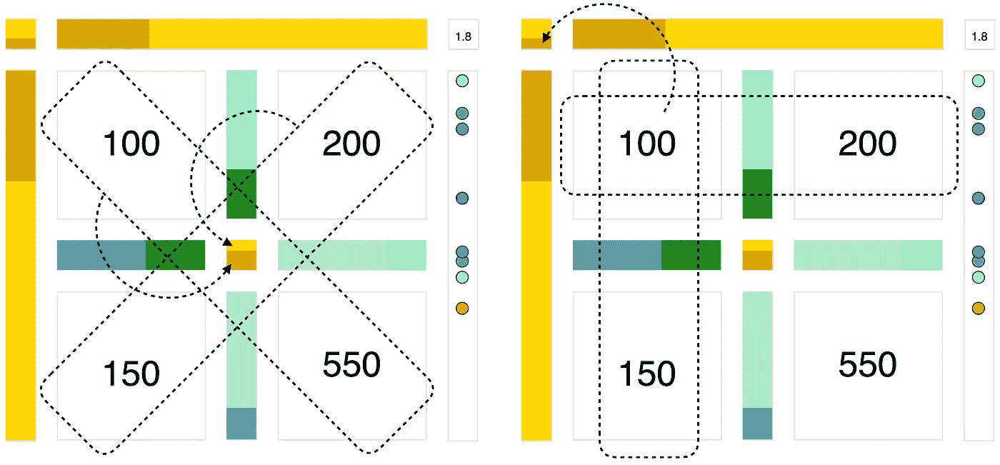

最后，优势比定义为

*或*=(*Yy*∙*Nn*)/(*Yn*∙*Ny*)。

笔记本中的实现应用了小计数校正(霍尔丹-安斯科姆校正)，即如果四个数字中的任何一个为零，那么所有四个数字都加上 0.5[2]。

可以看出，置信区间可以简单地近似为:

exp{ log( *或*)*cv*∙sqrt(1/*Yy*+1/*Yn*+1/*Ny*+1/*Nn*)}

其中临界值 *cv* ，取决于置信水平:90%: 1.64，95%: 1.96，99%: 2.58。

# 应用程序

让我们从混淆矩阵的一个经典应用开始。二战是雷达的早期。齿轮的灵敏度可以调整，但最佳设置是什么？提高雷达的灵敏度，大多数敌机都被发现了。但同时也有很多虚惊一场。降低灵敏度，有一些假警报，但现在一些敌机没有被发现，这是更糟糕的。我们想尽量减少假阴性。类似地，在癌症筛查项目中。我们不想错过任何一个真正患有癌症的人。这个结果是以一些假阳性为代价的。

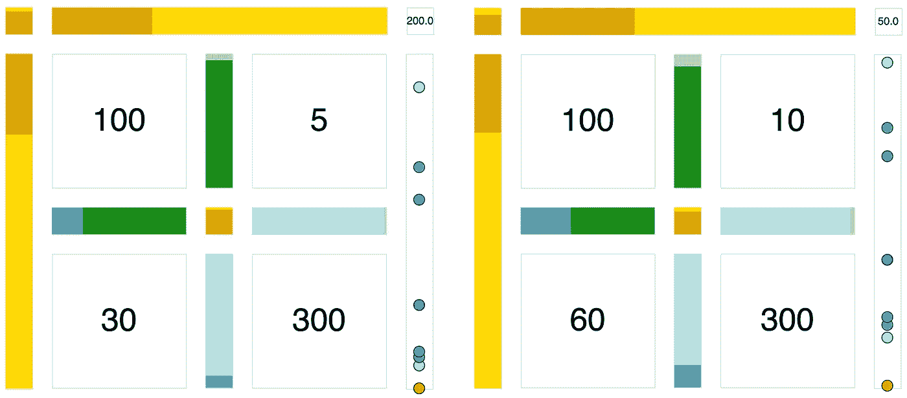

该空间中的分析通常是在垂直对杆上进行的。这些总结了所有四个数字的信息。显然，将一行中的两个数字乘以某个因子不会改变垂直对条。因此， *Y* 和 *N* 之间的分配不会影响这两个副杆。这导致这些成对条被用在一个特殊的图中，即接收机工作特性曲线或 ROC 曲线。

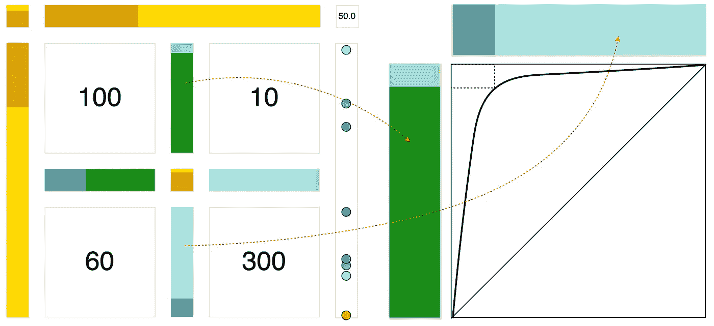

混淆矩阵表示一些样本，例如多个实验、多个患者或具有一些特定设备设置(即操作特性)的多个雷达测量。因此，特定混淆矩阵代表 ROC 曲线上的一个点。

由于垂直对条不依赖于 *Y* / *N* 分布，这意味着即使位置 A 的敌机比位置 B 多，位置 A 的雷达系统的测量值也可以与位置 B 的雷达系统的测量值进行比较。

有时，希望将假阳性( *Ny* )而不是假阴性( *Yn* )最小化。例如，垃圾邮件过滤器会将邮件标记为垃圾邮件。我们不希望一个正确的消息被标记为垃圾邮件，因为我们可能永远不会看到它。另一方面，如果收件箱中还有一些垃圾邮件，也不是什么大问题。另一个例子是广告活动:我们预测谁是目标群体。我们不想针对非目标受众开展昂贵的宣传活动。因此，尽量减少假阳性。因此，我们可能不会针对整个目标群体，但我们针对的人很可能是目标群体中的一员。

请注意，无论我们是最小化假阳性还是假阴性，都不能告诉我们要评估哪个度量。我们仍然可以使用垂直的双杠，但是现在我们将关注于 *y* | *N* 而不是 *n* | *Y* 。但是我们什么时候使用水平双杠呢？

数据集通常非常不平衡。例如所有信用卡交易中的欺诈性信用卡交易。看看下面两个例子。在右边的例子中，与左边的例子相比，第二行中的数字乘以 100。垂直对条不受影响，它们独立于患病率( *Y* )。此外，在这两种情况下，准确性(中心条)接近 100%。但是在第二种情况下，假阳性与真阳性相比的数量可能是毁灭性的。

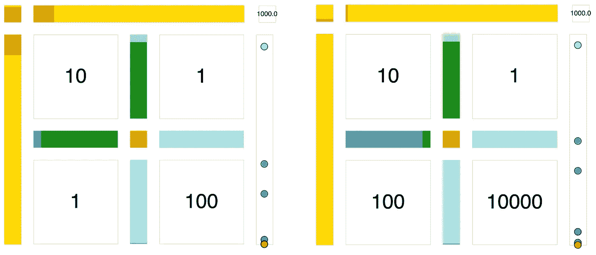

在严重不平衡的数据集中，真正的负数可能会占主导地位，在许多情况下，其他三个数字更令人感兴趣。请记住上面的定义部分，F1 分数——左上角的条形——是基于这三个数字的度量，实际上是基于 *y* | *Y* 和 *Y* | *y* ，即两个深绿色部分。可以看出，与准确性相反，F1 分数对两种情况之间的差异很敏感。

ROC 图概括了整体情况。对于不平衡的数据，有一个类似的图:精确召回图[3]。基本上，这两个图都是相互映射的两对棒线。为简单起见，我们在这里将这种图称为成对图。由于垂直对条与一行中的数字乘以一个公共因子无关(它们与患病率无关)，这两个病例位于 ROC 图上的同一点(左)。然而，在精确回忆图中，这两种情况截然不同。

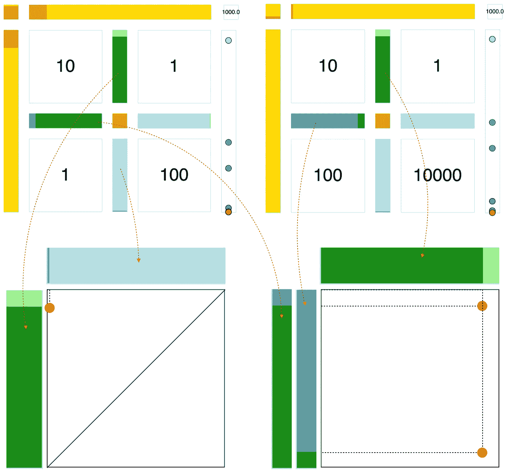

在我们可以控制患病率( *Y* )的情况下，两条曲线都适用。例如模型评估就是这种情况。我们有一个训练集来训练模型，即我们可以使用不同参数设置的同一个集。通过这种方式，我们可以构建已知患病率( *Y* )为常数的配对图。这与雷达的情况相反，在雷达的情况下，敌机的出现会随着地理位置和时间的不同而不同。

# 属国

到目前为止，我们已经查看了存在真值( *Y* ， *N* )和一些计算结果或经验测试结果( *y* ， *n* )的情况，并且我们使用我们的混淆矩阵和相应的派生度量来评估模型质量、医学测试质量、假设测试等。

但是 2×2 矩阵还有另一种用途，只是思路有点不同:两个二进制类是否独立？例如，20-29 岁年龄组( *Y* ， *N* )的会员资格是否与拥有汽车( *y* ， *n* )相关联？这也适用于以上所有的例子。在这个应用领域，矩阵通常被称为列联表。

这就是优势比(*或*)的由来。它在上面被定义为对角线数的乘积与非对角线数的乘积之比。如果*或*为 1，那么这两个类是独立的。在混淆矩阵图的*或*装饰器中——即右边的栏——深蓝色的点是*或*,橙色的点是 1。由于此*或描述*未被标准化，为方便起见，其值显示在右上框中。

*或*需要与 1 相差多少才能表示依赖关系？如上所述，对于*或*，很容易估计置信区间。在图表中，显示了置信度为 90%、95%和 99%的三个置信区间。请看下图中的例子(a)-(c)。在(a)中，1 在所有三个置信区间内，即无论置信水平如何，两个类别都是独立的。在(b)中，这两个类别依赖于或关联于 95%而不是 99%的置信水平。在(c)中，类是相关的，置信度为 99%。

一些说明性的例子:在(d)和(e)中，列中的数字和行中的数字是成比例的。显然，这些类是独立的，并且*或* = 1。在最后一个例子(f)中，非对角线的数量大于对角线的数量。类别之间的相关性很强，说明了这种分析的对称性。

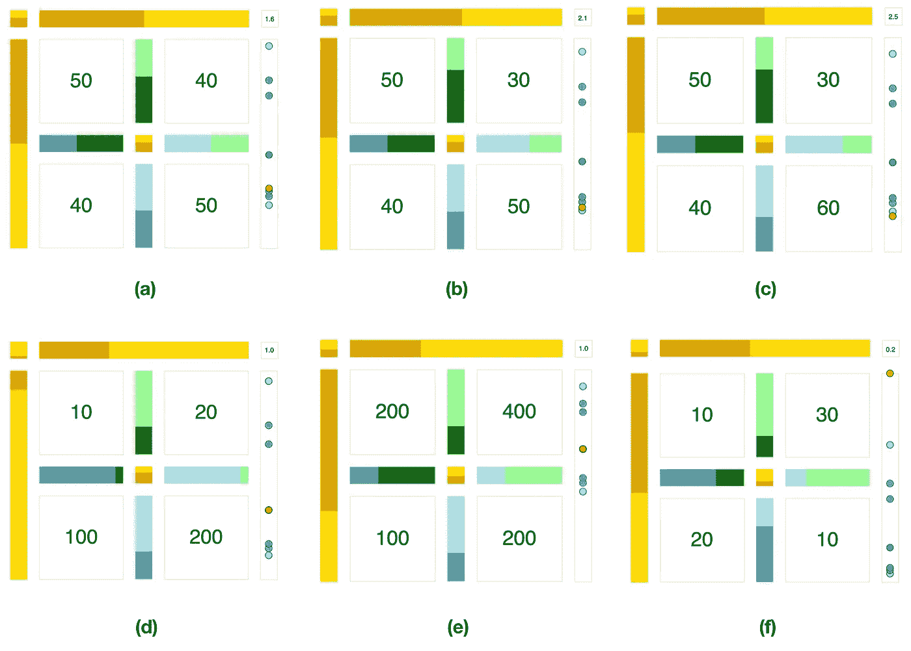

# 结束语

基于混淆矩阵创建可视化的动机是为了获得对基于四个数字的度量的定义和使用的一些见解。

对各种比率定义的详细记录以及对这些指标的深奥名称的应用应该与对图表中堆叠的、标准化的条形的直观理解相比较。此外，配对图的概念是两个配对柱的简单映射，它使 ROC 图和精密度-召回图的构建更加清晰，并说明了使用其中一个的原因。

最后，将比值比和置信区间添加到图表中增加了立即对类的依赖性或关联性做出精确结论的能力。

这些都是一目了然的见解。你可以随意下载 Jupyter 笔记本，玩混乱矩阵图([https://github.com/SorenLaursen/confusion_matrix_chart](https://github.com/SorenLaursen/confusion_matrix_chart))。

[1]混乱矩阵，维基百科(【https://en.wikipedia.org/wiki/Confusion_matrix】T2)

[2] *拉斐尔·伊里扎里:*数据科学导论(2020) — 15.10.4 比值比，[https://rafalab.github.io/dsbook/inference.html](https://rafalab.github.io/dsbook/inference.html)

[3] *Takaya Saito，Marc Rehmsmeier:* ROC 和 precision-recall with unbalanced datasets(2015)[https://classe val . WordPress . com/simulation-analysis/ROC-and-precision-recall-with-balanced-datasets/](https://classeval.wordpress.com/simulation-analysis/roc-and-precision-recall-with-imbalanced-datasets/)