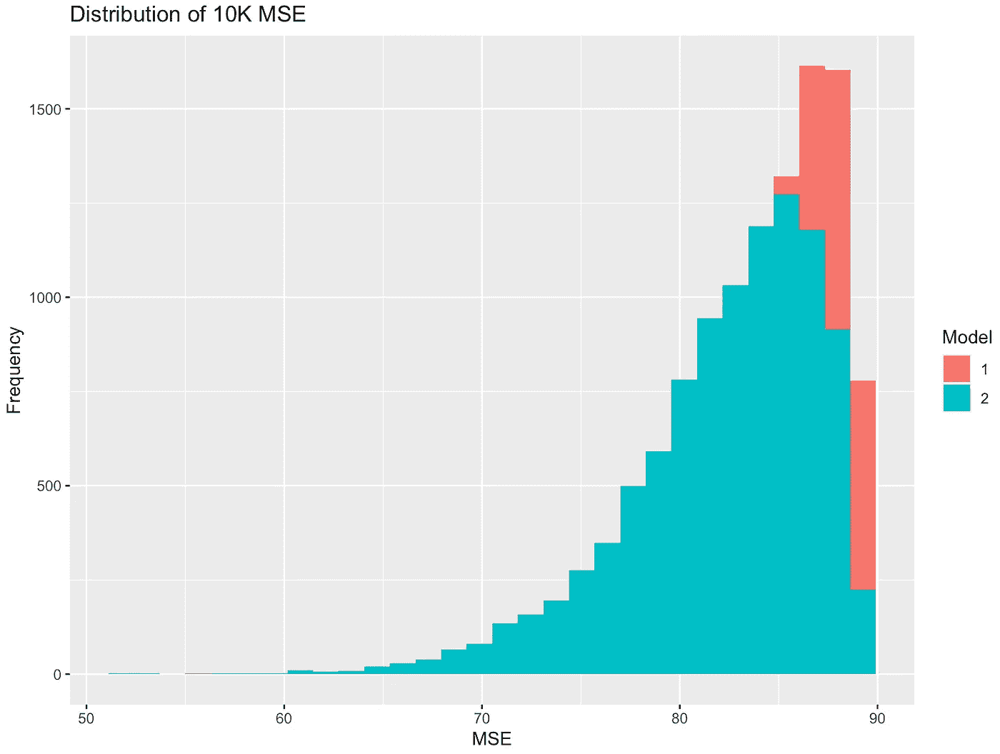
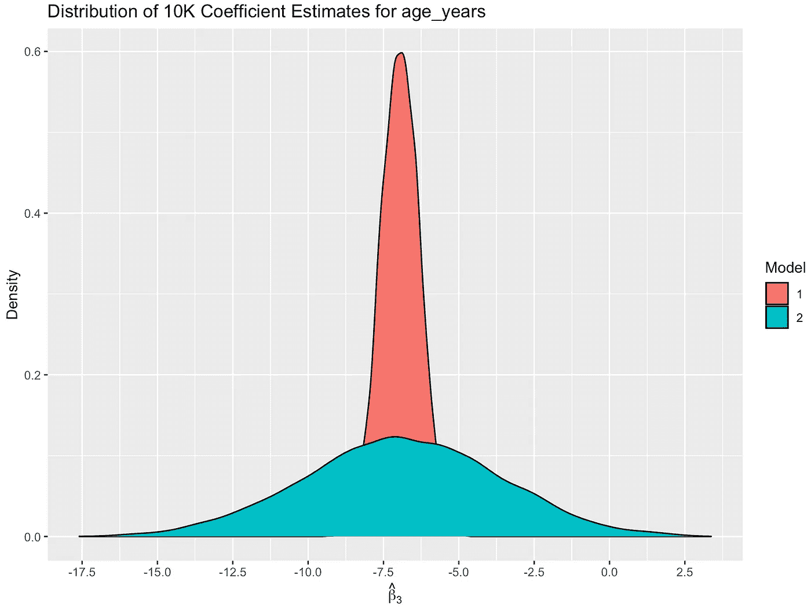
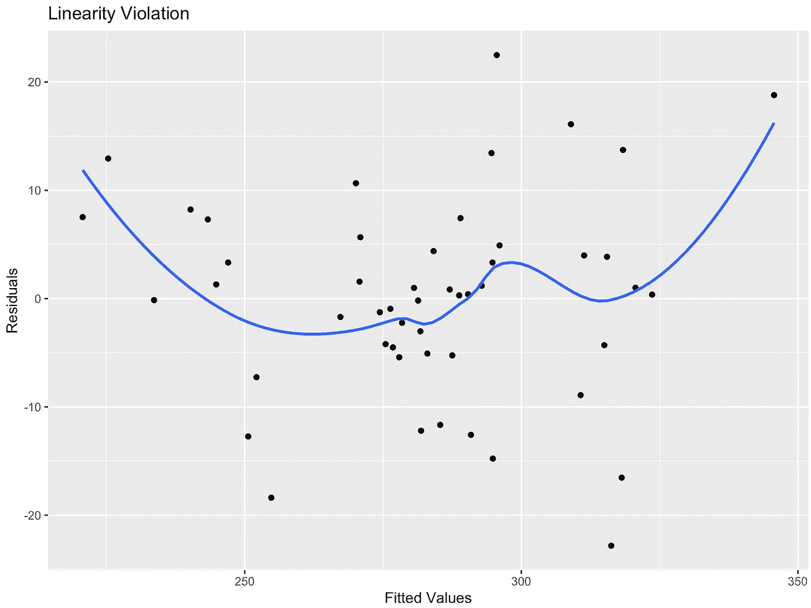
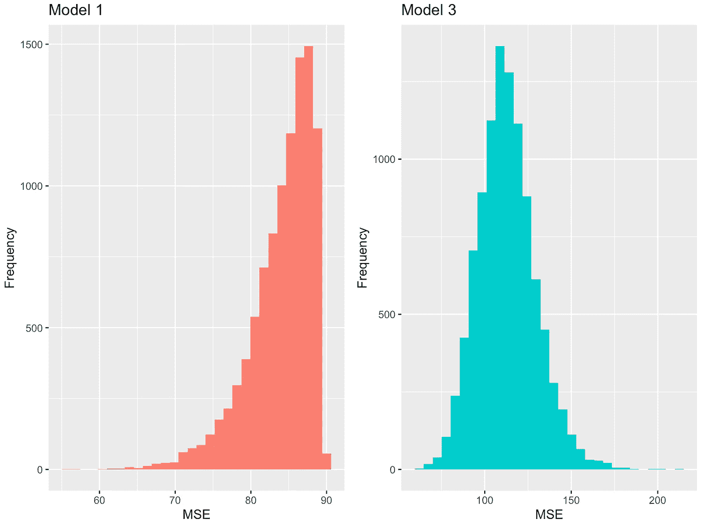
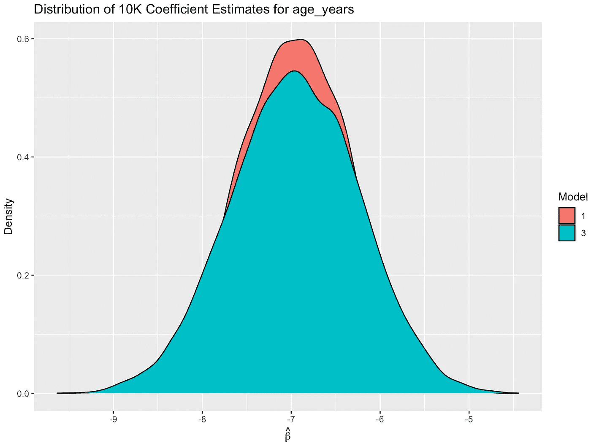
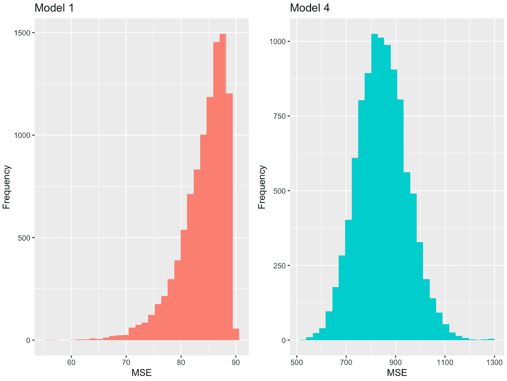
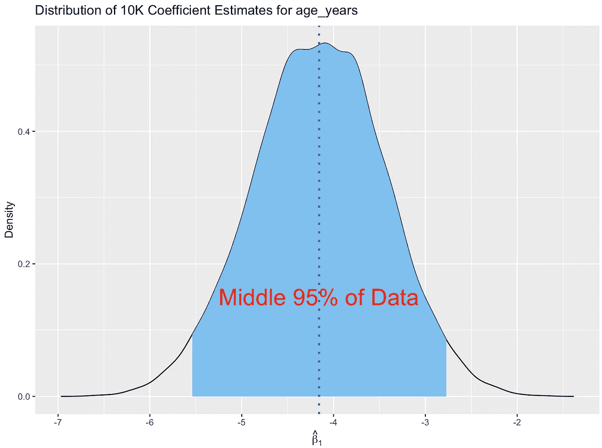

# 违反线性回归假设的后果

> 原文：<https://towardsdatascience.com/the-consequences-of-violating-linear-regression-assumptions-4f0513dd3160?source=collection_archive---------10----------------------->

## 违反假设会如何影响预测和推断

图片由 Mathilda Khoo 在 [Unsplash](https://unsplash.com/photos/HLA3TAFQuQs) 上拍摄

# **动机**

最近，一个学习线性回归的朋友问我，当违反像多重共线性这样的[假设](https://365datascience.com/ols-assumptions/)时会发生什么。尽管我以前是统计学专业的学生，但我只能给他一些笼统的回答，比如“你不会相信你的模型的估计值。”由于对我的回答不满意，我决定通过模拟创建一个真实世界的例子，来展示当某些假设被违反时，预测和推理会发生什么。

# **模拟**

假设研究人员有兴趣了解是什么推动了房价。让我们假设房价仅仅由两个变量决定:房子的大小和房龄。虽然年龄与价格呈负线性关系，但房子的大小与价格呈正二次(非线性)关系。从数学上讲，我们可以这样模拟这种关系:

*priceᵢ=β₀+β₁*sqftᵢ+β₂*sqftᵢβ₃*age_yearsᵢ+eᵢ*

其中 *Price* 是房屋的价格，单位为千美元， *sqft* 是房屋的面积，单位为千平方英尺， *age_years* 是房屋的使用年限。残差 *e* 正态分布，均值为 0，方差 *σ* ₑ *。*让我们称之为真实模型，因为它考虑了推动房价的一切因素(不包括残差)。由于研究人员没有水晶球告诉他们真正的模型是什么，他们测试了一些线性回归模型。以下是他们得出的结论，排名不分先后:

(1)*priceᵢ=β₀+β₁*sqftᵢ+β₂*sqftᵢβ₃*age_yearsᵢ+eᵢ*

(2)*priceᵢ=β₀+β₁*sqftᵢ+β₂*sqftᵢβ₃*age_yearsᵢβ₄*age_monthsᵢ+eᵢ*

(3)*priceᵢ=β₀+β₁*sqftᵢβ₂*age_yearsᵢ+eᵢ*

(4)*priceᵢ=β₀β₁*age_yearsᵢ+eᵢ*

研究人员很聪明，找到了真正的模型(模型 1)，但其他模型(模型 2、3 和 4)违反了某些 OLS 假设。最后，假设有 10K 的研究人员进行了同样的研究。每个人都从房屋群体中选取了 50 个独立的观察值，并将上述模型与数据进行拟合。通过检查这些 10K 模型的结果，我们可以看到这些不同模型的行为。下表显示了用于模拟数据的关键参数(完整代码可在[这里](https://github.com/hajimealabanza/Assumptions_Simulation/blob/master/simulation.R)找到):

# **结果**

## **无多重共线性违规**

(2)*priceᵢ=β₀+β₁*sqftᵢ+β₂*sqftᵢβ₃*age_yearsᵢβ₄*age_monthsᵢ+eᵢ*

研究人员在组装模型 2 时非常疲劳，没有意识到他们包括了两个衡量房屋年龄的指标:*年龄 _ 年*和*年龄 _ 月*。检查多重共线性的一个好方法是查看[方差膨胀因子](https://www.statisticshowto.com/variance-inflation-factor/) (VIF)。根据经验，大于 5 的 VIF 表示多重共线性，对于 *age_years* 和 *age_months 都是如此。*让我们从比较模型 2 和模型 1(真实模型)的预测能力开始。[均方误差](https://www.statisticshowto.com/mean-squared-error/) (MSE)是一个很好的预测指标，它告诉你一个模型的预测与实际值有多接近。下图显示了从所有 10K 研究人员处收集的 MSE 分布。

作者图片

两个模型之间的 MSE 非常相似，这意味着多重共线性违规不会真正影响预测。推论如何，或者换句话说，模型的解释能力如何？结果是，模型 2 和模型 1 对*年龄 _ 年*、 *β₃* 的系数估计有很大不同:

平均而言，两个模型的系数估计在-7 处是无偏的。然而，很明显，对于模型 2，样本之间的差异要大得多。这是什么意思？这意味着多重共线性削弱了模型 2 的统计能力。例如，在模型 2 中， *age_years* 仅在 54%的 10K 模型中具有统计显著性。这是有问题的，因为几乎一半的研究人员会认为年龄没有统计学意义。另一方面，在模型 1 中， *age_years* 在所有 10K 模型中具有统计显著性。

## **线性违规**

(3)*priceᵢ=β₀+β₁*sqftᵢβ₂*age_yearsᵢ+eᵢ*

回想一下*价格*和*平方英尺*之间的真实关系是非线性的。模型 1 解决了这种违反，但模型 3 没有，因为研究人员排除了 *sqft* 的二阶项。这种违反的一个迹象是，绘制拟合值与残差之间的关系是否会产生一种独特的模式。如下所示，模型 3 产生抛物线形状，因为线性函数不能充分捕捉*价格*和*年龄 _ 年数*之间的关系:

作者图片

既然我们已经确认违反了线性，让我们通过观察 MSE 来比较所有 10K 模型的预测:

作者图片

模型 1 的平均 MSE 为 84，而模型 3 为 113。为了让解释更加清晰，我们可以用均方根误差(RMSE)——MSE 的平方根——来表示模型 1 的房价预测与真实价格的差距平均为 9167 美元(√84*1000)，而模型 3 的房价预测与真实价格的差距为 10614 美元。最后，让我们深入推理，比较模型 1 和模型 3 之间*年龄*的系数估计值。你在下图中看到的是从 10k 研究人员那里获得的*年龄 _ 年数*系数估计值的分布:

作者图片

尽管两个模型平均获得的正确结果为-7，但模型 3 的精确度较低，因为它的取值范围稍大。虽然模型 3 的问题不像模型 2 那样严重，但如果不考虑更强的非线性水平，问题会更加严重。

## **没有内生性违背**

(4)*priceᵢ=β₀β₁*age_yearsᵢ+eᵢ*

当自变量和误差项之间有联系时，内生性就发生了。模型 4 违反了无内生性假设，因为研究人员从模型中省略了 *sqft* 。记住，当相关变量从模型中被忽略时，它会被误差项吸收。由于 *sqft* 和 *age_years* 略微相关(我在模拟中将其设置为 20%)，从模型中省略 *sqft* 会导致误差项与 *age_years* 相关。让我们首先通过检查 MSE 来比较模型 1 和模型 4 的预测能力:

作者图片

与模型 1 相比，模型 4 的预测要糟糕得多，主要是因为 *sqft* 解释了房价的许多变化。RMSE 告诉我们，平均而言，模型 4 做出的预测与真实房价相差 29099 美元，而模型 1 的预测为 9167 美元。接下来，我们重点讲推理。下图显示了模型 4 的*年龄 _ 年龄*系数、 *β₁* 在 10K 研究人员中的分布情况:

因为我们知道 *age_years* 的真实系数值是-7，而不是-4.1，所以平均系数估计值是有偏差的(因此术语省略变量偏差)。此外，我们可以看到，对于 9.5K 的 10K 研究人员来说， *age_years* 的系数估计值在-5.5 到-2.8 之间。这将导致大多数研究人员低估年龄对价格的影响。

# 结论

*   违反多重共线性不会影响预测，但会影响推断。例如，对于高度相关的协变量，p 值通常会变大，这可能会导致具有统计显著性的变量缺乏显著性。
*   违反线性会影响预测和推断。对于模型 3，我们看到预测和估计系数的精度仅受到轻微影响。然而，当更强的非线性水平未被考虑时，这些事情将会恶化。
*   由于遗漏了一个变量，模型 4 违反了无内生性假设。这造成了有偏见的系数估计，导致误导性的结论。预测也很糟糕，因为遗漏的变量解释了房价的大量变化。

这个模拟展示了当假设被违反时会发生什么。取决于多种因素(即残差方差、观察次数等)。)，模型的预测和推断能力会有所不同。当然，一个模型也有可能违反多个假设。如果有兴趣，我将在以后介绍其他假设(homoskedasticity、误差项的正态性和自相关)，但我介绍的这三个应该会让您对违反假设的后果有所了解。