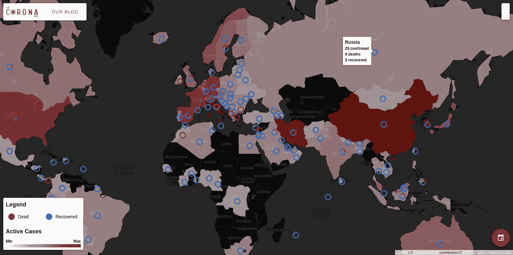
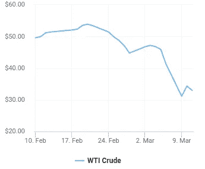
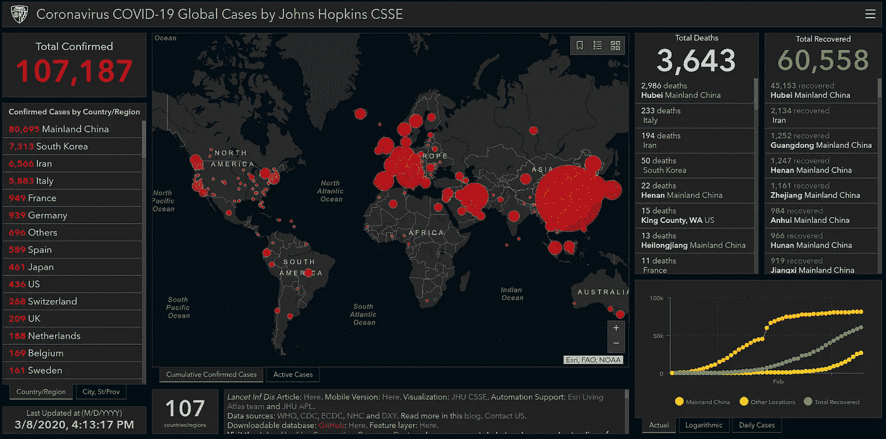
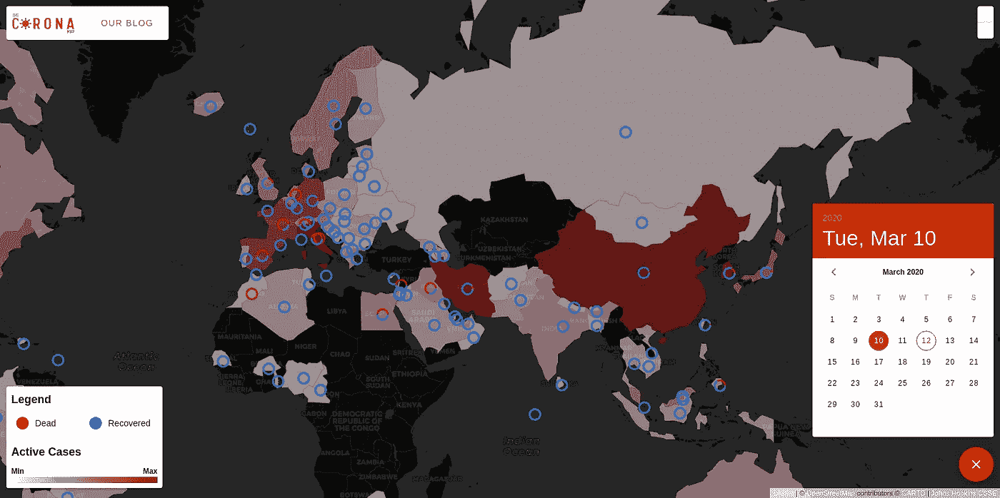
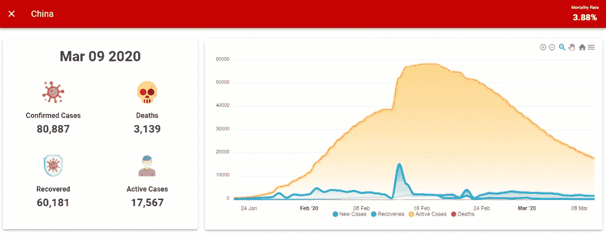

# 日冕地图:可视化疫情

> 原文：<https://towardsdatascience.com/the-corona-map-visualizing-the-pandemic-fc436f175dff?source=collection_archive---------4----------------------->

[thecoronamap.com](http://thecoronamap.com/)

小说《电晕病毒，世纪疫情》在全世界引起了歇斯底里。股市经历了自 2008 年危机以来最糟糕的一天，油价出现了 29 年来的最大跌幅。

[道琼斯图表](https://www.marketwatch.com/)

[油价](https://oilprice.com/)

首先，让我们了解什么是这种新的冠状病毒或新冠肺炎。冠状病毒不是一种单一的病毒，它是一个病毒家族，可以引起流感等疾病。这是该家族的最新发现，该家族被命名为新型冠状病毒或新冠肺炎。

那么这种新型冠状病毒和那些看起来不太伤人的旧冠状病毒有什么不同呢？嗯，主要的问题是它是新的，我们还没有太多的研究和/或药物来治疗它。这种病毒的另一个问题是它具有高度传染性。

大约 97%的受害者存活下来，但是免疫系统弱的人无法对抗它，我们还没有杀死这种病毒的药物。

科学家和研究人员正在努力，不久我们将有疫苗和治疗方法。全世界的政府和私人机构都在努力减轻灾难并控制病毒。

# GIS 能帮上什么忙？

“GIS 为可视化和分析流行病学数据、揭示趋势、相关性和相互关系提供了极好的手段。”

为了应对灾难，我们需要关于它们的数据，在这个数据分析和我们现有工具的时代，有很多事情可以做。在这方面，约翰·霍普金斯大学的 CSSE 做了伟大的工作。他们一直在收集数据，并每天将数据发布到他们的[库](https://github.com/CSSEGISandData/COVID-19)上。他们还创建了一个显示当前信息的门户网站。

上述门户在提供最新信息方面做得很好，但缺少地图上的历史信息，这些信息存在于他们提供的数据集中。他们在图表中提供了历史数据，但在地图上没有。

**我们在做什么？**

我相信，在太空中可视化与这个疫情相关的历史数据将为研究人员和任何想更多地研究新冠肺炎的人增加价值。所以，我和我的[朋友](https://www.linkedin.com/in/kamrankhalid/)决定制作一个小工具:[日冕地图](http://thecoronamap.com/)。

这是一个免费的简约工具，我们为那些对研究这种疾病如何传播以及它在全球的状况感兴趣的人开发的。这对旅行者、医生、研究人员、非政府组织、政府和任何想研究和/或发现这种疾病影响现状的人都是有益的。

到目前为止，我们只做了一个星期，我们计划在未来添加更多的数据层，并将每天更新当前的数据。现在，它在地图上显示了每天的全球统计数据，以及自第一例病例报告以来每个国家每天的统计数据。

右下角的日历可以让你检查任何日期的电晕状态

[中国冠状病毒统计](http://thecoronamap.com/)至 2020 年 3 月 9 日

我们正在寻找更多的数据来源，并将增加它们，使其对研究人员更有用。如果你想尽自己的一份力量，想分享能够真正帮助研究人员和组织抗击疾病的数据或想法，请联系我们，以便我们能够让 Corona 地图对他们更有帮助。

> *我是拉米兹·萨米。我爬山、举重、构建 WebGIS 解决方案。在*[*Linkedin*](https://www.linkedin.com/in/ramizsami/)*上随时与我联系。*