# 新冠肺炎的一份报纸——科罗纳时报

> 原文：<https://towardsdatascience.com/the-corona-times-b4ed731e0b71?source=collection_archive---------19----------------------->

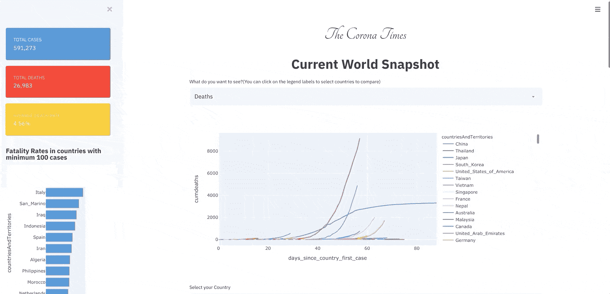

## 基于数据科学的新闻应用

似乎我消费信息的方式已经发生了很大的变化。最近我成了一个新闻迷。尤其是有一点，我一直在阅读相当多的国际新闻，以确定新冠肺炎在我国所处的阶段。

为了做到这一点，我通常会访问许多不同国家的新闻媒体网站来阅读新闻。这给了我一个想法。为什么不为 Corona 创建一个国际新闻仪表板？这就是了。

这篇文章是关于我如何使用 Streamlit 和来自 [NewsApi](https://newsapi.org/) 和[欧洲疾病控制中心](https://www.ecdc.europa.eu/en/publications-data/download-todays-data-geographic-distribution-covid-19-cases-worldwide)的数据创建新闻仪表板的。

***TLDR；*此处** **链接 App** [**。**](http://54.149.204.138:8501/)

# 获取数据

创建这个仪表板时最重要的事情是获取数据。我使用两个数据源:

## 1.数据来自欧洲疾病预防和控制中心。

该可下载的数据文件每天更新，包含关于新冠肺炎的最新公共数据。这是这些数据的快照。

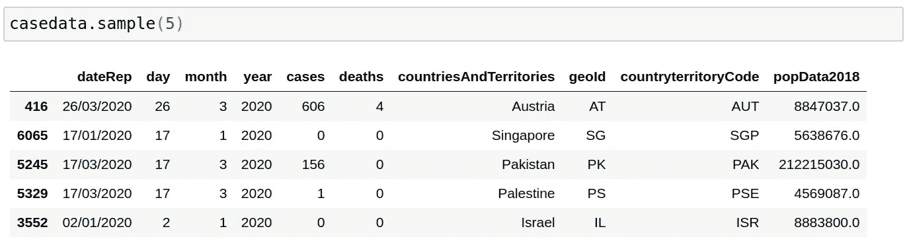

```
def get_data(date):
    os.system("rm cases.csv")
    url = "[https://opendata.ecdc.europa.eu/covid19/casedistribution/csv](https://opendata.ecdc.europa.eu/covid19/casedistribution/csv)"
    filename = wget.download(url,"cases.csv")
    casedata = pd.read_csv(filename, encoding='latin-1')
    return casedata
```

## 2.新闻宣传短片

第二个数据来源来自[新闻 API](https://newsapi.org/) ，它让我可以免费访问来自不同国家的主要新闻媒体的文章。唯一的警告是，我一天只能点击 API 500 次，对于免费帐户的特定查询，结果限制为 100 个。

我试图通过使用 streamlit 缓存来绕过这些限制障碍(所以我不会经常使用 API)。我还尝试使用多个过滤器获取上个月的新闻数据，以获得大量数据。

```
from newsapi import NewsApiClient
newsapi = NewsApiClient(api_key='aedb6aa9bebb4011a4eb5447019dd592')
```

API 工作的主要方式是让我们访问 3 个函数。

A)从一个国家获取最新新闻的功能:

```
json_data = newsapi.get_top_headlines(q=q,language='en', country='us')
data = pd.DataFrame(json_data['articles'])
data.head()
```

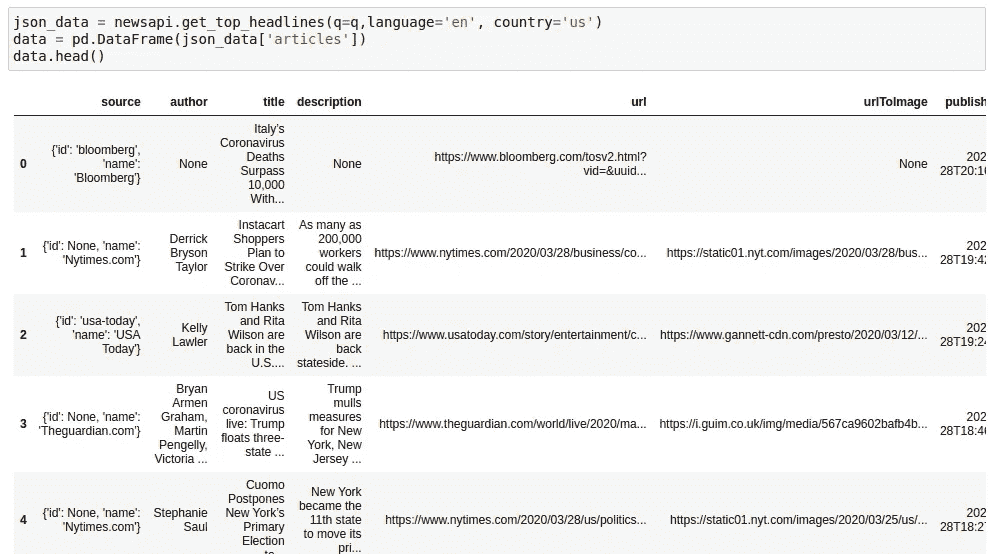

b)从国家获取与查询相关的" **Everything"** 的函数。这里可以看到 [API 参数](https://newsapi.org/docs/endpoints/everything)的描述:

```
json_data = newsapi.get_everything(q='corona',
                                    language='en',
                                    from_param=str(date.today() -timedelta(days=29)),
                                    to= str(date.today()),
                                    sources = 'usa-today',
                                    page_size=100,
                                    page = 1,
                                   sort_by='relevancy'
                                    )
data = pd.DataFrame(json_data['articles'])
data.head()
```

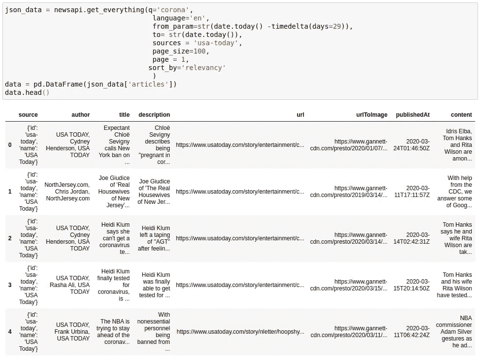

c)以编程方式从一个国家获取资源列表的功能。然后我们可以使用这些资源从**“一切”** API 中提取数据

```
def get_sources(country):
    sources = newsapi.get_sources(country=country)
    sources = [x['id'] for x in sources['sources']]
    return sourcessources = get_sources(country='us')
print(sources[:5])
-------------------------------------------------------------------
['abc-news', 'al-jazeera-english', 'ars-technica', 'associated-press', 'axios']
```

我使用了上面的所有函数来获取以特定频率刷新的数据。通过查看我在 GitHub 上的代码，您可以看到我是如何在循环中使用这些 API 函数来下载数据的。

# 创建仪表板

我希望在仪表板中有一些我感兴趣的重要信息。所以我开始创建各种小部件。

## 1.当前世界快照:

第一个信息是关于整个世界局势。病例数和死亡数。各国的病例和死亡曲线？各个国家的致死率是多少？以下是 2020 年 3 月 28 日的世界局势。

***观察:*** 我们可以看到意大利的死亡人数仍在上升，而西班牙、法国和美国的死亡人数也在上升。一些国家的死亡率令人担忧，意大利的死亡率为 10.56%，伊拉克为 8.7%。我怀疑冠状病毒开始几天 2%的死亡率统计如果没有错的话是误传。

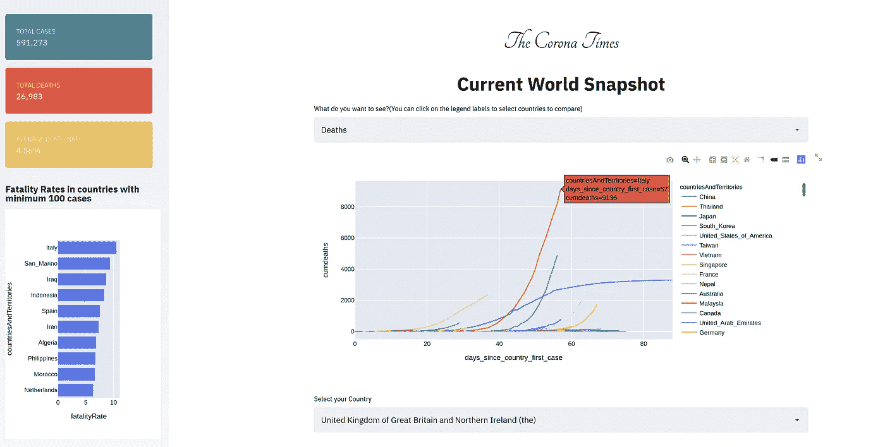

***技术细节*** —为了创建仪表板的这一部分，我使用了 ECDC 数据。我还在 Streamlit 中使用了很多 HTML 技巧，其中我使用了 bootstrap 小部件和自定义 HTML 来以我想要的方式显示数据。以下是一些技巧:

*   **使用引导卡:**您可以使用[引导卡](https://getbootstrap.com/docs/4.0/components/card/)，或者在这种情况下，如果您将参数 `unsafe_allow_html` 更改为 True，则可以使用 Streamlit 中的任何 HTML 元素。请注意，我在这里也使用了 python `f` 字符串格式。

```
st.sidebar.markdown(**f**'''<div class="card text-white bg-info mb-3" style="width: 18rem">
  <div class="card-body">
    <h5 class="card-title">Total Cases</h5>
    <p class="card-text">**{sum(casedata['cases']):,d}**</p>
  </div>
</div>''', **unsafe_allow_html**=True)
```

上述代码位于 streamlit 应用侧边栏中的仪表板风格卡片后面。

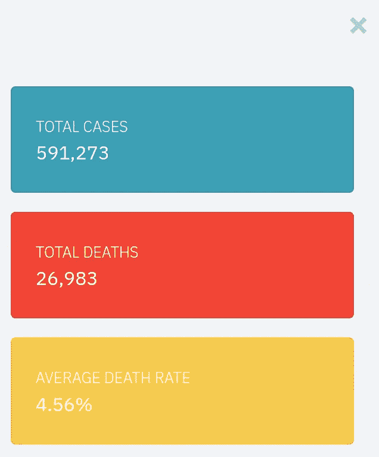

*   **更改了 streamlit 主页的宽度:**同样，streamlit 没有给出参数来实现这一点，我发现页面宽度对于我的用例来说有点太小。在应用程序开始时添加上面的[代码](https://discuss.streamlit.io/t/custom-render-widths/81/4)解决了这个问题。

```
st.markdown(
        f"""
<style>
    .reportview-container .main .block-container{{
        **max-width: 1000px;**
    }}
</style>
""",
        unsafe_allow_html=True,
    )
```

## 2.来自国家的最新消息

创建这个仪表板的主要目的是从国内顶级媒体渠道获取各种渠道的新闻。

**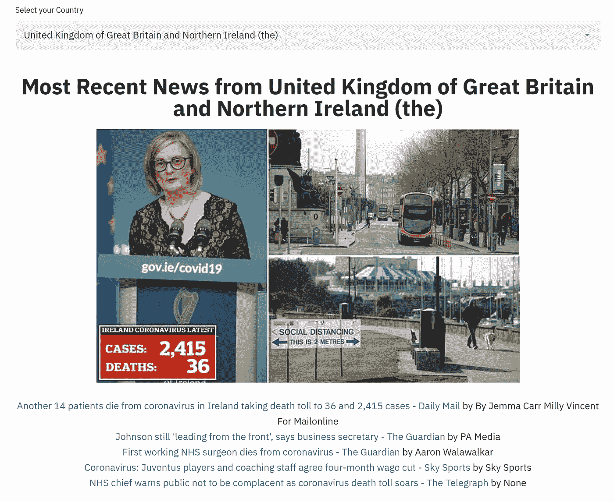**

*****技术细节:*** 之前说过，我是用新闻 API 来获取这个数据的。下面是我如何使用 HTML 和 markdown 的混搭来显示新闻结果。**

```
def create_most_recent_markdown(df,width=700):
    if len(df)>0:
        # img url
        img_path = df['urlToImage'].iloc[0]
        if not img_path:
            images = [x for x in df.urlToImage.values if x is not None]
            if len(images)!=0:
                img_path = random.choice(images)
            else:
                img_path = '[https://www.nfid.org/wp-content/uploads/2020/02/Coronavirus-400x267.png'](https://www.nfid.org/wp-content/uploads/2020/02/Coronavirus-400x267.png')
        img_alt = df['title'].iloc[0]
        df = df[:5]
        **markdown_str = f" <br> <br>"**
        for index, row in df.iterrows():
            **markdown_str += f"[{row['title']}]({row['url']}) by {row['author']}<br> "**
        return markdown_str
    else:
        return ''
```

**这里需要注意几件事:**

1.  **无法使用 markdown 设置图像宽度，因此使用自定义 HTML**
2.  **使用 python f 字符串创建文章标题和 URL。**
3.  **如果找不到图像，我们将默认使用自定义图像。**

## **3.新闻情绪**

**在这段艰难的日子里，另一件困扰我的事情是到处都有太多的负面情绪。如果可能的话，我想看到从积极的角度报道的新闻。所以我用 Textblob 的自定义情感分析器做了一些简单的情感分析。**

**我发现了新闻媒体的观点，以及过去 30 天中与冠状病毒有关的一些最积极和最消极的新闻。(过去 30 天，因为我不能用免费的 API 返回更多)。**

*****观察:*** 你可以看到，最积极的消息之一是川普在 3 月 17 日改变了他对冠状病毒的立场，我同意。第二个积极的报道似乎是关于这个问题的某种解决方案。而第一个负面消息是关于 Cardi B 抨击名人散播关于冠状病毒的混乱。这个我不做评论:)**

**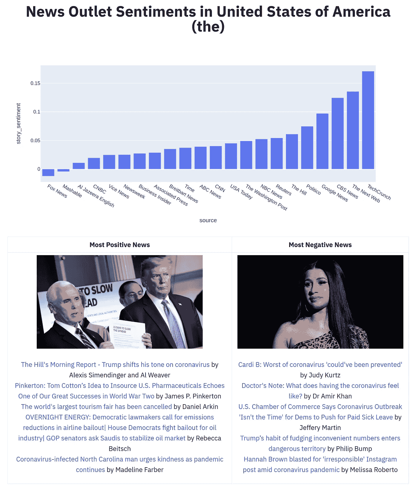**

*****技术细节:*** 为了得到一篇文章的情感评分我用了`TextBlob`。获得从-1 到 1 的情感分数就像使用下面的函数一样简单。由于新闻 API 中的内容被截断，我使用了标题和描述的连接来查找情感。**

```
def textblob_sentiment(title,description):
    blob = TextBlob(str(title)+" "+str(description))
    return blob.sentiment.polarity
```

**这里的主要困难是要有一个两栏的布局来提供正面和负面的消息。同样，我不得不使用 HTML 和 markdown 的混搭。我使用 HTML 表来做这件事。另外，请注意我是如何使用 Python f 字符串将 markdown 转换成 HTML 的。**

```
import markdown**md = markdown.Markdown()**positive_results_markdown = create_most_recent_markdown(positivedata,400)

negative_results_markdown = create_most_recent_markdown(negativedata,400)html = f'''<table style="width:100%">
                  <tr>
                    <th><center>Most Positive News</center></th>
                    <th><center>Most Negative News</center></th>
                  </tr>
                  <tr>
                    <td><center>**{md.convert(positive_results_markdown)}**</center></td>
                    <td><center>**{md.convert(negative_results_markdown)}**</center></td>
                  </tr>
                </table>'''
                #print md.convert("# sample heading text")st.markdown(html,unsafe_allow_html=True)
```

## **4.新闻来源 WordCloud**

**如果没有单词云，处理文本的可视化仪表板永远不会真正完整，所以我想到添加一个单词云来了解特定来源的单词用法。**

*****观察:*** 我们可以看到很多次副新闻使用“新的”、“经过测试的”这样的词。而《商业内幕》则大量使用“中国”。**

**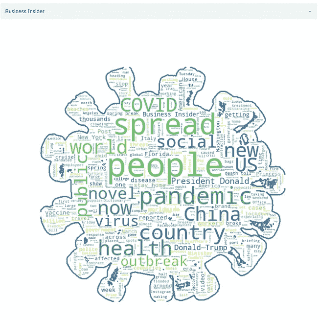****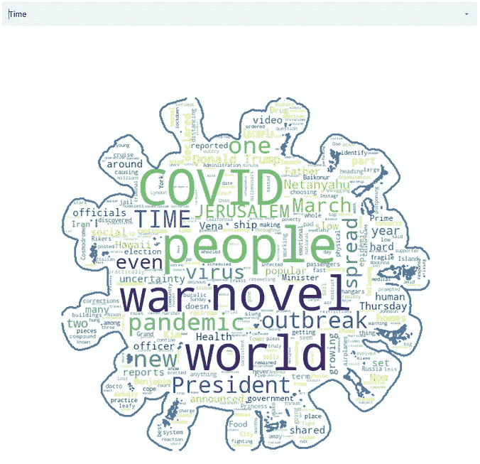****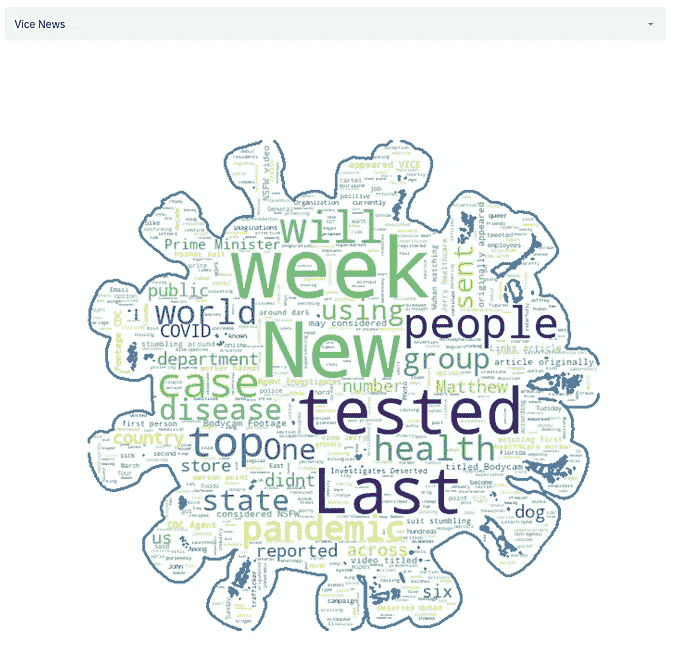**

**《商业内幕》、《时代》和《副新闻》中的词汇云比较。**

*****技术细节:*** 下面是我用来创建这个蒙面字云的:**

```
import cv2def create_mask():
    mask = np.array(Image.open("coronavirus.png"))
    im_gray = cv2.cvtColor(mask, cv2.COLOR_BGR2GRAY)
    _, mask = cv2.threshold(im_gray, thresh=20, maxval=255, type=cv2.THRESH_BINARY)
    mask = 255 - mask
    return mask**mask = create_mask()**def create_wc_by(source):
    data = fulldf[fulldf['source']==source]
    text = " ".join([x for x in data.content.values if x is not None])
    stopwords = set(STOPWORDS)
    stopwords.add('chars')
    stopwords.add('coronavirus')
    stopwords.add('corona')
    stopwords.add('chars')
    wc = WordCloud(background_color="white", max_words=1000, mask=mask, stopwords=stopwords,
               max_font_size=90, random_state=42, contour_width=3, contour_color='steelblue')
    wc.generate(text)
    plt.figure(figsize=[30,30])
    plt.imshow(wc, interpolation='bilinear')
    plt.axis("off")
    return plt**st.pyplot(create_wc_by(source),use_container_width=True)**
```

# **其他技术考虑**

## **1.高级缓存:**

**在昨天刚刚发布的 [0.57.0](https://discuss.streamlit.io/t/version-0-57-0/2301) 的新 streamlit 发行说明中，streamlit 对`st.cache`进行了更新。这个版本的一个显著变化是“能够通过设置`max_entries`和`ttl`参数来设置缓存函数的到期选项”。来自[文档](https://docs.streamlit.io/api.html?highlight=cache#streamlit.cache):**

*   ****max_entries** ( *int 或 None* ) —在**缓存**中保留的最大条目数，或者对于无界缓存为 None。(当一个新条目被添加到满缓存时，最旧的缓存条目将被删除。)默认为无。**
*   ****TTL**(*float or None*)—在**缓存中保留条目的最大秒数**，如果缓存条目不应过期，则为 None。默认值为无。**

**这可能有所帮助的两个用例是:**

*   **如果您正在为您的应用程序提供服务，并且不希望缓存永远增长。**
*   **如果您有一个从 URL 读取实时数据的缓存函数，并且应该每隔几个小时清除一次以获取最新数据**

**这就是在许多函数中使用的方法，以避免多次点击 API，同时防止它们变得陈旧。**

**例如，在 360 秒(即 6 分钟)的时间段内获取来自一个国家的顶级结果。**

```
st.cache(ttl=360,max_entries=20)
def create_dataframe_top(queries,country):
    #Hits API Here
```

**而来自 everything API 的完整结果是在一天内获取的。**

```
[@st](http://twitter.com/st).cache(ttl = 60*60*24,max_entries=20)
def create_dataframe_last_30d(queries, sources):
    # hits API
```

## **2.部署:**

**我使用亚马逊免费 ec2 实例在 http://54.149.204.138:8501/部署这个应用程序。如果你想知道步骤，这里有:**

**[](/how-to-deploy-a-streamlit-app-using-an-amazon-free-ec2-instance-416a41f69dc3) [## 如何使用 Amazon Free ec2 实例部署 Streamlit 应用程序？

### 10 分钟内将数据应用程序上传到网上

towardsdatascience.com](/how-to-deploy-a-streamlit-app-using-an-amazon-free-ec2-instance-416a41f69dc3) 

还有一些注意事项:

*   由于这是一个免费的服务器，它可能不会采取太多的负荷。
*   我还没有彻底测试缓存例程。我只希望服务器上有限的内存不要出现内存错误。
*   新闻 API 也是免费的。甚至在我尝试处理之后，可能还会有速率限制。

## 3.学问

对于迷路的人，你可能想先从最基本的开始。以下是我在 Streamlit 和 Plotly express 上的介绍性帖子。

[](/how-to-write-web-apps-using-simple-python-for-data-scientists-a227a1a01582) [## 如何为数据科学家使用简单的 Python 编写 Web 应用？

### 无需了解任何 web 框架，即可轻松将您的数据科学项目转换为酷炫的应用程序

towardsdatascience.com](/how-to-write-web-apps-using-simple-python-for-data-scientists-a227a1a01582) [](/pythons-one-liner-graph-creation-library-with-animations-hans-rosling-style-f2cb50490396) [## Python 的一个线性图形创建库，带有汉斯·罗斯林风格的动画

### 动画，单线图。它拥有一切

towardsdatascience.com](/pythons-one-liner-graph-creation-library-with-animations-hans-rosling-style-f2cb50490396) 

# 结论

在这里，我尝试创建一个关于冠状病毒新闻的仪表板，但它仍处于萌芽阶段，还有很多工作要做。

首先，它需要一台大型服务器。另一方面，需要大量时间来改进可视化和布局。还有很多测试。

此外，我们使用 HTML 和少量黑客以迂回的方式做了一些事情。Streamlit 中还有很多我喜欢的东西。我已经与 Streamlit 团队就他们将要引入的新功能进行了讨论，我将尽力让您了解最新情况。好消息是，布局选项是 Streamlit 正在开发的新功能的一部分。

你可以在我的 Github repo 上找到最终应用程序的完整代码。这是网上完整的[应用](http://54.149.204.138:8501/)。

如果你想了解创建可视化的最佳策略，我想从密歇根大学调用一门关于 [**数据可视化和应用绘图**](https://www.coursera.org/specializations/data-science-python?ranMID=40328&ranEAID=lVarvwc5BD0&ranSiteID=lVarvwc5BD0-SAQTYQNKSERwaOgd07RrHg&siteID=lVarvwc5BD0-SAQTYQNKSERwaOgd07RrHg&utm_content=3&utm_medium=partners&utm_source=linkshare&utm_campaign=lVarvwc5BD0) 的优秀课程，它是一个非常好的 [**数据科学专业的一部分，本身带有 Python**](https://www.coursera.org/specializations/data-science-python?ranMID=40328&ranEAID=lVarvwc5BD0&ranSiteID=lVarvwc5BD0-SAQTYQNKSERwaOgd07RrHg&siteID=lVarvwc5BD0-SAQTYQNKSERwaOgd07RrHg&utm_content=3&utm_medium=partners&utm_source=linkshare&utm_campaign=lVarvwc5BD0) 。一定要去看看。

谢谢你的阅读。将来我也会写更多初学者友好的帖子。在 [**媒体**](https://medium.com/@rahul_agarwal) 关注我，或者订阅我的 [**博客**](http://eepurl.com/dbQnuX) 了解他们。一如既往，我欢迎反馈和建设性的批评，可以通过 Twitter [@mlwhiz](https://twitter.com/MLWhiz) 联系。

此外，一个小小的免责声明——这篇文章中可能会有一些相关资源的附属链接，因为分享知识从来都不是一个坏主意。**