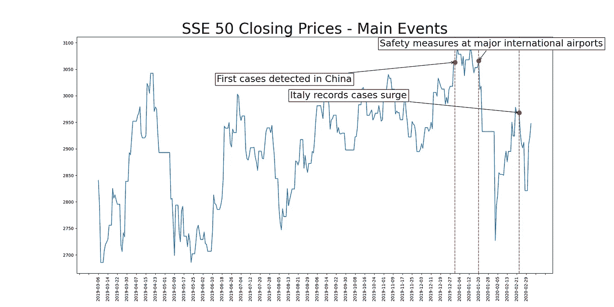
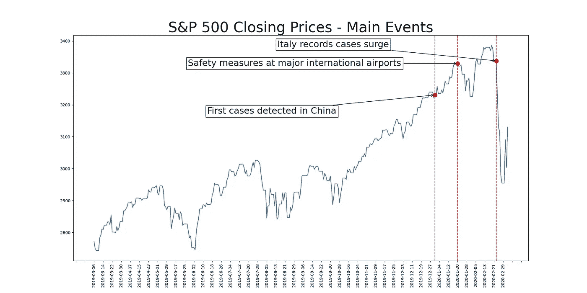
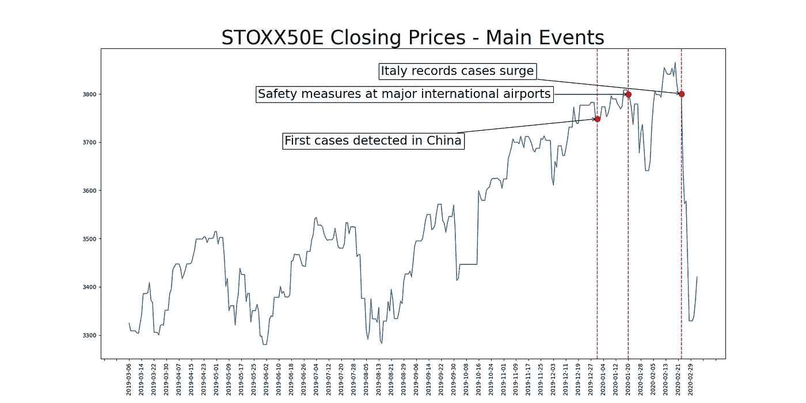
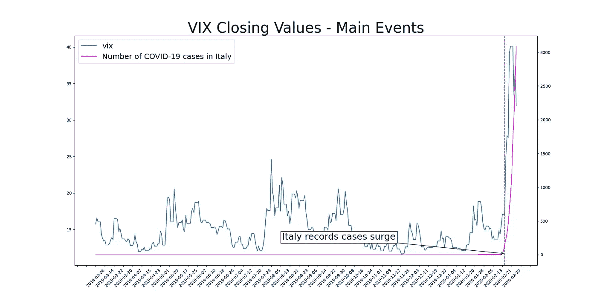
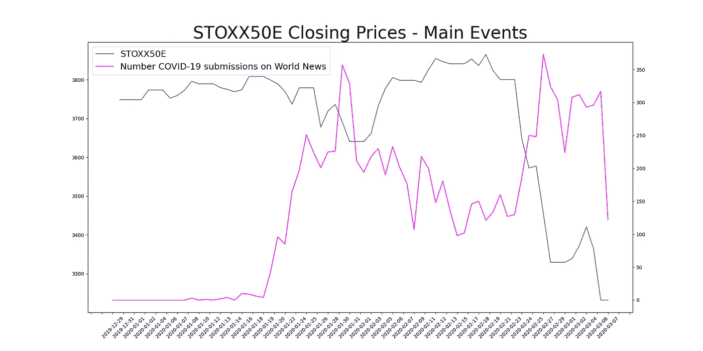
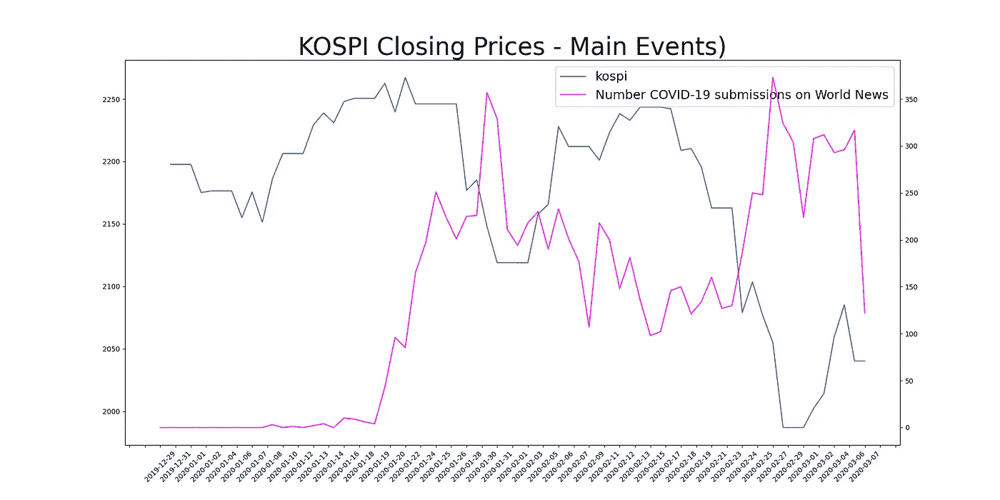
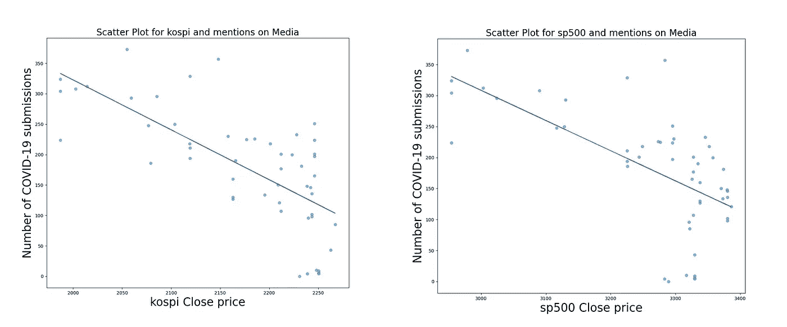
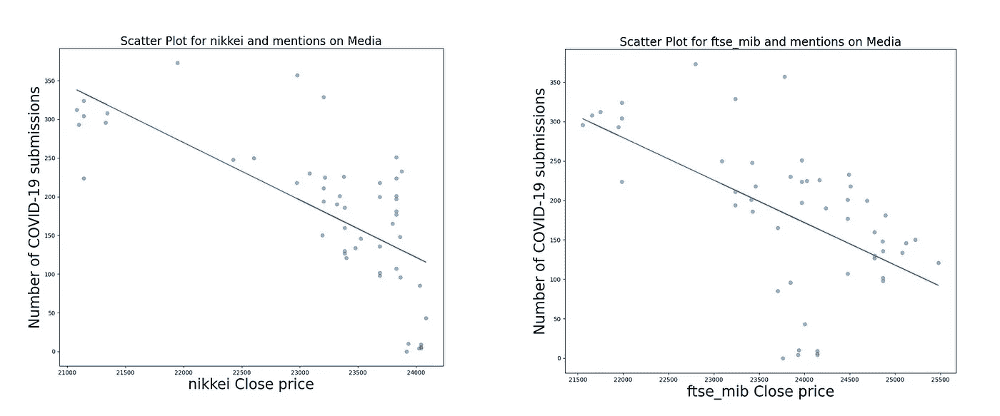

# 冠状病毒对股票市场的影响

> 原文：<https://towardsdatascience.com/the-coronavirus-effect-on-the-stock-market-b7a4739406e8?source=collection_archive---------20----------------------->

## 浅析新冠肺炎对世界经济的威胁


Alex bljan 在 [Unsplash](https://unsplash.com/s/photos/black-swan?utm_source=unsplash&utm_medium=referral&utm_content=creditCopyText) 上拍摄的照片

在 2020 年的最初几个月，世界面临着近代史上最大的威胁之一:**一种新的冠状病毒正在全球传播，有可能成为疫情**。

谈到瘟疫，**最需要担心的是健康，对于所有关于新冠肺炎的信息，我的建议是关注世卫组织网站**[](https://www.who.int/news-room/q-a-detail/q-a-coronaviruses)**，它包含了关于这种新疾病的最新和最可靠的信息。**

**然而，另一个可怕的方面是冠状病毒爆发将对世界经济产生的影响:许多分析师认为，这种传染病可能会带来严重的负面影响(甚至是长期影响)。**

**在这篇文章中，我关注了问题的经济方面:新冠肺炎对股票市场有什么影响？投资者认为最重要的事件是什么？媒体的作用是什么？让我们通过几个图表来看看大局。**

# **数据**

**冠状病毒爆发是一个不断发展的情况:**每 5 分钟就有一条新闻有助于更好地确定问题，很难保持领先**。然而，整个事件被各种事件打断了。我找到了这个页面，它报道(并更新)了自传染病开始以来的主要事实。从这个列表中，我选择了那些我认为对我的分析最重要的元素:**

```
**2019-12-31 => *"*First cases detected in China*"***2020-01-01 => *"*Wuhan market identified as outbreak hub*"* 2020-01-03 => *"*Passengers screened at Wuhan Airport*"* 2020-01-06 => *"*SARS, MERS and bird flu ruled out*"* 2020-01-07 => *"*Virus identified as coronavirus 2019n-CoV*"* 2020-01-09 => *"*Coronavirus genome sequence released*"* 2020-01-11 => *"*First coronavirus death reported*"* 2020-01-15 => *"*First confirmed coronavirus case in Japan*"*2020-01-2020-01-17 => *"*US has initiated screening of passengers arriving from Wuhan*"* **2020-01-20 => *"*Safety measures at major international airports*"***2020-01-21 => *"*US confirms first coronavirus case*"* 2020-01-22 => *"*WHO hold on declaring international health emergency*"* 2020-01-23 => *"*China implements travel bans*"* 2020-01-24 => *"*Starts building temporary hospital*"* 2020-01-26 => *"*WHO changes risk to 'high'*"* 2020-01-30 => *"*Russia closes 2,700 mile border*"* 2020-01-31 => *"*WHO declares global emergency*"* 2020-02-05 => *"*Japan confirms ten cases on cruise*"* 2020-02-09 => *"*COVID-19 overtakes SARS*"* 2020-02-12 => *"*Japan cruise cases increase to 174*"* 2020-02-13 => *"*Japan reports first COVID-19 death*"* 2020-02-19 => *"*New recoveries exceed new infections*"* 2020-02-21 => *"*Italy confirms fourth case*"* 2020-02-22 => *"*Italy reports one death*"* 2020-02-23 => *"*Italy records cases surge*"* **2020-02-27 => *"*Cases and deaths in Italy rise*"***2020-02-28 => *"*WHO raises global outbreak risk to 'Very High'*"* 2020-02-29 => *"*The US reports first death*"* 2020-03-02 => *"*Deaths cross 3,000 globally, confirmed cases cross 89,000*"*
```

**在分析“什么”方面，我拉了几个股票指数: **S & P 500** (美国) **FTSE MIB** (义大利)**日经**(日本) **SSE 50** (上海) **KOSPI** (南韩) **STOXX50E** (欧元区)，想法是观察不同市场对各种事件的反应。我在分析中提取的其他有趣数据是 VIX 指数，这是一个基于标准普尔 500 指数期权的股票市场波动预期的普遍衡量指标。所有这些信息都来自雅虎财经(FTSE MIB 数据集)。**

**另一组有用的信息来自新冠肺炎数据集，该数据集显示了每个国家每天的确诊病例、死亡和康复情况。我下载了 [Kaggle 版本](https://www.kaggle.com/sudalairajkumar/novel-corona-virus-2019-dataset)。**

**最后，我想看看媒体对这场危机的影响。不幸的是，没有简单的方法来获取来自世界各地的最新消息，所以我需要自己收集数据。最后，我从 reddit.com 收集信息，更准确地说，是从《世界新闻》的子栏目收集信息。**我拿了投稿标题**(从 2019 年 1 月初到 2020 年 3 月 6 日)**查了一下是不是在说冠状病毒**；我知道这是“有多少媒体在谈论它”的一个微弱的代表，但这是我所能做的最好的了。为了收集 Reddit 数据，我使用了[pushshift . io](https://pushshift.io/)API，数据集可从链接[https://gofile.io/?c=AW4NiM](https://gofile.io/?c=AW4NiM)获得。**

# **市场爆发的主要事件**

**通过对时间序列的直观检查，我们可以观察到武汉冠状病毒 ( `2019–12–31`)爆发后一段时间**持续走低。例如，以下图表是上证 50(上海)和标准普尔 500(美国)的收盘价:****

****

**上证 50 的收盘价。红线标记了一些可能影响价格的重要事件**

****

**标准普尔 500 的收盘价。红线标记了一些可能影响价格的重要事件**

**看着上面的图表，并考虑到其他指数也有类似的趋势，**我们可以识别出似乎特别重要的两天:**`**2020–01–20**`**`**2020–02–23**`；我们可以很容易地看到，在那些日子之后，所有指数都经历了低点(例如，在 STOXX50E(欧元区)也发生了同样的情况):****

********

****STOXX50E 的收盘价。红线标记了一些可能影响价格的重要事件****

****发生了什么事？1 月 20 日[很多机场开始实施安全措施](https://www.airport-technology.com/features/coronavirus-measures-world-airports/)。接下来几天的头条都是关于这个的:**冠状病毒已经国际化**。让投资者感到害怕的是，有证据表明新冠肺炎教不再局限于中国边境，而是开始传播。令人惊讶的是**我强调的第二个事件讲述了一个类似的故事**:2 月 23 日(以及随后的几天)**病毒开始持续折磨意大利**。****

****当然，市场本身并不是独立的，我们需要考虑这种相互依赖性:**在全球经济中，如果一个市场下跌，其他市场可能会跟随**。不管怎样，我从上述观察中得出的结论是，投资者最害怕的是病毒在国际上传播。****

****我们还可以看到 **VIX 指数在意大利**疫情爆发后刚刚上升(下图中的洋红色线条是意大利确诊病例数):****

********

****蓝线是 VIX 指数，而洋红色线是意大利确诊病例数。随着意大利的危机越来越严重，VIX 开始崛起****

****最后，下表显示了从疫情爆发日到数据中最后一个可用日期之间考虑的所有指数的**平均下降值(时间序列已经使用 3 天窗口**的移动平均**进行了平滑处理):******

```
**+-----------+-------------------------------------+
|   INDEX   |**4th March 2020** vs **31st Dec 2019** Delta|
+-----------+-------------------------------------+
| NIKKEI    | **-10.7%**                              |
| STOXX50E  | **-10.1%**                              |
| KOSPI     | **-7.9%**                               |
| FTSE MIB  | **-7.55**                               |
| S&P 500   | -4.8%                               |
| S&P 500   | -4.8%                               |
| SSE 50    | -4.0%                               |
+-----------+-------------------------------------+**
```

****日本指数似乎是表现最差的一个指数(-10.7%)。我对上证 50 指数(上海)的结果有些怀疑，它可能值得看一看指数构成(尽管中国处理危机相当不错，因此损失可能相当小)。****

# ****大众传媒****

****另一个要考虑的因素是媒体的作用。从时间序列来看，**新闻似乎实际上正在产生影响**，因为股票指数和大众媒体提及率是负相关的。**我想说，这两个信号并不是独立的:股票市场暴跌的事实让新闻变得更响亮。不过，我认为这是一件有趣的事情:******

********

****洋红色的线是时间序列，计算世界新闻子编辑上关于新冠肺炎的文章数量****

********

****洋红色的线是时间序列，计算世界新闻子编辑上关于新冠肺炎的文章数量****

****仔细想想，这并不奇怪:**我预计当信息开始传播时，大多数投资者会有所反应**。我只考虑了**提及的绝对数量，而没有按照“情绪”来划分新闻，因为不幸的是，“情绪”是众所周知的**。****

****这两个系列呈负相关的事实也可以从以下散点图中看出(标准普尔 500(美国)、KOSPI(南韩)):****

********

****媒体的影响。X 轴代表股票指数，Y 轴代表世界新闻子栏目中与冠状病毒相关的文章数量****

********

****媒体的影响。X 轴代表股票指数，Y 轴代表世界新闻子栏目中与冠状病毒相关的文章数量****

****同样，**一个单独的 subreddit 可能是一个弱代理，一个更好的分析将涉及许多其他类型的提及(例如，推文和其他来源)。******

# ****结论****

****很遗憾，没什么好说的了。虽然中国的情况似乎正在稳定，但在欧洲的传播仍然令人担忧，尤其是从健康角度来看。****

****如果意大利的模式将在其他国家重演，我们可能会预计市场会以类似的方式做出反应，因此目前唯一能做的就是阻止或减缓危机蔓延，以保护健康和经济。****

****作为一名意大利人，我正带着一些担忧生活在我的国家，但我仍然相信政府和人民将克服这种令人难以置信的情况。让我们交叉手指，希望新冠肺炎会很快被击败，无论是身体健康还是经济健康。****

*****注意:本文仅供参考。本文在任何情况下都不打算被用作或视为金融或投资建议、推荐或出售要约，或任何购买任何证券或其他形式的金融资产的要约。*****

# ****看看这些其他的文章！****

****[](/clustering-pollock-1ec24c9cf447) [## 聚类波洛克

### 杰森·布拉克绘画的聚类分析——如何利用 k-means 进行色彩分组

towardsdatascience.com](/clustering-pollock-1ec24c9cf447)****