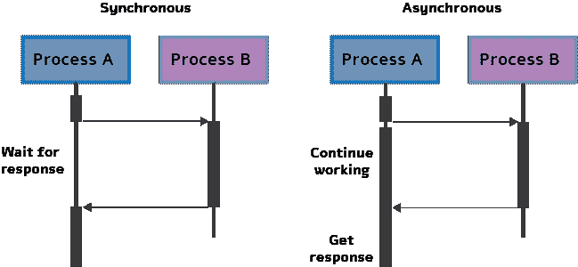
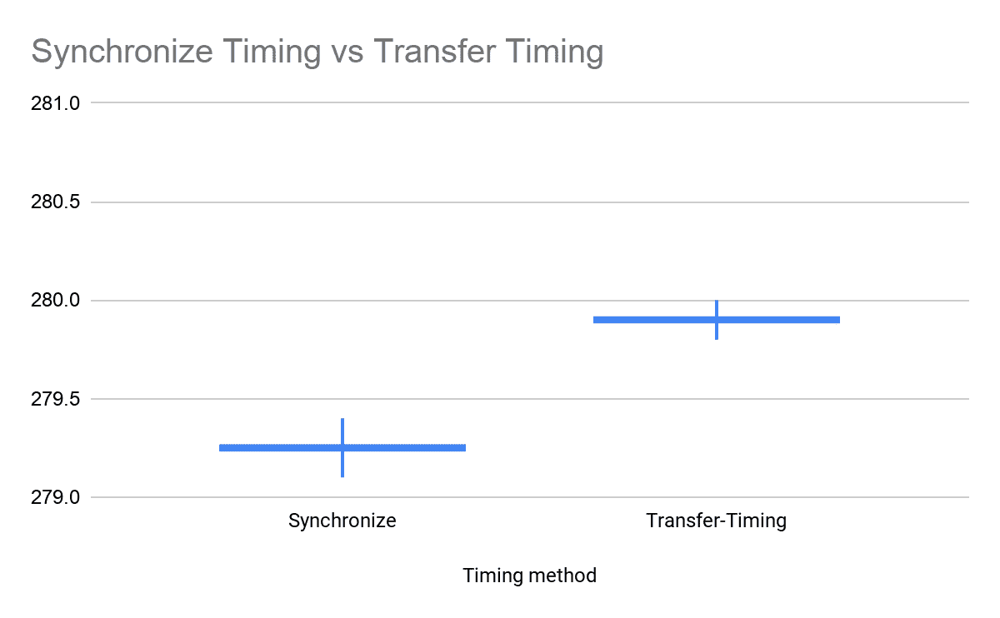
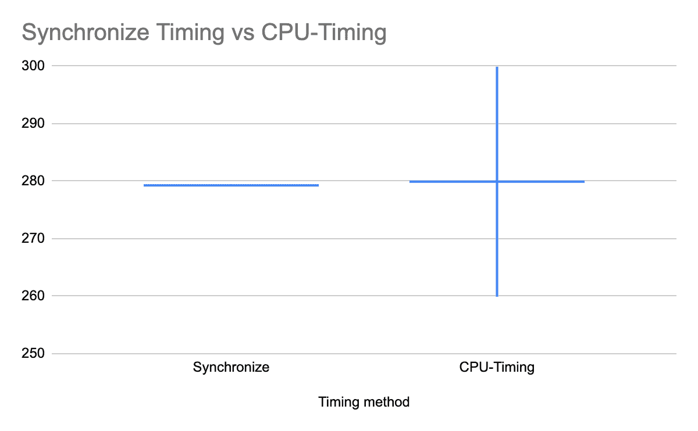

# 深度神经网络推理时间的正确度量方法

> 原文：<https://towardsdatascience.com/the-correct-way-to-measure-inference-time-of-deep-neural-networks-304a54e5187f?source=collection_archive---------5----------------------->


网络延迟是将深层网络部署到生产环境中的一个更重要的方面。大多数现实世界的应用程序需要惊人的快速推理时间，从几毫秒到一秒不等。但是，正确而有意义地测量神经网络的推理时间或延迟的任务需要深刻的理解。即使是经验丰富的程序员也经常会犯一些常见的错误，导致不准确的延迟测量。这些错误的影响有可能引发糟糕的决策和不必要的支出。

在本帖中，我们回顾了正确测量延迟时间应该解决的一些主要问题。我们回顾了使 GPU 执行独一无二的主要过程，包括异步执行和 GPU 预热。然后，我们共享代码样本，以便在 GPU 上正确测量时间。最后，我们回顾了在 GPU 上量化推理时间时人们会犯的一些常见错误。

# 异步执行

我们从讨论 GPU 执行机制开始。在多线程或多设备编程中，两个独立的代码块可以并行执行；这意味着第二个块可以在第一个块完成之前执行。这个过程被称为异步执行。在深度学习环境中，我们经常使用这种执行方式，因为 GPU 操作在默认情况下是异步的。更具体地说，当使用 GPU 调用函数时，操作被排队到特定设备，但不一定到其他设备。这允许我们在 CPU 或另一个 GPU 上并行执行计算。



**图一**。异步执行。**左**:同步流程，流程 A 等待流程 B 的响应后才能继续工作。**右图**:异步进程 A 继续工作，不等待进程 B 结束。

异步执行为深度学习提供了巨大的优势，例如能够大幅减少运行时间。例如，在推断多个批次时，第二批次可以在 CPU 上进行预处理，而第一批次通过网络在 GPU 上进行前馈。显然，在推理时尽可能使用异步是有益的。

异步执行的效果对用户来说是不可见的；但是，当谈到时间测量时，它可能是许多令人头痛的原因。当您使用 Python 中的“时间”库计算时间时，测量是在 CPU 设备上执行的。由于 GPU 的异步特性，停止计时的代码行将在 GPU 进程完成之前执行。因此，计时将会不准确或与实际推断时间无关。请记住，我们希望使用异步，在这篇文章的后面，我们将解释如何在异步过程中正确地测量时间。

# GPU 预热

现代 GPU 设备可以存在于几种不同的电源状态之一。当 GPU 未被用于任何目的并且持续模式(即，保持 GPU 开启)未被启用时，GPU 将自动将其功率状态降低到非常低的水平，有时甚至完全关闭。在低功耗状态下，GPU 会关闭不同的硬件，包括内存子系统、内部子系统，甚至计算核心和高速缓存。

任何试图与 GPU 交互的程序的调用将导致驱动程序加载和/或初始化 GPU。这种驱动程序负载行为值得注意。由于纠错码的清理行为，触发 GPU 初始化的应用程序可能会导致长达 3 秒的延迟。例如，如果我们测量一个网络的时间需要 10 毫秒，运行超过 1000 个例子可能会导致我们的大部分运行时间浪费在初始化 GPU 上。自然，我们不想衡量这样的副作用，因为时机不准确。它也不反映生产环境，通常 GPU 已经初始化或以持久模式工作。

由于我们希望尽可能启用 GPU 节能模式，因此让我们看看如何在测量时间的同时克服 GPU 的初始化问题。

# 测量推理时间的正确方法

下面的 PyTorch 代码片段展示了如何正确测量时间。这里我们使用 Efficient-net-b0，但是您可以使用任何其他网络。在代码中，我们处理上面描述的两个警告。在我们进行任何时间测量之前，我们通过网络运行一些虚拟示例来进行“GPU 预热”这将自动初始化 GPU，并防止它在我们测量时间时进入省电模式。接下来，我们使用 tr.cuda.event 在 GPU 上测量时间。这里使用 torch.cuda.synchronize()很关键。这行代码执行主机和设备(即 GPU 和 CPU)之间的同步，因此时间记录仅在 GPU 上运行的进程完成后进行。这克服了不同步执行的问题。

```
model = EfficientNet.from_pretrained(‘efficientnet-b0’)
device = torch.device(“cuda”)
model.to(device)
dummy_input = torch.randn(1, 3,224,224,dtype=torch.float).to(device)
starter, ender = torch.cuda.Event(enable_timing=True), torch.cuda.Event(enable_timing=True)
repetitions = 300
timings=np.zeros((repetitions,1))
#GPU-WARM-UP
for _ in range(10):
   _ = model(dummy_input)
# MEASURE PERFORMANCE
with torch.no_grad():
  for rep in range(repetitions):
     starter.record()
     _ = model(dummy_input)
     ender.record()
     # WAIT FOR GPU SYNC
     torch.cuda.synchronize()
     curr_time = starter.elapsed_time(ender)
     timings[rep] = curr_timemean_syn = np.sum(timings) / repetitions
std_syn = np.std(timings)
print(mean_syn)
```

# 测量时间时的常见错误

当我们测量网络的延迟时，我们的目标是只测量网络的前馈，不多也不少。通常，即使是专家，也会在测量中犯一些常见的错误。以下是其中的一些，以及它们的后果:

1.在主机和设备之间传输数据。这个帖子的观点只是衡量一个神经网络的推理时间。在这种观点下，最常见的错误之一是在进行时间测量时，CPU 和 GPU 之间的数据传输。这通常是在 CPU 上创建张量，然后在 GPU 上执行推理时无意中完成的。这种内存分配需要相当长的时间，从而增加了推断的时间。这种误差对测量值的均值和方差的影响如下所示:



**图 2** :测量时间时 CPU 和 GPU 之间传输的影响。**左**:平均值和标准差的正确测量值(bar)。**右**:每次调用网络时，输入张量在 CPU 和 GPU 之间传递时的均值和标准差。X 轴是计时方法，Y 轴是以毫秒为单位的时间。

2.不使用 GPU 预热。如上所述，GPU 上的第一次运行会提示其初始化。GPU 初始化可能需要 3 秒钟，当时间以毫秒为单位时，这将产生巨大的差异。

3.使用标准 CPU 计时。最常见的错误是在不同步的情况下测量时间。众所周知，即使是经验丰富的程序员也会使用下面这段代码。

```
s = time.time()
 _ = model(dummy_input)
curr_time = (time.time()-s )*1000
```

这当然完全忽略了前面提到的异步执行，因此输出不正确的时间。该错误对测量值的平均值和方差的影响如下所示:



**图 3:** 测量时间对 CPU 的影响。**左侧**:平均值和标准偏差的正确测量值(bar)。**右**:进程不同步时的均值和标准差。X 轴是计时方法，Y 轴是以毫秒为单位的时间。

4.取一个样本。像计算机科学中的许多过程一样，神经网络的前馈具有(小的)随机成分。运行时间的差异可能很大，尤其是在测量低延迟网络时。为此，有必要对几个示例运行网络，然后对结果进行平均(300 个示例可能是个好数字)。一个常见的错误是使用一个样本，并将其称为运行时。当然，这并不代表真正的运行时间。

# 测量吞吐量

神经网络的吞吐量被定义为网络在单位时间(例如，一秒)内可以处理的输入实例的最大数量。与延迟不同，延迟涉及单个实例的处理，为了实现最大吞吐量，我们希望并行处理尽可能多的实例。有效的并行性显然依赖于数据、模型和设备。因此，为了正确测量吞吐量，我们执行以下两个步骤:(1)我们估计允许最大并行度的最佳批量大小；(2)给定这个最佳批量，我们测量网络在一秒钟内可以处理的实例数量。

为了找到最佳的批处理大小，一个好的经验法则是对于给定的数据类型达到我们的 GPU 的内存限制。这个大小当然取决于硬件类型和网络的大小。找到最大批量的最快方法是进行二分搜索法。当时间不成问题时，简单的顺序搜索就足够了。为此，我们使用 for 循环将批处理大小增加 1，直到实现运行时错误，这确定了 GPU 可以处理的最大批处理大小，用于我们的神经网络模型及其处理的输入数据。

找到最佳批量后，我们计算实际吞吐量。为此，我们希望处理多个批次(100 个批次就足够了)，然后使用以下公式:

(批次数量 X 批次大小)/(以秒为单位的总时间)。

这个公式给出了我们的网络在一秒钟内可以处理的例子的数量。下面的代码提供了执行上述计算的简单方法(给定最佳批量):

```
model = EfficientNet.from_pretrained(‘efficientnet-b0’)
device = torch.device(“cuda”)
model.to(device)
dummy_input = torch.randn(optimal_batch_size, 3,224,224, dtype=torch.float).to(device)repetitions=100
total_time = 0
with torch.no_grad():
  for rep in range(repetitions):
     starter, ender = torch.cuda.Event(enable_timing=True),          torch.cuda.Event(enable_timing=True)
     starter.record()
     _ = model(dummy_input)
     ender.record()
     torch.cuda.synchronize()
     curr_time = starter.elapsed_time(ender)/1000
     total_time += curr_time
Throughput = (repetitions*optimal_batch_size)/total_time
print(‘Final Throughput:’,Throughput)
```

# 结论

精确测量神经网络的推理时间并不像听起来那么简单。我们详细介绍了深度学习实践者应该注意的几个问题，比如异步执行和 GPU 省电模式。这里展示的 PyTorch 代码演示了如何正确地测量神经网络中的时序，尽管有前面提到的警告。最后，我们提到了一些导致人们错误测量时间的常见错误。在未来的帖子中，我们将更深入地探讨这个主题，并解释现有的深度学习分析器，这些分析器使我们能够实现更准确的网络时间测量。如果您对如何在不影响准确性的情况下减少网络延迟感兴趣，我们邀请您阅读 Deci 白皮书中有关该主题的更多信息。

最初发布于[https://deci . ai/the-correct-way-to-measure-inference-time-of-deep-neural-networks/](https://deci.ai/the-correct-way-to-measure-inference-time-of-deep-neural-networks/)