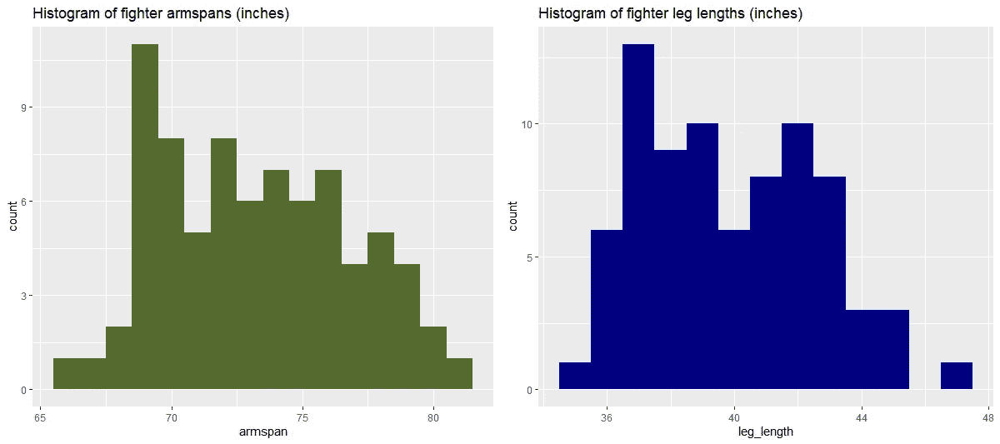
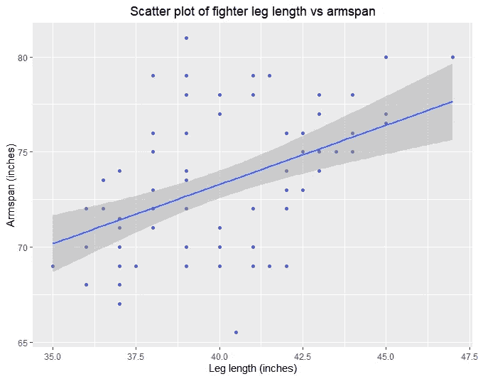

# 职业拳击运动员臂长与腿长关系的分析

> 原文：<https://towardsdatascience.com/the-correlation-between-arm-and-leg-length-in-mma-fighters-a-tutorial-on-data-analysis-in-r-3936efe12cb4?source=collection_archive---------59----------------------->

## R 中的数据分析演练

我最近[发表了一篇关于综合格斗(MMA)拳手的臂长和格斗成功的论文](https://psycnet.apa.org/fulltext/2020-39190-001.html)。我发现臂长更长的拳手在战斗中的优势非常小，也就是说，他们赢的更多。我遇到的一个问题是，我不能排除腿长是影响因素的假设，因为综合格斗运动员的腿长数据不是常规收集的。我们认为手臂更长的拳手也有更长的腿，这大概也是一个优势。我找不到任何关于拳手手臂和腿长之间相互关系的数据，所以我就把它留在那里。

我最近发现了一个叫做[的 MMA 联盟，职业拳手联盟](https://www.pflmma.com/)。它有大约 78 名战士的臂展和腿长数据。我想看看 MMA 拳手手臂和腿长之间的相关性可能会很有趣。这不是一个大样本，所以做任何比相关性更奇特的事情都不太可能提供信息(我的论文有大约 1600 架战斗机！).我们预计手臂和腿的长度之间有很大的相关性，所以 78 架战斗机很可能足够好了。例如，一个使用自由软件的简单功效分析 [Gpower](https://download.cnet.com/G-Power/3000-2054_4-10647044.html) 告诉我们，要有 99%的机会检测到|0.6|或更大的相关性(如果存在的话)只需要 35 个数据点，如果你像我们一样有一个单尾假设，则需要 30 个数据点。78 架战斗机进行 1-尾测试，我们有 99%的能力检测到低至|0.41|的相关性。

我手动浏览了所有战斗机页面，并将臂展和腿长数据写入 Excel。数据[可以在我的臂展文章的开放科学基金会页面上找到。我做了一个简单的分析，心想见鬼，为什么不把它做成一个 R 教程给感兴趣的人呢！](https://osf.io/7qv9s/)

首先，我们从我的 OSF 目录下载数据，并读入 R:

```
download.file(‘[https://osf.io/4d2pv/download','arm_leg_PFL.csv'](https://osf.io/4d2pv/download','arm_leg_PFL.csv'))
data= read.csv(‘arm_leg_PFL.csv’)
```

首先让我们制作二维直方图，看看它们是如何分布的，它们是如何变化的(记住你需要先安装这些软件包！).我们使用 GGplot2 包，因为它给出了漂亮的图形，使用 gridExtra 包，因为它允许我们同时呈现多个图形。

```
library(ggplot2)
library(gridExtra)plot1 = ggplot(data, aes(x = armspan))+
geom_histogram(binwidth = 1, fill = ‘darkolivegreen’)+
ggtitle(‘Histogram of fighter armspans (inches)’)plot2 = ggplot(data, aes(x = leg_length)) +
geom_histogram(binwidth = 1, fill = ’navy’)+
ggtitle(‘Histogram of fighter leg lengths (inches)’)grid.arrange(plot1, plot2, nrow=1)
```



作者提供的图片

变量有点偏斜，不像我们希望的那样呈正态分布，或者在一般人群样本中预期的那样(身体比例趋于正态分布)。当数据呈正态分布时，许多统计方法效果最佳。也就是说，这两个变量似乎都没有任何可能给分析带来问题的极值，尽管有些野兽有 47 英寸的腿！

这两种测量方法的尺度差异很大，可能是因为臂展包括双臂的长度和胸宽(双臂张开时中指指尖之间的距离)，而腿长可能是一条腿从髋骨到脚的距离。inseam 测量的评级似乎有点高，因为大多数人的测量值为 36+，这对于 6 英尺(1.83 米)的人来说是一个体面的腿长，而这些战斗机中的许多都比这短得多。但是谁知道呢。

现在我们让他们互相争斗。Geom_point 添加数据点，geom_smooth 添加趋势线。Method = 'lm '表示我们想要一条直线，但是还有其他选择。

```
ggplot(data, aes(x = leg_length, y = armspan))+
geom_point(colour = ‘slateblue’)+
geom_smooth(method=’lm’)+
ggtitle(‘Scatter plot of fighter leg length vs armspan’)+
theme(plot.title = element_text(hjust = 0.5))+
xlab(‘Leg length (inches)’)+
ylab(‘Armspan (inches)’)
```

代码中的“主题”部分只是以标题为中心(审美偏好)



作者提供的图片

他们看起来有很好的相关性。但是科学不仅仅是图表！让我们更正式地测试它。我们同时使用皮尔逊相关性和斯皮尔曼相关性，因为前者更有效，后者对异常值更稳健。如果它们相差很大，这可能表明异常值正在干扰我们的分析(尽管从图表来看，这不太可能)。

```
cor.test(data$armspan, data$leg_length, method = ’pearson’, alternative = 'greater')
cor.test(data$armspan, data$leg_length, method = ’spearman’, alternative = 'greater')
```

注意，如果你省略了“方法”参数，R 将只做一个皮尔逊参数。“替代=更大”意味着我们有一个 1 尾假设，即它们是正相关的。

相关性差别不大，所以离群值不会真的把事情弄糟。皮尔逊相关系数为+0.47，斯皮尔曼相关系数为+0.48。两者 P 值均< 0.001，高度显著。鉴于我们的样本量肯定大到足以检测这些相关性，极低的 p 值并不令人惊讶。

有趣的是 r = +0.47 比我预测的要低一点！对于上下文，臂展和身高之间的相关性大约为 r = 0.8。这可能有一些原因，例如测量误差，特别是如果战士或他们的团队进行了测量并向联盟报告。这将引入噪声，降低任何相关的幅度。臂展也包括胸宽，而腿部尺寸似乎反映了单腿的尺寸。如果我们有手臂的长度，那可能会显示出与腿的长度有更大的相关性。但遗憾的是，在现实世界中，你很少有完美的数据，尤其是当你从互联网上搜集数据时。

所以，臂展之间的相关性比预期的要小，但仍然相当大。在更大的数据集中测试这一点会很棒，所以我们可以看看腿的长度对获胜机会的影响，如果有人知道这种数据，请告诉我！