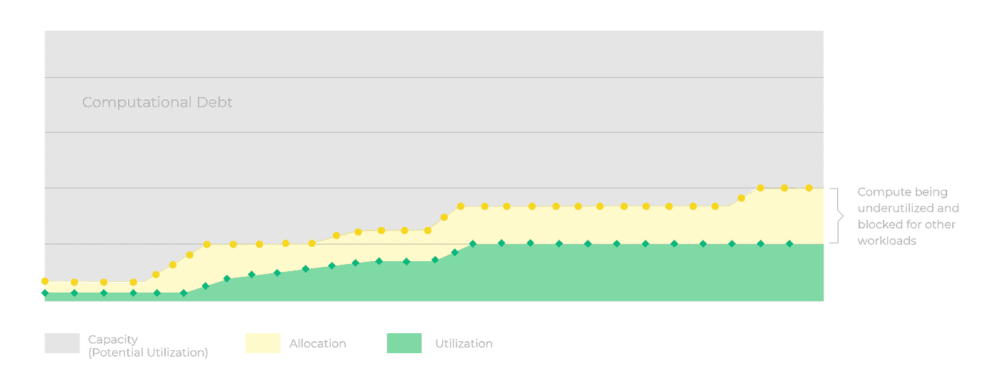

# 机器学习基础设施中“计算债务”的成本

> 原文：<https://towardsdatascience.com/the-cost-of-computational-debt-in-machine-learning-infrastructure-228a95516047?source=collection_archive---------37----------------------->

## 如何最大化您的 ML 服务器的利用率和可伸缩性

机器学习和深度学习很贵，这不是新闻。虽然将人工智能融入组织的商业价值非常高，但它通常无法抵消将这些模型应用到业务中所需的计算成本。机器学习和深度学习是非常计算密集型的，有人认为，除非云或内部计算成本降低，否则人工智能创新将得不偿失，尽管它具有前所未有的商业价值。

在《连线》杂志的一篇文章中，[麻省理工学院的研究科学家和《](https://www.wired.com/story/prepare-artificial-intelligence-produce-less-wizardry/)[深度学习的计算极限](https://arxiv.org/pdf/2007.05558.pdf)》的作者 Neil Thompson 提到，从谷歌到[脸书](https://www.wired.com/story/facebooks-ai-says-field-hit-wall/)的许多组织已经建立了影响力大、节省成本的模型，但由于计算成本使模型无利可图，这些模型未被使用。汤普森表示，在最近的一些会谈和论文中，从事特别大型和尖端人工智能项目的研究人员开始抱怨，他们无法测试多个算法设计，或者重新进行一项实验，因为成本太高。

组织需要计算效率更高的方法来推进创新，并提高人工智能工作的投资回报率。然而，高计算成本和对更高效计算的关注并不应该受到所有的指责。事实上，GPU 加速的基础设施和其他云提供商的重大进步，以前所未有的速度大幅提高了训练最复杂的人工智能网络的能力。2020 年 5 月， [DeepCube 发布了](https://www.businesswire.com/news/home/20200512005105/en/DeepCube-Launches-Industry-First-Deep-Learning-Software-Accelerator)其基于软件的推理加速器，可以大幅提高任何现有硬件上的深度学习性能。换句话说，正在开发计算解决方案，以满足机器学习和深度学习不断增长的需求。人工智能创新的无声杀手是现有计算的未充分利用，以及“计算债务”不断增加的成本。

# 什么是“计算债务”？

人工智能领导者可能会惊讶地发现，阻碍机器学习投资回报率的主要因素之一是 GPU、CPU 和内存资源的利用不足。公司在计算上投资了数百万美元，这些计算有可能大幅加速人工智能工作负载并提高性能，但最终只利用了其中的一小部分，有时低至这些强大资源的 20%。计算分配和实际利用率之间的差距令人震惊，可能会让公司付出比他们意识到的更多的代价。计算、分配和利用率之间的差距我们称之为“计算债务”。指的是分配和容量之间的“浪费”。

在下图中，您可以看到绿色表示平均利用率，黄色表示某一时间的分配情况。当一个工作负载运行时，它通常只利用 GPU 的一部分，而另一部分则被其他潜在工作负载阻止。灰色区域是容量，即现有的可用计算能力，无论是 GPU、CPU 还是内存。灰色区域是所有闲置和未充分利用的计算。

资料来源:cnvrg.io

# 什么导致了“计算债务”？

机器学习和深度学习是计算密集型的，管理起来很复杂，这使得这种计算债务很难减少。人工智能基础设施团队面临的最大挑战之一是理解如何提高利用率，并以最大化消耗的方式管理资源，以及提高机器学习项目的投资回报率。“计算债务”的一些主要原因是:

1.  **基础设施团队缺乏人工智能项目可见性**
    人工智能项目的基础设施成本每年增长 2 倍，然而 IT 团队缺乏工具来管理、优化和预算人工智能资源，无论是在本地还是在云中。大多数 IT/DevOps 主管缺乏对特定时间 GPU/CPU 和内存的利用率、分配和容量的了解。这使得控制消费和减少低效率成为不可能。
2.  **不断增长的“计算债务”** 随着 AI 计算需求变得更加复杂，计算分配和实际利用率之间的差距越来越大。平均而言，组织可能只消耗其总资源的 30%左右。这使得近 70%的计算处于闲置状态，浪费了公司数千甚至数百万美元。
3.  **无法识别效率低下的工作** 基础架构团队无法轻松识别一直未充分利用 GPU/CPU 的工作负载。如果没有收集到的历史工作负载数据，就无法分析和识别运行效率低下的工作负载。由于缺乏可见性，很难提高利用率，也很难控制工作负载的优先级。
4.  **生产力中断**
    未充分利用的 GPU 被阻止用于其他工作，增加了数据科学家完成项目的等待时间。这导致更多的时间浪费在等待 GPU 的可用性上，此外还浪费了资源。同时，还有其他闲置的资源可以用于其他工作。
5.  **缺乏标准化和统一性**
    通常，团队无法将一项工作与其利用率相关联。没有标准的可视化工具允许您查看某个时间点的作业分配、利用率和容量。这使得识别低效作业和优先处理浪费的工作负载变得困难。机器学习已经达到成熟阶段，人工智能基础设施战略是必要的，以便增长。
6.  **无法控制优化策略** 虽然一些团队可能能够识别效率低下的问题，并为优化的基础架构策略制定计划，但几乎没有工具来执行这些策略。IT/DevOps 团队需要控制人工智能工作负载，以优化资源管理。如果无法确定作业优先级、配置计算模板以及监控工作负载分配和利用率，就无法实现实质性的改进。

# 减少“计算债务”的策略

这个问题没有明确的解决方案，但是有一些方法可以提高资源管理的效率。以下是一些可以提高计算资源利用率的策略。

1.  **投资最先进的 GPU 加速人工智能基础设施** [GPU 加速技术](https://cnvrg.io/solutions/dgx/)已经取得了长足的进步。硬件和软件深度学习加速解决方案已经出现，可以提供前所未有的性能。研究 GPU 加速的最新可用解决方案，以采用真正现代的人工智能基础设施。
2.  **采用混合云基础架构** 结合公共云、私有云和内部资源，在运行人工智能工作负载方面提供敏捷性和灵活性。由于人工智能工作负载之间的工作负载类型差异很大，因此构建混合云基础架构的组织能够更灵活地分配资源和定制规模。您可以通过公共云降低资本支出，并提供高计算需求时期所需的可扩展性。在具有严格安全要求的组织中，添加私有云是必要的，并且随着时间的推移可以降低运营支出。混合云可帮助您获得改善资源预算所需的控制力和灵活性。
3.  **利用** [**估算 GPU/CPU 内存消耗的工具**](https://www.microsoft.com/en-us/research/uploads/prod/2020/05/dnnmem.pdf)根据[微软研究中心对微软 4960 个失败的 DL 作业的研究](https://www.microsoft.com/en-us/research/uploads/prod/2020/05/dnnmem.pdf)，8.8%的作业失败是由 GPU 内存耗尽引起的，这在所有深度学习特定故障中占最大类别。已经开发了许多[评估工具](https://cnvrg.io/introducing-mlops-dashboard/)来帮助规划 GPU 内存消耗，以减少这些故障。此外，如果您能够收集利用率数据，您可以使用这些历史数据来更好地预测每个季度的 GPU/CPU 和内存需求。
4.  **Scale MLOps** 介绍一种简化您的 ML 工作流程并使科学和工程角色之间的转换标准化的方法。由于 IT 和 DevOps 负责部署和管理工作负载，因此在运行不同的作业时拥有清晰的沟通渠道非常重要。适当的[调度工具](https://cnvrg.io/introducing-mlops-dashboard/)和策略化资源模板也可以改善人工智能工作负载的资源管理。
5.  **最大限度地提高利用率，减少“计算债务”** 为了提高利用率，有必要将计算债务作为基础架构团队和数据科学团队的 KPI。设法减少计算负担并提高利用率的组织将在人工智能竞赛中茁壮成长。

# 结论

很少有解决方案能够最大限度地提高基础架构团队对 GPU/CPU 和内存消耗的可见性，从而提高利用率。虽然业界正在快速构建更高效的硬件和软件来解决计算债务的威胁，但我们还有很长的路要走。事实是，大多数组织都坐拥数百万美元的未充分利用的计算。通过使用您所拥有的，并改善资源管理，组织将实现其人工智能基础设施的大规模可扩展性。通过在你的现代人工智能基础设施中采用这些策略，你会发现计算的充分利用是可以实现的。专注于基础设施优化的公司将看到其人工智能工作的投资回报率增加，并在竞争中获得竞争优势。