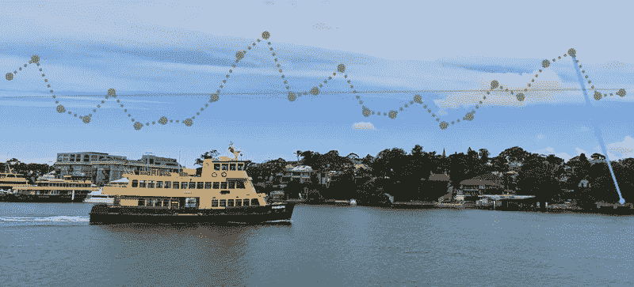
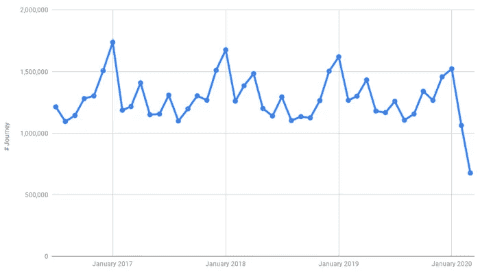
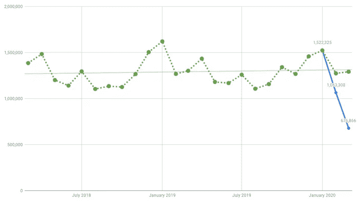
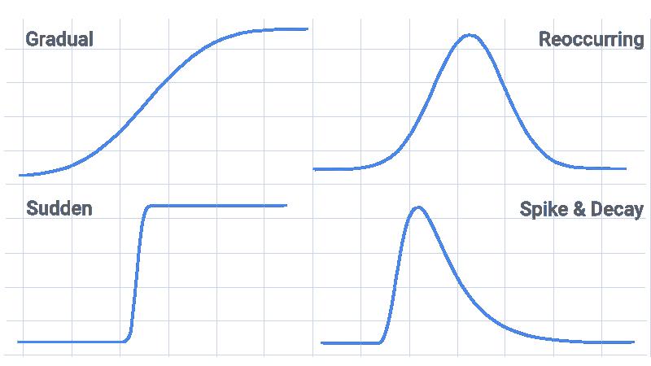
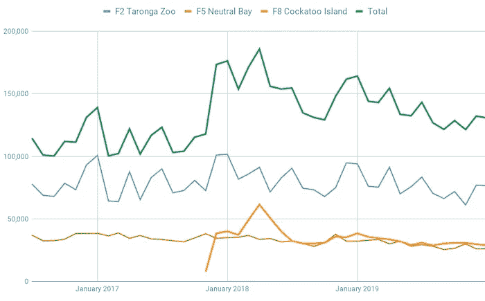
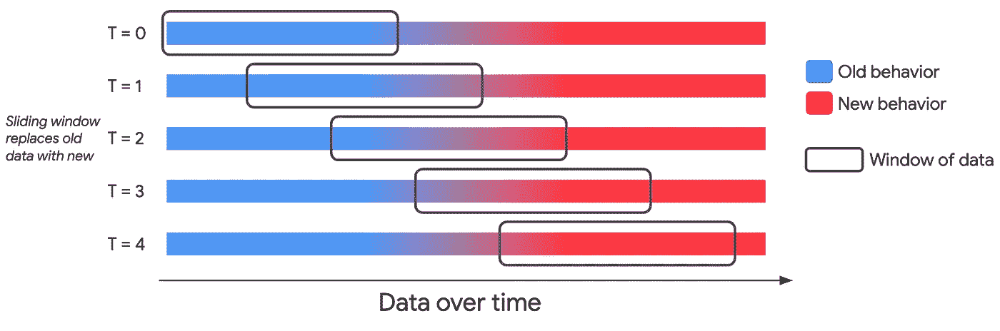
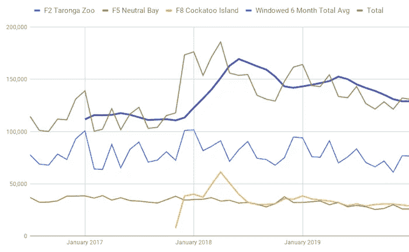
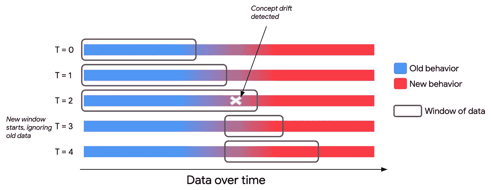

# 新冠肺炎概念漂移，使用悉尼渡轮活动数据

> 原文：<https://towardsdatascience.com/the-covid-19-concept-drift-using-sydney-ferry-activity-data-32bbff63cb9f?source=collection_archive---------41----------------------->

## CV-19 创造了消费者行为的突然转变，影响了营销数据和 ML 模型。学习如何识别和解决这些问题。

*[*马伯骞*](https://www.linkedin.com/in/vicma/) *&* [*德鲁·贾勒特*](https://www.linkedin.com/in/drewjarrett/)*

*全球冠状病毒疫情已经并仍在影响着全球大多数行业，以及我们许多人。因此，我们的行为——消费者行为——已经发生了变化，与之相关的营销数据也发生了变化。当生活恢复正常时，希望越快越好🤞，我们会看到消费者行为的重新调整还是一种新型行为的引入？*

*许多预测模型的一个共同的重要假设是，用于训练模型的数据与生产中输入的数据相似。[概念漂移](https://en.wikipedia.org/wiki/Concept_drift)是当我们试图预测的事物的数据发生变化时使用的术语。发生这种情况的原因有很多。例如:*

*   *欺诈者可能会更改电子邮件的内容以通过垃圾邮件过滤器。*
*   *一个产品现在在不同的市场有售，新用户有不同的使用习惯。*
*   *随着时间的推移，由于正常的磨损，测量传感器可能会变得嘈杂或不准确。*
*   *新促销或广告的新奇效果会逐渐消失。*
*   *CV-19 疫情改变了消费者的行为。*

*提出问题，CV-19 污染了你的数据吗？或者——考虑到疫情的长度——它带来了一组新的数据来分析吗？无论哪种方式，重要的是认识到将会有概念漂移，引入新的数据挑战并降低预测 ML 模型的准确性。*

*因此，现在让我们采取一些措施来解决与我们的数据有关的任何问题，以及未来的证据。*

***首先，这篇文章的作者打个招呼。***

*嗨，我是维克。我在新加坡工作，是谷歌的一名数据科学家，在那里我致力于提高我们的关键客户和合作伙伴的数据成熟度和能力。此前，我是美国的一名工程师。*

*嗨，我是[德鲁](https://uk.linkedin.com/in/drewjarrett)。我是谷歌的客户解决方案工程师，帮助我们的广告客户充分利用他们的网站、应用和数据。*

***悉尼渡轮之旅***

*4 月 3 日，谷歌发布了 [CV-19 社区移动报告](https://www.blog.google/technology/health/covid-19-community-mobility-reports)，这是一组汇总的匿名见解，显示了不同地理位置的移动趋势。看看澳大利亚的数据，与标准基线相比，公共交通的流动性趋势下降了-63%。*

*显然(对我们大多数受这个疫情影响的人来说)！但这很好地说明了行为的转变。请注意与标准基线进行比较的重要性，我们稍后将解释原因。*

**

*图片由作者拍摄——悉尼渡口*

*为了这篇文章，我们来看看德鲁的日常通勤——可以说是世界上最好的交通方式——悉尼轮渡服务。相比之下，维克多坐了 4 次地铁🤷。*

*opendata.transport.nsw.gov.au 服务提供[澳洲新南威尔士州渡轮分接数据](https://opendata.transport.nsw.gov.au/dataset/opal-trips-ferry)(代表个人进入&离开渡轮码头)。假设我们正在构建一个预测活动的模型。*

**

*作者制作的图像—随时间变化的渡轮数据图*

*数据从 2016 年 7 月到 2020 年 3 月，显示出明显的季节性趋势，每年 1 月的活动高峰与悉尼夏季和新年前夕的活动高峰相对应。然后在三月初，[世界卫生组织宣布了一个疫情](https://www.bbc.com/news/world-51839944)，这反映在二月和三月之间服务下降了 57%(哇，这与谷歌社区移动性报告非常吻合！).*

*让我们以此为基础建立一个可行的 3 步方法，我们可以遵循它来纠正我们的 ML 模型如何解释数据— 1。识别，2。解决，3。自动化。*

***第一步。(做好准备)识别正在发生的漂移***

*我们怎么可能首先知道有问题呢？通常情况下，这是当数据不再符合过去的趋势。这可能会随着时间的推移而缓慢发生，或者就这些运输服务而言，可能会突然发生。*

*为了准备控制基线，我们可以绘制所有历史(或训练)数据，并根据过去的趋势预测未来的活动。我们在这里使用 [ARIMA(自回归综合移动平均)](https://en.wikipedia.org/wiki/Autoregressive_integrated_moving_average)方法完成了这项工作(更多信息，请查看这篇由 [Lak Lakshmanan](https://medium.com/@lakshmanok) 撰写的关于[使用 BigQuery](https://medium.com/google-cloud/analyzing-covid-19-with-bigquery-13701a3a785) 分析新冠肺炎的有用文章)。*

**

*图片由作者制作— ARIMA 轮渡数据预报*

*绿色虚线代表我们的基线。即 2020 年 1 月之前的实际历史数据，以及 2020 年 1 月之后的预测数据。我们使用的 ARIMA 方法返回预测的置信上限和下限，当实际结果(蓝线)超出这些界限时，很明显可能有问题。尤其是从 2 月到 3 月。*

*数据随时间漂移有几种方式。是突然的还是渐进的？是永久的还是暂时的？*

**

*作者制作的图像——概念漂移模式*

*   *再次出现。行为变化随后恢复正常，类似于季节性，例如，公路建设在夏季分流交通。*
*   *循序渐进。缓慢但持久的变化，例如采用拼车和减少对轮渡服务的需求。*
*   *峰值和衰减。衰减较慢的突然变化；常见于病毒式、短暂的新闻或媒体内容，例如《权力的游戏》大结局。*
*   *突然转变。行为跳跃，例如完全的旅行限制。*

*在我们的摆渡例子中(我确信大多数 CV-19 受影响的数据),我们看到了一个突然的变化，并且有希望衰减。然而，鉴于疫情持续的时间长度，加上后疫情时代消费者行为可能出现的新的渐进变化，我们可能会继续看到与基线不同的结果，这需要加以解决。*

****热衷于多花时间多学习？****

*用于检测时间序列数据中的结构变化的方法是[变化点检测](https://en.wikipedia.org/wiki/Change_detection)，变化点是数据趋势开始变化的时间段。这可以每周自动进行，为检测未来的问题做好准备。*

*随着时间的推移，ML 模型的准确性也可能会降低(希望您正在监控这一点)。像[可解释人工智能](https://cloud.google.com/explainable-ai)这样的工具为理解正在发生的事情提供了一个很好的视角，即特定(不正确)预测背后的解释是否仍然可信，或者是否存在以前没有的潜在问题？这些参考了 [Shapley 值](https://github.com/slundberg/shap)来理解特征的重要性。*

***第二步。解决数据漂移***

*我们可以采用许多方法来解决概念漂移，有些方法比其他方法更先进。另外，根据漂移的类型，不同的方法会更相关。*

*这篇文章的目标是给你留下一个可实现的短期胜利，来应对我们已经看到的 CV-19 的突然变化。有鉴于此，我们将通过数据称重和/或数据开窗来解决漂移问题。*

**称重数据**

*称重数据的优势在于，我们可以继续使用我们之前使用的历史训练集，只是现在允许模型识别与最近事件不太相关的旧项目。此外，CV-19 有可能会再次出现(我们希望不会！)在这种情况下，保存和使用历史数据可以确保我们为长期成功做好准备。*

*为了了解这一点如何应用于轮渡数据，我们可以考虑在引入新航线(F8 凤头鹦鹉岛航线)时纠正总计数活动的突然增加。*

**

*作者制作的图像-一段时间内的渡轮数据图*

*通过对较新的数据给予更大的权重，并随着数据变老而降低权重，根据它们与当前事实的偏离程度来衡量分数。允许模型理解更多的相关事件。实现这一点的最简单的方法是给最近的后漂移事件加权 1，给较早的前漂移事件加权 0。*

**数据开窗**

*也就是说，通过在一组固定的窗口上聚合，将数据窗口化到实例中，这有助于消除突然的漂移。此外，如果您热衷于保留历史数据，权重仍然可以应用于实例。你可以[阅读更多关于这个项目通量电容器](https://medium.com/@drewjarrett/structuring-data-to-predict-the-future-aka-project-flux-capacitor-7133715d7e57)的博文。*

*在图中有一个**固定窗口**以设定的间隔移动，以减少新旧行为之间的漂移。*

**

*作者制作的图像—说明一个固定的窗口*

*要了解这如何应用于渡轮数据，让我们使用 6 个月的固定窗口，对每个窗口中的总活动进行平均。如果我们试图使用所有历史数据预测未来的活动，我们的预测将因 2018 年 1 月之前的低活动而有所偏差。使用 6 个月的窗口可以让我们的估计对总活动/流量的跳跃做出更快的反应，并且总体上更准确。*

**

*作者制作的图像-一段时间内的渡轮数据图*

****热衷于多花时间，多学习？****

*计算权重时，还可以考虑使用[指数衰减](https://en.wikipedia.org/wiki/Exponential_decay)方法，较小的权重对模型的贡献较小。*

*为了更进一步，可以使用大量模型的集合，使用旧的和新的数据集进行训练。然后可以应用[加权多数算法](https://en.wikipedia.org/wiki/Weighted_majority_algorithm_(machine_learning))从一组预测中得出结果。如果我们希望数据“恢复正常”，这可能是有用的。*

***第三步。自动化再培训***

*这是不可避免的，我们需要保留我们的模型，因为用户的行为有所不同。当然，我们可以选择手动重新训练我们的模型，但这是一个为成功而设置的好机会，并让它自动发生？*

*根据我们想要应用的策略，有几个不同的选项。*

**连续自适应**

*换句话说，每个新数据点通过固定的滑动窗口或加权方案来更新模型，如步骤 2 中所讨论的。对于固定的滑动窗口，最旧的数据点将被忽略。*

*在悉尼轮渡的数据中，我们可能只看到最近的一组季节性数据。这是一种更简单的方法，尽管我们仍然需要实验来找到合适的窗口大小或加权方案。*

**触发适应**

*当检测到概念漂移时，可以触发模型进行重新训练。例如，这可能是使用一直到最后一个变化点的数据重新构建预测，或者增量调整数据窗口的大小(如果漂移更剧烈，则缩小；如果没有检测到漂移，则扩大)。*

*在图中注意到**窗口在增长，而相关数据仍在累积**。然而，在 T = 2 之后，已经积累了足够的不同数据，并且从检测到概念漂移时开始创建新的窗口。*

**

*作者制作的图像—说明自适应窗口*

****热衷于多花时间，多学习？****

*当检测概念漂移时，考虑一下你所检测的变化的触发阈值应该是多少，以及模型应该如何适应。*

*当谈到自动化流程时，Google Cloud 中的 [Cloud Composer](https://cloud.google.com/composer/docs/concepts/overview) 工具(它部署了 Apache Airflow)是一种基于一组处理数据和重新训练模型的触发器来建立持续集成工作流的强大方法。谷歌云解决方案页面的 [CI/CD 下也有一些有用的快速入门和 codelabs。](https://cloud.google.com/docs/ci-cd)*

***总结***

*如你所见，有很多方法可以解决概念漂移。在这篇文章中，我们主要关注 CV-19 疫情引起的突然漂移的解决方案。希望你能从中获得一些快速的成功，以及一些更先进的想法，供你在未来阅读。*

*感谢阅读。请在评论中反馈并让我们知道你的进展。*