# Cox 比例风险模型

> 原文：<https://towardsdatascience.com/the-cox-proportional-hazards-model-35e60e554d8f?source=collection_archive---------3----------------------->

什洛莫·沙莱夫在 [Unsplash](https://unsplash.com?utm_source=medium&utm_medium=referral) 上拍摄的照片

## 生存数据的回归模型

我之前写过如何计算生存数据的[卡普兰-迈耶](/visualizing-time-series-survival-data-36029652a393)曲线。作为一个非参数估计量，它在快速查看数据集的生存曲线方面做得很好。然而，它不能让你做的是模拟协变量对存活率的影响。在本文中，我们将重点关注 Cox 比例风险模型，这是生存数据最常用的模型之一。

我们将深入讨论如何计算估计值。这是有价值的，因为我们将会看到，估计值只取决于故障的排序，而不是它们的实际时间。我们还将简要讨论一些特殊于生存分析的因果推断的棘手问题。

# 生存函数和风险率

我们通常根据如下的存活曲线来考虑存活数据。

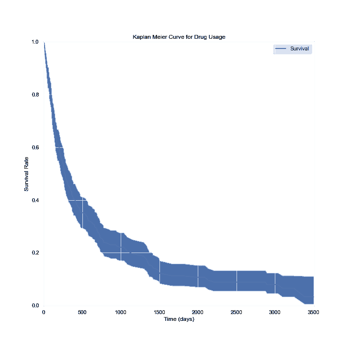

随机生成数据的生存曲线

在 x 轴上，我们以天为单位表示时间。在 y 轴上，我们有(一个[估计值](/visualizing-time-series-survival-data-36029652a393))人群中“存活”到那个时间的受试者的百分比(技术上，比例)。Survive 可以是比喻的，也可以是字面的。可能是人是否能活到某个年龄，机器是否能在一定时间内不出故障，也可能是某人在失业后是否会失业一段时间。

至关重要的是，生存分析的复杂性在于一些受试者没有观察到他们的“死亡”。在收集数据时，他们可能还活着，机器可能还在运行，或者有人可能还在失业。这种观察被称为“右删截”,处理删截意味着生存分析需要不同的统计工具。

我们用 S 表示幸存函数，它是时间的函数。其输出是在时间 *t* 存活的受试者的百分比。(再次强调，从技术上讲，它是介于 0 和 1 之间的一个比例，但我会交替使用这两个词)。为了简单起见，我们将做一个技术性的假设，如果我们等待足够长的时间，所有的受试者都会“死亡”

我们将用类似于 *i* 或 *j* 的下标来索引主题。整个群体的故障时间将在时间变量 *t* 上用类似的下标表示。

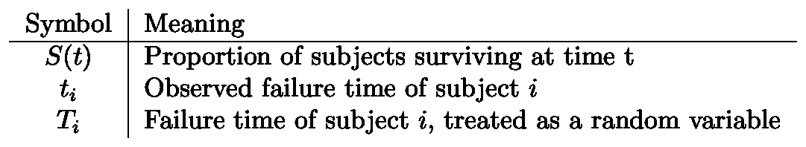

另一个需要考虑的微妙之处是，我们是将时间视为离散的(比如一周接一周)还是连续的。从哲学上讲，我们只能以离散的增量来度量时间(比如说，精确到秒)。通常情况下，我们的数据只会告诉我们某一年是否有人死亡，或者某一天某台机器是否出现故障。为了使阐述尽可能清晰，我将在离散的和连续的案例之间来回切换。

当我们试图对协变量(如年龄、性别、种族、机器制造商)的影响进行建模时，我们通常会对理解协变量对*风险率*的影响感兴趣。危险率是在给定时间 *t* 的故障/死亡/状态转换的瞬时概率，条件是已经存活了那么长时间。我们将把它记为λ(t)。将时间视为离散的:

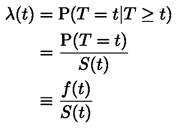

离散时间的生存函数

其中 *f* 是在时间 *t* 失效的总概率密度。我们可以通过在概率密度“函数”中允许 [delta 函数](https://en.wikipedia.org/wiki/Dirac_delta_function)来统一离散和连续的情况。因此，对于连续情况，结果λ = f/S 是相同的。

我们来固定一个例子。让我们考虑一个临床试验的背景，在这个临床试验中，一种药物最初导致疾病进入缓解期。当受试者的疾病开始发展时，我们会说药物对受试者“失效”。最后，假设每周测量受试者的疾病状态。那么，如果λ(3) = 0.1，这意味着对于给定的受试者，如果他们在第 3 周之前仍处于缓解状态，则有 10%的可能性，他们的疾病将在第 3 周开始发展。其余的 90%将保持缓解状态。

接下来，总概率密度函数 *f* 就是 S 对时间的导数。(还是那句话，如果时间是离散的， *f* 只是一些δ函数的和)。这意味着

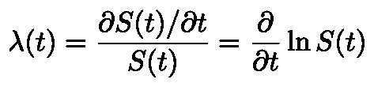

风险函数是 S 的对数的导数

这意味着，如果我们知道风险函数，我们可以求解 S 的微分方程:

根据风险函数的生存函数

如果时间是离散的，delta 函数的和的积分就变成了每个离散时间的危险的和。

好了，这总结了我们需要的符号和基本概念。让我们继续讨论模型。

# 非参数、半参数和全参数模型

正如我前面说过的，我们通常对风险率λ的建模感兴趣。

在非参数模型中，我们对λ的函数形式不做任何假设。卡普兰-迈耶曲线是这种情况下的最大似然估计。不利的一面是，这使得*很难模拟*协变量的任何影响。这有点像用散点图来理解协变量的影响。不一定像线性回归这样的完全参数模型那样有用。

在完全参数模型中，我们假设λ的精确函数形式。关于全参数模型的讨论本身就是一篇完整的文章，但是值得简单讨论一下。下表显示了三种最常见的全参数模型。每一个都被下一个概括，从 1 到 2 到 3 个参数。危险函数的函数形式显示在中间一栏。风险函数的对数也显示在最后一列。所有参数(ɣ，α，μ)都假定为正，除了在广义威布尔分布中μ可以是 0(复制[威布尔](https://en.wikipedia.org/wiki/Weibull_distribution)分布)。

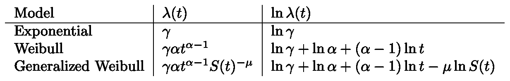

查看对数可以看出，[指数](https://en.wikipedia.org/wiki/Exponential_distribution)模型假设风险函数是常数。威布尔模型假设，如果α >为 1，则增加；如果α=1，则保持不变；如果α <为 1，则减少。广义威布尔模型以与威布尔模型相同的方式开始(开始时 ln S = 0)。在那之后，一个额外的项μ出现了。

这些模型的问题在于它们对数据做了强有力的假设。在某些情况下，可能有理由相信这些模型非常适合。但是有了这些和其他几个选项，由于模型的[错误设定](https://en.wikipedia.org/wiki/Statistical_model_specification#Detection_of_misspecification)，得出错误结论的风险很大。

这就是为什么 Cox 比例风险，一个半参数模型如此受欢迎。没有对风险函数的形状进行函数假设；相反，函数形式的假设是关于协变量单独的影响。

# Cox 比例风险模型

Cox 比例风险模型通常以时间 *t、*协变量向量 x 和系数向量β的形式给出

Cox 比例风险模型

其中λₒ是时间的任意函数，基线危害。与标准线性回归一样，指数中包含 X 和β的点积。无论协变量的值如何，所有受试者都有相同的基线风险λₒ.此后，根据协变量进行调整。

## 结果的解释

假设我们已经将 Cox 比例风险模型与我们的数据进行了拟合，其中包括

1.  为每个主题指定时间的列
2.  指定受试者是否被“观察”(失败，或者，在我们的优选示例中，疾病进展)的栏。值 1 表示受试者的疾病进展。值为 0 意味着在最后一次观察时，疾病没有发展。这项观察被删改了。
3.  协变量 x 的列。

拟合之后，我们将得到β的值。例如，为简单起见，假设只有一个协变量。β=0.1 的值意味着协变量增加 1 会导致在任何给定时间疾病进展的概率约为 10%。确切的值实际上是

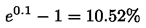

β=0.1 时危险增加的精确值

对于小的β值，β值本身是危险增加的精确近似值。对于更大的β值，必须计算精确的量。

β=0.1 的另一种表达方式是，随着 x 的增加，x 每增加 1，危险以 10%的*率*增加。较大的 10.52%来自于(连续)[复利](https://en.wikipedia.org/wiki/Compound_interest)，就像复利一样。

此外，β=0 意味着没有影响，β为负意味着随着协变量的增加，风险降低。注意，与标准回归不同，这里没有截距项。取而代之的是截距被吸收到基线危险λₒ中，这也是可以估计的(见下文)。

最后，假设我们已经估计了基线风险函数，我们可以构造幸存者函数。

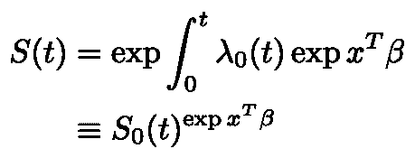

基线函数被提升到来自协变量的 exp(xʹβ因子的幂。在解释基线生存函数时应该小心，它大致相当于常规线性回归中的截距项。如果协变量已经居中(平均值为 0)，那么它代表“平均”受试者的存活函数。

# 估计 Cox 比例风险模型

20 世纪 70 年代，[英国数学家 David Cox](https://en.wikipedia.org/wiki/David_Cox_(statistician)) 提出了一种无需估计基线风险λₒ.就能估计β的方法同样，基线危害可以在事后估算。如前所述，我们将会看到，重要的是观察到的故障的排序，而不是时间本身。

在开始评估之前，有必要讨论一下领带。因为我们通常只观察离散增量的数据，所以两个故障可能同时发生。例如，两台机器可能在同一周发生故障，而记录只在每周进行一次。这些联系使得对形势的分析变得相当复杂，却没有增加多少洞察力。因此，我将在没有联系的情况下得到估计。

回想一下，我们的数据是由在离散时间观察到的一些故障组成的。让 R(t)表示在时间 t 时“处于危险中”的人群。如果我们研究中的受试者在时间 t 前失败(例如，疾病发展)，他们就不“处于危险中”此外，如果我们研究中的受试者在时间 t 之前的某个时间对他们的观察进行了审查，他们也没有“处于危险中”

按照通常的方式，我们希望构建一个似然函数(给定协变量和系数，我们观察到的数据的概率是多少),然后优化它以获得最大似然估计量。

对于我们观察到受试者 *j* 出现故障的每个离散时间，假设故障出现，则出现故障的概率*如下。在 j 时刻，对所有处于危险中的受试者进行求和。*

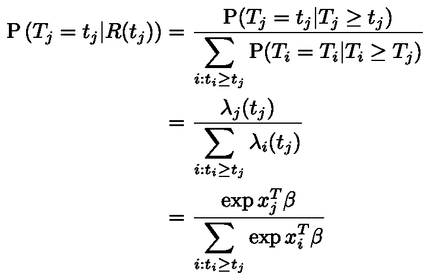

(等式 1)对象 j 而不是另一个对象在时间 j 失败的概率

请注意，基线危险λₒ已经退出！非常方便。为此，我们构建的可能性只是一个[部分可能性](https://en.wikipedia.org/wiki/Likelihood_function#Partial_likelihood)。也请注意，时间根本没有出现。受试者 j 的术语仅取决于哪些受试者在 j 时刻仍然活着，而这又仅取决于受试者被审查或观察失败的顺序。

当然，部分可能性只是这些项的乘积，我们观察到的每一个失败都有一个(没有截尾观察的项)。

然后，对数部分似然是

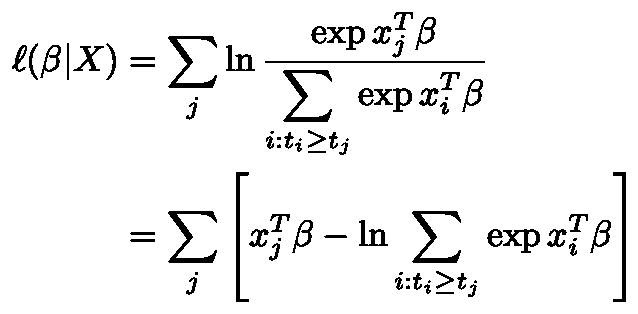

(等式 2)部分对数似然函数

使用标准的数值方法进行拟合，例如在 python 包`[statsmodels](https://www.statsmodels.org/stable/duration.html)`中，估计的方差-协方差矩阵由 [Fisher 信息矩阵](https://en.wikipedia.org/wiki/Fisher_information)的(逆)给出。这里没什么令人兴奋的。

## 估计基线幸存者函数

既然我们已经估计了系数，我们可以估计生存函数。这与估算卡普兰-迈耶曲线非常相似。

我们假设用 *i* 索引的项α。在时间 *i* 处，基线存活者曲线应减少一个分数α，表示在时间*I*处失败的处于危险中的受试者的比例。换句话说

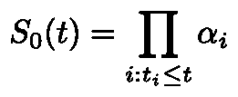

为了计算α的最大似然估计量，我们考虑来自在时间 *i* 失败的受试者 *i* 的似然贡献，以及来自在时间 *i.* 被审查的受试者的贡献

对于在时间 *i，*失败的受试者，概率由他们在时间 *i* 存活的概率减去他们在下一时间 *i+1 存活的概率给出。*(我们暂时假设时代是有序的)。

(等式 3)来自观察到的故障的可能性贡献

相反，如果他们在时间 *i、*被审查，贡献就是他们在 *i、*之后还活着的概率，即他们还没有死。这只是

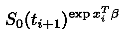

(等式 4)来自截尾观察的似然贡献

有一个额外的术语来自被观察的受试者(即被观察到失败而不是被审查)。对数似然变成

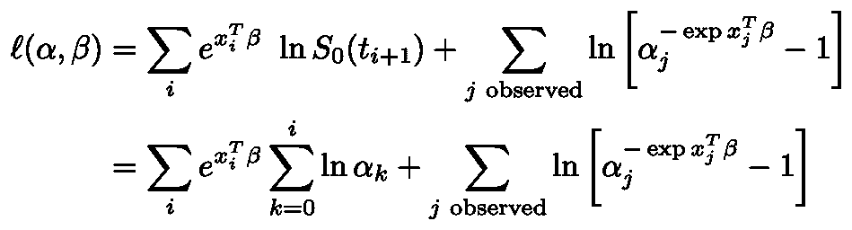

(等式 5)基线幸存者函数的对数似然

我在跟踪端点(I 对 i+1)方面有点草率，但一切都会好的。

我们观察到失败的科目只有α项。对α-j 求微分，并假设没有联系，我们从左边的总和中只得到 j 时刻活着的受试者的贡献，从右边的项中得到一个贡献。

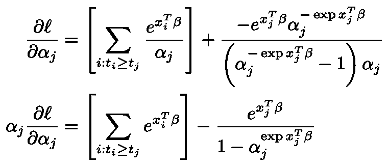

(等式 6)似然函数关于 j 项的偏导数

将此值设为 0 意味着我们可以使用β的估计值作为几个方程的解来获得α的最大似然估计值，每个方程对应一个观察失败的受试者:

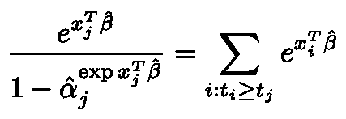

(等式 7)求解α估计的简单等式

# 扩展和警告

关于 Cox 比例风险模型还有很多要说的，但我会尽量简短，只提几件事。

例如，人们可能想考虑时变回归量，这是可能的。

要记住的另一个关键点是[省略变量偏差](https://en.wikipedia.org/wiki/Omitted-variable_bias#:~:text=(Learn%20how%20and%20when%20to%20remove%20this%20template%20message),to%20those%20that%20were%20included.)。在标准线性回归中，与回归变量不相关的省略变量不是大问题。这在生存分析中是不成立的。假设我们的数据中有两个相同大小和取样的亚人群，每个亚人群都有一个恒定的风险率，一个是 0.1，另一个是 0.5。最初，我们会看到一个很高的风险率(平均值只有 0.3)。随着时间的推移，具有高危险率的人群将离开该人群，我们将观察到危险率向 0.1 下降。如果我们忽略了代表这两个群体的变量，我们的基线风险率将会被打乱。

*我的目标是写(相对)易懂的数据科学概念的解释，而不回避有时涉及的复杂数学。如果你喜欢这个，你我还有类似风格的解释***[*困惑度*](/the-relationship-between-perplexity-and-entropy-in-nlp-f81888775ccc)*[*中心极限定理*](/why-is-the-normal-distribution-so-normal-e644b0a50587) *，或者* [*期望最大化*](/expectation-maximization-explained-c82f5ed438e5) *。****

***如果你不喜欢这个，多考虑一下* [*回归*](https://medium.com/@rmcharan/regression-geometry-61fdd5515ab7) *，奇异值分解***，或者* [*傅立叶变换*](/build-intuition-for-the-fourier-transform-b0bd338c6d4f) *。****

# **参考**

**更详细的讨论见[卡梅隆和特里文迪](https://www.cambridge.org/us/academic/subjects/economics/econometrics-statistics-and-mathematical-economics/microeconometrics-methods-and-applications?format=HB&isbn=9780521848053)**