# MySQL、PostgreSQL 和 Hive 的奇特案例

> 原文：<https://towardsdatascience.com/the-curious-case-of-mysql-postgresql-and-hive-9e7cae9e52f4?source=collection_archive---------16----------------------->

## MySQL、PostgreSQL 和 Hive 在相同的 SQL 语法下如何表现不同


照片由[弗洛里安·奥利佛](https://unsplash.com/@florianolv?utm_source=unsplash&utm_medium=referral&utm_content=creditCopyText)在 [Unsplash](https://unsplash.com/s/photos/programming?utm_source=unsplash&utm_medium=referral&utm_content=creditCopyText) 上拍摄

在大数据时代，数据的数量、大小和速度都在快速增长，对于数据分析师和数据科学家来说，了解 SQL 仍然是必不可少的。SQL 帮助我们管理传统关系数据库(RDBMS)、分布式集群甚至云环境中的数据。

如果我们在传统的 RDBMS 中处理数据，我们通常会使用像 MySQL 或 PostgreSQL 这样的数据库引擎。然而，随着数据的数量和大小迅速增长，我们不能只使用 RDBMS 来存储所有的数据。这就是我们需要分布式集群来存储和处理大量数据的地方，Hadoop 为我们提供了便利。

如果您正在使用 Hadoop 生态系统，那么您很可能会使用 Apache Hive 来管理和查询驻留在 Hadoop 分布式文件系统或 HDFS 中的结构化数据。

MySQL、PostgreSQL 和 Hive 都有相似的 SQL 语法，有时我们假设它们会根据给定的 SQL 查询表现相似。然而，事实并非如此。让我们深入一些场景，在相同的 SQL 语法下，PostgreSQL、MySQL 和 Apache Hive 中至少有一个表现不同。

# 整数的除法运算

除法是 SQL 引擎需要解释的一种复杂的算术运算，不像加法、减法和乘法等其他运算。如果你将两个整数相加、相减或相乘，你将总是得到一个整数，而除法不是这样。您可以将两个整数相除，得到一个小数或一个舍入整数作为结果，这取决于您使用的 SQL 引擎。

在 Hive 和 MySQL 中，如果用`/` 运算符对两个整数进行除法运算，总会得到一个小数结果。

```
**SELECT 32/5**>> result: 6.400000
```

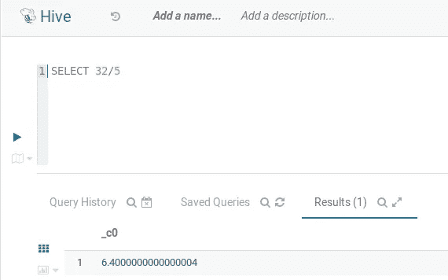

与此同时，在 PostgreSQL 中，如果您使用`/` 运算符对两个整数进行除法运算，您将始终得到一个整数结果。

```
**SELECT 32/5**>> result: 6
```

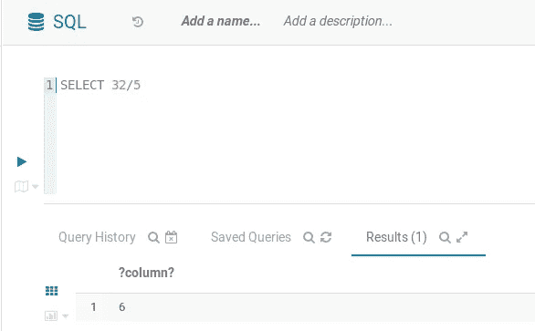

因此，如果您使用 PostgreSQL，记住您期望的输出类型是很重要的。如果您想要一个整数结果，您可以像上面一样编写您的 SQL 查询。但是，如果您想要像 Hive 和 MySQL 中那样精确的十进制结果，您需要显式地将其中一个操作数转换为十进制数。

```
**SELECT 32.0/5**>> result: 6.4
```

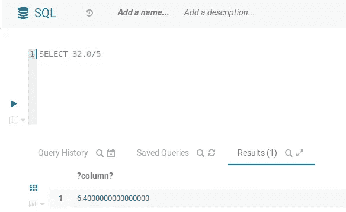

如果你使用 MySQL 或 Hive，并且你想在执行两个整数的除法后得到一个整数结果，你需要使用`DIV`运算符来代替。

```
**SELECT 32 DIV 5**>> result: 6
```

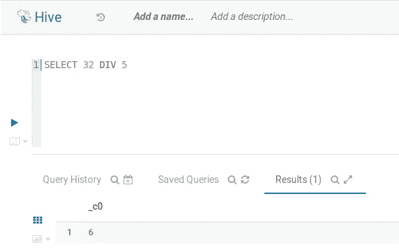

# 区分大小写:字符串比较

比较两个字符串也可能在不同的 SQL 引擎上产生不同的结果。Apache Hive 和 PostgreSQL 在进行字符串比较时是区分大小写的，这意味着大写字母和小写字母很重要。让我们看看下面的例子。

```
**SELECT** 'One' = 'one'>> result: False
```

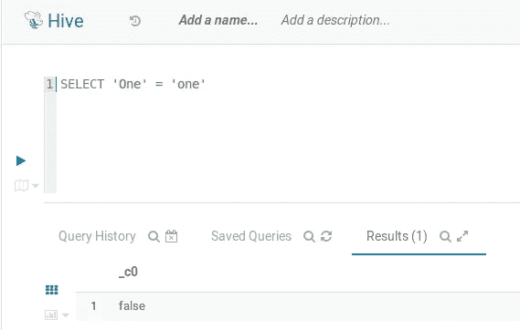

尽管两个字符串有相同的字母，查询将返回 **FALSE** ，因为 Hive 和 PostgreSQL 都区分大小写。

同时，如果你使用 MySQL，同样的查询将返回 1 或 **TRUE** ，因为 MySQL 在字符串比较时不区分大小写。这意味着只要两个字符串具有相同的字母，MySQL 就会将它们解释为相同的，不管它们是大写还是小写。

```
**SELECT** 'One' = 'one'>> result: 1
```

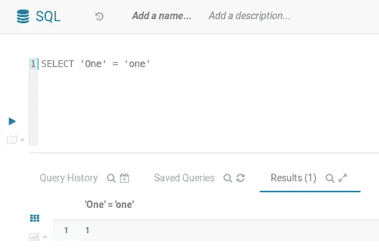

# 区分大小写:表引用

这取决于您使用的 SQL 引擎，当您引用数据库中的表时，需要注意区分大小写。如果使用 PostgreSQL 和 Hive，那么在引用表时就不需要担心大小写，因为它们总是将字母转换成小写。

为了更清楚地说明这一点，让我们看看下面的例子。

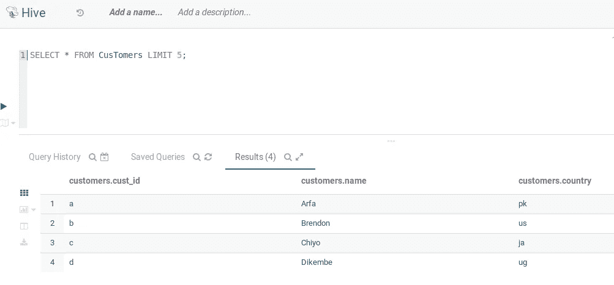

数据库中有一个名为“*客户*的表。但是，我们在查询中将其称为*客户*。Hive 和 PostgreSQL 总是将字母转换成小写，因此它们理解我们想要引用表*‘CusTomers’*而不是*‘CusTomers’*

然而，MySQL 却不是这样。在 MySQL 中，当表被写入数据库时，您需要引用它。如果您将该表引用为*‘CusTomers’*，而它应该是*‘CusTomers*’，那么 MySQL 将抛出一个错误。

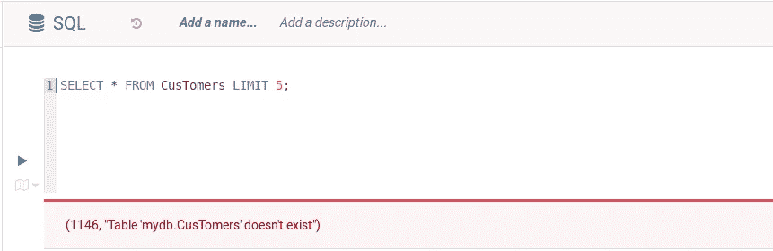

现在，如果我们完全按照数据库中写的那样引用该表，MySQL 将返回我们完全想要的信息。

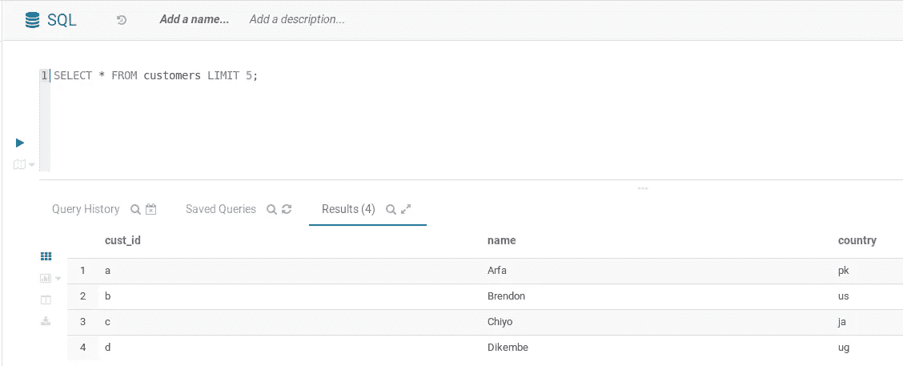

# 在 SELECT 和 GROUP BY 语句中使用别名

创建别名是创建更高效、更简洁的 SQL 查询的一种非常有用的方法。此外，它为长查询提供了一个快捷方式，提高了查询的可读性，特别是如果我们要在 GROUP BY 子句中使用别名。让我们看一个例子来理解 alias 是如何工作的。

假设我们有一个名为*‘inventory’*的表，包含以下列和内容。

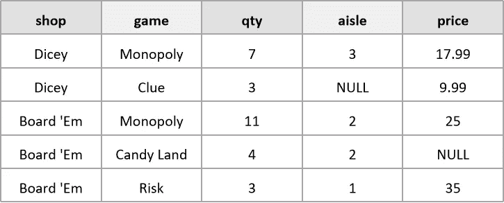

现在，假设我们希望纯粹基于数量状态对上表进行分组和聚合，即`qty`是大于还是小于 5。为此，我们将编写一个类似这样的 SQL 查询:

```
**SELECT CASE  WHEN** qty > 5 **THEN** 'more than 5'
             **ELSE** 'less than 5'
        **END**,
        COUNT(*)
**FROM** inventory
**GROUP BY** **CASE WHEN** qty > 5 **THEN** 'more than 5'
              **ELSE** 'less than 5'
         **END**
```

上面的 SQL 查询可以工作，但是不够简洁，可读性显然还可以提高。这就是别名派上用场的地方。我们可以将 **SELECT** 语句中的 **CASE** 转换成别名，并通过子句在**组中引用该别名，如下所示:**

```
**SELECT CASE  WHEN** qty > 5 **THEN** 'more than 5'
             **ELSE** 'less than 5'
        **END AS** inventory_status,
        COUNT(*)
**FROM** inventory
**GROUP BY** inventory_status
```

上面的 SQL 查询更短、更简洁，尤其是当我们有一个很长的 **CASE** 语句时。

如果使用 MySQL 和 PostgreSQL，可以在 **SELECT** 语句中编写一个带有别名的 SQL 查询，并通过子句引用 **GROUP 中的别名。下面是通过**子句引用**组中的别名的查询结果。**

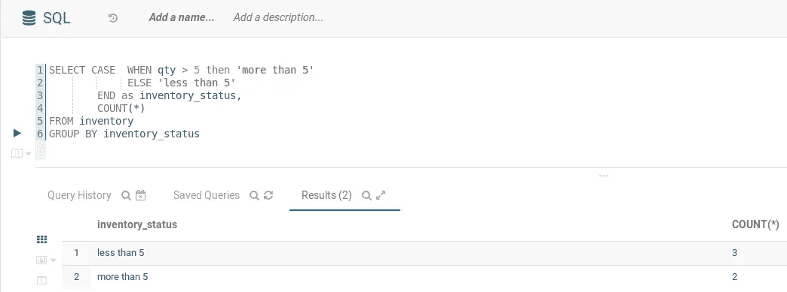

同时，如果你使用 Hive，你不能通过子句引用**组中的别名，因为它会抛出一个错误。这是因为在处理 **SELECT** 语句之前，Hive 将首先通过**子句处理**组。**

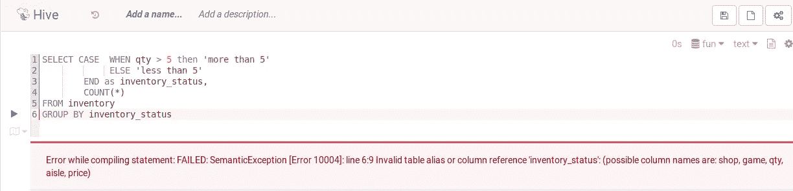

因此，如果您正在使用 Hive，唯一的方法就是删除别名，并重写 GROUP BY 子句中的 **CASE** 语句，就像没有别名的原始查询一样。

# 非数字字符串到数字类型的转换

使用 SQL，我们可以用 **CAST** 命令转换表中一列的数据类型。如果我们想把一个字符串列转换成一个整数，我们可以这样做。

```
**SELECT CAST**(column_name **AS INT**) **FROM** table_name
```

但是，如果您尝试将值不代表数字的字符串列的数据类型转换为数字列，查询将返回意外的结果，这取决于您使用的 SQL 引擎。为了解释这一现象，让我们用与前面相同的例子来说明'*库存*'表。

在 Hive 中，如果您尝试将' *game* '列转换为整数，查询将导致缺少值或 **NULL** 值。回想一下，'*游戏*'列的数据类型是**字符串**，并且所有的值都是非数字的(*大富翁、线索、糖果乐园*)。当您将该列转换为数字列时，例如 integer 或 float，那么查询将返回空值，因为没有办法将这些字符串转换为数字表示。

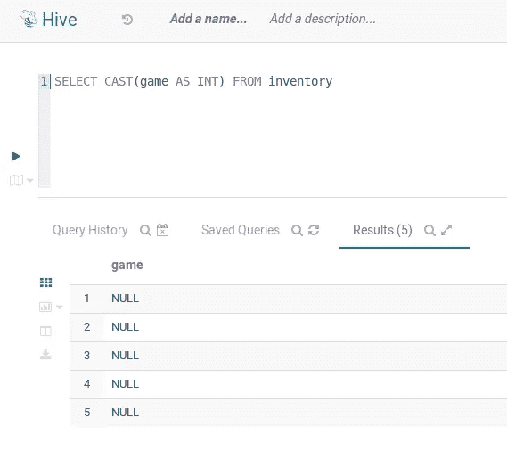

现在我们来看看我们是否使用 MySQL。在 MySQL 中，如果用相同的 SQL 语法对同一列进行数据类型转换，会得到列中的值，但都是零。这不同于我们在 Hive 中得到的缺失值( **NULL** )。

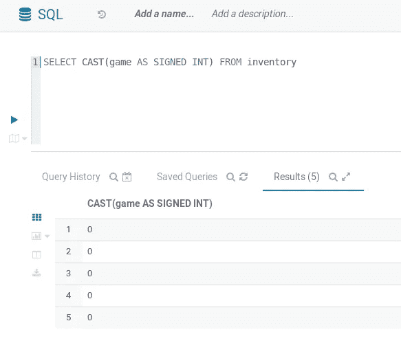

同时，如果您在 PostgreSQL 中使用相同的语法对相同的列尝试相同的数据类型转换，您将会得到一个错误。

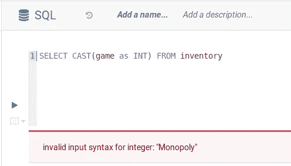

不同的 SQL 引擎有不同的方法来处理像这样的数据类型转换问题。因此，当您尝试将字符串列的数据类型转换为数字列，并且一个或多个字符串值不代表数字时，提前了解您使用的 SQL 引擎以及您期望得到的结果是很重要的。

# 没有连接条件的连接语法

JOIN 语法是 SQL 中最重要的语法之一，尤其是在处理关系数据库时。SQL 中的**连接**有不同的类型:**内连接**、**左连接**、**右连接**、**外连接**、**交叉连接**。

因为本文的重点不是解释不同的**连接**语法是如何工作的，所以我不打算详细讨论这个问题。但是，如果你想知道关于不同的 **JOIN** 语法彼此有何不同的详细信息，我推荐[这篇文章](/sql-join-8212e3eb9fde)和[这篇文章](/combining-tables-using-sql-f6ddfd5f8b6f)。

为了补充**连接**语法，通常我们还应该在子句上使用**或者在**子句上使用**来提供连接条件。为了更清楚地说明这一点，我们假设有两个不同的表，一个名为' *toys* '，另一个名为' *makers* '。下面是这两个表的列和内容的图示。**

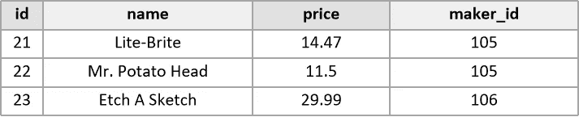

“玩具”表的列和内容

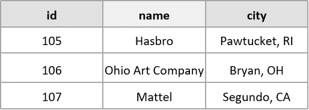

“制造商”表的列和内容

现在的目标是根据'*玩具*'表中的制造商 ID，将'*玩具*'表和'*制造商*'表组合起来。为此，我们可以使用下面的 SQL 查询。

```
**SELECT** * 
**FROM** toys **JOIN** makers 
**ON** toys.maker_id = makers.id
```

上述查询产生以下结果。

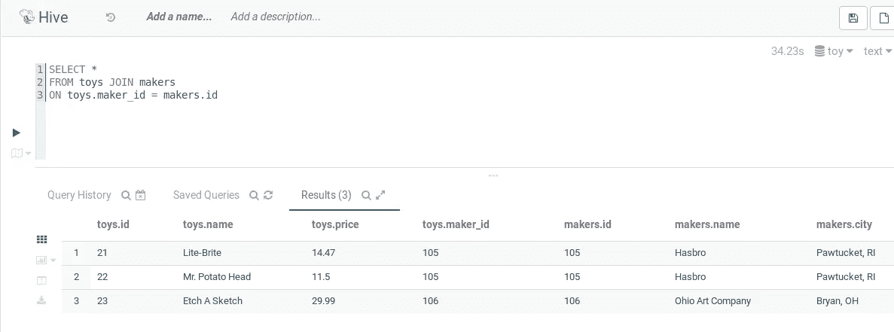

注意，我们没有详细指定我们希望在查询中使用哪个 **JOIN** 语法。然而，因为我们提供了连接条件，即子句上的**，所以 SQL 引擎将**连接**语法解释为**左连接**。**

现在，如果由于某些原因我们忘记提供连接条件，会发生什么呢？

如果你使用 PostgreSQL，你会很幸运，因为它会直接抛出一个错误，告诉你你的语法无效。

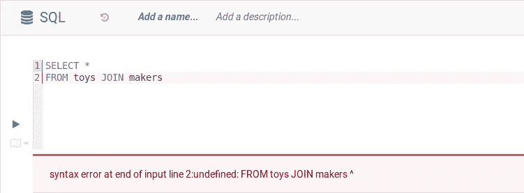

同时，如果您正在使用 MySQL 或 Hive，并且忘记添加连接条件，查询仍然会运行。但是，它会将您的**连接**语法解释为**交叉连接**。查询的结果如下。

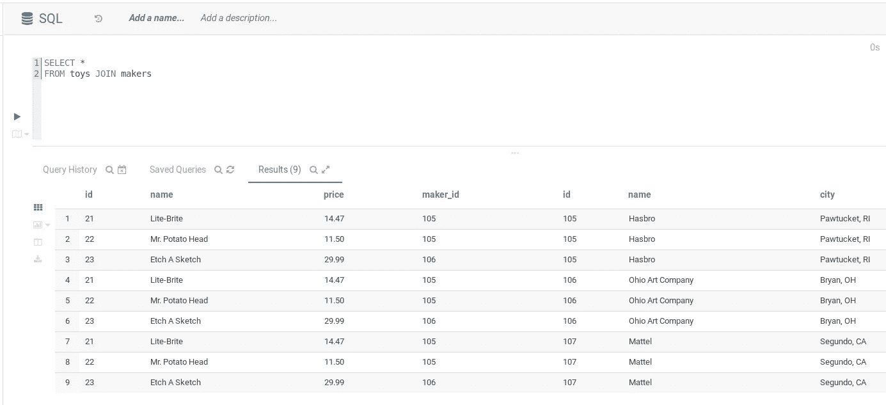

为了更好地理解一个**交叉连接**实际上是做什么的，让我们用下面的图表来举例说明。

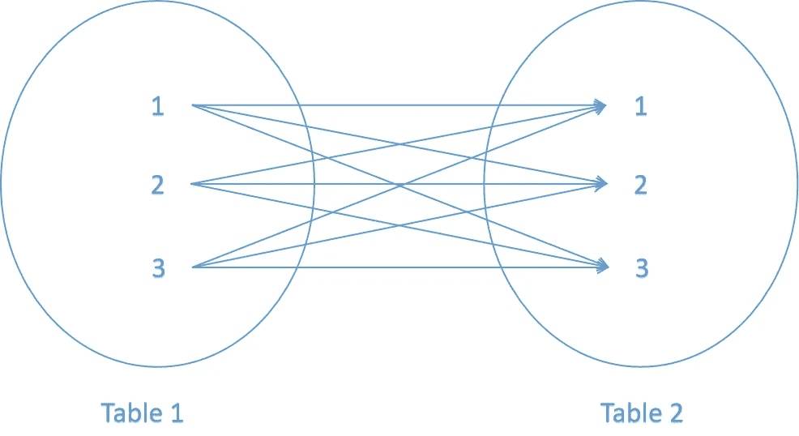

使用 **Cross JOIN** ，来自左表和右表的行的每一种可能的组合都将包含在最终结果中。用作示例的两个表只包含 3 行，现在想象一下，如果您的数据库包含许多行，而您忘记了添加连接条件。结果将是一个包含大量行的新表，您可能会被这个结果误导。

为了避免这种情况，最好明确告诉 SQL 引擎应该在查询中执行哪种**连接**语法。另外，在 **join** 语法之后提供 JOIN 条件也是必须的。

仅此而已。这些是相同的 SQL 语法在 MySQL、PostgreSQL 和 Apache Hive 中表现不同的情况，至少据我所知是这样。如果你知道其他他们表现不同的案例，如果你能和我分享，我会很高兴。