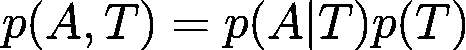
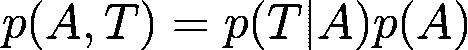

# 海拔和温度之间因果联系的奇特案例

> 原文：<https://towardsdatascience.com/the-curious-case-of-the-causal-link-between-altitude-and-temperature-d777119a5693?source=collection_archive---------37----------------------->

加勒特·帕克在 [Unsplash](https://unsplash.com?utm_source=medium&utm_medium=referral) 上的照片

## 一个简单但不那么简单的例子来说明为什么因果关系很重要

这个例子在因果关系文献中被反复使用。我写这篇文章是为了让我自己明白，因为这并不是直截了当的。所以，让我们直接开始吧。

假设我们想学习高度和温度的联合分布。我们的数据集来自瑞士。在我们的数据集中，我们将高度与它们各自的温度配对。如何分解共同分布？嗯，有两种可能的方法:

或者:

是的，就是这么简单。但是现在黄金问题来了。哪个提法实际上是正确的，因为每一个都暗示着不同的东西。第一个暗示我们能够从温度预测海拔。也就是说，我们的模型学习连接 T->A。第二个模型采用相反的关系，A->T。因此，如果你已经上过一些基本的物理课，你显然会马上发现，第二个公式更有意义。没有物理定律表明，如果你改变温度，那么物体的高度就会改变(模体积随着温度而改变，压力根据密度而改变)。

只是为了满足我的好奇心(也许也是你的)，你们中有多少人确信 p(H | T)模型将是绝对的垃圾？

现在，假设您学习了从温度到高度的预测模型，并希望将其应用到其他地方，例如德国。理由是你的模型不能概括，因为德国的身高分布与瑞士有很大不同。即 p(A)不同，不是温度分布不同造成的。

照片由[西蒙·雅各布森](https://unsplash.com/@closed?utm_source=medium&utm_medium=referral)在 [Unsplash](https://unsplash.com?utm_source=medium&utm_medium=referral) 拍摄

你现在可能会想，但是等等…这并不意味着我的模型不能概括，这个论点有点可疑，不充分。我同意。关键是测试数据的分布偏移。统计学习理论中一个众所周知的事实是，我们从学习算法中获得的伟大理论结果是基于示例的 **iid 假设**(同分布独立分布)。在这种情况下，我们的真实风险(整个数据集的实际误差)可以根据我们用于拟合模型的数据点数量变得任意小。但是，如果违反了 iid 假设，那么当我们天真地将我们的模型与数据拟合时，它不会一般化，即，它会有很大的测试误差。

这个**分布转移**的概念非常重要，这也是机器学习对因果关系感兴趣的原因。通过学习实际的因果机制，我们可以使我们的模型对分布变化更加稳健。这也被称为分布失调**泛化。**

照片由埃米尔·吉耶莫在 [Unsplash](https://unsplash.com?utm_source=medium&utm_medium=referral) 上拍摄

确定因果方向的一种方法是拿一座山，改变它的海拔高度并观察温度。如果我们看到温度变化，那么显然高度影响温度。反过来，我们可以影响山顶的温度，让它变得更热或更冷，并观察海拔高度。海拔显然不会改变。这将被称为**干预**，我也不是在统计学意义上谈论它。这将是你在现实世界中的一座山，并把它变得更大。但显然我们不能这么做！我们没有神力。但是，如果我们不能做到这一点，我们怎么能确定因果方向呢？

事实是，这很难。实际上，两个变量的情况非常困难。只有当模型和噪声符合一定的标准时，我们才能确定因果方向，否则，你可以忘记它。

这种推理向我解释了因果推理的要点，而不是用简单的统计模型来拟合数据。

如果你想看更多我的 rants，也可以在 [Twitter](https://twitter.com/vlastelicap) 关注我。；)

统计推断和因果推断之间更一般的比较可以在本文中找到。