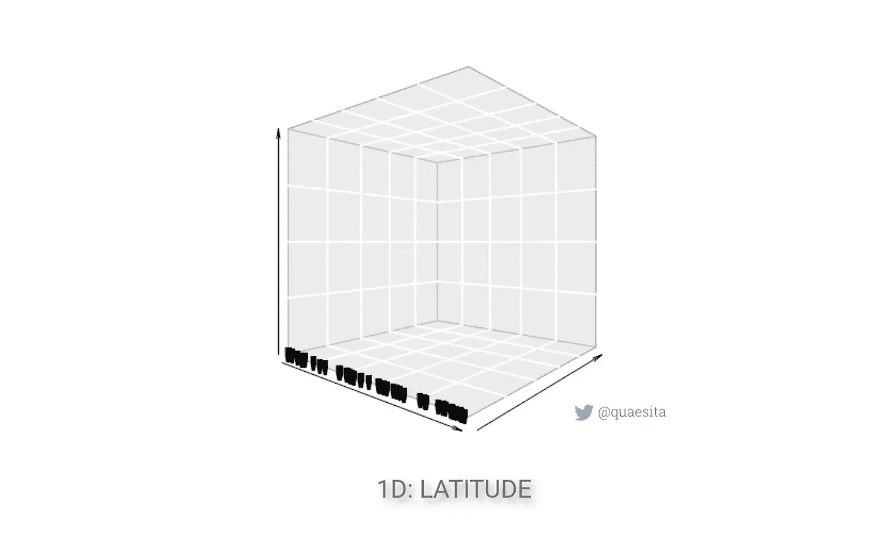
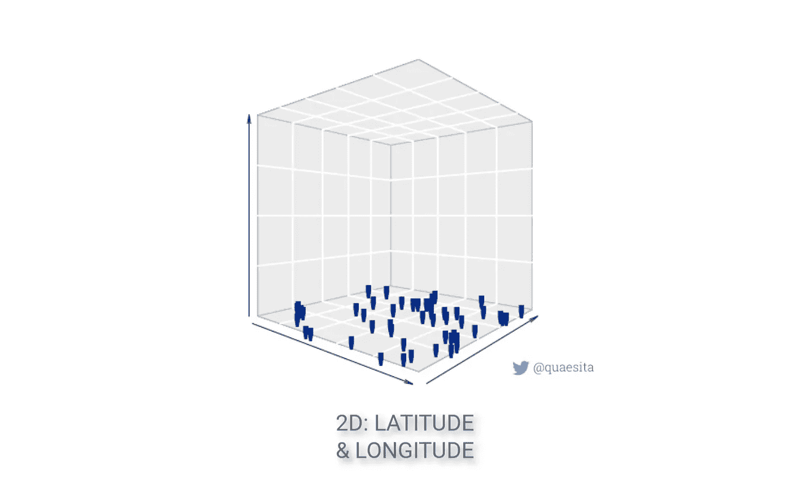
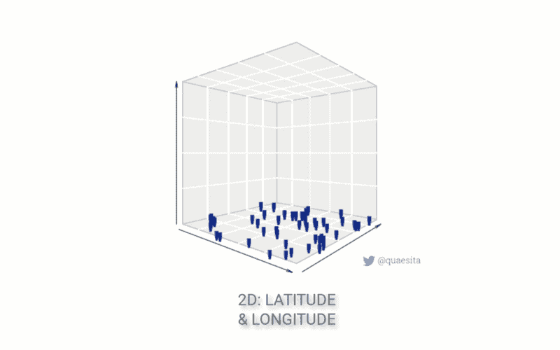
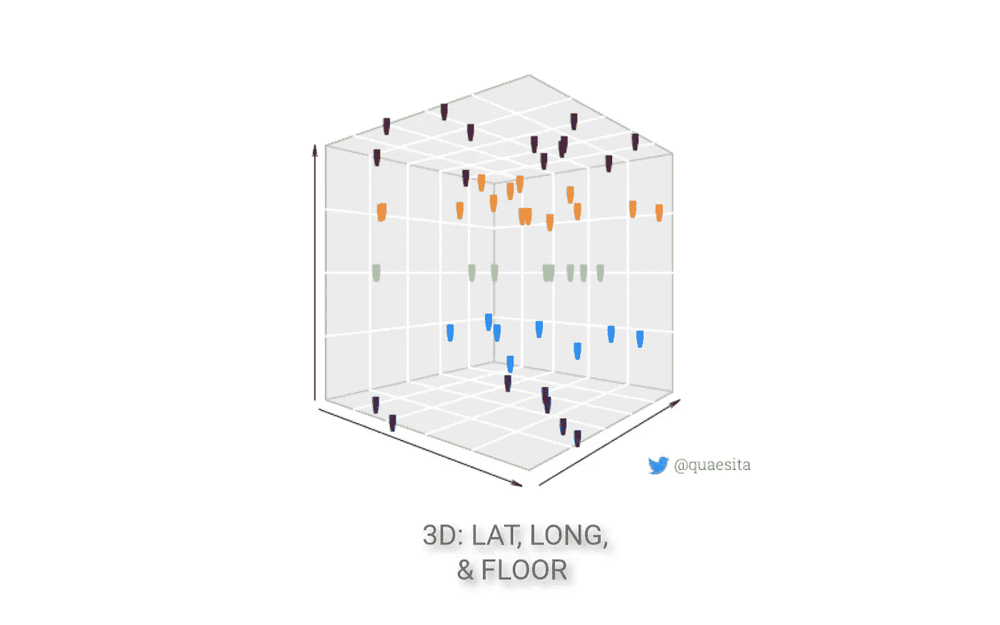
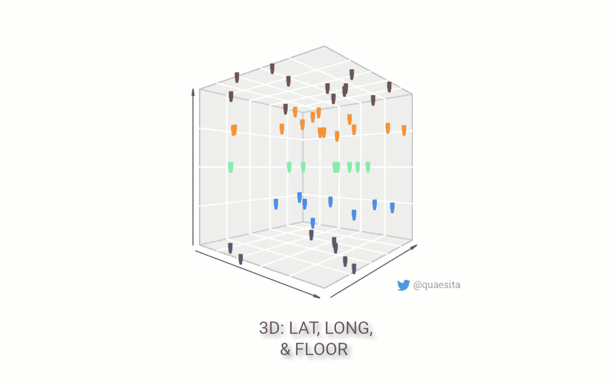
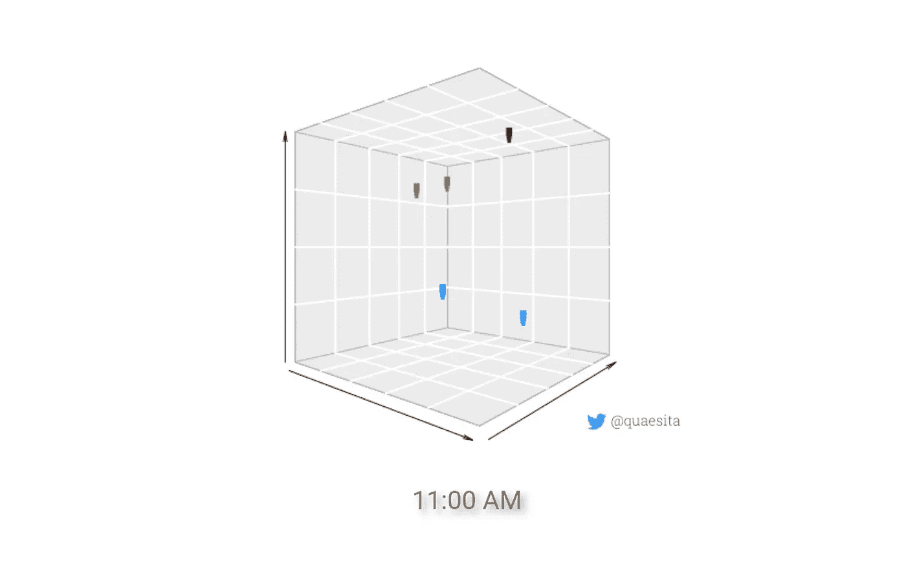
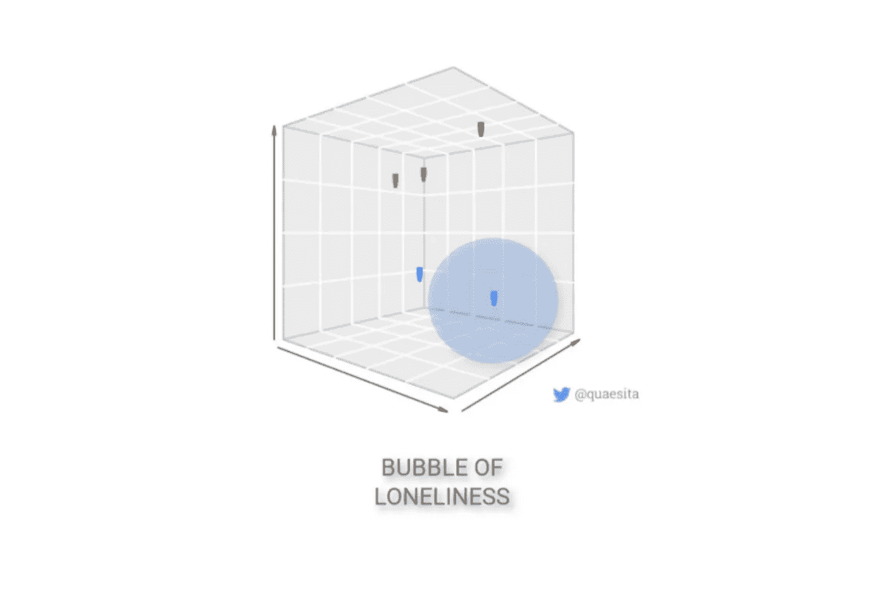

# 维度的诅咒…减去行话的诅咒

> 原文：<https://towardsdatascience.com/the-curse-of-dimensionality-minus-the-curse-of-jargon-520da109fc87?source=collection_archive---------13----------------------->

## 简而言之，这都是因为孤独

维度的诅咒！那究竟是什么？除了作为一个在[机器学习](http://bit.ly/quaesita_simplest)行话中令人震惊和敬畏的名字的主要例子(这些行话听起来往往比它们更花哨)，它还指的是添加更多特征对数据集的影响。简而言之，维度的诅咒是关于*孤独*的。

> 一言以蔽之，维度的诅咒都是关于孤独的。

在我解释自己之前，让我们先弄清楚一些基本的术语。什么是特色？这是机器学习的[词，其他学科可能称之为预测器/(独立)变量/属性/信号:换句话说，关于每个](http://bit.ly/quaesita_emperor)[数据点](http://bit.ly/quaesita_hist)的信息。这里有一个[行话介绍](http://bit.ly/quaesita_slkid)如果这些词都不熟悉的话。

如果你喜欢在看漂亮的图片之前听解释，这里有一个[2 分钟的视频](https://bit.ly/mfml_095)。

当一个[机器学习算法](http://bit.ly/quaesita_emperor)对维数灾难敏感时，这意味着当你的[数据点](http://bit.ly/quaesita_hist)在空间中被它们的朋友包围时，该算法工作得最好。他们在太空中的朋友越少，情况就越糟糕。让我们来看看。

> 数据社交距离很容易:只需添加一个维度。但是对于某些算法，你可能会发现这是一个诅咒…

## 一维

想象你坐在一个大教室里，周围都是你的伙伴。

很自然，你是一个数据点。让我们把你放在一个维度中，让房间变暗，然后从房间的后面用一束强光照射你。你的影子投射到前面墙上的一条线上。在那条线上，一点都不孤独。你和你的船员都是罐头里的沙丁鱼，聚在一起。一维很惬意！也许有点太舒适了。

## 二维

为了给你喘息的空间，让我们增加一个维度。我们在 2D，飞机就在房间的地板上。在这个空间里，你和你的朋友更加分散。个人空间又是一个东西。

***注意:*** *如果你喜欢在一个假想的电子表格中跟随，把添加/删除一个维度想象成插入/删除一列数字。*

## 三维

让我们添加一个第三维度，随机把你们每个人送到你们所在的 5 层大楼的一个楼层。

突然间，你不再有那么多朋友围绕着你。在你身边很孤独。如果你喜欢几乎每个座位上都有学生的感觉，那么你现在可能正悲伤地盯着几把空椅子。你开始泪眼模糊，但至少你的一个朋友可能还在你身边…

## 四维空间

不会太久的！让我们再增加一个维度。时间。

学生们在不同的时间分散在 60 分钟的课堂上(在不同的楼层)——让我们把自己限制在 9 节课，因为讲师需要睡眠和，嗯，生活。所以，如果你足够幸运，以前仍然有一个情感支持的伴侣，我相当有信心你现在在社交上疏远了。如果你孤独的时候不能有效，轰！我们有我们的问题。维度诅咒来袭！

## MOAR 维度

当我们增加维度时，你会很快变得孤独。如果我们想确保每个学生都像在 2D 那样被朋友包围，我们就需要学生。很多人。

这里最重要的想法是，我们必须以指数方式招募更多的朋友，而不是以线性方式，让你远离忧郁。

如果我们增加两个维度，我们不能简单地用多两个学生来补偿…或者甚至是多两个教室的学生。如果我们最初在教室里有 50 名学生，我们增加了 5 层楼和 9 个班级，我们需要 5x9=45 倍多的学生来保持 50 人可以做到的那样。所以，我们需要 45x50 = 2,250 个学生来避免孤独。这比每个维度多一个学生要多得多！数据需求快速增长。

> 当您添加维度时，最低数据要求可能会快速增长。

每当我们上升一个维度，我们就需要招募更多的学生(数据点)。如果数据对你来说很贵，这个诅咒真的不是闹着玩的！

## 次元天后

并非所有的机器学习算法在面对一点私人时间时都会如此情绪化。像 [k-NN](http://bit.ly/wiki_knn) 这样的方法当然是完全的天后。对于一个名字缩写代表 k-最近邻的方法来说，这并不奇怪——它是关于相邻数据点的计算，所以数据点是相邻的是相当重要的。

当涉及到尺寸时，其他方法要健壮得多。例如，如果你上过线性回归的课，你会知道一旦你有了相当数量的数据点，增加或减少一个维度不会让任何东西灾难性地崩溃。还是有价格的——只是更实惠而已。*

这并不意味着它能抵御所有的虐待！如果您从来不知道包含单个异常值或添加一个近似重复的要素会给最小二乘法带来的混乱(犯罪的拿破仑，多重共线性*，再次来袭！)那就当自己被警告了。没有一种方法是适合所有情况的。是的，这包括神经网络。*

## 你该怎么办？

关于实践中的维数灾，你打算怎么做？如果你是一个机器学习研究者，你最好知道你的算法是否有这个问题…但我肯定你已经知道了。你可能没看这篇文章，所以我们就在背后议论你，好吗？但是，是的，你可能会想，是否有可能把你发明的算法设计成对维度不那么敏感。您的许多客户喜欢将他们的矩阵放在全图案面**，尤其是当事情变得有文字时。

** *按照惯例，我们将数据排列成一个矩阵，这样行就是例子，列就是特征。在这种情况下，一个又高又瘦的矩阵有许多分布在几个维度上的例子。*

如果你是一个应用数据科学爱好者，你会做你一直在做的事情——在尝试使用厨房水槽之前，只使用一个或几个有前途的功能获得算法性能的基准。(我将在另一篇文章中解释为什么你需要那个习惯，如果你同时想要线索，请查找术语***。)***

> ***有些方法只对高瘦的数据集有效，所以如果你感觉被诅咒了，你可能需要节食。***

***如果你的方法在有限的几个功能上工作得还不错，然后当你增加维度时对你嗤之以鼻，那就是提示你要么坚持你精心挑选的几个功能(或者甚至*逐步选择*如果你变得狡猾的话)或者首先通过运行一些可爱的*功能工程*技术从你原来的厨房水槽中制造几个超级功能(你可以尝试任何东西，从像主成分分析(PCA)这样的老派东西——今天仍然相关，特征向量永远不会过时——到像自动编码器这样的更现代的东西你真的不需要知道术语*维数灾难*来完成你的工作，因为你的过程——从小处开始，逐步增加复杂性——应该会替你处理好，但是如果它困扰着你……现在你可以摆脱这种担忧了。***

****

****总结一下:**随着你添加越来越多的[特性](http://bit.ly/quaesita_slkid)(列)，你需要数量呈指数增长的[例子](http://bit.ly/quaesita_slkid)(行)来克服你的数据点在空间上是如何分散的。一些方法只在细长数据集上有效，所以如果你感觉被诅咒了，你可能需要节食。**

****

**注:如果你把“空间上的接近”解释为与规模有关，让我纠正一下。这不是用英里和厘米来衡量的效果，所以我们不会试图将我们的灾难归咎于膨胀的宇宙——你不能通过简单的乘法来逃避诅咒。相反，也许这张图片会帮助你在 3D 中直观地理解它；这不是这个球形奶牛有多大的问题，呃，我的意思是，喵星人有多大……而是它身上包着多少包装花生的问题。图片:[来源](https://en.wikipedia.org/wiki/Triboelectric_effect)。**

# **感谢阅读！喜欢作者？**

**如果你渴望阅读更多我的作品，这篇文章中的大部分链接会带你去我的其他思考。不能选择？试试这个:**

** [## 数据科学中最强大的想法

### 从有用的模式中分离出不必要信息的快速解决方案

towardsdatascience.com](/the-most-powerful-idea-in-data-science-78b9cd451e72) 

# 与凯西·科兹尔科夫联系

让我们做朋友吧！你可以在 [Twitter](https://twitter.com/quaesita) 、 [YouTube](https://www.youtube.com/channel/UCbOX--VOebPe-MMRkatFRxw) 、 [Substack](http://decision.substack.com) 和 [LinkedIn](https://www.linkedin.com/in/kozyrkov/) 上找到我。有兴趣让我在你的活动上发言吗？使用[表格](http://bit.ly/makecassietalk)取得联系。

# 人工智能课程怎么样？

如果你在这里玩得开心，并且你正在寻找一个为初学者和专家设计的有趣的应用人工智能课程，这里有一个我为你制作的娱乐课程:

在这里欣赏整个课程播放列表:[bit.ly/machinefriend](http://bit.ly/machinefriend)**