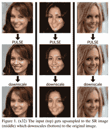

# 人工智能中偏见的危险

> 原文：<https://towardsdatascience.com/the-danger-of-bias-in-ai-c3ce68eabbcc?source=collection_archive---------33----------------------->

这张令人惊叹的照片归功于韦恩·达什伯格。如果 AI 的每个回合都潜伏着危险，那会怎样？

## **为什么承认我们架构中的偏差是关键**

关于人工智能中偏见的危险，这是第一篇文章，我们想把重点放在一个特定的模型上。最近，基于“PULSE:通过生成模型的潜在空间探索进行自我监督的照片上采样”的模型 Face-Depixelizer 已经发布。这种模型可以从它的像素化版本输出原始图片。更严格地说，它将输出最接近的已知去像素化图像。

图一。(x32)输入(顶部)被上采样到 SR 图像(中间)，该图像被下缩放(底部)到原始图像。来自[原创论文。](https://arxiv.org/pdf/2003.03808.pdf)

根据 [github repo](https://github.com/tg-bomze/Face-Depixelizer) 上的描述，给定一个低分辨率的输入图像，Face Depixelizer 搜索生成模型(此处为 [StyleGAN](https://github.com/NVlabs/stylegan) )的输出，以获得感知上真实并正确缩小的高分辨率图像。

更准确地说，正如在[论文](https://arxiv.org/pdf/2003.03808.pdf)中所解释的那样:“【the】方法使用一个(预训练的)生成模型来生成图像，该模型近似于所考虑的自然图像的分布。对于给定的输入 LR 图像，我们遍历由生成模型的潜在空间参数化的流形，以找到正确缩小的区域。通过这样做，我们找到了适当缩小的真实图像的例子，如 1 所示

## **这个 AI 模型有什么问题？**

如果你输入一张黑人的像素化图片，比如巴拉克·奥巴马或蒂埃里·亨利，不管这个黑人有多出名，它仍然会输出一张白人脸。下面的图 2 显示了这些例子的 PULSE 输出。这当然意味着该模型偏向于白人面孔。这可以推广到多种场景，我们的下一篇文章将更深入地讨论它们。现在，假设你的公司正在使用一个自动雇用候选人的模型。如果这个模型偏向于白人，那么这个模型最终会建议一个黑人作为新雇员是非常不可能的，甚至在某些情况下是不可能的。

图二。几个例子，脉冲得到一个非常遥远的图片作为像素化输出的重建。

这让我们想到了 Yann Lecun 的解释。

## 我们如何解决偏见？

如下所述，大多数时候，我们的模型只是根据本身有偏差的数据进行训练。只在狗和猫身上训练一个计算机视觉模型来对它们进行分类，它将不会知道如何对任何其他动物进行分类，例如鲸鱼。

> Lecun 提出“当数据有偏差时，ML 系统也有偏差。这个面部上采样系统让每个人看起来都是白人，因为该网络是在 FlickFaceHQ 上预训练的，其中主要包含白人照片。在塞内加尔的数据集上训练**完全相同的**系统，每个人都会看起来像非洲人。”

这再清楚不过了。当然，首先要考虑的是数据本身。这就是为什么预处理和数据探索是机器学习中的关键步骤的主要原因。在不了解数据性质的情况下训练模型是没有意义的。如果我们希望在要分类的输入集中实现多样性，那么我们的数据集中就需要多样性。

让我们通过观察面部去像素化数据集的多样性来快速验证 Yann Lecun 的说法。但是，在此之前，让我们从一个更普遍的角度来看这个问题。

## **我们能评估数据集中的多样性吗？**

在许多情况下，评估数据集是否足够多样化并不是一件轻而易举事情。然而，有一个问题要时刻牢记在心，那就是:“**我的数据实际上代表了我感兴趣的人群吗？**”。如果我对猫和狗的分类感兴趣，我有足够的多样性来展示所有可能的猫品种吗？对于新员工来说也是如此:如果公司捍卫多样性和包容性，那么在年龄、教育、性别、性偏好等方面，感兴趣的人群是否足够多样化？

现在，在许多不同的现实世界场景中，这变得更加困难。假设你拥有一个客户评论网站。人们可以在这些评论的基础上建立满意度评分。但这个满意度得分实际上反映了底层人群的真实满意度吗？仅根据文本审查来评估这一点是一项非常困难的任务。然而，这些评论中的许多可能是由对你的服务非常愤怒的人群中的一部分人写得非常好的。

## 我们能评估人脸去像素化数据集的多样性吗？

面部去污剂正在使用罩下的 [StyleGAN](https://github.com/NVlabs/stylegan) 。StyleGAN 本身可以使用许多数据集进行训练:

*   StyleGAN 用 Flickr-Faces-HQ 数据集在 1024×1024 进行训练。
*   StyleGAN 用 1024×1024 的 CelebA-HQ 数据集训练。
*   StyleGAN 使用 256×256 的 LSUN Bedroom 数据集进行训练。
*   StyleGAN 用 512×384 的 LSUN Car 数据集训练。
*   StyleGAN 用 256×256 的 LSUN Cat 数据集训练。

根据[作者](https://arxiv.org/pdf/1812.04948.pdf)的说法，FlickrFaces-HQ (FFHQ)是一个新的人脸数据集，由 7 万张分辨率为 10242 的高质量图像组成([论文的图 7](https://arxiv.org/pdf/1812.04948.pdf))。“该数据集在年龄、种族和图像背景方面比 CELEBA-HQ 包含了更多的变化，并且还包含了更好的配饰，如眼镜、太阳镜、帽子等。这些图片是从 Flickr 抓取的(因此继承了该网站的所有偏见)，并自动对齐和裁剪。

作者没有清楚地解释多样化数据的过程。因此，很难清楚地说明多样性的程度。然而，他们提出了一个具有高级统计数据的视图，如图 3 所示。

图 3。关于 FFHQ 数据集的高级统计信息。来自 [github 回购](https://github.com/NVlabs/ffhq-dataset)。

使用元数据可以是评估多样性程度的第一种方法。对于多样化的人脸数据集，代表的国家越多越好。不幸的是，如上面图 3 中的高级统计所示，85%的图像没有指定国家，因此被指定给未知的**。**

**另一种方法是建立一个模型，以不同的方式对数据进行采样。因此，给定一张图片，这种模型应该能够识别一些关键特征，例如年龄、种族和性别。基于这些特征，它可以从底层分布中进行采样。这种模型的一个简化版本如下图 4 所示，其中我们对美国政治舞台上的著名面孔进行了分类。**

****

**图 4。用 opencv 检测性别和年龄。来自 [github](https://github.com/smahesh29/Gender-and-Age-Detection) 的模型。**

**下面，我们使用了一个基本上做两件事的架构:I .检测所代表的个体的性别和 ii .检测所代表的个人的年龄段。这种架构可以集成到采样模型中。如图 4 所示，这个模型正确地预测了性别，但是错误地预测了米歇尔和梅兰妮·特朗普的年龄。这是很重要的一点，因为这样的模型应该尽可能没有偏见。换句话说，如果想要在采样过程中集成这种模型，他们应该确保精度足够高，不会在管道中集成偏差。**

**事实上，人们可以将采样模型视为 ML 管道中的一个重要模型。这种模型通过从源数据中正确取样，可以更好地代表潜在人口。在下面的图 5 中，我们展示了如何将这样的模型集成到 ML 管道中。**

****

**图 5。简单化(上图)与智能采样模型(下图)。上述流程的第一步是从源数据中随机抽样，并获得典型的 80%训练数据和 20%测试数据。底层管道的第一步是关注关键特性，以帮助确保数据的多样性。例如，基于图 2 所示的模型，性别可能是一个关键特征。一旦我们确保了性别的合理分布，我们就可以从这个过滤的数据集中取样，并得到一个训练和测试数据集。**

**严格地说，当一个人构建一个训练集和一个测试集时，他们也从底层分布中进行采样。但是这种过程不会给采样增加任何约束，因此高度依赖于数据集的偏差程度。如果您怀疑数据集有偏差，那么在采样时遵循简单的均匀分布是不合适的！我最近写了一篇关于过采样的文章来解决类不平衡问题，这篇文章更详细地解释了采样时的均匀分布问题，并深入探讨了这个问题。处理不平衡的数据集自然可以看作是处理有偏差的数据集。例如，假设您事先知道您感兴趣的人群应该是 50%男性和 50%女性。因此，如果训练集并不紧密代表这种分布，并且包含例如 70%男性和 30%女性，那么对于下游任务来说，过采样通常是必要的，正如在这篇[必读论文](https://arxiv.org/abs/1710.05381)中所解释的。**

**“智能抽样模型”(ISM)可被视为一种函数，它采用性别和年龄等关键特征以及这些特征在基础人群中的预期分布。然后，在此基础上，ISM 可以从源数据中进行采样，并确保采样数据中很好地代表了预期分布。可以讨论其他更精确的方法，但不在本文的讨论范围之内。下面的图 6 显示了 ISM 背后的一般思想。**

****

**图 6。ISM 背后的一般思想。ISM 允许您根据性别等关键特征，按照一些预定义的要求从源数据中取样。在本例中，用户设置了一个性别先验，ISM 确保这种分布在其输出中得到密切体现。我们从 70%男性，30%女性的分布到 52%男性和 48%女性的分布。**

## **结论:**

**正如 Soumith Chintala 在推特上正确指出的:**

> **“今天，ML 研究人员无意中为许多非人工智能公司的产品提供了动力，这些公司无知地从互联网上的预训练伯特/雷斯内特/YOLO 开始。可能忽略了许可证、自述文件、发布条款(…)”。**

**理解数据可能有偏差并透明地解决这一问题需要成为该领域日益关注的问题。**

**这篇文章很快介绍了一个体系结构，它很难推广到在训练数据中显示偏差的人群子集。正如 FFHQ 的作者含蓄地指出的，有时偏见很难消除，因此 FFHQ 数据集的图片依赖于 Flickr 固有的偏见。**

**在所有情况下，在 ML 管道中引入智能采样模型( **ISM** )是关键，正如 Yann Lecun 所建议的，正确的数据采样是减少数据偏差的核心优先事项，因此在后续 ML 架构中也是如此。总之，**承认我们架构中的偏见是关键，并且需要在未来受到越来越多的关注！****