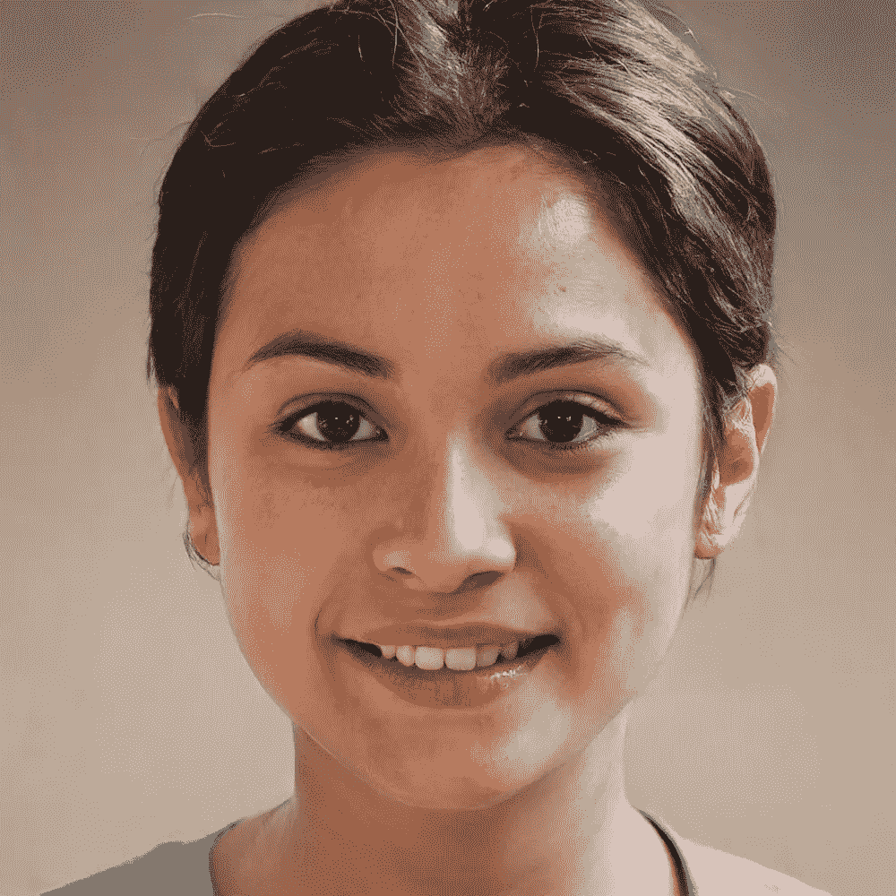

# 对抗性学习的危险

> 原文：<https://towardsdatascience.com/the-dangers-of-adversarial-learning-874a95cdddd3?source=collection_archive---------42----------------------->

## 甘的优点如何变成我们社会的问题

正如故事所说，逆境塑造性格。

另一个故事是，一天晚上，Ian Goodfellow 正在和他的朋友喝酒，这时他想到了一个将对机器学习的前景产生重大影响的想法。这在理论上听起来不错，在朋友们边喝啤酒边进行投机性讨论的领域听起来也不错，但许多事情在理论上听起来不错，并不一定意味着它们在实践中也是合理的。

所以伊恩·古德费勒回家后实施了他的想法。这是一个相对简单的想法，所以他只用了几个小时就实现了。看:成功了！于是生成性对抗网络(GANs)诞生了。

gan 是生成模型(我在关于[让计算机做梦](/how-to-make-computers-dream-3b4b10e4463a)的文章中写了关于生成模型的更详细的介绍)。这意味着它们允许您根据您训练模型的数据的概率分布生成全新的数据。GANs 不是构建生成模型的唯一架构(例如，变化的自动编码器是另一个非常流行的例子)，但自从它们发明以来，一直是最流行的模型之一。

他们被训练的数据可以采取许多形状和形式。例如，它可以是图像数据。它也可以是声音、视频、神经成像数据(例如，为了更好地[理解精神疾病](/mental-illness-and-the-dynamics-of-the-brain-cb41033fb650?gi=8ae75b08d89c))等。

生成模型是机器学习的统计、无监督方法的一部分，其质量不同于过去十年中非常流行的经典深度前馈架构。

虽然前馈网络只能分类和学习数据中的相关性，但生成模型的想象能力更接近于我们大脑的技能组合:在机器学习首次尝试训练生成模型的过程中，亥姆霍兹机器是用唤醒-睡眠算法训练的。他们可以有效地虚构新数据:通过像自由能原理、卡尔·弗里斯顿的主动推理、[贝叶斯大脑假说](/the-bayesian-brain-hypothesis-35b98847d331#362f)和预测编码这样的想法，他们还提供了一个关于我们自己的大脑可能正在运作的原则的重要视角。

但这些与神经科学的有趣相似之处并不是本文的重点，而是这些生成模型在不久的将来可能对我们的社会产生的非常真实和潜在的影响。

看看这两张图片:一张是真实的人，另一张是我刚刚用 GAN 制作的。你能看出区别吗？

一个真人和一个假人，用[甘](https://thispersondoesnotexist.com/)生成。你能看出区别吗？

我敢打赌，你必须非常仔细地看，直到你弄清楚谁是真正的人，谁不是。但很可能你没想明白，因为没有真人。这两张照片都是假的，但是我想你作为一个人是不会有太多信心去分辨的。

这说明了生成模型的优点和问题:它们正在迅速演变，在某些领域，它们变得如此令人信服，以至于它们模糊了真实和虚假之间的界限，超出了任何人的辨别能力。

GANs 依赖于对抗学习。

这意味着它们由两个网络组成:一个发生器网络和一个鉴别器网络。这两者不断相互竞争:生成器网络试图生成看起来真实的假数据，而鉴别器网络试图区分真假(假设你使用人脸照片来训练鉴别器，其中一部分数据是输入网络的人脸实际照片，另一部分是生成器吐出的人脸)。

如果假货对鉴别者来说太好了，那么发电机网络就赢了。但是只要鉴别器仍然能够辨别真假，那么发电机网络就需要继续改进，并且鉴别器的能力可以继续用于改进发电机网络的能力。

> “平心而论，你得有极高的智商才能理解瑞克和莫蒂。这种幽默极其微妙。如果没有扎实的理论物理知识，大多数笑话一般观众都理解不了。
> -**-*肯尼迪总统*-**

生成模型的生成能力带来了在我们的智能设备和计算机上生成假媒体的可能性。

现代人一天中的大部分时间都生活在虚拟世界中，与树木、鸟类和海洋的现实世界脱节。有时候，我们的大脑更关心筛选虚拟数据，而不是真实数据。但是，虽然森林中有一棵树的事实通常很难反驳，但我们对互联网上真假事物的直觉还没有适应我们面临的新现实。

虽然对于受过历史教育的人来说，肯尼迪总统事实上并没有称赞里克和莫蒂的微妙幽默，但这个视频[被一个普通用户“用三个小时毫不费力地组装起来，看起来很糟糕”,仍然表明了我们前进的方向。](https://www.youtube.com/watch?v=GlrrvAYklRA)

GANs 可以有有趣和娱乐性的应用，例如通过[模仿著名的绘画风格(如在这些 GANGogh 画中，](/gangogh-creating-art-with-gans-8d087d8f74a1)或这个项目[画下一个伦勃朗](https://www.nextrembrandt.com/)，允许我们通过像 [FaceApp](https://en.wikipedia.org/wiki/FaceApp) 或 [PortraitAI](https://portraitai.com/) 这样的应用，想象我们是年轻的和年老的，男性和女性，或作为一幅 17 世纪的油画。

因为这些应用程序变得如此受欢迎，而且显然非常有趣，所以不可能阻止生成模型领域的快速发展。妮娜·席克预计，十年后，普通用户将能接触到好莱坞现阶段只能梦想的特效，彻底改变电影的制作方式。

但我们不应该忘记这些发展的黑暗面:“深度伪造”是一个虚拟数据的名称，它被潜在的敌对代理人在真实的伪装下使用。深度虚假媒体有可能进一步扩大社交媒体的过滤泡沫和回音室之间的鸿沟，这将进一步使它们与现实中的任何接地需求脱钩。这将有助于建立由替代事实组成的替代现实:如果我们可以让对立的政客或其他竞争对手听起来像我们所希望的那样，那么所有事情的大门都是敞开的，从虚构中辨别真相将变得更加困难。

正如上面两张图片所显示的，在某些领域，人类变得越来越困难，他们的辨别能力完全被我们盘子里的生殖模型所压倒。

为了抗衡，全球各地的公司都开始建造深度假探测器，这些探测器建立的人工智能即使在我们的人类能力走到尽头后，仍然可以分辨出什么是真的，什么是假的。修建这道防御墙至关重要。

但 GANs 和对抗性学习的讽刺之处恰恰在于，构建越来越好的识别器将反过来允许我们训练越来越好的生成模型，从而导致一场看不到尽头的致命军备竞赛。

我们将如何走出这个难题很难讲，但这是人工智能社区需要注意和了解的事情，例如通过尼娜·席克的新书[“深度假货——即将到来的 Infocaplypse”](https://ninaschick.org/deepfakes)更详细地讨论了所有这些。生成模型是杰出的发明，证明了我们的想象力，甚至可以想象算法可以自己开始想象。但我们需要注意，我们不能让它们变成潘多拉的盒子，一旦打开，就永远不可能关上。