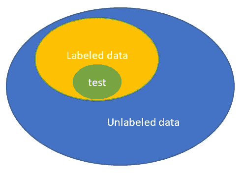
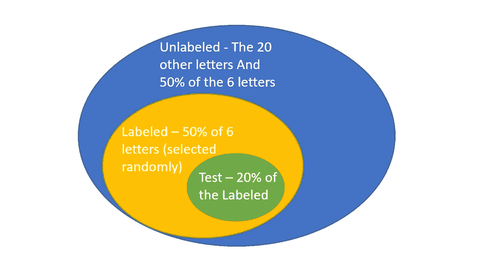
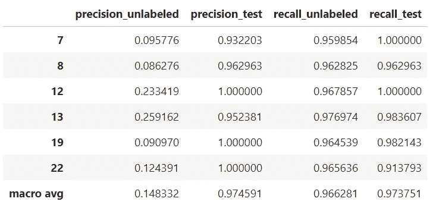
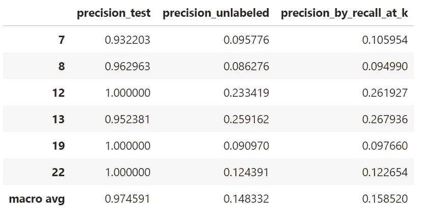
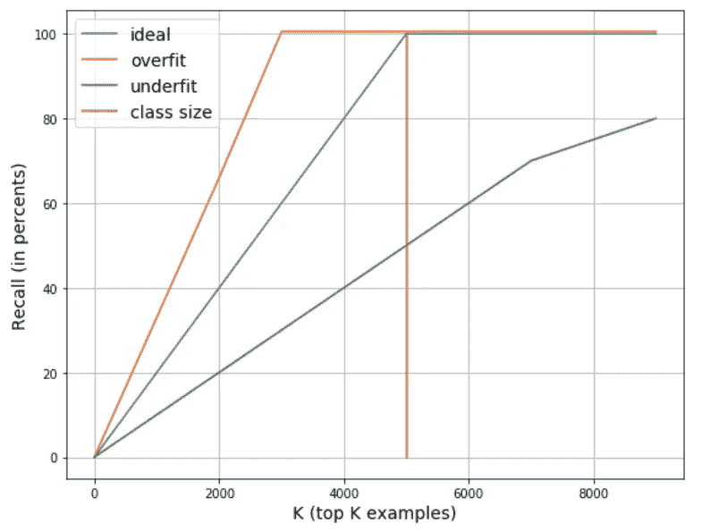
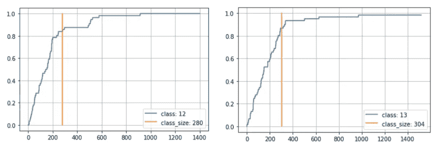
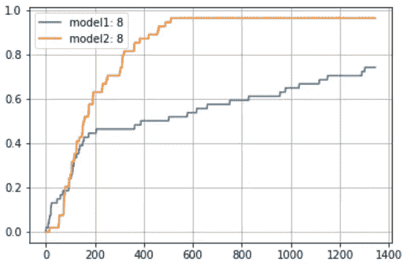
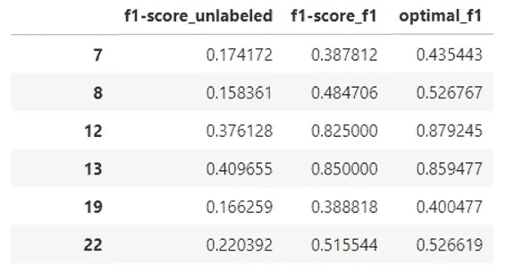

# 精确的阴暗面

> 原文：<https://towardsdatascience.com/the-dark-side-of-precision-bdc7199cbaf8?source=collection_archive---------25----------------------->

## [入门](https://towardsdatascience.com/tagged/getting-started)、[理解大数据](https://towardsdatascience.com/tagged/making-sense-of-big-data)

## 在这篇文章中，我将展示为什么在生产中评估你的模型精度如此困难，以及如何正确地做这件事。

## 开始

我想这里任何一个生产 ML 分类器的人都会知道我在说什么。我有一个在测试集上表现出色的算法。我部署了一下，算法的真实性能比预期差很多，尤其是精度。

因此，我深入研究了一下，找到了对这一现象的数学解释，我还找到了更好的度量标准，使用基本的先验知识来评估算法的实际性能(别担心，我会在文章中展示)。

## 定义和设置

您可以将数据分为 3 个层次集合:

作者图片

有标签和无标签的数据，在有标签的数据中，有一组没有在算法选择或训练中使用的数据——测试集。验证集不是测试的一部分(因为它被用来选择最佳模型)。

**数学定义**

*   *Preal——未标记数据的分布概率。*
*   *Ptest——测试集上的分布概率*
*   *x—一个数据样本*
*   *y——x 的真实标签*
*   *Ypred——分类器对 X 的预测*

**重要的是要记住** —所有被标注的数据(包括测试)的标签，当然是我们知道的。客户关心的只是未标记数据的标签。所以，如果测试集上的表现不错，先别庆祝。可能真实的性能(在未标注的情况下)要差得多(这很可能发生)。

所以，我们所关心的评估是 *Preal* 但不幸的是，我们只能计算 *Ptest* 。将测试结果推广到真实性能是非常诱人的(如果测试的召回率是 70%，算法的真实召回率是 70%)。在下一节中，我将分析在哪些假设下这种概括是正确的。我们将会看到概括精确度所需的假设和概括回忆所需的假设有很大的不同。

**一般化的数学定义(适用于本文)—** 在某个度量的计算中切换 *Preal* 中的 *Ptest* ，并减少在测试集中的条件:

也许这不是编写评估指标的最常规的方法，但是我将向您展示用这种方法编写指标是多么容易。

本文分为两部分:

1.  深入回忆和精确概括。
2.  使用先验知识更好地评估精确度。

如果你喜欢这篇文章，我将发布第三部分——使用领域专家采样概括精度的最佳方法。

在每一部分的最后，我将给出一个真实的例子，代码可以在这个 git 存储库中找到:

 [## avivhadar 33/精密-暗面

### 举例说明在生产中评估精度有多难，以及如何解决这个问题。GitHub…

github.com](https://github.com/avivhadar33/precision-dark-side) 

结果毫无疑问地支持了这个理论！

# 深入回忆和精确

## **回忆**

先说测试集上的召回定义(上式中):

这是对真实表现的概括:

注意，为了一般化，以下数学假设必须成立:**这个特定类的分布只需要在测试集和未标记数据之间相同**(因为条件*y =类*，所以没有对其他类的假设)。

因此，通过对特定类的良好标记，我们可以用测试中的召回率来评估算法的真实召回率。当然，不代表未标记数据的标记将导致测试集上的召回，这不会代表算法的真实召回，但这是微不足道的。有时，即使对于一个类，找到代表未标记数据的好的测试集也是一个困难的问题。我认为这是一个度量标准良好推广的最低要求。

## **精度**

让我们继续测试集的精度定义(在上面的公式中):

这是对真实表现的概括:

看起来与召回几乎相同，但有一个很小且非常显著的差异，现在的条件是 *Ypred=class* ，而不是将问题缩小到召回中的特定类别的条件 *y=class* 。这个条件取决于算法的结果——算法识别为*类*的样本，这个组通常**包含数据中所有类**的样本。在算法没有任何先验假设的情况下，我们得到概化精度的数学假设是:**整个测试的分布将与整个未标记数据的分布相同。**

这种假设在大多数情况下是不现实的，因为它需要所有类的真实世界的良好表示，包括测试集中正确的比例(权重)。例如:

1.  为了对猫图像的分类器进行良好的精度评估，您需要标记世界上所有的动物，甚至所有的物体(取决于数据集)。不仅如此，你还需要对它们进行加权，就像它们在真实分布中的位置一样。
2.  更具体的例子:假设我们的猫分类算法把猫和一些特定类型的狗混淆了。因此，为了从测试集中概括精度，我们需要所有这些种类的狗的标签，我们需要像它们在真实分布中的部分一样对它们进行精确加权(很可能我没有这些信息)。对它们进行错误的加权，我们将得到不能很好地代表真实精度的精度值。
3.  一般来说，大多数实践应用 ML 的人的经验证明，标签数据几乎从不代表真实数据。

## **结论**

1.  在测试集上计算的一般化度量要求不小的假设。
2.  对测试的召回度量的概括比对精确度的概括更可靠。

## **真实数据上的例子**

为了演示这一现象，我采用了一个由英文字母组成的数据集(26 个类，每个类对应一个字母)，并将其拆分为 3 个(如上图所示):[https://www . csie . NTU . edu . tw/~ CJ Lin/libsvmtools/datasets/multi class . html](https://www.csie.ntu.edu.tw/~cjlin/libsvmtools/datasets/multiclass.html)

**未标记:**

1.  整整 20 节课
2.  抽取 50%的剩余类别(总共 6 个)进行标注

那些例子并不是真正“未标记的”(我们有它们的标签)，但是它们被用来模拟真实的未标记数据，这些数据的分布与标记数据不同。

**标注:**其余 6 个类的 50%，测试集是每个类的 20%。

可以用这个文氏图来描述:

作者图片|我在文章中用来演示理论的数据分割的维恩图。

通过这种方式，未标记的数据还包含来自算法从未见过的类的数据(就像现实生活中的许多情况一样)。**所以召回假设成立，精度假设不成立**。下面你可以看到一个算法在标记数据(没有测试)上训练的性能，在测试集上训练的性能和真实性能(在未标记数据上)。算法是 LightGBM，带有默认参数(除了类的平衡权重)。仅为算法训练的类显示的性能:

图片作者|图 1:算法在测试集和未标记集(如上定义)上的召回率和精度。precision_test 是对测试集计算的精度，precision _ unlabeled 是该示例中算法的真实精度。仅为算法训练的类显示性能

因此，正如我上面所说的，在这种情况下，召回从测试中得到了很好的推广(这些类在测试和未标记中分布相同——召回假设)。并且精度没有被很好地概括(尽管在测试中表现良好，但是在未标记上的精度差)。

**值得一提的是**尽管如此，我认为测试集上的指标非常重要。我认为它们是真正算法性能的上限。这并不总是正确的，但在大多数情况下，它确实证明了自己。

在我的项目中，我遇到了这个问题——我只有客户感兴趣的类的标签，而没有其他类的标签(还有更多)。所有顾客感兴趣的是模型的精确度。正如我前面所展示的，测试性能与真实世界的精度没有任何关系。

**值得一提的是 2** 领域专家对预测的手动审查可以给你对真实精度的最佳评估，但在大多数情况下，这是一个极其缓慢和昂贵的过程。绝对不是每次实验都能得到的东西。

因此，好消息是有更好的指标可以使用！在下一节中，我将向您展示如何:

1.  使用基本先验知识更好地评估算法的真实精度。
2.  为您的算法找到最佳决策边界。
3.  即使没有先验知识，如何使用新的度量来改进模型性能的比较。

# 利用先验知识进行精度评估

在我的项目中，我有所有未标记的数据和每个班级真实数量的示例的良好评价(从现在开始将被称为班级规模)。我将向你展示我如何利用这些信息来更好地评估我的算法的真实精度。

## **召回@K 未标注**

为了更好地评估实际精度，我将同时使用测试集和未标记集。我通过算法计算测试集和未标记集中每个样本的类得分，然后相应地对未标记集进行排序。通过对每个类的这种排序，我将 k 个未标记的例子的召回率度量定义为——对于[1，size(Unlabeled)]中的所有 k 个，该度量等于使用 k 个排序的未标记例子的分数作为决策边界的测试集中的召回率。例如，如果第 130 个未标记排序示例的分数是 0.75，那么当决策边界是 0.75 时，在测试上的召回@130 个未标记=召回。

**重要符号—** 未标记的召回@k 可以通过与召回相同的假设来概括(以相同的方式证明)

让我们看看如何使用上述度量帮助我们基于召回假设来概括精度(提醒—这个特定类的分布只需要在测试集和未标记数据之间相同)。

## **k 个未标记的精度——更好地评估特定 k 个未标记示例的实际精度**

现在，你正在寻找——在回忆假设下计算精度。

我称这种度量精度为@k unlabeled，它由以下等式定义:

解释为什么是对真实精度的评估:

*   分子——在回忆假设下，它等于前 k 个排序的例子中正面例子的数量。Example —如果在一个特定的 k 个未标注的例子中真实召回率(等于假设下的测试召回率)为 70%，类别规模为 200，那么前 k 个未标注的例子中有 0.7*200=140 个正例。
*   分母——当然是前 k 个未标注的例子中的例子数(就 k 个)。

现在，当我们将它们分开时，我们得到了前 k 个未标记样本中的部分正例，也就是 precision ！

当然，这个评估也不是完美的，分子只是对正面例子数量的估计(如果回忆假设成立，这是准确的)。但是在大多数情况下，它比测试集上的精度更好。我也使用这个度量作为真实精度的上限(在大多数情况下，它比测试精度更严格)。

**重要的符号—** 如果你对类的大小有上限或下限，这个度量可以给出真实精度的上限或下限。

**重要符号 2—** 度量可以得到大于 1 的值。我将在本文的后面解决这个问题。

## **真实数据示例**

我使用未标记集(没有它们的标签)和测试集，根据上面提供的数据计算了这个指标(根据得分 0.5 阈值的相关 k):

图片由作者提供|图 2:通过测试精度和 precision@k 未标记度量进行的真实精度评估。precision_unlabeled 是该示例中算法的真实精度，precision_test 是在测试集上计算的精度，precision_by_recall_at_k 是通过上述 precision@k unlabeled(在分数 0.5 阈值的相关 k 上)的精度评估

你可以很清楚地看到，这种方法能更好地评估这种情况下的真实精度。

## 回忆@K 无标签对 K 曲线

除了 precision@k unlabeled 之外，通过查看 **recall@k unlabeled 对 k 曲线**，recall@k unlabeled 可以提供更多关于算法的信息。

一些 recall@k 未标记与 k 曲线的示例(红线标记班级大小):

图片由作者提供|图 Recall @ k 未标记与 k 曲线的示例。红线表示我们试图通过算法预测的班级规模。

我期望的理想曲线是什么样的？对于完美的分类器(没有偏见)，我希望线性上升，直到 100%，这将是准确的类大小(蓝色曲线)。换句话说，所有的阳性将出现在类大小线的左侧，如果模型是无偏的，测试阳性和未标记阳性的顺序将是随机的，这将创建一条直线(花一点时间理解这句话)。

现在，我将讨论这一指标中可能出现的两个重要场景。

**过拟合**

有时，recall@k unlabeled vs. k 曲线显示的结果比理想情况“更好”，这通常是由于标记数据中的偏差而发生的。让我们看看橙色曲线，注意在 k = 3,000 时，召回率是 100%。尽管我们知道班级规模是 5000 人，但这意味着@ 3000 可能的最大召回率是:3000/5000 = 0.6。这也可以通过大于 1 的 precision@k 无标签度量来实现。

对这一现象的合理解释是，标记的数据并不代表整个类，只是它的一部分。在这种情况下，算法仅学习识别类的一部分，并且计算的 recall@k 未标记值将大于其真实值，因为评估是在类的子集上进行的，该子集是比整个类更小的组。这是一个您无法概括您的回忆的情况的示例，因为标记的类与真实的类分布不同，所以概括所需的数学假设不成立(实际上测试中的指标并不代表真实的指标)。

**例如** —一个猫分类器，他的所有标记数据不包括黑猫，可能不会将黑猫分类为猫，这将减少未标记数据中被分类为猫的例子的数量。这可能导致在真实的班级规模之前 100%的召回。

**欠配合**

即使测试中的性能是完美的，召回@k 未标记对 k 曲线显示更差的性能也是合理的。例如，请注意 k=class size 中的绿色曲线，召回率为 50%，这表明精度为 50%(通过 precision@k 未标记的度量)。即使测试评估显示满分，这种情况也可能发生。这也可以通过 precision@k 未标记度量中的低性能来实现。

当测试集分布与未标记的分布非常不同时，就会出现这种情况。

字母数据集中的示例:

图片由作者提供|图 4:回想一下示例中的@k 未标记对 k 曲线(对于类 22 ),尽管测试性能良好，但它仍显示出欠拟合。

正如您所看到的，尽管测试中表现良好(图 1 ),但该类的模型实际表现要差得多。

这个度量是了解您的性能对于生产来说不够好，您需要改进算法的好方法。

## **现实**

真实数据中的召回@k 无标签与 k 曲线如何？大概是这样的:

图片由作者提供|图 5: 2 回忆示例中的@k 条未标记曲线与 k 条曲线。

这只是为了让你对那些曲线在现实生活中的样子有一个好的感觉。关于这些曲线的更多分析可以在 git 资源库中找到。

## **在没有先验知识的情况下比较模型**

这是本节中要记住的最重要的事情。即使没有确切的先验知识(班级规模)，也很容易从下面的曲线中认识到，对于每一个小于 500 人的班级规模，哪种模型更好(模型 2)。因为 precision@k unlabeled 的上述公式(如上所示)在 recall@k unlabeled 中是线性的，所以可以看出改进有多显著。这些模型在测试集上有相似的结果，但是您可以通过这个度量标准看到一个明显比另一个好。

图片作者|图 6:同一类不同模型(模型 1、模型 2)的两条 recall@k 无标签对 k 曲线。

我们还可以使用 recall@k unlabeled 与 k 曲线上的“曲线下面积”等指标来优化超参数。当然，这些度量可以在召回假设下进行推广，并且在大多数情况下，它们比测试集上的等价度量要好。这种度量的主要问题是，它“偏好”过度适合标记数据的模型，而不是完美的分类器。

## **寻找最佳决策边界**

recall@k unlabeled vs. k 曲线给你的另一个东西，是对最佳决策边界的更好评估。有许多方法可以选择最佳决策边界，我将展示如何近似最大化 F1 分数的决策边界(这种方法可以推广到其他指标)。我们使用我们对真实精度的更好评估来获得对真实 F1 分数的更好评估:

因此，为了选择最佳决策边界，您需要计算每个 k 的上述度量，并选择使该度量最大化的 k 处的分数。测试集的最佳决策边界和真实的最佳决策边界之间的差异可能是巨大的，这种评估证明了它本身是真实的最佳决策边界的更好的评估。

为了演示这一原理，我使用了之前的数据集，并比较了通过这三个阈值获得的 f1 分数:

1.  我们通过算法 0.5 阈值的决策边界得到的 f1-score—f1-score _ unlabeled。
2.  到我们通过上面的方法计算的阈值得到的 f1 分数— f1-score_f1。
3.  对未标记数据可能获得的最佳阈值(根据 f1 得分度量)— optimal_f1。

作者图片|图 7:用不同阈值(阈值如上所示)的相同预测获得的 f1 分数。

你可以清楚地看到，默认阈值比用这种方法得到的阈值差得多。该阈值性能也接近最佳性能。

## **结论**

1.  如上所述的 precision@k 无标签度量可以给你一个算法的真实精度的更好的评估，比在测试集上概括性能更好。
2.  我们讨论了 recall@k 无标签与 k 曲线(过拟合和欠拟合)的一些有趣情况，并实现了对其原因的解释。
3.  甚至在没有先验知识的情况下，召回@k 条未标记的 vs. k 条曲线可以帮助在不同模型之间获得更好的比较。