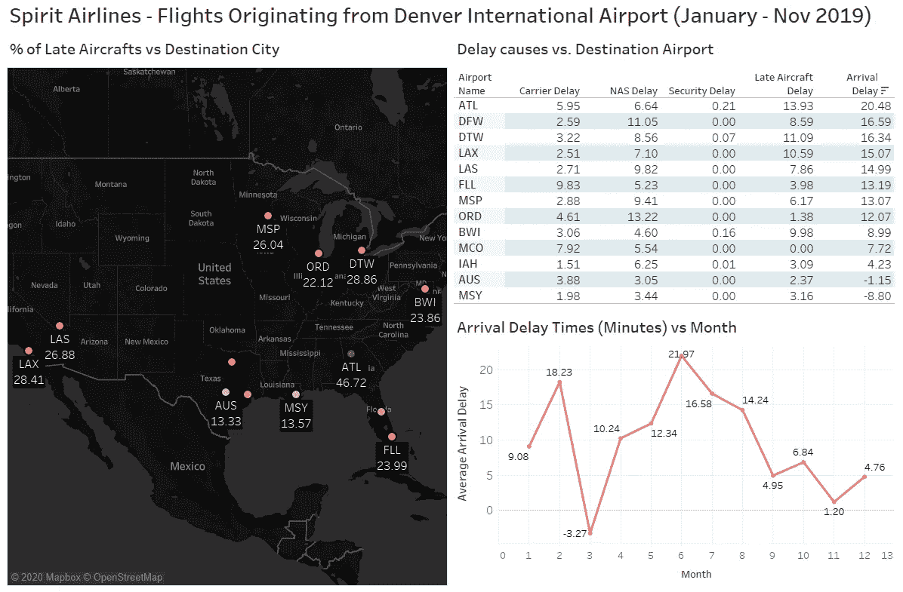

# 数据科学方法—帮助您入门的策略和技巧

> 原文：<https://towardsdatascience.com/the-data-science-approach-strategies-tips-to-help-you-get-started-c52a53bf64d6?source=collection_archive---------51----------------------->

弗兰基·查马基在 [Unsplash](https://unsplash.com?utm_source=medium&utm_medium=referral) 上拍摄的照片

作为技术专业人员，我们不断努力拓展创新的边界，将我们的技能应用于改进我们各自组织的产品或服务。数据科学是近年来发展最快的领域之一，它使用科学方法、流程、算法和系统从数据中提取洞察力。作为一名来自科罗拉多大学博尔德分校的数据分析学生，我参与了机器学习项目，这些项目让我能够管理分析生命周期。完成硕士学位后，我发现了 4 个关键步骤，它们可能对数据专业人员从他们的模型中获得增强的预测有用。如果你对分析领域感兴趣，并想了解如何在学术或工作环境中塑造你的数据科学项目，我强烈建议你阅读这篇文章，以便开始你的分析之旅。

1.  **识别核心业务问题**

在开始分析任何数据集之前，理解我们的最终目标是什么是至关重要的。我们试图用数据解决的问题是什么？我们是在试图预测我们的客户，还是在为我们的业务引入新的产品线？更多的时候，我们在没有真正理解核心业务问题的情况下，陷入了试图为我们的分析找到最佳模型的困境。一旦我们确定了我们打算通过数据分析解决的问题，我们就可以更清楚地知道我们需要采取哪些步骤来确保我们走在正确的道路上。

**2。选择合适的数据**

首先，为了使用数据分析解决任何业务问题，我们需要确保我们拥有的数据是正确的数据。这从分析数据中存在的特征或列开始。特征是您试图分析的对象的可测量属性。在数据集中，它们通常也被称为“变量”或“属性”。例如，包含客户信息的数据集将具有姓名、年龄和性别等特征。数据集中要素的质量对使用该数据进行机器学习时获得的洞察力的质量有着重要影响。您可以通过诸如要素选择和要素工程等方法来提高要素的质量，但重要的是从可以分析的一组初始相关要素开始。

**3。预处理您的数据**

如果一个原始数据集被立即投入到机器学习模型中，那么预测可能会非常不准确。机器学习模型建立在从数据模式中学习的算法基础上，这需要预处理的数据集。数据越准确，模型就越精确。在建模阶段之前，应该考虑以下 3 个重要的预处理子步骤:

*   *数据清理*:缺失值处理，去除有噪声/无意义的数据
*   *数据转换*:数值变量的归一化，从已有特征中构造新属性，概念层次生成。
*   *数据缩减*:通过编码技术缩减数据大小。两种最有效的降维方法是主成分分析和小波变换。

**4。可视化您的数据**

数据可视化是理解我们的特征中的任何现有关系或模式的好方法。散点图、直方图、条形图和相关图是我提供特征描述性分析的最爱。根据下面的 Tableau 仪表板，我们可以指出亚特兰大的延误时间最长，并且夏季月份往往最繁忙。从数据可视化中获得的洞察力有助于我们更深入地研究我们的业务问题，标记具有更大影响的数据点和特性。

总的来说，这些方法是启动机器学习项目时需要考虑的优点。作为一名数据分析学生，当我在建模阶段之前实施这些方法时，我在我的学术项目中取得了成功。它们绝不是绝对必要的，但是，如果遵循这些初步的指导方针，您可能会期望在将来从您的模型中看到更好的结果。