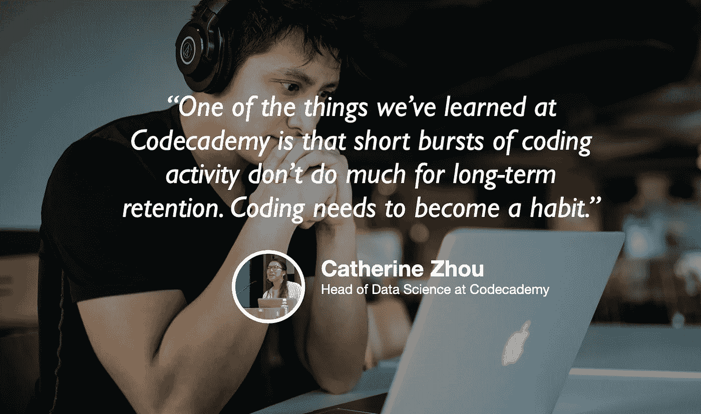

# 学习的数据科学

> 原文：<https://towardsdatascience.com/the-data-science-of-learning-e8a5a960f746?source=collection_archive---------48----------------------->

## [苹果](https://podcasts.apple.com/ca/podcast/towards-data-science/id1470952338?mt=2) | [谷歌](https://www.google.com/podcasts?feed=aHR0cHM6Ly9hbmNob3IuZm0vcy8zNmI0ODQ0L3BvZGNhc3QvcnNz) | [SPOTIFY](https://open.spotify.com/show/63diy2DtpHzQfeNVxAPZgU) | [其他](https://anchor.fm/towardsdatascience)

## 猫周上 [TDS 播客](https://towardsdatascience.com/podcast/home)

背景图片由[韦斯·希克斯](https://unsplash.com/@sickhews?utm_source=unsplash&utm_medium=referral&utm_content=creditCopyText)

*编者按:迈向数据科学播客的“攀登数据科学阶梯”系列由 Jeremie Harris 主持。Jeremie 帮助运营一家名为*[*sharpes minds*](http://sharpestminds.com)*的数据科学导师初创公司。可以听下面的播客:*

如果你对提升你的编码游戏感兴趣，或者对你的数据科学游戏感兴趣，那么花一些时间去理解学习过程本身是值得的。

如果有一家公司对学习过程的研究比其他任何公司都多，那就是 Codecademy。Codecademy 拥有超过 6500 万用户，对于如何让人们学习如何编码有着深刻的理解，这就是为什么我想在本期播客中与他们的数据科学负责人 Cat Zhou 交谈。

以下是我最喜欢的一些外卖食品:

*   培养具有不同教育背景的团队有很多价值。计算机科学专业的学生、经济学家、商人和顽固的贝叶斯主义者都注意到了数据中不同类型的机会，学习如何让这些团队合作是管理数据科学工作的关键。
*   根据 Codecademy 的数据，那些沉迷于内容，并在短时间内编写一大堆代码的人从长远来看不会保持他们的编码习惯。因此，突发的编码活动可能不是最好的方式，因为它们和临时抱佛脚应付考试的效果一样。关键是找到可持续参与的“最佳点”,以确保编码成为一种长期的习惯。
*   随着数据科学越来越受到重视，数据团队与产品团队的结合越来越紧密，产品团队开始依赖数据团队来帮助指导新功能的开发。因此，数据科学家需要培养良好的产品直觉，以便能够与产品经理、设计师和开发人员沟通，这些人依靠他们来全面了解用户行为。

你也可以在这里的 Twitter 上关注[猫，以跟上她的工作，我](https://twitter.com/catherinezh)[在这里](https://twitter.com/jeremiecharris)。